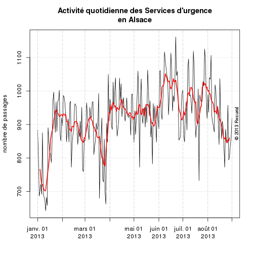

RPU 2013 Analyse
========================================================

```r
date()
```

```
## [1] "Thu Sep 12 20:12:37 2013"
```

source: RPU2013
Ce document exploite le fichier RData préparé à partir de la table *RPU__* de Sagec. Voir le document *RPU_2013_Preparation.Rmd* du dossier Resural.

Librairies nécessaires:
-----------------------

```r
library("gdata")
library("rgrs")
library("lubridate")
library("rattle")
library("epicalc")
library("zoo")
library("xts")
library("xtable")
library("plotrix")
library("openintro")
```

Activité régionale
-----------------------------

```r
source("../../mes_fonctions.R")
```

Variables globales:
-------------------

```r
mois_courant <- 8
annee_couranre <- 2013
path <- "../../"
```


Lecture du fichier des données
---------------------------------------
On lit le fichier de travail créé:

```r

load(paste(path, "rpu2013d0108.Rda", sep = ""))
d1 <- d0108
rm(d0108)

e <- as.Date(d1$ENTREE)
q <- tapply(e, yday(e), length)
plot(q, type = "l")
```

 

```r

z <- zoo(q, unique(as.Date(d1$ENTREE)))
plot(z)
```

 

```r
plot(xts(z))
lines(rollmean(xts(z), 7), col = "red")
```

 


Retour à domicile
-----------------
Les variation du retour journalier à domicile sont calculés de la manière suivante:
- numérateur = somme quotidienne où MODE_SOTIE == Domicile
- dénominateur = somme quotidienne des ENTREE (correspod à q)

```r
q2 <- tapply(d1[d1$MODE_SORTIE == "Domicile", 6], yday(d1[d1$MODE_SORTIE == 
    "Domicile", 6]), length)
head(q2)
```

```
##   1   2   3   4   5   6 
## 560 503 419 424 457 466
```

```r
q3 <- q2/q
summary(q3)
```

```
##    Min. 1st Qu.  Median    Mean 3rd Qu.    Max. 
##   0.568   0.617   0.637   0.643   0.659   1.000
```

```r
plot(q3, type = "l")
```

 

On refait le calcul de q en tenant compte des non réponses:

```r
q4 <- tapply(d1[!is.na(d1$MODE_SORTIE), 6], yday(d1[!is.na(d1$MODE_SORTIE), 
    6]), length)
head(q4)
```

```
##   1   2   3   4   5   6 
## 772 703 597 610 615 604
```

```r
q5 <- q2/q4
head(q5)
```

```
##      1      2      3      4      5      6 
## 0.7254 0.7155 0.7018 0.6951 0.7431 0.7715
```

```r
summary(q5)
```

```
##    Min. 1st Qu.  Median    Mean 3rd Qu.    Max. 
##   0.674   0.727   0.749   0.753   0.773   1.000
```

```r
plot(q3, type = "l", main = "Taux de retour à domicile\n(non réponses exclues)", 
    ylab = "Fréquence", xlab = "Jours")
```

 

Taux de non réponses:

```r
q6 <- q4/q
head(q6)
```

```
##      1      2      3      4      5      6 
## 0.8733 0.8777 0.8703 0.8665 0.8518 0.8741
```

```r
summary(q6)
```

```
##    Min. 1st Qu.  Median    Mean 3rd Qu.    Max. 
##   0.783   0.830   0.850   0.854   0.872   1.000
```


