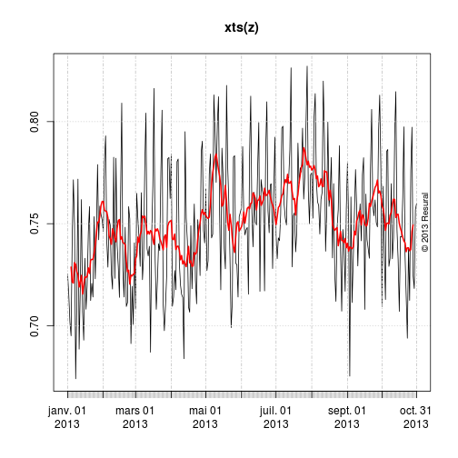
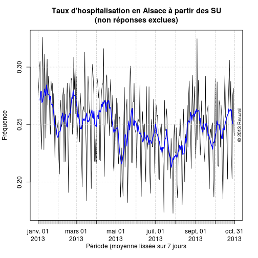

RPU 2013 Analyse
========================================================

```r
date()
```

```
## [1] "Wed Sep 18 11:51:30 2013"
```

source: RPU2013
Ce document exploite le fichier RData préparé à partir de la table *RPU__* de Sagec. Voir le document *RPU_2013_Preparation.Rmd* du dossier Resural.


Activité régionale
-----------------------------

```r
source("../../mes_fonctions.R")
```

Librairies nécessaires:
-----------------------

```r
# library('gdata') library('rgrs') library('lubridate') library('rattle')
# library('epicalc') library('zoo') library('xts') library('xtable')
# library('plotrix') library('openintro')
load_libraries()
```

Variables globales:
-------------------

```r
mois_courant <- 8
annee_couranre <- 2013
path <- "../../"
```


Lecture du fichier des données
---------------------------------------
On lit le fichier de travail créé:

```r

if (!exists("d1")) {
    load(paste(path, "rpu2013d0108.Rda", sep = ""))
    d1 <- d0108
    rm(d0108)
}
d1 <- d1[d1$ENTREE < "2013-09-01", ]

e <- as.Date(d1$ENTREE)
q <- tapply(e, yday(e), length)
plot(q, type = "l")
```

 

```r

z <- zoo(q, unique(as.Date(d1$ENTREE)))
plot(z)
```

 

```r

plot(xts(z), main = "Activité quotidienne des Services d'urgence\nen Alsace", 
    ylab = "nombre de passages", minor.ticks = FALSE)
lines(rollmean(xts(z), 7), col = "red", lwd = 2)
copyright()
```

 

```r

plot(z, col = "gray45", main = "Activité quotidienne des Services d'urgence\nen Alsace", 
    ylab = "nombre de passages", xlab = "Année 2013")
lines(rollmean(z, 7), col = "red", lwd = 2)
copyright()
```

 

Variables:
- *e* vecteur contenant les dates d'entrées depuis le début de l'année
- *q* vecteur contenant le nombre d'entrées par jour depuis le début de l'année
- *q2* vecteur contenant le nombre de retours à domiciles par jour
- *q3* vecteur contenant la proportion de retours à domicile par rapport au nombre d'entrées, par jour (taux)
- *q4* vecteur contenant le nombre de retours à domiciles par jour en excluant les non réponses (NA)
- *q5* vecteur contenant la proportion de retours à domicile par rapport au nombre d'entrées, par jour (taux), en excluant les non réponses (NA)
- *q6* taux de non réponses
- *q7* vecteur contenant le taux d'hospitalisation par jour (miroir de q5)

Retour à domicile
-----------------
Les variation du retour journalier à domicile sont calculés de la manière suivante:
- numérateur = somme quotidienne où MODE_SOTIE == Domicile
- dénominateur = somme quotidienne des ENTREE (correspod à q)

```r
q2 <- tapply(d1[d1$MODE_SORTIE == "Domicile", 6], yday(d1[d1$MODE_SORTIE == 
    "Domicile", 6]), length)
head(q2)
```

```
##   1   2   3   4   5   6 
## 560 503 419 424 457 466
```

```r
q3 <- q2/q
summary(q3)
```

```
##    Min. 1st Qu.  Median    Mean 3rd Qu.    Max. 
##   0.568   0.616   0.637   0.640   0.659   0.772
```

```r
plot(q3, type = "l")
copyright()
```

 

On refait le calcul de q en tenant compte des non réponses:

```r
q4 <- tapply(d1[!is.na(d1$MODE_SORTIE), 6], yday(d1[!is.na(d1$MODE_SORTIE), 
    6]), length)
head(q4)
```

```
##   1   2   3   4   5   6 
## 772 703 597 610 615 604
```

```r
q5 <- q2/q4
head(q5)
```

```
##      1      2      3      4      5      6 
## 0.7254 0.7155 0.7018 0.6951 0.7431 0.7715
```

```r
summary(q5)
```

```
##    Min. 1st Qu.  Median    Mean 3rd Qu.    Max. 
##   0.674   0.727   0.749   0.751   0.772   0.827
```

```r
plot(q5, type = "l", main = "Taux de retour à domicile\n(non réponses exclues)", 
    ylab = "Fréquence", xlab = "Jours")
copyright()
```

 

```r

z <- zoo(q5, unique(as.Date(d1$ENTREE)))
plot(z, main = "Taux de retour à domicile\n(non réponses exclues)", ylab = "Fréquence", 
    xlab = "Période (moyenne lissée sur 7 jours")
```

 

```r
plot(xts(z))
lines(rollmean(xts(z), 7), col = "red", lwd = 2)
copyright()
```

 

Taux d'hospitalisation
----------------------
c'est le complément (miroir) du précédent:

```r
q7 <- 1 - q2/q4
head(q7)
```

```
##      1      2      3      4      5      6 
## 0.2746 0.2845 0.2982 0.3049 0.2569 0.2285
```

```r
summary(q7)
```

```
##    Min. 1st Qu.  Median    Mean 3rd Qu.    Max. 
##   0.173   0.228   0.251   0.249   0.273   0.326
```

```r
z <- zoo(q7, unique(as.Date(d1$ENTREE)))
plot(xts(z), main = "Taux d'hospitalisation en Alsace à partir des SU\n(non réponses exclues)", 
    ylab = "Fréquence", xlab = "Période (moyenne lissée sur 7 jours")
lines(rollmean(xts(z), 7), col = "blue", lwd = 2)
copyright()
```

 


Taux de non réponses:

```r
q6 <- q4/q
head(q6)
```

```
##      1      2      3      4      5      6 
## 0.8733 0.8777 0.8703 0.8665 0.8518 0.8741
```

```r
summary(q6)
```

```
##    Min. 1st Qu.  Median    Mean 3rd Qu.    Max. 
##   0.783   0.830   0.850   0.852   0.872   0.949
```

Clinique Saint-Luc Schirmeck
============================

- FINESS géographique: N° FINESS :  67 079 863 6
- FINESS juridique:    67 001 460 4
- adresse: 10 RUE DES FORGES 67130 SCHIRMECK
- Tél : 03 88 97 05 70 

resume<-function (x)
{
  name=c("moyenne","écart-type","médiane","min","max","n")
	m<-mean(x,na.remove=TRUE)
	e<-sd(x)
	r<-matrix(c(m,e,median(x),min(x),max(x),length(x)),1,6)
	colnames(r)<-name
	return(r)
}
