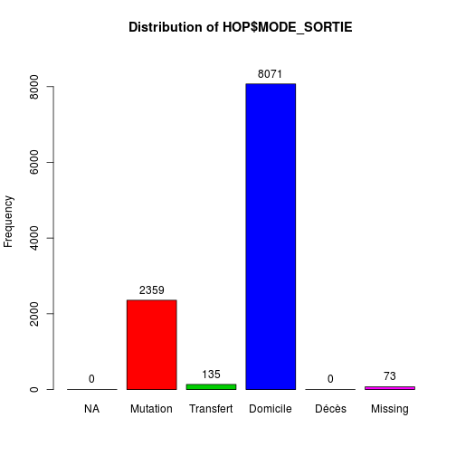
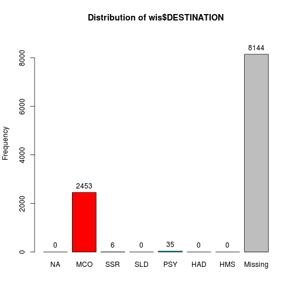
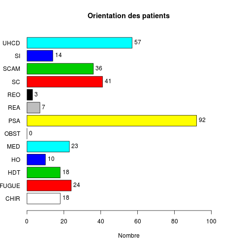
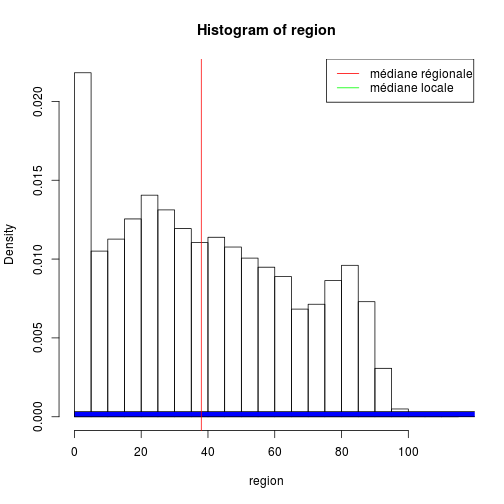
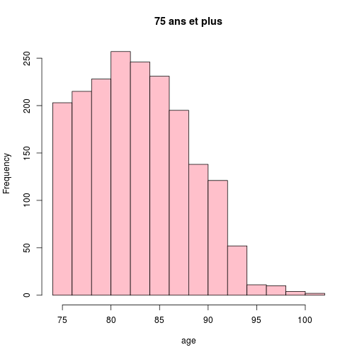
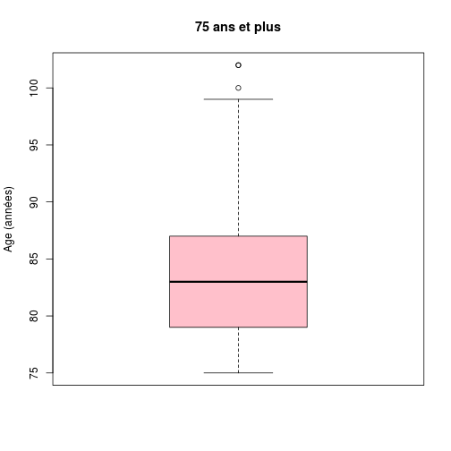
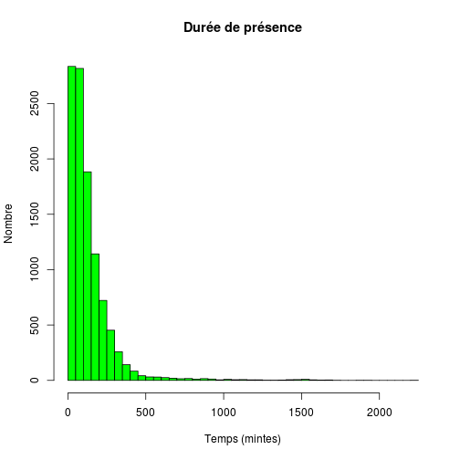

CH Wissembourg
========================================================

Ligne 18 remplacer **Wis* par l'hôpital de son choix.


```r
source("../prologue.R")
```

```
## [1] "Fichier courant: rpu2013d0110.Rda"
```

```r
source("../../mes_fonctions.R")

date()
```

```
## [1] "Wed Dec  4 14:08:42 2013"
```

```r
pt <- nrow(d1)
# population totale
pt
```

```
## [1] 276452
```

Récupération des données
========================

```r
library("epicalc")
```

```
## Loading required package: foreign
## Loading required package: survival
## Loading required package: splines
## Loading required package: MASS
## Loading required package: nnet
```

```r
library("lubridate")
source("odds.R")
HOP <- d1[d1$FINESS == "Wis", ]
n <- nrow(HOP)
```

### Passages en 2013: 10638

Mode de sortie
--------------

```r
a <- summary(HOP$MODE_SORTIE)
a
```

```
##        NA  Mutation Transfert  Domicile     Décès      NA's 
##         0      2359       135      8071         0        73
```

```r
tab1(HOP$MODE_SORTIE)
```

 

```
## HOP$MODE_SORTIE : 
##           Frequency   %(NA+)   %(NA-)
## NA                0      0.0      0.0
## Mutation       2359     22.2     22.3
## Transfert       135      1.3      1.3
## Domicile       8071     75.9     76.4
## Décès             0      0.0      0.0
## NA's             73      0.7      0.0
##   Total       10638    100.0    100.0
```

```r
hosp <- as.numeric(a["Mutation"] + a["Transfert"])
hosp
```

```
## [1] 2494
```

```r
total <- as.numeric(hosp + a["Domicile"])
total
```

```
## [1] 10565
```

```r
ratio_hosp <- round(hosp * 100/as.numeric(a["Domicile"]))
ratio_hosp
```

```
## [1] 31
```

```r
tx_hosp <- round(hosp * 100/total)
tx_hosp
```

```
## [1] 24
```


Destination
-----------

```r
a <- summary(HOP$DESTINATION)
a
```

```
##   NA  MCO  SSR  SLD  PSY  HAD  HMS NA's 
##    0 2453    6    0   35    0    0 8144
```

```r
tab1(HOP$DESTINATION)
```

 

```
## HOP$DESTINATION : 
##         Frequency   %(NA+)   %(NA-)
## NA              0      0.0      0.0
## MCO          2453     23.1     98.4
## SSR             6      0.1      0.2
## SLD             0      0.0      0.0
## PSY            35      0.3      1.4
## HAD             0      0.0      0.0
## HMS             0      0.0      0.0
## NA's         8144     76.6      0.0
##   Total     10638    100.0    100.0
```


Orientation
-----------

```r
summary(HOP$ORIENTATION)
```

```
##  CHIR FUGUE   HDT    HO   MED  OBST   PSA   REA   REO    SC  SCAM    SI 
##    18    24    18    10    23     0    92     7     3    41    36    14 
##  UHCD  NA's 
##    57 10295
```

```r

# on supprime les NA
a <- HOP$ORIENTATION[!is.na(HOP$ORIENTATION)]
tab1(a, horiz = T, main = "Orientation des patients", xlab = "Nombre")
```

 

```
## a : 
##         Frequency Percent Cum. percent
## CHIR           18     5.2          5.2
## FUGUE          24     7.0         12.2
## HDT            18     5.2         17.5
## HO             10     2.9         20.4
## MED            23     6.7         27.1
## OBST            0     0.0         27.1
## PSA            92    26.8         53.9
## REA             7     2.0         56.0
## REO             3     0.9         56.9
## SC             41    12.0         68.8
## SCAM           36    10.5         79.3
## SI             14     4.1         83.4
## UHCD           57    16.6        100.0
##   Total       343   100.0        100.0
```


Age
----


```r
age <- HOP$AGE
s <- summary(age)

c <- cut(age, breaks = c(-1, 1, 75, 150), labels = c("1 an", "1 à 75 ans", 
    "sup 75 ans"), ordered_result = TRUE)
a <- summary(c)
a
```

```
##       1 an 1 à 75 ans sup 75 ans 
##        336       8474       1828
```

```r

c2 <- cut(age, breaks = c(-1, 19, 75, 120), labels = c("Pédiatrie", "Adultes", 
    "Gériatrie"))
b <- summary(c2)
b
```

```
## Pédiatrie   Adultes Gériatrie 
##      2710      6100      1828
```

### Age moyen: 42.5  
### Pédiatrie: 2710  (25 %)
### Gériatrie: 1828  (17 %)


```r

# region: chiffre pour toute l'Alsace local: HOPsembourg
region <- d1$AGE
summary(region)
```

```
##    Min. 1st Qu.  Median    Mean 3rd Qu.    Max.    NA's 
##     0.0    18.0    38.0    40.4    62.0   112.0      10
```

```r

hist(region, freq = F)
hist(a, add = T, col = "blue", freq = F, main = "Histogramme des ages")
abline(v = median(region, na.rm = T), col = "red")
abline(v = median(a, na.rm = T), col = "green")
legend("topright", legend = c("médiane régionale", "médiane locale"), col = c("red", 
    "green"), lty = 1)
```

 

```r

# moins de 1 an / total
local <- HOP$AGE[HOP$AGE < 1]
length(local) * 100/n
```

```
## [1] 1.56
```

```r
region <- d1$AGE[d1$AGE < 1]
length(region) * 100/pt
```

```
## [1] 2.59
```

```r

# on forme une matrice carrée de 2 lignes et 2 colonnes: on saisi d'abord la
# colonne 1, puis 2 pour une saisie par ligne mettre byrow=TRUE
M1 <- matrix(c(length(a), n, length(region), pt), nrow = 2, byrow = FALSE)
M1
```

```
##       [,1]   [,2]
## [1,]     3   7161
## [2,] 10638 276452
```

```r
chisq.test(M1)
```

```
## 
## 	Pearson's Chi-squared test with Yates' continuity correction
## 
## data:  M1
## X-squared = 268.1, df = 1, p-value < 2.2e-16
```

```r
p <- M1[1, 1]/n
q <- M1[1, 2]/pt
or <- p * (1 - q)/q * (1 - p)
p
```

```
## [1] 0.000282
```

```r
q
```

```
## [1] 0.0259
```

```r
or
```

```
## [1] 0.0106
```

```r

calcOddsRatio(M1, referencerow = 2)
```

```
## [1] "categorie =  , odds ratio =  0.010886977646434"
## [1] "categorie =  ,  95 % interval de confiance = [ 0.00350986990383619 , 0.0337694232325842 ]"
```

```r
calcRelativeRisk(M1)
```

```
## [1] "category =  , relative risk =  0.0113011790795804"
## [1] "category =  ,  95 % confidence interval = [ 0.0036451758868526 , 0.0350371703734223 ]"
```

```r

# 75 ans et plus

a <- HOP$AGE[HOP$AGE > 74]
length(a) * 100/n  # % de la pop locale de 75 ans qui passa au SU
```

```
## [1] 17.98
```

```r
region <- d1$AGE[d1$AGE > 74]
length(region) * 100/pt  # % de 75 ans dans la pop alsacienne qui consulte au SU
```

```
## [1] 15.35
```

```r

hist(a, main = "75 ans et plus", xlab = "age", col = "pink")
```

 

```r
summary(a)
```

```
##    Min. 1st Qu.  Median    Mean 3rd Qu.    Max. 
##    75.0    79.0    83.0    83.3    87.0   102.0
```

```r
boxplot(a, col = "pink", main = "75 ans et plus", ylab = "Age (années)")
```

 

```r

# calcul manuel de l'odds-ratio

M1 <- matrix(c(length(a), n - length(a), length(region), pt - length(region)), 
    nrow = 2, byrow = FALSE)
M1
```

```
##      [,1]   [,2]
## [1,] 1913  42436
## [2,] 8725 234016
```

```r
chisq.test(M1)
```

```
## 
## 	Pearson's Chi-squared test with Yates' continuity correction
## 
## data:  M1
## X-squared = 54.15, df = 1, p-value = 1.859e-13
```

```r
p <- M1[1, 1]/n
q <- M1[1, 2]/pt
or <- (p * (1 - q))/(q * (1 - p))
p
```

```
## [1] 0.1798
```

```r
q
```

```
## [1] 0.1535
```

```r
or
```

```
## [1] 1.209
```

```r

# calcul del'OR et du risque relatif avec formules:

calcOddsRatio(M1, referencerow = 2)
```

```
## [1] "categorie =  , odds ratio =  1.20909561298578"
## [1] "categorie =  ,  95 % interval de confiance = [ 1.14949493713793 , 1.27178655086678 ]"
```

```r
calcRelativeRisk(M1)
```

```
## [1] "category =  , relative risk =  1.20007624597318"
## [1] "category =  ,  95 % confidence interval = [ 1.143336119715 , 1.25963220378981 ]"
```

```r
chisq.test(M1)
```

```
## 
## 	Pearson's Chi-squared test with Yates' continuity correction
## 
## data:  M1
## X-squared = 54.15, df = 1, p-value = 1.859e-13
```

```r
fisher.test(M1)
```

```
## 
## 	Fisher's Exact Test for Count Data
## 
## data:  M1
## p-value = 5.115e-13
## alternative hypothesis: true odds ratio is not equal to 1
## 95 percent confidence interval:
##  1.149 1.272
## sample estimates:
## odds ratio 
##      1.209
```

```r

# graphe de l'OR

odds <- calcOddsRatio(M1, referencerow = 2, quiet = TRUE)
or <- odds[1]
lower <- odds[2]
upper <- odds[3]
y <- 0.5
if (lower > 1) limiteInf <- 0.5 else limiteInf <- lower - 0.5
plot(or, y, pch = 19, col = "darkblue", xlab = "odds-ratio", ylab = "", axes = FALSE, 
    main = "Patients de 75 ans et plus", xlim = c(limiteInf, upper + 0.5))
axis(1)
abline(v = 1, lty = "dashed")
lines(c(lower, upper), c(y, y), col = "royalblue")
```

 


sex ratio
-----------

```r
sexew <- HOP$SEXE
local <- summary(sexew)
local
```

```
##    F    I    M 
## 5092    0 5546
```

```r
srw <- round(local[3]/local[1], 3)

sexer <- d1$SEXE
region <- summary(sexer)
region
```

```
##      F      I      M 
## 131031      4 145417
```

```r
srr <- round(region[3]/region[1], 3)

M1 <- matrix(c(local[3], local[1], region[3], region[1]), nrow = 2)
colnames(M1) <- c("Local", "Alsace")
rownames(M1) <- c("Hommes", "Femmes")
M1
```

```
##        Local Alsace
## Hommes  5546 145417
## Femmes  5092 131031
```

```r
calcOddsRatio(M1, referencerow = 2)
```

```
## [1] "categorie = Hommes , odds ratio =  0.981409697401316"
## [1] "categorie = Hommes ,  95 % interval de confiance = [ 0.94409241499401 , 1.02020202562421 ]"
```

```r
or <- calcOddsRatio(M1, referencerow = 2, quiet = TRUE)

plot(or[1], 1, pch = 19, col = "darkblue", xlab = "odds-ratio", ylab = "", axes = FALSE)
axis(1)
abline(v = 1, lty = "dashed")
lines(c(or[2], or[3]), c(1, 1), col = "royalblue")
```

 

sex-ratio local = 1.089  
sex-ratio régional = 1.11  
odds-ratio = 0.9814 [0.9441-1.0202]

Le sex-ratio est légèrement inférieur à celui de la région mais pas signficativement différent

Horaires
---------

```r
e <- hour(HOP$ENTREE)
a <- cut(e, breaks = c(0, 7, 19, 23), labels = c("nuit profonde", "journée", 
    "soirée"))
b <- summary(a)
```


### Soirée 15.01 %

### Nuit profonde 7.16 %

On fait la somme du vendredi 20 heures au lundi matin 8 heures. Dimanche = 1

```r
d <- HOP$ENTREE[wday(HOP$ENTREE) == 1 | wday(HOP$ENTREE) == 7 | (wday(HOP$ENTREE) == 
    6 & hour(HOP$ENTREE) > 19) | (wday(HOP$ENTREE) == 2 & hour(HOP$ENTREE) < 
    8)]
f <- summary(as.factor(wday(d)))
```

### Week-end: 3670 dossiers (34.5 %)

Gravité
--------

```r
d <- HOP$GRAVITE
a <- summary(d)
```


### CCMU 1: 707 (7 %)

### CCMU 4 & 5: 153 (1 %)

Durée de prise en charge
-------------------------

```r
e <- ymd_hms(HOP$ENTREE)
s <- ymd_hms(HOP$SORTIE)
HOP$presence <- (s - e)/60
HOP$presence[d1$presence < 0] <- NA
a <- summary(as.numeric(HOP$presence))
hist(as.numeric(HOP$presence), breaks = 40, main = "Durée de présence", xlab = "Temps (mintes)", 
    ylab = "Nombre", col = "green")
```

 

```r
q <- HOP$presence[as.numeric(HOP$presence) < 4 * 60]
h <- HOP[HOP$MODE_SORTIE == "Mutation" | HOP$MODE_SORTIE == "Transfert", "presence"]
sh <- summary(as.numeric(h))
sh
```

```
##    Min. 1st Qu.  Median    Mean 3rd Qu.    Max.    NA's 
##       0     106     171     222     265    1690      73
```

```r
dom <- HOP[HOP$MODE_SORTIE == "Domicile", "presence"]
sdom <- summary(as.numeric(dom))
```

### Moyenne: 135 minutes

### Médiane: 93 minutes

### % en moins de 4 heures: 9279 (87 %)

### si hospitalisé: 222 minutes

### si retour à domicile: 107 minutes

### Taux hospitalisation: 24.13 %

TOP 5 des pathologies
---------------------
### Médicales

### Ttraumatiques

### Chirurgicales
