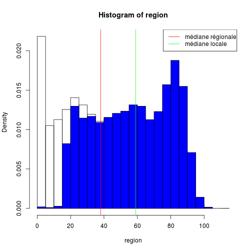

CH Wissembourg
========================================================


```r
source("../prologue.R")
```

```
## [1] "Fichier courant: rpu2013d0110.Rda"
```

```r
source("../../mes_fonctions.R")

date()
```

```
## [1] "Wed Dec  4 14:08:42 2013"
```

```r
pt <- nrow(d1)
# population totale
pt
```

```
## [1] 276452
```

Récupération des données
========================

```r
library("epicalc")
```

```
## Loading required package: foreign
## Loading required package: survival
## Loading required package: splines
## Loading required package: MASS
## Loading required package: nnet
```

```r
source("odds.R")
wis <- d1[d1$FINESS == "Wis", ]
n <- nrow(wis)
n
```

```
## [1] 10638
```

Mode de sortie
--------------

```r
a <- summary(wis$MODE_SORTIE)
a
```

```
##        NA  Mutation Transfert  Domicile     Décès      NA's 
##         0      2359       135      8071         0        73
```

```r
tab1(wis$MODE_SORTIE)
```

 

```
## wis$MODE_SORTIE : 
##           Frequency   %(NA+)   %(NA-)
## NA                0      0.0      0.0
## Mutation       2359     22.2     22.3
## Transfert       135      1.3      1.3
## Domicile       8071     75.9     76.4
## Décès             0      0.0      0.0
## NA's             73      0.7      0.0
##   Total       10638    100.0    100.0
```

```r
hosp <- as.numeric(a["Mutation"] + a["Transfert"])
hosp
```

```
## [1] 2494
```

```r
total <- as.numeric(hosp + a["Domicile"])
total
```

```
## [1] 10565
```

```r
ratio_hosp <- round(hosp * 100/as.numeric(a["Domicile"]))
ratio_hosp
```

```
## [1] 31
```

```r
tx_hosp <- round(hosp * 100/total)
tx_hosp
```

```
## [1] 24
```


Destination
-----------

```r
a <- summary(wis$DESTINATION)
a
```

```
##   NA  MCO  SSR  SLD  PSY  HAD  HMS NA's 
##    0 2453    6    0   35    0    0 8144
```

```r
tab1(wis$DESTINATION)
```

 

```
## wis$DESTINATION : 
##         Frequency   %(NA+)   %(NA-)
## NA              0      0.0      0.0
## MCO          2453     23.1     98.4
## SSR             6      0.1      0.2
## SLD             0      0.0      0.0
## PSY            35      0.3      1.4
## HAD             0      0.0      0.0
## HMS             0      0.0      0.0
## NA's         8144     76.6      0.0
##   Total     10638    100.0    100.0
```


Orientation
-----------

```r
summary(wis$ORIENTATION)
```

```
##  CHIR FUGUE   HDT    HO   MED  OBST   PSA   REA   REO    SC  SCAM    SI 
##    18    24    18    10    23     0    92     7     3    41    36    14 
##  UHCD  NA's 
##    57 10295
```

```r

# on supprime les NA
a <- wis$ORIENTATION[!is.na(wis$ORIENTATION)]
tab1(a, horiz = T, main = "Orientation des patients", xlab = "Nombre")
```

 

```
## a : 
##         Frequency Percent Cum. percent
## CHIR           18     5.2          5.2
## FUGUE          24     7.0         12.2
## HDT            18     5.2         17.5
## HO             10     2.9         20.4
## MED            23     6.7         27.1
## OBST            0     0.0         27.1
## PSA            92    26.8         53.9
## REA             7     2.0         56.0
## REO             3     0.9         56.9
## SC             41    12.0         68.8
## SCAM           36    10.5         79.3
## SI             14     4.1         83.4
## UHCD           57    16.6        100.0
##   Total       343   100.0        100.0
```


Age
----


```r
a <- wis$AGE
summary(a)
```

```
##    Min. 1st Qu.  Median    Mean 3rd Qu.    Max. 
##     0.0    19.0    41.0    42.5    65.0   102.0
```

```r
region <- d1$AGE
summary(region)
```

```
##    Min. 1st Qu.  Median    Mean 3rd Qu.    Max.    NA's 
##     0.0    18.0    38.0    40.4    62.0   112.0      10
```

```r

hist(region, freq = F)
hist(a, add = T, col = "blue", freq = F, main = "Histogramme des ages")
abline(v = median(region, na.rm = T), col = "red")
abline(v = median(a, na.rm = T), col = "green")
legend("topright", legend = c("médiane régionale", "médiane locale"), col = c("red", 
    "green"), lty = 1)
```

 

```r

# moins de 1 an / total
a <- wis$AGE[wis$AGE < 1]
length(a) * 100/n
```

```
## [1] 1.56
```

```r
region <- d1$AGE[d1$AGE < 1]
length(region) * 100/pt
```

```
## [1] 2.59
```

```r

# on sasi d'abord la colonne 1, puis 2 pour une saisie par ligne mettre
# byrow=TRUE
M1 <- matrix(c(length(a), n, length(region), pt), nrow = 2, byrow = FALSE)
M1
```

```
##       [,1]   [,2]
## [1,]   166   7161
## [2,] 10638 276452
```

```r
chisq.test(M1)
```

```
## 
## 	Pearson's Chi-squared test with Yates' continuity correction
## 
## data:  M1
## X-squared = 41.5, df = 1, p-value = 1.181e-10
```

```r
p <- M1[1, 1]/M1[2, 1]
q <- M1[1, 2]/M1[2, 2]
or <- p * (1 - q)/q * (1 - p)
p
```

```
## [1] 0.0156
```

```r
q
```

```
## [1] 0.0259
```

```r
or
```

```
## [1] 0.5777
```

```r

calcOddsRatio(M1, referencerow = 2)
```

```
## [1] "category =  , odds ratio =  0.602412763102682"
## [1] "category =  ,  95 % confidence interval = [ 0.515869244979365 , 0.703475038841527 ]"
```

```r
calcRelativeRisk(M1)
```

```
## [1] "category =  , relative risk =  0.611420471759015"
## [1] "category =  ,  95 % confidence interval = [ 0.525444001222125 , 0.711464956144742 ]"
```

```r

# 75 ans et plus
a <- wis$AGE[wis$AGE > 74]
length(a) * 100/n
```

```
## [1] 17.98
```

```r
region <- d1$AGE[d1$AGE > 74]
length(region) * 100/pt
```

```
## [1] 15.35
```

```r

M1 <- matrix(c(length(a), n, length(region), pt), nrow = 2, byrow = FALSE)
M1
```

```
##       [,1]   [,2]
## [1,]  1913  42436
## [2,] 10638 276452
```

```r
chisq.test(M1)
```

```
## 
## 	Pearson's Chi-squared test with Yates' continuity correction
## 
## data:  M1
## X-squared = 38.82, df = 1, p-value = 4.656e-10
```

```r
p <- M1[1, 1]/M1[2, 1]
q <- M1[1, 2]/M1[2, 2]
or <- p * (1 - q)/q * (1 - p)
p
```

```
## [1] 0.1798
```

```r
q
```

```
## [1] 0.1535
```

```r
or
```

```
## [1] 0.8133
```

```r

calcOddsRatio(M1, referencerow = 2)
```

```
## [1] "category =  , odds ratio =  1.17149456883822"
## [1] "category =  ,  95 % confidence interval = [ 1.11465503331085 , 1.23123251930332 ]"
```

```r
calcRelativeRisk(M1)
```

```
## [1] "category =  , relative risk =  1.16409712785449"
## [1] "category =  ,  95 % confidence interval = [ 1.10994424832232 , 1.22089206293679 ]"
```

```r
chisq.test(M1)
```

```
## 
## 	Pearson's Chi-squared test with Yates' continuity correction
## 
## data:  M1
## X-squared = 38.82, df = 1, p-value = 4.656e-10
```

```r
fisher.test(M1)
```

```
## 
## 	Fisher's Exact Test for Count Data
## 
## data:  M1
## p-value = 8.403e-10
## alternative hypothesis: true odds ratio is not equal to 1
## 95 percent confidence interval:
##  1.114 1.231
## sample estimates:
## odds ratio 
##      1.171
```

```r

# sex ratio
```


