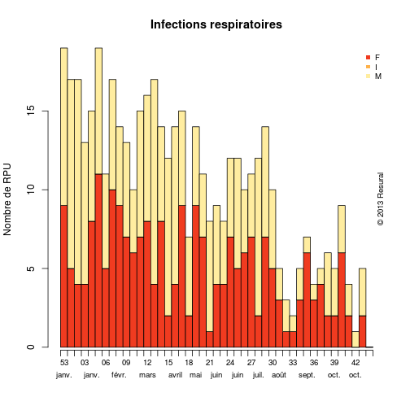
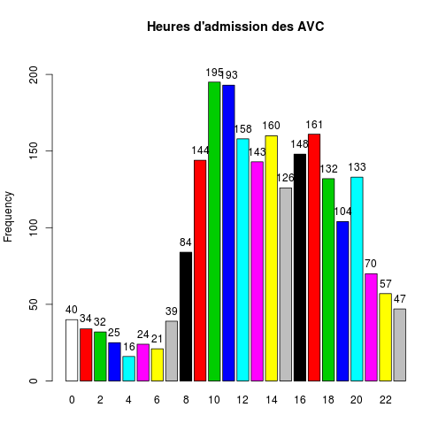

CIM 10
========================================================


```r
source("../prologue.R")
```

```
## Rattle : une interface graphique gratuite pour l'exploration de données
## avec R. Version 2.6.26 r77 Copyright (c) 2006-2013 Togaware Pty Ltd.
## Entrez 'rattle()' pour secouer, faire vibrer, et faire défiler vos
## données. Loading required package: foreign Loading required package:
## survival Loading required package: splines Loading required package: MASS
## Loading required package: nnet
## 
## Attaching package: 'zoo'
## 
## Les objets suivants sont masqués from 'package:base':
## 
## as.Date, as.Date.numeric
## 
## Please visit openintro.org for free statistics materials
## 
## Attaching package: 'openintro'
## 
## L'objet suivant est masqué from 'package:MASS':
## 
## mammals
## 
## L'objet suivant est masqué from 'package:datasets':
## 
## cars
```

```
## [1] "Fichier courant: rpu2013d0110.Rda"
```

```r
source("../../mes_fonctions.R")
nrow(d1)
```

```
## [1] 276452
```

```r

dp <- d1$DP
ndp <- length(dp)
dpr <- dp[!is.na(dp)]
ndpr <- length(dpr)

# correction d'erreurs: dpr[37807]<-'N10' dpr[47689]<-'R06.0'
# dpr[68023]<-'C61' dpr[73924]<-'N10'

dpr <- gsub(".", "", dpr, fixed = TRUE)
```

```
## Error: input string 37807 is invalid in this locale
```

```r
total <- ndpr


dpr <- d1[!is.na(d1$DP), c("DP", "CODE_POSTAL", "ENTREE", "FINESS", "GRAVITE", 
    "ORIENTATION", "MODE_SORTIE", "AGE", "SEXE", "TRANSPORT")]
# correction d'erreurs:
dpr$DP[37807] <- "N10"
dpr$DP[47689] <- "R06.0"
dpr$DP[68023] <- "C61"
dpr$DP[73924] <- "N10"
# un peu de ménage:
dpr$DP <- gsub(".", "", as.character(dpr$DP), fixed = TRUE)
dpr$DP <- gsub("+", "", as.character(dpr$DP), fixed = TRUE)

# Création d'un dataframe DP
dpr <- d1[!is.na(d1$DP), c("DP", "CODE_POSTAL", "ENTREE", "FINESS", "GRAVITE", 
    "ORIENTATION", "MODE_SORTIE", "AGE", "SEXE", "TRANSPORT", "DESTINATION")]

library("epitools")
```

```
## Attaching package: 'epitools'
## 
## L'objet suivant est masqué from 'package:survival':
## 
## ratetable
```

```r
annee <- 2013
```


Pneumonies
----------


```r
pneumo <- dpr[substr(dpr$DP, 1, 4) == "J159", ]
p <- summary(pneumo$AGE)
print("Pneumonies et AGE")
```

```
## [1] "Pneumonies et AGE"
```

```r
p
```

```
##    Min. 1st Qu.  Median    Mean 3rd Qu.    Max. 
##     2.0    63.5    79.0    72.2    86.0    98.0
```

Les pneumopaties bactériennes sans précision sont cotées J15.9 Dans la CIM10.
467 diagnostics de ce type ont été portés au SAU en 2013.

Les pneumonies bactériennes concernent les adultes agés des deux sexes. L'age moyen est de 72.2 ans et la moitié de ces patients ont 79 ans et plus.


```r
# copyright<-'© 2013 Résural'
seq3.r <- colorbrewer.palette(3, "seq", "r")

a <- epigraphe(pneumo$ENTREE, min.date = "2013-01-01", strata = pneumo$SEXE, 
    col = seq3.r[3:1], main = "Infections respiratoires", xlab = "", ylab = "Nombre de RPU")
```

 

En fonction de la gravité (CCMU):

```r
summary(as.factor(pneumo$GRAVITE))
```

```
##    1    2    3    4    5    D    P NA's 
##   13  217  204   25    1    0    0    7
```

En fonction du mode de sortie;

```r
summary(as.factor(pneumo$MODE_SORTIE))
```

```
##        NA  Mutation Transfert  Domicile     Décès      NA's 
##         0       349         0        74         0        44
```


En fonction de la destination:

```r
summary(as.factor(pneumo$DESTINATION))
```

```
##   NA  MCO  SSR  SLD  PSY  HAD  HMS NA's 
##    0  350    1    0    0    0    0  116
```


En fonction de l'orientation:

```r
a <- summary(pneumo$ORIENTATION)
a
```

```
##  CHIR FUGUE   HDT    HO   MED  OBST   PSA   REA   REO    SC  SCAM    SI 
##     8     0     0     0   115     0     0     2     0     0     0     1 
##  UHCD  NA's 
##   177   164
```


8 patients porteurs de problèmes respiratoires sont orienté en chirurgie : erreur ou manque de place en médecine ?


```r
rm(pneumo)
```


AVC
---


```r
AVC <- dpr[substr(dpr$DP, 1, 3) >= "I60" & substr(dpr$DP, 1, 3) < "I65" | substr(dpr$DP, 
    1, 3) == "G46" | substr(dpr$DP, 1, 3) == "G45", ]

h <- hour(AVC$ENTREE)
hist(h, breaks = 24, xlab = "Heure de la journée", main = "Répartition des AVC dans la journée")
```

 

```r
tab1(h, missing = FALSE, main = "Heures d'admission des AVC")
```

 

```
## h : 
##         Frequency Percent Cum. percent
## 0              40     1.7          1.7
## 1              34     1.5          3.2
## 2              32     1.4          4.6
## 3              25     1.1          5.7
## 4              16     0.7          6.4
## 5              24     1.0          7.5
## 6              21     0.9          8.4
## 7              39     1.7         10.1
## 8              84     3.7         13.8
## 9             144     6.3         20.1
## 10            195     8.5         28.6
## 11            193     8.4         37.1
## 12            158     6.9         44.0
## 13            143     6.3         50.2
## 14            160     7.0         57.2
## 15            126     5.5         62.7
## 16            148     6.5         69.2
## 17            161     7.0         76.2
## 18            132     5.8         82.0
## 19            104     4.5         86.6
## 20            133     5.8         92.4
## 21             70     3.1         95.5
## 22             57     2.5         97.9
## 23             47     2.1        100.0
##   Total      2286   100.0        100.0
```


