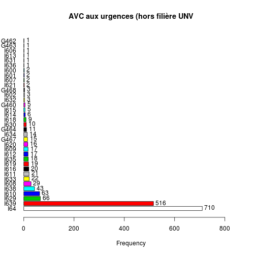
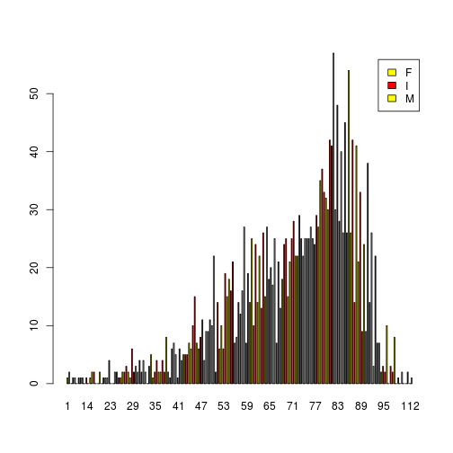

Diagnostic principal
========================================================
On récupère la colonne diagnostic principal


```r
#'@param dp liste brute des diagnostics
#'@param dpr liste des diag sans les NA. Les intitulés sont standardisés par suppression du point. Ainsi I60.9 devient I609 (méthode gsub)
#'@param ndp nombre de DP bruts (NA inclus)
#'@param ndpr nombre de DP renseignés

library("epicalc")
library("lubridate")

load("../../rpu2013d0107.Rda")
d1 <- d0107
rm(d0107)
dp <- d1$DP
ndp <- length(dp)
dpr <- dp[!is.na(dp)]
dpr <- gsub(".", "", dpr, fixed = TRUE)
```

Nombre de diagnostics principaux (DP)

```r
ndpr <- length(dpr)
ndpr
```

```
## [1] 132923
```

Exhaustivité

```r
ex <- round(ndpr * 100/ndp, 2)
ex
```

```
## [1] 68.84
```

Nombre de diagnostic uniques:

```r
a <- length(unique(dpr))
a
```

```
## [1] 3996
```

```r
a <- substr(dpr, 1, 1)
tab1(a, horiz = T, sort.group = "decreasing", main = "Classes dignostiques de la CIM10")
```

 

```
## a : 
##         Frequency Percent Cum. percent
## S           45176    34.0         34.0
## R           20404    15.4         49.3
## J            9447     7.1         56.4
## M            8023     6.0         62.5
## K            6981     5.3         67.7
## T            5389     4.1         71.8
## I            5280     4.0         75.8
## H            4707     3.5         79.3
## F            4640     3.5         82.8
## N            4561     3.4         86.2
## Z            3849     2.9         89.1
## A            2784     2.1         91.2
## L            2683     2.0         93.2
## G            2600     2.0         95.2
## B            1438     1.1         96.3
## W            1215     0.9         97.2
## E             975     0.7         97.9
## D             789     0.6         98.5
## Y             521     0.4         98.9
## X             360     0.3         99.2
## V             335     0.3         99.4
## C             305     0.2         99.7
## P             158     0.1         99.8
## O             157     0.1         99.9
## r              79     0.1         99.9
## Q              55     0.0        100.0
## k              12     0.0        100.0
##   Total    132923   100.0        100.0
```


Etude des AVC
-------------
Les AVC sont définis par la nomenclature *I60* à *I64*, *G45* Accidents ischémiques cérébraux transitoires (sauf G45.4 amnésie transitoire) et syndromes apparentés et *G46* Syndromes vasculaires cérébraux au cours de maladies cérébrovasculaires

La prévention et la prise en charge des accidents vasculaires cérébraux - Annexes -
juin 2009

Annexe : Liste exhaustive des codes CIM-10 d’AVC

- G450 Syndrome vertébro-basilaire
- G451 Syndrome carotidien (hémisphérique)
- G452 Accident ischémique transitoire de territoires artériels précérébraux multipleset bilatéraux
- G453 Amaurose fugace
- G454 Amnésie globale transitoire : NON RETENU
- G458 Autres accidents ischémiques cérébraux transitoires et syndromes apparentés
- G459 Accident ischémique cérébral transitoire, sans précision
- I600 Hémorragie sous-arachnoïdienne de labifurcation et du siphon carotidien
- I601 Hémorragie sous-arachnoïdienne de l'artère cérébrale moyenne
- I602 Hémorragie sous-arachnoïdienne de
- l'artère communicante antérieure
- I603 Hémorragie sous-arachnoïdienne del'artère communicante postérieure
- I604 Hémorragie sous-arachnoïdienne de l'artère basilaire
- I605 Hémorragie sous-arachnoïdienne de l'artère vertébrale
- I606 Hémorragie sous-arachnoïdienne d'autres artères intracrâniennes
- I607 Hémorragie sous-arachnoïdienne d'une ar
tère intracrânienne, sans précision
- I608 Autres hémorragies sous-arachnoïdiennes
- I609 Hémorragie sous-arachnoïdienne, sans précision
- I610 Hémorragie intracérébrale hémisphérique, sous-corticale
- I611 Hémorragie intracérébrale hémisphérique, corticale
- I612 Hémorragie intracérébrale hémisphérique, non précisée
- I613 Hémorragie intracérébrale du tronc cérébral
- I614 Hémorragie intracérébrale cérébelleuse
- I615 Hémorragie intracérébrale intraventriculaire
- I616 Hémorragie intracérébrale,localisations multiples
- I618 Autres hémorragies intracérébrales
- I619 Hémorragie intracérébrale, sans précision
- I620 Hémorragie sous-durale (aiguë) (non traumatique)
- I621 Hémorragie extradurale non traumatique
- I629 Hémorragie intracrânienne (non traumatique), sans précision
- I630 Infarctus cérébral dû à une thrombose des artères précérébrales
- I631 Infarctus cérébral dû à une embolie des artères précérébrales
- I632 Infarctus cérébral dû à une occlusion ou sténose des artères précérébrales,de mécanisme non précisé
- I633 Infarctus cérébral dû à une thrombose des artères cérébrales
- I634 Infarctus cérébral dû à une embolie des artères cérébrales
- I635 Infarctus cérébral dû à une occlusion ou sténose des artères cérébrales, demécanisme non précisé
- I636 Infarctus cérébral dû à une thrombose veineuse cérébrale, non pyogène
- I638 Autres infarctus cérébraux
- I639 Infarctus cérébral, sans précision
- I64 Accident vasculaire cérébral, non précisé comme étant hémorragique ou parinfarctus
- G460 Syndrome de l'artère cérébrale moyenne (I66.0) (1)
- G461 Syndrome de l'artère cérébrale antérieure (I66.1) (1)
- G462 Syndrome de l'artère cérébrale postérieure (I66.2) (1)
- G463 Syndromes vasculaires du tronc cérébral (I60-I67) (1)
- G464 Syndrome cérébelleux vasculaire (I60-I67) (1)
- G465 Syndrome lacunaire moteur pur (I60-I67) (1)
- G466 Syndrome lacunaire sensitif pur (I60-I67) (1)
- G467 Autres syndromes lacunaires (I60-I67) (1)
- G468 Autres syndromes vasculaires cérébraux au cours de maladies cérébrovasculaires (I60-I67) (1)
(1) : résumé à ne retenir que si présence d’un diagnostic associé significatif (DAS) des catégories I60 à I64


```
## G460 G462 G464 G467 G468 I600 I601 I602 I606 I607 I608 I609 I610 I611 I612 
##    5    1    9   14    3    1    2    3    1    2   21   11   42   16   16 
## I613 I614 I615 I616 I618 I619 I620 I621 I629 I630 I631 I632 I633 I634 I635 
##    1    4    4   13    8   19   10    2   46   10    1    2   14   12   18 
## I636 I638 I639  I64 
##    1   31  342  514
```

 

```
## avc : 
##         Frequency Percent Cum. percent
## I64           514    42.9         42.9
## I639          342    28.5         71.4
## I629           46     3.8         75.2
## I610           42     3.5         78.7
## I638           31     2.6         81.3
## I608           21     1.8         83.1
## I619           19     1.6         84.7
## I635           18     1.5         86.2
## I612           16     1.3         87.5
## I611           16     1.3         88.8
## I633           14     1.2         90.0
## G467           14     1.2         91.2
## I616           13     1.1         92.2
## I634           12     1.0         93.2
## I609           11     0.9         94.2
## I630           10     0.8         95.0
## I620           10     0.8         95.8
## G464            9     0.8         96.6
## I618            8     0.7         97.2
## G460            5     0.4         97.7
## I615            4     0.3         98.0
## I614            4     0.3         98.3
## I602            3     0.3         98.6
## G468            3     0.3         98.8
## I632            2     0.2         99.0
## I621            2     0.2         99.2
## I607            2     0.2         99.3
## I601            2     0.2         99.5
## I636            1     0.1         99.6
## I631            1     0.1         99.7
## I613            1     0.1         99.7
## I606            1     0.1         99.8
## I600            1     0.1         99.9
## G462            1     0.1        100.0
##   Total      1199   100.0        100.0
```

# Etude des AVC+AIT

avc_ait<-dpr[substr(dpr,1,3)>="I60" & substr(dpr,1,3)<"I65" | substr(dpr,1,3)=="G46" | substr(dpr,1,3)=="G45"]

tab1(avc_ait,horiz=TRUE,sort.group="decreasing",main="AVC&AIT aux urgences (hors filière UNV",missing=FALSE)

# Création d'un dataframe DP


extraction d'un DF avc:

```r
AVC <- dpr[substr(dpr$DP, 1, 3) >= "I60" & substr(dpr$DP, 1, 3) < "I65" | substr(dpr$DP, 
    1, 3) == "G46" | substr(dpr$DP, 1, 3) == "G45", ]
```

Horaire des AVC  
à comparer avec
- les crises d'épilepsie
- la pression athmosphérique

  

```
## h : 
##         Frequency Percent Cum. percent
## 0              34     2.0          2.0
## 1              20     1.2          3.2
## 2              26     1.6          4.8
## 3              22     1.3          6.1
## 4               8     0.5          6.6
## 5              13     0.8          7.4
## 6              17     1.0          8.4
## 7              27     1.6         10.0
## 8              61     3.7         13.7
## 9             105     6.3         20.0
## 10            139     8.4         28.4
## 11            144     8.7         37.0
## 12            101     6.1         43.1
## 13            113     6.8         49.9
## 14            116     7.0         56.9
## 15            101     6.1         63.0
## 16             98     5.9         68.9
## 17            121     7.3         76.1
## 18            104     6.3         82.4
## 19             71     4.3         86.7
## 20             95     5.7         92.4
## 21             49     2.9         95.3
## 22             42     2.5         97.8
## 23             36     2.2        100.0
##   Total      1663   100.0        100.0
```

Selon le jour de la semaine


```
## w
##   Sun   Mon  Tues   Wed Thurs   Fri   Sat 
##   202   262   273   246   250   219   211
```

```
## w
##   Sun   Mon  Tues   Wed Thurs   Fri   Sat 
## 12.15 15.75 16.42 14.79 15.03 13.17 12.69
```

 

Proportion théorique = 14.28% par jour de la semaine

Age et AVC
----------

```
##    Min. 1st Qu.  Median    Mean 3rd Qu.    Max. 
##     1.0    60.0    74.0    70.7    83.0   102.0
```

Le rapport de 2009 donne age moyen = 70.5 et age médian = 75 ans.

Sexe et AVC
-----------

```r
summary(AVC$SEXE)
```

```
##   F   I   M 
## 874   0 789
```

```r
hist(AVC$AGE, main = "Répartition des AVC", col = "pink", xlab = "Age en années")
```

 

```r
t <- table(AVC$AGE)
barplot(t, main = "AVC - Répartition des ages")
```

 

```r
t <- table(AVC$SEXE, AVC$AGE)
barplot(t, col = c("darkblue", "white", "red"), legend = TRUE)
```

 

```r
barplot(t, col = c("yellow", "red"), legend = TRUE, beside = TRUE)
```

 

Etude AIT
---------
Recommandations pour la sélection des données PMSI MCO concernant l’AVC (Juin 2009)
- G450 Syndrome vertébro-basilaire
- G451 Syndrome carotidien (hémisphérique)
- G452 Accident ischémique transitoire de territoires artériels précérébraux multiples et bilatéraux
- G453  Amaurose fugace
- G458  Autres accidents ischémiques cérébraux transitoires et syndromes apparentés
- G459  Accident ischémique cérébral transitoire, sans précision  

```r
ait <- dpr$DP[substr(dpr$DP, 1, 3) == "G45" & substr(dpr$DP, 1, 4) != "G454"]
tab1(ait, missing = FALSE)
```

 

```
## ait : 
##         Frequency Percent Cum. percent
## G450            4     0.9          0.9
## G451            5     1.1          2.0
## G452           10     2.3          4.3
## G453            3     0.7          5.0
## G458           32     7.2         12.2
## G459          390    87.8        100.0
##   Total       444   100.0        100.0
```

