Diagnostic principal
========================================================
On récupère la colonne diagnostic principal


```r
#'@param dp liste brute des diagnostics
#'@param dpr liste des diag sans les NA. Les intitulés sont standardisés par suppression du point. Ainsi I60.9 devient I609 (méthode gsub)
#'@param ndp nombre de DP bruts (NA inclus)
#'@param ndpr nombre de DP renseignés

library("epicalc")
```

```
## Loading required package: foreign
## Loading required package: survival
## Loading required package: splines
## Loading required package: MASS
## Loading required package: nnet
```

```r
library("lubridate")

source("../prologue.R")
```

```
## gdata: read.xls support for 'XLS' (Excel 97-2004) files ENABLED.
## 
## gdata: read.xls support for 'XLSX' (Excel 2007+) files ENABLED.
## 
## Attaching package: 'gdata'
## 
## L'objet suivant est masqué from 'package:stats':
## 
##     nobs
## 
## L'objet suivant est masqué from 'package:utils':
## 
##     object.size
## 
## Loading required package: questionr
## Loading required namespace: car
## 
## Attaching package: 'rgrs'
## 
## Les objets suivants sont masqués from 'package:questionr':
## 
##     copie, copie.default, copie.proptab, cprop, cramer.v,
##     format.proptab, freq, lprop, print.proptab, prop, quant.cut,
##     renomme.variable, residus, wtd.mean, wtd.table, wtd.var
## 
## Rattle : une interface graphique gratuite pour l'exploration de données avec R.
## Version 2.6.26 r77 Copyright (c) 2006-2013 Togaware Pty Ltd.
## Entrez 'rattle()' pour secouer, faire vibrer, et faire défiler vos données.
## 
## Attaching package: 'zoo'
## 
## Les objets suivants sont masqués from 'package:base':
## 
##     as.Date, as.Date.numeric
## 
## Please visit openintro.org for free statistics materials
## 
## Attaching package: 'openintro'
## 
## L'objet suivant est masqué from 'package:MASS':
## 
##     mammals
## 
## L'objet suivant est masqué from 'package:datasets':
## 
##     cars
```

```
## [1] "Fichier courant: rpu2013d0109.Rda"
```

```r
d1 <- foo(path, file)

# load('../../rpu2013d0107.Rda') d1<-d0107 rm(d0107)

dp <- d1$DP
ndp <- length(dp)
dpr <- dp[!is.na(dp)]
dpr <- d1[!is.na(d1$DP), c("DP", "CODE_POSTAL", "ENTREE", "FINESS", "GRAVITE", 
    "ORIENTATION", "MODE_SORTIE", "AGE", "SEXE", "TRANSPORT")]
dpr$DP <- gsub("\xe9", "é", dpr$DP)
dpr$DP <- gsub(".", "", dpr$DP, fixed = TRUE)

# dpr$DP<-gsub('.','',as.character(dpr$DP),fixed=TRUE)
dpr$DP <- gsub("+", "", dpr$DP, fixed = TRUE)
```

Nombre de diagnostics principaux (DP)

```r
ndpr <- nrow(dpr)
ndpr
```

```
## [1] 167419
```

Exhaustivité

```r
ex <- round(ndpr * 100/ndp, 2)
ex
```

```
## [1] 67.23
```

Nombre de diagnostic uniques:

```r
a <- length(unique(dpr$DP))
a
```

```
## [1] 4313
```

```r
a <- substr(dpr, 1, 1)
tab1(a, horiz = T, sort.group = "decreasing", main = "Classes dignostiques de la CIM10")
```

 

```
## a : 
##         Frequency Percent Cum. percent
## c              10     100          100
##   Total        10     100          100
```


Etude des AVC
-------------
Les AVC sont définis par la nomenclature *I60* à *I64*, *G45* Accidents ischémiques cérébraux transitoires (sauf G45.4 amnésie transitoire) et syndromes apparentés et *G46* Syndromes vasculaires cérébraux au cours de maladies cérébrovasculaires

La prévention et la prise en charge des accidents vasculaires cérébraux - Annexes -
juin 2009

Annexe : Liste exhaustive des codes CIM-10 d’AVC

- G450 Syndrome vertébro-basilaire
- G451 Syndrome carotidien (hémisphérique)
- G452 Accident ischémique transitoire de territoires artériels précérébraux multipleset bilatéraux
- G453 Amaurose fugace
- G454 Amnésie globale transitoire : NON RETENU
- G458 Autres accidents ischémiques cérébraux transitoires et syndromes apparentés
- G459 Accident ischémique cérébral transitoire, sans précision
- I600 Hémorragie sous-arachnoïdienne de labifurcation et du siphon carotidien
- I601 Hémorragie sous-arachnoïdienne de l'artère cérébrale moyenne
- I602 Hémorragie sous-arachnoïdienne de
- l'artère communicante antérieure
- I603 Hémorragie sous-arachnoïdienne del'artère communicante postérieure
- I604 Hémorragie sous-arachnoïdienne de l'artère basilaire
- I605 Hémorragie sous-arachnoïdienne de l'artère vertébrale
- I606 Hémorragie sous-arachnoïdienne d'autres artères intracrâniennes
- I607 Hémorragie sous-arachnoïdienne d'une ar
tère intracrânienne, sans précision
- I608 Autres hémorragies sous-arachnoïdiennes
- I609 Hémorragie sous-arachnoïdienne, sans précision
- I610 Hémorragie intracérébrale hémisphérique, sous-corticale
- I611 Hémorragie intracérébrale hémisphérique, corticale
- I612 Hémorragie intracérébrale hémisphérique, non précisée
- I613 Hémorragie intracérébrale du tronc cérébral
- I614 Hémorragie intracérébrale cérébelleuse
- I615 Hémorragie intracérébrale intraventriculaire
- I616 Hémorragie intracérébrale,localisations multiples
- I618 Autres hémorragies intracérébrales
- I619 Hémorragie intracérébrale, sans précision
- I620 Hémorragie sous-durale (aiguë) (non traumatique)
- I621 Hémorragie extradurale non traumatique
- I629 Hémorragie intracrânienne (non traumatique), sans précision
- I630 Infarctus cérébral dû à une thrombose des artères précérébrales
- I631 Infarctus cérébral dû à une embolie des artères précérébrales
- I632 Infarctus cérébral dû à une occlusion ou sténose des artères précérébrales,de mécanisme non précisé
- I633 Infarctus cérébral dû à une thrombose des artères cérébrales
- I634 Infarctus cérébral dû à une embolie des artères cérébrales
- I635 Infarctus cérébral dû à une occlusion ou sténose des artères cérébrales, demécanisme non précisé
- I636 Infarctus cérébral dû à une thrombose veineuse cérébrale, non pyogène
- I638 Autres infarctus cérébraux
- I639 Infarctus cérébral, sans précision
- I64 Accident vasculaire cérébral, non précisé comme étant hémorragique ou parinfarctus
- G460 Syndrome de l'artère cérébrale moyenne (I66.0) (1)
- G461 Syndrome de l'artère cérébrale antérieure (I66.1) (1)
- G462 Syndrome de l'artère cérébrale postérieure (I66.2) (1)
- G463 Syndromes vasculaires du tronc cérébral (I60-I67) (1)
- G464 Syndrome cérébelleux vasculaire (I60-I67) (1)
- G465 Syndrome lacunaire moteur pur (I60-I67) (1)
- G466 Syndrome lacunaire sensitif pur (I60-I67) (1)
- G467 Autres syndromes lacunaires (I60-I67) (1)
- G468 Autres syndromes vasculaires cérébraux au cours de maladies cérébrovasculaires (I60-I67) (1)
(1) : résumé à ne retenir que si présence d’un diagnostic associé significatif (DAS) des catégories I60 à I64


```r
#'@param avc liste des AVC
#'@param navc liste des codes Cim10 utilisés

avc <- dpr[substr(dpr$DP, 1, 3) >= "I60" & substr(dpr$DP, 1, 3) < "I65" | substr(dpr$DP, 
    1, 3) == "G46"]
```

```
## Error: undefined columns selected
```

```r
navc <- unique(avc)
```

```
## Error: objet 'avc' introuvable
```

```r
summary(as.factor(avc))
```

```
## Error: objet 'avc' introuvable
```

```r

tab1(avc, horiz = TRUE, sort.group = "decreasing", main = "AVC aux urgences (hors filière UNV", 
    missing = FALSE)
```

```
## Error: objet 'avc' introuvable
```

# Etude des AVC+AIT

avc_ait<-dpr[substr(dpr$DP,1,3)>="I60" & substr(dpr$DP,1,3)<"I65" | substr(dpr$DP,1,3)=="G46" | substr(dpr$DP,1,3)=="G45"]

tab1(avc_ait,horiz=TRUE,sort.group="decreasing",main="AVC&AIT aux urgences (hors filière UNV",missing=FALSE)

# Création d'un dataframe DP


extraction d'un DF avc:

```r
AVC <- dpr[substr(dpr$DP, 1, 3) >= "I60" & substr(dpr$DP, 1, 3) < "I65" | substr(dpr$DP, 
    1, 3) == "G46" | substr(dpr$DP, 1, 3) == "G45", ]
```

Horaire des AVC  
à comparer avec
- les crises d'épilepsie
- la pression athmosphérique

 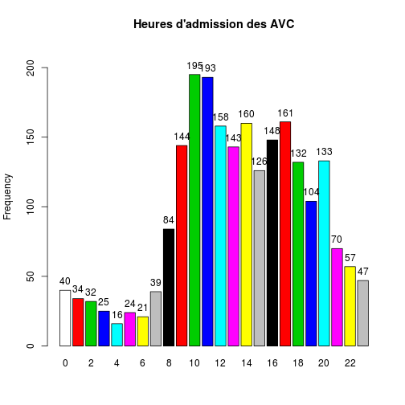 

```
## h : 
##         Frequency Percent Cum. percent
## 0              39     1.9          1.9
## 1              28     1.3          3.2
## 2              29     1.4          4.6
## 3              25     1.2          5.8
## 4              12     0.6          6.3
## 5              19     0.9          7.2
## 6              21     1.0          8.2
## 7              34     1.6          9.9
## 8              81     3.9         13.7
## 9             133     6.3         20.1
## 10            179     8.5         28.6
## 11            178     8.5         37.1
## 12            140     6.7         43.7
## 13            134     6.4         50.1
## 14            152     7.2         57.4
## 15            122     5.8         63.2
## 16            132     6.3         69.5
## 17            150     7.1         76.6
## 18            121     5.8         82.4
## 19             91     4.3         86.7
## 20            117     5.6         92.3
## 21             67     3.2         95.5
## 22             51     2.4         97.9
## 23             44     2.1        100.0
##   Total      2099   100.0        100.0
```

Selon le jour de la semaine


```
## w
##   Sun   Mon  Tues   Wed Thurs   Fri   Sat 
##   253   333   324   309   317   297   266
```

```
## w
##   Sun   Mon  Tues   Wed Thurs   Fri   Sat 
## 12.05 15.86 15.44 14.72 15.10 14.15 12.67
```

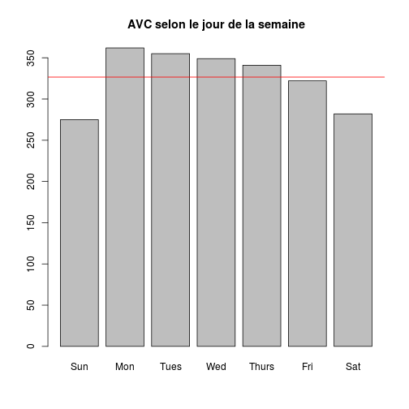 

Proportion théorique = 14.28% par jour de la semaine

AVC selon le mois
-----------------

```
## m
## Jan Feb Mar Apr May Jun Jul Aug Sep Oct Nov Dec 
## 232 191 220 270 251 258 250 242 185   0   0   0
```

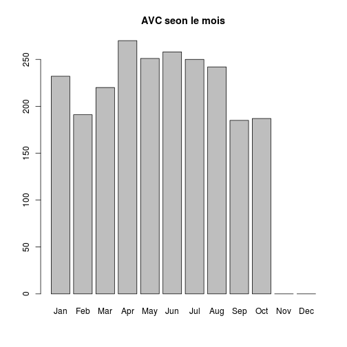 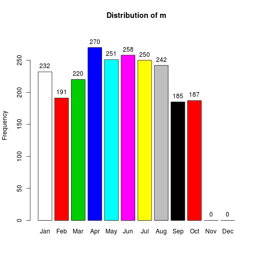 

```
## m : 
##         Frequency Percent Cum. percent
## Jan           232    11.1         11.1
## Feb           191     9.1         20.2
## Mar           220    10.5         30.6
## Apr           270    12.9         43.5
## May           251    12.0         55.5
## Jun           258    12.3         67.7
## Jul           250    11.9         79.7
## Aug           242    11.5         91.2
## Sep           185     8.8        100.0
## Oct             0     0.0        100.0
## Nov             0     0.0        100.0
## Dec             0     0.0        100.0
##   Total      2099   100.0        100.0
```

AVC par semaine
---------------
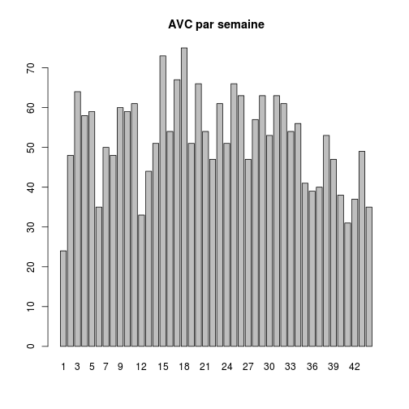 


Age et AVC
----------

```
##    Min. 1st Qu.  Median    Mean 3rd Qu.    Max. 
##       1      61      75      71      83     112
```

Le rapport de 2009 donne age moyen = 70.5 et age médian = 75 ans.

Sexe et AVC
-----------

```r
summary(AVC$SEXE)
```

```
##    F    I    M 
## 1101    0  998
```

```r
hist(AVC$AGE, main = "Répartition des AVC", col = "pink", xlab = "Age en années")
```

 

```r
t <- table(AVC$AGE)
barplot(t, main = "AVC - Répartition des ages")
```

 

```r
t <- table(AVC$SEXE, AVC$AGE)
barplot(t, col = c("darkblue", "white", "red"), legend = TRUE)
```

 

```r
barplot(t, col = c("yellow", "red"), legend = TRUE, beside = TRUE)
```

 

Etude AIT
---------
Recommandations pour la sélection des données PMSI MCO concernant l’AVC (Juin 2009)
- G450 Syndrome vertébro-basilaire
- G451 Syndrome carotidien (hémisphérique)
- G452 Accident ischémique transitoire de territoires artériels précérébraux multiples et bilatéraux
- G453  Amaurose fugace
- G458  Autres accidents ischémiques cérébraux transitoires et syndromes apparentés
- G459  Accident ischémique cérébral transitoire, sans précision  

```r
ait <- dpr$DP[substr(dpr$DP, 1, 3) == "G45" & substr(dpr$DP, 1, 4) != "G454"]
tab1(ait, missing = FALSE)
```

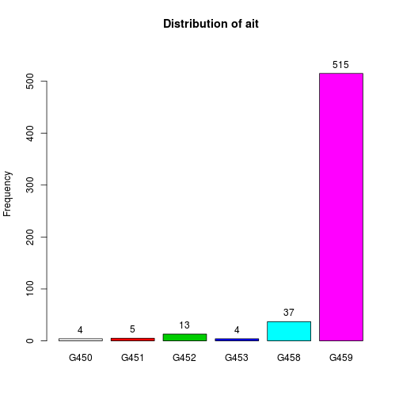 

```
## ait : 
##         Frequency Percent Cum. percent
## G450            4     0.8          0.8
## G451            5     1.0          1.7
## G452           13     2.5          4.2
## G453            4     0.8          5.0
## G458           37     7.0         12.0
## G459          462    88.0        100.0
##   Total       525   100.0        100.0
```


Asthme
======

J45.0 Asthme à prédominance allergique  
J45.1 Asthme non allergique  
J45.8 Asthme associé  
J45.9 Asthme, sans précision  
J46   Etat de mal asthmatique


```
## J450 J451 J458 J459  J46 
##   96  136    5  723   41
```

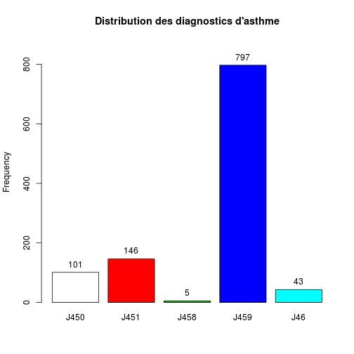 

```
## as.factor(asthme$DP) : 
##         Frequency Percent Cum. percent
## J450           96     9.6          9.6
## J451          136    13.6         23.2
## J458            5     0.5         23.7
## J459          723    72.2         95.9
## J46            41     4.1        100.0
##   Total      1001   100.0        100.0
```

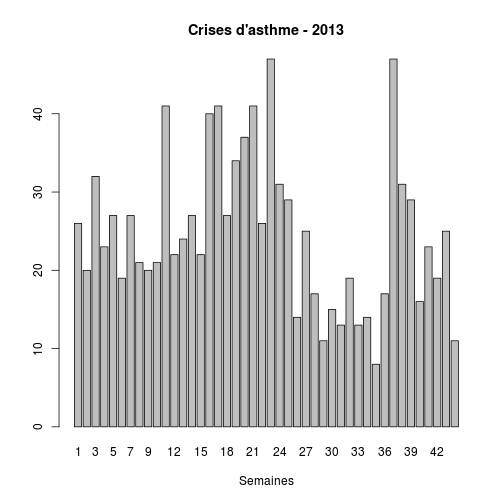 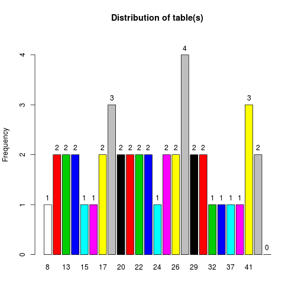 

```
## table(s) : 
##         Frequency Percent Cum. percent
## 3               1     2.5          2.5
## 8               1     2.5          5.0
## 11              1     2.5          7.5
## 13              2     5.0         12.5
## 14              2     5.0         17.5
## 15              1     2.5         20.0
## 17              2     5.0         25.0
## 19              2     5.0         30.0
## 20              2     5.0         35.0
## 21              2     5.0         40.0
## 22              2     5.0         45.0
## 23              1     2.5         47.5
## 24              1     2.5         50.0
## 25              1     2.5         52.5
## 26              2     5.0         57.5
## 27              4    10.0         67.5
## 29              2     5.0         72.5
## 31              2     5.0         77.5
## 32              1     2.5         80.0
## 34              1     2.5         82.5
## 37              1     2.5         85.0
## 40              1     2.5         87.5
## 41              3     7.5         95.0
## 47              2     5.0        100.0
##   Total        40   100.0        100.0
```

```
##       DP             CODE_POSTAL     ENTREE              FINESS   
##  Length:1001        68000  :116   Length:1001        Mul    :335  
##  Class :character   68200  : 72   Class :character   Col    :282  
##  Mode  :character   68100  : 70   Mode  :character   Sel    : 97  
##                     67600  : 33                      Hag    : 66  
##                     67100  : 32                      Hus    : 54  
##                     68500  : 31                      3Fr    : 49  
##                     (Other):647                      (Other):118  
##     GRAVITE     ORIENTATION     MODE_SORTIE       AGE       SEXE   
##  2      :646   MED    :173   NA       :  0   Min.   : 0.0   F:504  
##  3      :224   UHCD   : 95   Mutation :323   1st Qu.: 3.0   I:  0  
##  1      :103   SC     : 45   Transfert: 13   Median :14.0   M:497  
##  4      : 17   REA    :  7   Domicile :571   Mean   :23.7          
##  5      :  3   CHIR   :  4   Décès    :  0   3rd Qu.:40.0          
##  (Other):  0   (Other):  3   NA's     : 94   Max.   :97.0          
##  NA's   :  8   NA's   :674                                         
##  TRANSPORT  
##  AMBU : 96  
##  FO   :  1  
##  HELI :  1  
##  PERSO:678  
##  SMUR : 27  
##  VSAB : 74  
##  NA's :124
```

Gravité des crises: prédominance CCMU  2  et 3 et qulques 4 ou 5 
hospit = mutation+tranfert = 323+13=336
taux hospit supérieur à 30% (336/1001)  
taux hospit en services chaud (SI+SC+Rea): 52/1001= 5.2% et 52/323= 16% des hospit  
age: moyenne 24 ans(médiane 14 ans)  
sex ratio: 0.98

Crise asthme hospitalisée et lieu d'hospitalisation:

```r
table(asthme$DP, asthme$ORIENTATION)
```

```
##       
##        CHIR FUGUE HDT  HO MED OBST PSA REA REO  SC SCAM  SI UHCD
##   J450    0     0   1   0   6    0   0   1   0   0    0   0   13
##   J451    1     0   0   0  30    0   0   0   0  16    0   0    3
##   J458    0     0   0   0   2    0   0   1   0   0    0   0    0
##   J459    2     0   0   0 120    2   0   4   0  21    0   0   77
##   J46     1     0   0   0  15    0   0   1   0   8    0   0    2
```

#### Remarques INVS:
Ce bulletin (Le point épidémiologique du 24 octobre 2013 | Surveillance épidémiologique de la Cire Lorraine-Alsace) clôt la surveillance de l’asthme. Pour l’association SOS Médecins de Strasbourg,
l’activité liée à l’asthme a été particulièrement marqué de mi-avril (semaine 16) à fin mai
(semaine 22) puis en semaine 40. Concernant l’association de Mulhouse, seule une forte
augmentation en semaine 39 a été observée depuis début avril.

Intoxications par les champignons
=================================
CIM10 = T62


```r
champ <- dpr[substr(dpr$DP, 1, 3) == "T62", ]
summary(champ)
```

```
##       DP             CODE_POSTAL    ENTREE              FINESS 
##  Length:39          68200  : 6   Length:39          Mul    :9  
##  Class :character   68300  : 3   Class :character   Col    :6  
##  Mode  :character   67480  : 2   Mode  :character   3Fr    :5  
##                     67500  : 2                      Geb    :5  
##                     67600  : 2                      Hag    :5  
##                     68500  : 2                      Sel    :5  
##                     (Other):22                      (Other):4  
##     GRAVITE    ORIENTATION    MODE_SORTIE      AGE       SEXE   TRANSPORT 
##  2      :21   UHCD   : 4   NA       : 0   Min.   : 0.0   F:17   AMBU :10  
##  1      : 9   CHIR   : 1   Mutation : 6   1st Qu.:12.5   I: 0   FO   : 0  
##  3      : 8   SC     : 1   Transfert: 0   Median :33.0   M:22   HELI : 0  
##  4      : 0   FUGUE  : 0   Domicile :29   Mean   :31.2          PERSO:21  
##  5      : 0   HDT    : 0   Décès    : 0   3rd Qu.:42.5          SMUR : 0  
##  (Other): 0   (Other): 0   NA's     : 4   Max.   :91.0          VSAB : 4  
##  NA's   : 1   NA's   :33                                        NA's : 4
```

Intoxication au CO
==================
CIM10 = T58


```r
co <- dpr[substr(dpr$DP, 1, 3) == "T58", ]
m <- month(co$ENTREE, label = T)
table(m)
```

```
## m
## Jan Feb Mar Apr May Jun Jul Aug Sep Oct Nov Dec 
##   5  12  11   0   6   9   0   1   0   0   0   0
```

```r
barplot(table(m), main = "Intoxication au CO - 2013", xlab = "Mois")
```

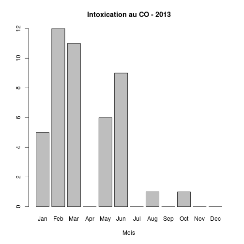 

Bronchiolite
============
Bronchiolite aiguë

Inclus:
    avec bronchospasme

J21.0 Bronchiolite aiguë due au virus respiratoire syncytial [VRS]
J21.8 Bronchiolite aiguë due à d'autres micro-organismes précisés
J21.9 Bronchiolite aiguë, sans précision


```r
bron <- dpr[substr(dpr$DP, 1, 3) == "J21", ]
m <- month(bron$ENTREE, label = T)
barplot(table(m), main = "Bronchiolites - 2013", xlab = "Mois")
```

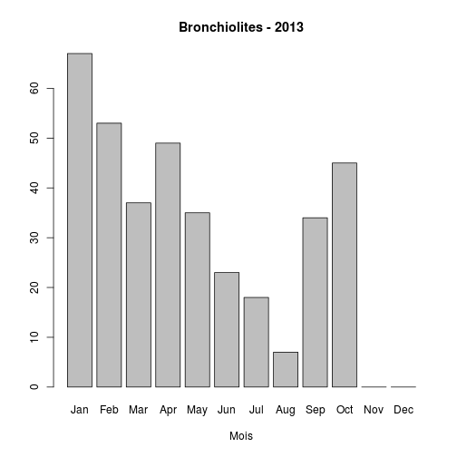 

```r
s <- week(bron$ENTREE)
barplot(table(s), main = "Bronchiolites - 2013", xlab = "Semaines")
```

 

```r
summary(bron)
```

```
##       DP             CODE_POSTAL     ENTREE              FINESS   
##  Length:323         68200  : 62   Length:323         Mul    :255  
##  Class :character   68100  : 46   Class :character   Sel    : 24  
##  Mode  :character   68270  : 16   Mode  :character   Col    : 18  
##                     68300  :  9                      Wis    : 10  
##                     68800  :  9                      3Fr    :  9  
##                     68110  :  8                      Geb    :  2  
##                     (Other):173                      (Other):  5  
##     GRAVITE     ORIENTATION     MODE_SORTIE       AGE        SEXE   
##  2      :180   MED    : 72   NA       :  0   Min.   : 0.00   F:132  
##  3      :101   SC     : 69   Mutation :146   1st Qu.: 0.00   I:  0  
##  1      : 35   REA    :  3   Transfert:  0   Median : 0.00   M:191  
##  5      :  3   UHCD   :  3   Domicile :150   Mean   : 1.39          
##  4      :  2   SCAM   :  1   Décès    :  0   3rd Qu.: 0.00          
##  (Other):  0   (Other):  0   NA's     : 27   Max.   :93.00          
##  NA's   :  2   NA's   :175                                          
##  TRANSPORT  
##  AMBU :  6  
##  FO   :  0  
##  HELI :  0  
##  PERSO:285  
##  SMUR :  0  
##  VSAB :  2  
##  NA's : 30
```

Surreprésentation de Mul  
taux hospitalisation: 50%

Gastro-entérites
================
CIM10 A09 : Diarrhée et gastro-entérite d'origine présumée infectieuse

Note:

    Dans les pays où les affections énumérées en A09 sans précision supplémentaire peuvent être présumées d'origine non infectieuse, les classer en K52.9.

Inclus:
    Catarrhe intestinal

        Colite
        Entérite
        Gastro-entérite
        SAI
        hémorragique
        septique

    Diarrhée:

        SAI
        dysentérique
        épidémique

    Maladie diarrhéique infectieuse SAI

Excl.:
    diarrhée non infectieuse (K52.9)

        néonatale (P78.3) 

    maladies dues à des bactéries, des protozoaires, des virus et d'autres agents infectieux précisés (A00-A08)  
    

```r
ge <- dpr[substr(dpr$DP, 1, 3) == "A09", ]
summary(ge)
```

```
##       DP             CODE_POSTAL      ENTREE              FINESS    
##  Length:1961        68100  : 232   Length:1961        Mul    :1001  
##  Class :character   68200  : 221   Class :character   Col    : 284  
##  Mode  :character   68300  : 134   Mode  :character   3Fr    : 194  
##                     68000  : 111                      Wis    : 132  
##                     68500  :  55                      Geb    : 105  
##                     67160  :  53                      Sel    :  89  
##                     (Other):1155                      (Other): 156  
##     GRAVITE      ORIENTATION      MODE_SORTIE        AGE      SEXE   
##  2      :1345   MED    : 189   NA       :   0   Min.   :  0   F:978  
##  1      : 398   UHCD   : 106   Mutation : 336   1st Qu.:  1   I:  0  
##  3      : 193   SC     :  21   Transfert:   3   Median :  5   M:983  
##  4      :  14   CHIR   :   3   Domicile :1422   Mean   : 18          
##  5      :   0   HO     :   1   Décès    :   0   3rd Qu.: 27          
##  (Other):   0   (Other):   4   NA's     : 200   Max.   :100          
##  NA's   :  11   NA's   :1637                                         
##  TRANSPORT   
##  AMBU : 191  
##  FO   :   0  
##  HELI :   0  
##  PERSO:1521  
##  SMUR :  10  
##  VSAB :  54  
##  NA's : 185
```

```r
table(ge$FINESS, ge$DP)
```

```
##      
##        A09 A090 A099
##   3Fr    0   37  157
##   Alk    0    6    8
##   Col  229   40   15
##   Dia    0    0    0
##   Geb    0   20   85
##   Hag    0   26   10
##   Hus    0   37   28
##   Mul 1001    0    0
##   Odi    0   11   30
##   Sel    0   39   50
##   Wis    0   64   68
##   Sav    0    0    0
```

```r
hist(ge$AGE, main = "Gasto-entérites - 2013", xlab = "Age (années)", ylab = "nombre", 
    col = "gray90")
```

 

```r
boxplot(ge$AGE, col = "yellow", main = "Gastro-entérite", ylab = "age (années)")
```

 

```r
m <- month(ge$ENTREE, label = T)
x <- barplot(table(m), main = "Gestro-entérites - 2013", xlab = "Mois")
lines(x = x, y = table(m), col = "red")
```

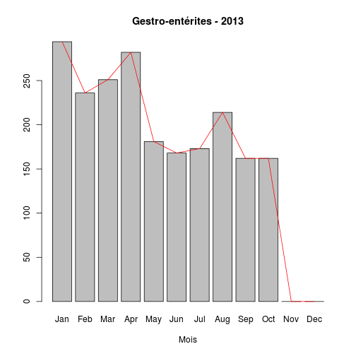 

#### NOTE TECHNIQUE: tracer une ligne joignant les sommets des barres du barplot. On utilise lines avec les valeurs suivantes:
- x = abcisse des colonnes. Elles sont contenues dans l'objet barplot. On peut les recueillir eplicitement par la fonction *str* (str(x)).
- y = ordonnées des barres, récupérées avec la fonction *table* qui agglomère les données par mois
Voir aussi: http://www.ats.ucla.edu/stat/r/faq/barplotplus.htm

#### calculs à la manière de l'INVS

nombre de diagnostics de GE / nb total de diagnostics par semaine:

```r
mge <- month(ge$ENTREE, label = T)
mtot <- month(dpr$ENTREE, label = T)
summary(mtot)
```

```
##   Jan   Feb   Mar   Apr   May   Jun   Jul   Aug   Sep   Oct   Nov   Dec 
## 17364 17156 18396 20302 19207 20772 20387 17993 15842     0     0     0
```

```r
summary(mge)
```

```
## Jan Feb Mar Apr May Jun Jul Aug Sep Oct Nov Dec 
## 294 236 251 282 181 168 173 214 162   0   0   0
```

```r
a <- round(summary(mge) * 100/summary(mtot), 2)
a
```

```
##  Jan  Feb  Mar  Apr  May  Jun  Jul  Aug  Sep  Oct  Nov  Dec 
## 1.69 1.38 1.36 1.39 0.94 0.81 0.85 1.19 1.02  NaN  NaN  NaN
```

```r
barplot(a)
```

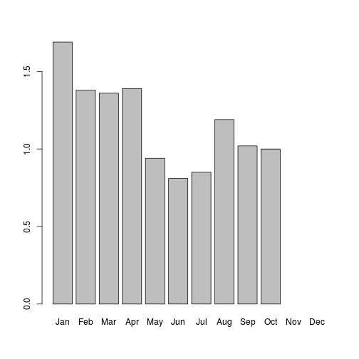 

dpt: tous les cas de traumato (S00 à T98)  
dpnp:tous lescas de médecine  

dpt<-dpr[substr(dpr$DP,1,3)>="S00" & substr(dpr$DP,1,3)<"T99", ]  
dpnt<-dpr[substr(dpr$DP,1,3) < "S00" | substr(dpr$DP,1,3)>"T98", ]  
mnt<-month(dpnt$ENTREE,label=T)  
a<-round(summary(mge)*100/summary(mnt),2)  
a  
