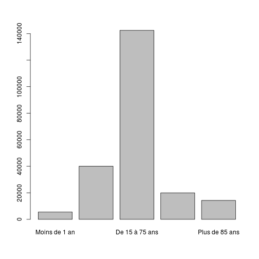

Répartition des passages par tranches d'age
========================================================

```r
date()
```

```
## [1] "Sun Oct  6 15:31:48 2013"
```

Variables globales:
-------------------

```r
mois_courant <- 8
annee_couranre <- 2013
path <- "../../"
```

Activité régionale
-----------------------------

```r
wd <- getwd()
# setwd('~/Documents/Resural/Stat
# Resural/RPU2013/Chapitres/Activite_regionale')
source(paste(path, "mes_fonctions.R", sep = ""))
```

Librairies nécessaires:
-----------------------

```r
load_libraries()
```


Lecture du fichier des données
---------------------------------------
On lit le fichier de travail créé:

```r

if (!exists("d1")) {
    load(paste(path, "rpu2013d0108.Rda", sep = ""))
    d1 <- d0108
    rm(d0108)
}
```

Le découpage en tranches d'age est le même que celui utilisé pour la population générale (voir demographie2.Rmd)


```r
age <- cut(d1$AGE, breaks = c(-1, 0.99, 14, 74, 84, 110), labels = c("Moins de 1 an", 
    "De 1 à 15 ans", "De 15 à 75 ans", "de 75 à 85 ans", "Plus de 85 ans"))
a <- tapply(d1$AGE, age, length)
a
```

```
##  Moins de 1 an  De 1 à 15 ans De 15 à 75 ans de 75 à 85 ans Plus de 85 ans 
##           5554          40062         142453          19996          14269
```

```r
barplot(a)
```

 

