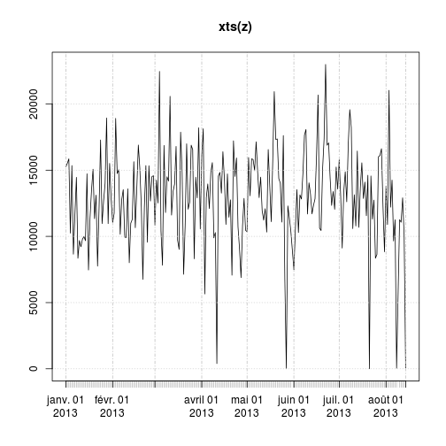
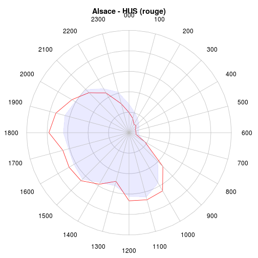
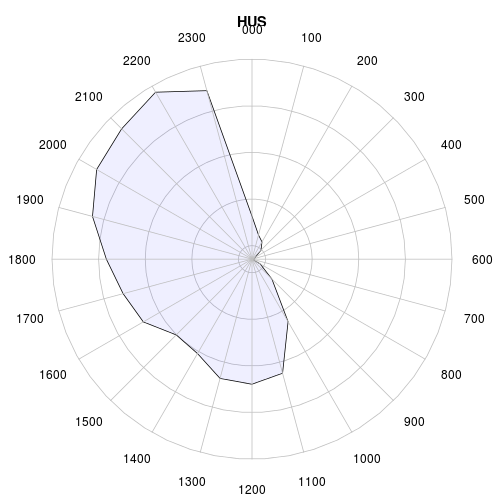
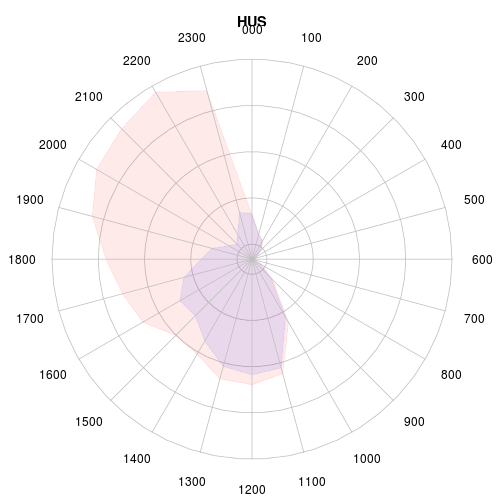

RPU 2013 Analyse
========================================================

```r
date()
```

```
## [1] "Sat Nov  9 10:13:20 2013"
```

source: RPU2013
Ce document exploite le fichier RData préparé à partir de la table *RPU__* de Sagec. Voir le document *RPU_2013_Preparation.Rmd* du dossier Resural.

Librairies nécessaires:
-----------------------

```r
library("gdata")
library("rgrs")
library("lubridate")
library("rattle")
library("epicalc")
library("zoo")
library("xts")
library("xtable")
library("plotrix")
library("openintro")
```

Chargement des routines perso
-----------------------------

```r
source("../mes_fonctions.R")
```

```
## Warning: impossible d'ouvrir le fichier '../mes_fonctions.R' : Aucun
## fichier ou dossier de ce type
```

```
## Error: impossible d'ouvrir la connexion
```

Variables globales:
-------------------

```r
mois_courant <- 9
```


Lecture du fichier des données
---------------------------------------
On lit le fichier de travail créé:

```r

# load('rpu2013.Rda')
load("rpu2013d0109.Rda")
d1 <- d0109
rm(d0109)

attach(d1)
```

Les données sont enregistrées dans un data.frame appelé *d1*.

Analyse des données
===================

```r
n <- dim(d1)
print(n)
```

```
## [1] 249039     20
```

```r
names(d1)
```

```
##  [1] "id"            "CODE_POSTAL"   "COMMUNE"       "DESTINATION"  
##  [5] "DP"            "ENTREE"        "EXTRACT"       "FINESS"       
##  [9] "GRAVITE"       "MODE_ENTREE"   "MODE_SORTIE"   "MOTIF"        
## [13] "NAISSANCE"     "ORIENTATION"   "PROVENANCE"    "SEXE"         
## [17] "SORTIE"        "TRANSPORT"     "TRANSPORT_PEC" "AGE"
```

```r
str(d1)
```

```
## 'data.frame':	249039 obs. of  20 variables:
##  $ id           : chr  "2c9d83843bf5e01d013bf5e985d20225" "2c9d83843bf5e01d013bf5e986950226" "2c9d83843bf5e01d013bf5e987620227" "2c9d83843bf5e01d013bf5e988060228" ...
##  $ CODE_POSTAL  : Factor w/ 2551 levels "00000","00159",..: 706 706 706 706 706 701 818 706 706 706 ...
##  $ COMMUNE      : Factor w/ 5321 levels "00","01257 DRESDEN ALLEMAGNE",..: 2184 2184 2184 2184 741 2048 2033 2184 2184 2184 ...
##  $ DESTINATION  : Factor w/ 7 levels "NA","MCO","SSR",..: NA NA NA NA NA NA 2 NA 2 NA ...
##  $ DP           : chr  "R104" "J038" "S617" "M485" ...
##  $ ENTREE       : chr  "2013-01-01 00:04:00" "2013-01-01 00:16:00" "2013-01-01 00:26:00" "2013-01-01 00:32:00" ...
##  $ EXTRACT      : chr  "2013-01-01 05:37:00" "2013-01-01 05:37:00" "2013-01-01 05:37:00" "2013-01-01 05:37:00" ...
##  $ FINESS       : Factor w/ 12 levels "3Fr","Alk","Col",..: 10 10 10 10 10 10 10 10 10 10 ...
##  $ GRAVITE      : Factor w/ 7 levels "1","2","3","4",..: 2 2 3 2 2 1 3 2 2 2 ...
##  $ MODE_ENTREE  : Factor w/ 5 levels "NA","Mutation",..: 4 4 4 4 4 4 4 4 4 4 ...
##  $ MODE_SORTIE  : Factor w/ 5 levels "NA","Mutation",..: 4 4 4 4 4 4 2 4 2 4 ...
##  $ MOTIF        : chr  "GASTRO04" "DIVERS23" "TRAUMATO10" "TRAUMATO02" ...
##  $ NAISSANCE    : chr  "1960-04-08 00:00:00" "1986-03-05 00:00:00" "1971-12-22 00:00:00" "1927-04-27 00:00:00" ...
##  $ ORIENTATION  : Factor w/ 13 levels "CHIR","FUGUE",..: NA NA NA NA NA NA 5 NA 5 NA ...
##  $ PROVENANCE   : Factor w/ 7 levels "NA","MCO","SSR",..: 6 6 6 6 6 6 6 6 6 6 ...
##  $ SEXE         : Factor w/ 3 levels "F","I","M": 3 3 3 1 3 3 1 1 1 1 ...
##  $ SORTIE       : chr  "2013-01-01 02:38:00" "2013-01-01 00:38:00" "2013-01-01 02:07:00" "2013-01-01 01:52:00" ...
##  $ TRANSPORT    : Factor w/ 6 levels "AMBU","FO","HELI",..: 4 4 4 1 4 4 6 6 4 4 ...
##  $ TRANSPORT_PEC: Factor w/ 3 levels "AUCUN","MED",..: 1 1 1 3 1 1 2 2 1 1 ...
##  $ AGE          : num  52 26 41 85 39 9 79 50 46 18 ...
```

```r
summary(d1)
```

```
##       id             CODE_POSTAL            COMMUNE        DESTINATION    
##  Length:249039      68000  : 16950   MULHOUSE   : 29395   MCO    : 51458  
##  Class :character   68200  : 15535   STRASBOURG : 25516   PSY    :   900  
##  Mode  :character   68100  : 13931   COLMAR     : 16943   SSR    :    74  
##                     67100  : 11672   HAGUENAU   :  5242   HMS    :    21  
##                     67000  :  8184   SAINT LOUIS:  4203   SLD    :    12  
##                     68500  :  6494   (Other)    :167736   (Other):     3  
##                     (Other):176273   NA's       :     4   NA's   :196571  
##       DP               ENTREE            EXTRACT              FINESS     
##  Length:249039      Length:249039      Length:249039      Col    :49096  
##  Class :character   Class :character   Class :character   Mul    :41554  
##  Mode  :character   Mode  :character   Mode  :character   Hus    :28293  
##                                                           Hag    :26307  
##                                                           Dia    :22143  
##                                                           Odi    :19528  
##                                                           (Other):62118  
##     GRAVITE            MODE_ENTREE        MODE_SORTIE    
##  2      :152210   NA         :     0   NA       :     0  
##  3      : 28890   Mutation   :  2712   Mutation : 48898  
##  1      : 28727   Transfert  :  2177   Transfert:  3665  
##  4      :  2604   Domicile   :217766   Domicile :159755  
##  P      :  1032   Transfe  rt:   294   Décès    :     2  
##  (Other):   680   NA's       : 26090   NA's     : 36719  
##  NA's   : 34896                                          
##     MOTIF            NAISSANCE          ORIENTATION       PROVENANCE    
##  Length:249039      Length:249039      UHCD   : 24513   PEA    :134665  
##  Class :character   Class :character   MED    : 12574   PEO    : 21883  
##  Mode  :character   Mode  :character   CHIR   :  5541   MCO    :  5617  
##                                        PSA    :  2327   SSR    :    40  
##                                        REO    :  1074   PSY    :    37  
##                                        (Other):  3571   (Other):    15  
##                                        NA's   :199439   NA's   : 86782  
##  SEXE          SORTIE          TRANSPORT      TRANSPORT_PEC   
##  F:118091   Length:249039      AMBU : 33170   AUCUN  :175912  
##  I:     4   Class :character   FO   :  1076   MED    :  4866  
##  M:130944   Mode  :character   HELI :   165   PARAMED:  4932  
##                                PERSO:136636   NA's   : 63329  
##                                SMUR :  2026                   
##                                VSAB : 20948                   
##                                NA's : 55018                   
##       AGE       
##  Min.   :  0.0  
##  1st Qu.: 18.0  
##  Median : 38.0  
##  Mean   : 40.5  
##  3rd Qu.: 62.0  
##  Max.   :112.0  
##  NA's   :9
```

Stuctures hospitaliéres participantes
=====================================
- *Alk* CH d' Alkirch
- *Col* CH Colmar (Pasteur + Parc)
- *Dia* Diaconat-Fonderie
- *3Fr* Clinique des trois frontières
- *Geb* HUS
- *Hag* CH de Haguenau
- *Hus* Hôpiaux Universitaires de Strasbourg
- *Mul* CH de Mulhouse
- *Odi* Clinique Ste Odile
- *Sel* CH de Sélestat
- *Wis* CH de Wissembourg
- *Sav* CH de Saverne
Hôpitaux ne transmettant pas de données:
- *Tha* CH de Thann
- *Ann* Clinique Ste Anne

Contribution (en %) des SU à la production de RPU:

```r
summary(d1$FINESS)
```

```
##   3Fr   Alk   Col   Dia   Geb   Hag   Hus   Mul   Odi   Sel   Wis   Sav 
## 12013  5326 49096 22143 11451 26307 28293 41554 19528 18502  9576  5250
```

```r
a <- table(d1$FINESS)
round(prop.table(a) * 100, digits = 2)
```

```
## 
##   3Fr   Alk   Col   Dia   Geb   Hag   Hus   Mul   Odi   Sel   Wis   Sav 
##  4.82  2.14 19.71  8.89  4.60 10.56 11.36 16.69  7.84  7.43  3.85  2.11
```

Passages déclarés au serveur régional:

   ALK  | COL  | CTF |  DIA |  GEB |  HUS |  MUL |  ODI |  SAV |  SEL  | TAN |  WIS 
   ----|-------|-----|------|------|------|-------|------|-----|-------|-----|-----
  4577 |21353 | 5475 | 3136  |4926 |41561 |20160 | 8417 | 8961 | 9670 | 4840 | 3052
  
  First Header  | Second Header
------------- | -------------
Content Cell  | Content Cell
Content Cell  | Content Cell

Projection sur l'année:

```r
mois_courant <- 7
p <- 12/mois_courant
summary(d1$FINESS) * p
```

```
##   3Fr   Alk   Col   Dia   Geb   Hag   Hus   Mul   Odi   Sel   Wis   Sav 
## 20594  9130 84165 37959 19630 45098 48502 71235 33477 31718 16416  9000
```

```r
sum(summary(d1$FINESS) * p)
```

```
## [1] 426924
```

```r

t1 <- table(d1$FINESS)
t2 <- table(d1$FINESS) * p
t3 <- rbind(t1, t2)
rownames(t3) <- c("Réalisé", "Projection 2013")
xtable(t(t3))
```

```
## % latex table generated in R 3.0.2 by xtable 1.7-1 package
## % Sat Nov  9 10:13:30 2013
## \begin{table}[ht]
## \centering
## \begin{tabular}{rrr}
##   \hline
##  & Réalisé & Projection 2013 \\ 
##   \hline
## 3Fr & 12013.00 & 20593.71 \\ 
##   Alk & 5326.00 & 9130.29 \\ 
##   Col & 49096.00 & 84164.57 \\ 
##   Dia & 22143.00 & 37959.43 \\ 
##   Geb & 11451.00 & 19630.29 \\ 
##   Hag & 26307.00 & 45097.71 \\ 
##   Hus & 28293.00 & 48502.29 \\ 
##   Mul & 41554.00 & 71235.43 \\ 
##   Odi & 19528.00 & 33476.57 \\ 
##   Sel & 18502.00 & 31717.71 \\ 
##   Wis & 9576.00 & 16416.00 \\ 
##   Sav & 5250.00 & 9000.00 \\ 
##    \hline
## \end{tabular}
## \end{table}
```

### Origine temporelle des données:
Pour chaque hopital on determine la datela plus basse a partir de laquelle des donn2es sont transmises. Les dates sont donnees en secondes unix => il faut les transformer en dates calendaires

```r
b <- tapply(as.Date(d1$ENTREE), d1$FINESS, min)
c <- as.Date(b, origin = "1970-01-01")
cbind(as.character(sort(c)))
```

```
##     [,1]        
## 3Fr "2013-01-01"
## Col "2013-01-01"
## Dia "2013-01-01"
## Geb "2013-01-01"
## Hag "2013-01-01"
## Hus "2013-01-01"
## Odi "2013-01-01"
## Sel "2013-01-01"
## Wis "2013-01-01"
## Mul "2013-01-07"
## Alk "2013-04-01"
## Sav "2013-07-23"
```

Exhaustivité des données
------------------------

#### Jours manquants:a<-as.data.frame(a)
NB: il manque le 31/05dans d1

On forme une matrice (table) de 365 lignes et 12 colonnes (hopitaux) contenant le nombre de RPU un jour donne pour un hopital. Pour conserver une trace du jour, on ajoute une colonne date. On signale les jours pour lesquels le nombre de RPU est inferieur a 20:


```r
a <- table(as.Date(d1$ENTREE), d1$FINESS)
a <- as.data.frame.matrix(a)
head(a)
```

```
##            3Fr Alk Col Dia Geb Hag Hus Mul Odi Sel Wis Sav
## 2013-01-01  59   0 208  88  45 131 126   0  84 111  32   0
## 2013-01-02  38   0 197  89  42 112 125   0  69  80  49   0
## 2013-01-03  39   0 160  73  42  83 121   0  55  78  35   0
## 2013-01-04  42   0 170  93  30  92 121   0  67  65  24   0
## 2013-01-05  46   0 150  87  44 100 102   0  70  85  38   0
## 2013-01-06  38   0 167  77  43  90  93   0  79  68  36   0
```

```r
# liste par FINESS des jours où le nb de RPU est inférieur à 20: il faut
# ajouter une colonne date pour que cela fonctionne.
a$date <- seq(as.Date("2013-01-01"), as.Date("2013-09-29"), 1)
# On initialise une liste de 12 éléments,12 parce que 12 SU
b <- list(1:12)
# pour chacun des SU, les jours où le nombre de RPU < 20, on stocke la date
# (col.13) et le n° du SU
for (i in 1:12) {
    b[[i]] <- a[a[, i] < 20, c(13, i)]
}
str(b)
```

```
## List of 12
##  $ :'data.frame':	0 obs. of  2 variables:
##   ..$ date:Class 'Date'  num(0) 
##   ..$ 3Fr : int(0) 
##  $ :'data.frame':	135 obs. of  2 variables:
##   ..$ date: Date[1:135], format: "2013-01-01" ...
##   ..$ Alk : int [1:135] 0 0 0 0 0 0 0 0 0 0 ...
##  $ :'data.frame':	2 obs. of  2 variables:
##   ..$ date: Date[1:2], format: "2013-09-28" ...
##   ..$ Col : int [1:2] 0 0
##  $ :'data.frame':	0 obs. of  2 variables:
##   ..$ date:Class 'Date'  num(0) 
##   ..$ Dia : int(0) 
##  $ :'data.frame':	5 obs. of  2 variables:
##   ..$ date: Date[1:5], format: "2013-05-08" ...
##   ..$ Geb : int [1:5] 0 0 0 0 0
##  $ :'data.frame':	0 obs. of  2 variables:
##   ..$ date:Class 'Date'  num(0) 
##   ..$ Hag : int(0) 
##  $ :'data.frame':	0 obs. of  2 variables:
##   ..$ date:Class 'Date'  num(0) 
##   ..$ Hus : int(0) 
##  $ :'data.frame':	19 obs. of  2 variables:
##   ..$ date: Date[1:19], format: "2013-01-01" ...
##   ..$ Mul : int [1:19] 0 0 0 0 0 0 0 0 0 0 ...
##  $ :'data.frame':	0 obs. of  2 variables:
##   ..$ date:Class 'Date'  num(0) 
##   ..$ Odi : int(0) 
##  $ :'data.frame':	53 obs. of  2 variables:
##   ..$ date: Date[1:53], format: "2013-04-11" ...
##   ..$ Sel : int [1:53] 6 1 10 2 0 3 0 0 0 0 ...
##  $ :'data.frame':	2 obs. of  2 variables:
##   ..$ date: Date[1:2], format: "2013-01-30" ...
##   ..$ Wis : int [1:2] 16 18
##  $ :'data.frame':	203 obs. of  2 variables:
##   ..$ date: Date[1:203], format: "2013-01-01" ...
##   ..$ Sav : int [1:203] 0 0 0 0 0 0 0 0 0 0 ...
```

```r
# dossier manquants pour guebwiller:
b[[5]]
```

```
##                  date Geb
## 2013-05-08 2013-05-08   0
## 2013-05-09 2013-05-09   0
## 2013-05-10 2013-05-10   0
## 2013-05-11 2013-05-11   0
## 2013-05-12 2013-05-12   0
```

```r
names(b[[5]])
```

```
## [1] "date" "Geb"
```

```r
b[[5]]$date
```

```
## [1] "2013-05-08" "2013-05-09" "2013-05-10" "2013-05-11" "2013-05-12"
```

```r
# liste des SU incomplets:
for (i in 1:12) {
    n = length(b[[i]]$date)
    if (n > 0) {
        print(paste(i, names(b[[i]][2]), n, sep = " "))
    }
}
```

```
## [1] "2 Alk 135"
## [1] "3 Col 2"
## [1] "5 Geb 5"
## [1] "8 Mul 19"
## [1] "10 Sel 53"
## [1] "11 Wis 2"
## [1] "12 Sav 203"
```

#### Exhaustivité des items
Il faut tranformer les valeurs NULL en NA pour pouvoir les comptabiliser. Les valeurs NULL apparaissent pour les factors: DP, MOTIF, TRANSPORT, ORIENTATION,GRAVITE, SORTIE. Il faut les transformer en character pour leur attriber la valeur NA au lieu de NULL:

```r
a <- as.character(d1$DP)
a[a == "NULL"] <- NA
sum(is.na(a))
```

```
## [1] 81620
```

```r
mean(is.na(a))
```

```
## [1] 0.3277
```

sum(is.na(a)) retourne le nombre de lignes concernées et *mean(is.na(a))* donne directement le pourcentage de valeurs nulles (R in action pp 356)

```r
d1$DP <- a

a <- as.character(d1$MOTIF)
a[a == "NULL"] <- NA
d1$MOTIF <- a

a <- as.character(d1$TRANSPORT)
a[a == "NULL"] <- NA
d1$TRANSPORT <- a

a <- as.character(d1$ORIENTATION)
a[a == "NULL"] <- NA
d1$ORIENTATION <- a

a <- as.character(d1$GRAVITE)
a[a == "NULL"] <- NA
d1$GRAVITE <- a

a <- as.character(d1$SORTIE)
a[a == "NULL"] <- NA
d1$SORTIE <- a

a <- as.character(d1$ENTREE)
a[a == "NULL"] <- NA
d1$ENTREE <- a
```

Les 2 lignes qui suivent comptent les NA

```r
a <- is.na(d1)
b <- apply(a, 2, mean)
a <- cbind(sort(round(b * 100, 2)))
colnames(a) <- "%"
a
```

```
##                   %
## id             0.00
## CODE_POSTAL    0.00
## COMMUNE        0.00
## ENTREE         0.00
## EXTRACT        0.00
## FINESS         0.00
## NAISSANCE      0.00
## SEXE           0.00
## AGE            0.00
## SORTIE         9.37
## MODE_ENTREE   10.48
## GRAVITE       14.01
## MODE_SORTIE   14.74
## TRANSPORT     22.09
## TRANSPORT_PEC 25.43
## DP            32.77
## PROVENANCE    34.85
## MOTIF         36.33
## DESTINATION   78.93
## ORIENTATION   80.08
```

MODE_SORTIE (hospitalisation ou retour à domicile): dans 14.86% des cas on ne sait pas ce que devient le patient. Pour sélectionner les hospitalisés et éliminer les NA et les valeurs nulles:

```r
a <- d1$MODE_SORTIE[MODE_SORTIE == "Mutation" | MODE_SORTIE == "Transfert"]
a <- na.omit(a)
a <- as.factor(as.character(a))
summary(a)
```

```
##  Mutation Transfert 
##     48898      3665
```

```r
round(prop.table(table(a)) * 100, 2)
```

```
## a
##  Mutation Transfert 
##     93.03      6.97
```

```r

a <- d1[MODE_SORTIE == "Mutation" | MODE_SORTIE == "Transfert", ]
a <- na.omit(a)
summary(a$DESTINATION)
```

```
##    NA   MCO   SSR   SLD   PSY   HAD   HMS 
##     0 18041     4     4   317     0     0
```

```r
summary(as.factor(a$ORIENTATION))
```

```
## CHIR  HDT   HO  MED OBST  REA   SC   SI UHCD 
## 3869   48   14 8434   37  531  736  709 3988
```

```r
round(prop.table(table(as.factor(a$ORIENTATION))) * 100, 2)
```

```
## 
##  CHIR   HDT    HO   MED  OBST   REA    SC    SI  UHCD 
## 21.07  0.26  0.08 45.92  0.20  2.89  4.01  3.86 21.71
```

```r

tab1(as.factor(a$ORIENTATION), sort.group = "decreasing", horiz = TRUE, cex.names = 0.8, 
    xlab = "", main = "Orientation des patients hospitalisés")
```

 

```
## as.factor(a$ORIENTATION) :  
##         Frequency Percent Cum. percent
## MED          8434    45.9         45.9
## UHCD         3988    21.7         67.6
## CHIR         3869    21.1         88.7
## SC            736     4.0         92.7
## SI            709     3.9         96.6
## REA           531     2.9         99.5
## HDT            48     0.3         99.7
## OBST           37     0.2         99.9
## HO             14     0.1        100.0
##   Total     18366   100.0        100.0
```

```r

a <- d1[d1$MODE_SORTIE == "Domicile", ]
summary(as.factor(a$ORIENTATION))
```

```
##   CHIR  FUGUE    HDT     HO    MED   OBST    PSA    REA    REO     SC 
##     92    198     13      2     53      1   2284      9   1047      4 
##   SCAM     SI   UHCD   NA's 
##    386     22    196 192167
```

```r
t <- table(as.factor(a$ORIENTATION))
round(prop.table(t) * 100, 2)
```

```
## 
##  CHIR FUGUE   HDT    HO   MED  OBST   PSA   REA   REO    SC  SCAM    SI 
##  2.14  4.60  0.30  0.05  1.23  0.02 53.03  0.21 24.31  0.09  8.96  0.51 
##  UHCD 
##  4.55
```

```r
tab1(as.factor(a$ORIENTATION), sort.group = "decreasing", horiz = TRUE, cex.names = 0.8, 
    xlab = "", main = "Orientation des patients non hospitalisés", missing = F)
```

 

```
## as.factor(a$ORIENTATION) :  
##         Frequency   %(NA+)   %(NA-)
## NA's       192167     97.8      0.0
## PSA          2284      1.2     53.0
## REO          1047      0.5     24.3
## SCAM          386      0.2      9.0
## FUGUE         198      0.1      4.6
## UHCD          196      0.1      4.6
## CHIR           92      0.0      2.1
## MED            53      0.0      1.2
## SI             22      0.0      0.5
## HDT            13      0.0      0.3
## REA             9      0.0      0.2
## SC              4      0.0      0.1
## HO              2      0.0      0.0
## OBST            1      0.0      0.0
##   Total    196474    100.0    100.0
```

La table ci-dessus liste le devenir des patients non hospitalisés. On note des incohérences: REA, HDT, SI, Med, CHIR, UHCD. La ligne *Missing* correspond aux patients rentrés sur avis médical.

Etude des patients hospitalisés
--------------------------------
La rubrique mode de sortie peut se décomposer en 3 éléments
- *hosp*: patient hospitalisés, cad gardé en milieu de soins par *MUTATION* ou *TRANSFERT*
- *dom*: retour à domicile ou équivalent
- *dcd*: patients décédés aux urgences
Dans l'échantillon *d1* c'est la colonne *MODE_SORTIE* qui renseigne sur le devenir du patient à la sortie des urgences:


```
## [1] "d1 compte  249039  lignes"
```

Il y a deux façons de former des sous ensembles avec R:
- sélectionner en utilisant la notation vectorielle: hosp<-d1[d1$MODE_SORTIE=="Mutation" | d1$MODE_SORTIE=="Transfert",]
- sélectionner avec la méthode **subset**: b<-subset(d1,MODE_SORTIE=="Mutation" | MODE_SORTIE=="Transfert")

La première méthode sélectionne toutes les lignes correspondant aux critères ET celles où le critère vaut *NA*. ie, la méthode 1 retourne un data frame de 39224 lignes et 20 colonnes.

La méthode *subset* ne tient pas compte des lignes où le critère vaut NA. Dans l'exemple, retourne un dataframe de 23473 lignes et 20 colonnes.


```r
hosp <- d1[d1$MODE_SORTIE == "Mutation" | d1$MODE_SORTIE == "Transfert", ]
dom <- d1[d1$MODE_SORTIE == "Domicile", ]
dcd <- d1[d1$MODE_SORTIE == "Deces", ]
nbna <- nrow(hosp) + nrow(dom) + nrow(dcd) - nrow(d1)
pna <- round(nbna * 100/nrow(d1), 2)

print(paste("hosp = ", nrow(hosp), " lignes"))
```

```
## [1] "hosp =  89282  lignes"
```

```r
print(paste("dom = ", nrow(dom), " lignes"))
```

```
## [1] "dom =  196474  lignes"
```

```r
print(paste("dcd = ", nrow(dcd), " lignes"))
```

```
## [1] "dcd =  36719  lignes"
```

```r

print(paste("La différence du nombre de lignes entre d1 et hosp, dom et dcd indique le nmbre de lignes correspondant à NA et qui sont incluses dans le décompte des lignes de chaque sous ensemble: ", 
    nbna, "correspondant aux mode de sortie non renseignés soit ", pna, " %"))
```

```
## [1] "La différence du nombre de lignes entre d1 et hosp, dom et dcd indique le nmbre de lignes correspondant à NA et qui sont incluses dans le décompte des lignes de chaque sous ensemble:  73436 correspondant aux mode de sortie non renseignés soit  29.49  %"
```

Avec *subset* on élimine ces lignes parasites:

```r
a <- subset(d1, MODE_SORTIE == "Domicile")
b <- subset(d1, MODE_SORTIE == "Mutation" | MODE_SORTIE == "Transfert")
nrow(a)
```

```
## [1] 159755
```

```r
nrow(b)
```

```
## [1] 52563
```

```r
nrow(d1) - nrow(a) - nrow(b)
```

```
## [1] 36721
```

```r

print("O")
```

```
## [1] "O"
```

```r
t <- table(b$ORIENTATION, b$FINESS, useNA = "ifany")
m1 <- margin.table(t, 1)
t2 <- cbind(t, m1)
m2 <- margin.table(t2, 2)
rbind(t2, m2)
```

```
##      3Fr Alk   Col  Dia Geb  Hag   Hus  Mul Odi  Sel  Wis  Sav    m1
## CHIR   1   0  2117   36  25  862     0 1155 128  835   11  170  5340
## HDT    0   0    44    0   1    0     0    4   1    0   16    0    66
## HO     0   0     6    0   1    0     0    3   0    0    9    0    19
## MED    1   0  4875    8  12 1604   371 1856  39 2726   21  828 12341
## OBST   0   0    26    0   3   30     0    0   1   11    0    0    71
## PSA    0   1     0    9   0    0     0    0   0    0    0    0    10
## REA    0   0   294    2   0  121     0  202   1   57    4    8   689
## REO    5   6     0    9   0    0     0    0   1    0    1    0    22
## SC     0   0   304    0   2   53     0  590   2    1   31    0   983
## SI     0   0   480    0   5  207     0  229   6    8   12    0   947
## UHCD   0   0  3656    5  13 3087 14960  493   1  240   37    0 22492
## <NA> 213 887   344 2156 172 1589     0 1383 692    0 2090   57  9583
## m2   220 894 12146 2225 234 7553 15331 5915 872 3878 2232 1063 52563
```

```r

summary(a$MODE_SORTIE)
```

```
##        NA  Mutation Transfert  Domicile     Décès 
##         0         0         0    159755         0
```

```r
summary(b$MODE_SORTIE)
```

```
##        NA  Mutation Transfert  Domicile     Décès 
##         0     48898      3665         0         0
```

- nb total de lignes = 105979
- total hospitalisés = 21950 +  1523
- total non hospitalisés = 66755 
- non réponses = 105979-90228 = 15751

```r
summary(b$DESTINATION)
```

```
##    NA   MCO   SSR   SLD   PSY   HAD   HMS  NA's 
##     0 51315    74    12   894     2     0   266
```

```r
summary(b$ORIENTATION)
```

```
##    Length     Class      Mode 
##     52563 character character
```

```r
summary(a$DESTINATION)
```

```
##     NA    MCO    SSR    SLD    PSY    HAD    HMS   NA's 
##      0    127      0      0      0      1     21 159606
```

```r
summary(a$ORIENTATION)
```

```
##    Length     Class      Mode 
##    159755 character character
```


on forme un dataframe *hosp* des patients hospitalisés par mutation ou transfert:

```r
hosp <- d1[d1$MODE_SORTIE == "Mutation" | d1$MODE_SORTIE == "Transfert", ]
summary(d1$MODE_SORTIE)
```

```
##        NA  Mutation Transfert  Domicile     Décès      NA's 
##         0     48898      3665    159755         2     36719
```

```r
prop.table(summary(d1$MODE_SORTIE)) * 100
```

```
##        NA  Mutation Transfert  Domicile     Décès      NA's 
## 0.000e+00 1.963e+01 1.472e+00 6.415e+01 8.031e-04 1.474e+01
```

#### Destinations

```r
summary(hosp$DESTINATION)
```

```
##    NA   MCO   SSR   SLD   PSY   HAD   HMS  NA's 
##     0 51315    74    12   894     2     0 36985
```

```r
prop.table(summary(hosp$DESTINATION))
```

```
##        NA       MCO       SSR       SLD       PSY       HAD       HMS 
## 0.0000000 0.5747519 0.0008288 0.0001344 0.0100132 0.0000224 0.0000000 
##      NA's 
## 0.4142492
```

```r
# sans les NA
table(hosp$DESTINATION)
```

```
## 
##    NA   MCO   SSR   SLD   PSY   HAD   HMS 
##     0 51315    74    12   894     2     0
```

```r
prop.table(table(hosp$DESTINATION)) * 100
```

```
## 
##        NA       MCO       SSR       SLD       PSY       HAD       HMS 
##  0.000000 98.122263  0.141500  0.022946  1.709467  0.003824  0.000000
```


#### Orientation des hospitalisés MCO (avec et sans les NA):

```r
a <- as.factor(hosp$ORIENTATION[hosp$DESTINATION == "MCO"])
a <- summary(a)
a
```

```
##  CHIR   HDT    HO   MED  OBST   PSA   REA   REO    SC    SI  UHCD  NA's 
##  5235    10     8 12133    71    10   681    21   973   947 22467 45744
```

```r
round(prop.table(a) * 100, 2)
```

```
##  CHIR   HDT    HO   MED  OBST   PSA   REA   REO    SC    SI  UHCD  NA's 
##  5.93  0.01  0.01 13.74  0.08  0.01  0.77  0.02  1.10  1.07 25.44 51.81
```

```r

a <- table(hosp$ORIENTATION[hosp$DESTINATION == "MCO"])
a
```

```
## 
##  CHIR   HDT    HO   MED  OBST   PSA   REA   REO    SC    SI  UHCD 
##  5235    10     8 12133    71    10   681    21   973   947 22467
```

```r
a <- prop.table(a) * 100
a
```

```
## 
##     CHIR      HDT       HO      MED     OBST      PSA      REA      REO 
## 12.30144  0.02350  0.01880 28.51067  0.16684  0.02350  1.60024  0.04935 
##       SC       SI     UHCD 
##  2.28640  2.22530 52.79397
```

```r
sce_chauds <- a["REA"] + a["SI"] + a["SC"]
print(paste("Services chauds: ", round(sce_chauds, 2), " %"))
```

```
## [1] "Services chauds:  6.11  %"
```

```r
mco <- a["CHIR"] + a["MED"] + a["OBST"]
print(paste("MCO: ", round(mco, 2), " %"))
```

```
## [1] "MCO:  40.98  %"
```

```r
print(paste("UHTCD: ", round(a["UHCD"], 2), " %"))
```

```
## [1] "UHTCD:  52.79  %"
```

```r
print(paste("Atypiques: ", round(a["FUGUE"] + a["PSA"] + a["SCAM"] + a["REO"], 
    2), " %"))
```

```
## [1] "Atypiques:  NA  %"
```

```r
print(paste("HDT-HO: ", round(a["HDT"] + a["HO"], 2), " %"))
```

```
## [1] "HDT-HO:  0.04  %"
```

Quelques erreurs de codage:
- Fugue, HDT, HO, PSA,REO, SCAM devraient être nuls
dom<-d1
#### Orientation des patients hospitalisés en Psychiatrie:

```r
a <- summary(hosp$ORIENTATION[hosp$DESTINATION == "PSY"])
a
```

```
##    Length     Class      Mode 
##     37879 character character
```

```r
a <- table(hosp$ORIENTATION[hosp$DESTINATION == "PSY"])
a
```

```
## 
## CHIR  HDT   HO  MED  REA  REO   SC UHCD 
##  105   56   11  197    6    1   10   11
```

```r

a <- d1[d1$DESTINATION == "PSY", ]
a$DESTINATION <- as.character(a$DESTINATION)
a <- a[!is.na(a$DESTINATION), ]
summary(a$ORIENTATION)
```

```
##    Length     Class      Mode 
##       900 character character
```

```r
round(prop.table(summary(a$ORIENTATION)) * 100, 3)
```

```
## Error: 'type' (character) de l'argument incorrect
```

#### Analyse de l'ensemble de la rubrique **ORIENTATION**

```r
d1$ORIENTATION <- as.factor(d1$ORIENTATION)
a <- summary(d1$ORIENTATION)
a
```

```
##   CHIR  FUGUE    HDT     HO    MED   OBST    PSA    REA    REO     SC 
##   5541    199    100     23  12574     72   2327    753   1074   1013 
##   SCAM     SI   UHCD   NA's 
##    386   1025  24513 199439
```

```r
a <- round(prop.table(a) * 100, 4)

sce_chauds <- a["REA"] + a["SI"] + a["SC"]
print(paste("Services chauds: ", round(sce_chauds, 2), " %"))
```

```
## [1] "Services chauds:  1.12  %"
```

```r
mco <- a["CHIR"] + a["MED"] + a["OBST"]
print(paste("MCO: ", round(mco, 2), " %"))
```

```
## [1] "MCO:  7.3  %"
```

```r
uhcd <- a["UHCD"]
print(paste("UHTCD: ", round(uhcd, 2), " %"))
```

```
## [1] "UHTCD:  9.84  %"
```

```r
atypique <- a["FUGUE"] + a["PSA"] + a["SCAM"] + a["REO"]
print(paste("Atypiques: ", round(atypique, 2), " %"))
```

```
## [1] "Atypiques:  1.6  %"
```

```r
psy <- a["HDT"] + a["HO"]
print(paste("HDT-HO: ", round(psy, 2), " %"))
```

```
## [1] "HDT-HO:  0.05  %"
```

```r
nr <- a["NA's"]

als <- c(mco, uhcd, nr, atypique, sce_chauds, psy)
lor <- c(49.39, 19.12, 17.25, 8.92, 5.24, 0.07)

r <- rbind(als, lor)
barplot(r, las = 2, beside = T, legend = T, ylab = "% des RPU", xlab = "", sub = "(Ref. ORULOR 2011 p.50)", 
    names.arg = c("MCO", "UHCD", "NR", "Atypiques", "REA", "PSY"), main = "Orientation des patients hospitalisés", 
    cex.sub = 0.6)
```

 

en fonction de l'établissement (NOTE: utilisation de useNA="ifany"):

```r
# analyse brute
t <- table(d1$ORIENTATION, d1$FINESS)
t
```

```
##        
##           3Fr   Alk   Col   Dia   Geb   Hag   Hus   Mul   Odi   Sel   Wis
##   CHIR      5     0  2122    66    35   862     0  1248   185   836    12
##   FUGUE     7     5    94     9     1    31     0     0    26     2    22
##   HDT       0     0    45     0     1     0     0    36     1     0    17
##   HO        2     0     6     0     1     0     0     4     0     0    10
##   MED       1     0  4887    14    15  1604   371  2034    58  2738    23
##   OBST      0     0    26     0     3    30     0     0     2    11     0
##   PSA      35   114   759   756    21   389     0   132    33     6    82
##   REA       1     0   294     4     1   121     0   260     2    57     5
##   REO      47    17   891   110     1     0     0     0     2     0     3
##   SC        0     0   304     0     3    53     0   613     2     1    37
##   SCAM      2    15   142    13    13   122     0     8    28     3    31
##   SI        1     0   480     2     6   207     0   283     7    26    13
##   UHCD      1     0  3660    12    15  3087 15824  1623     1   240    50
##        
##           Sav
##   CHIR    170
##   FUGUE     2
##   HDT       0
##   HO        0
##   MED     829
##   OBST      0
##   PSA       0
##   REA       8
##   REO       3
##   SC        0
##   SCAM      9
##   SI        0
##   UHCD      0
```

```r
# analyse brute incluant les NA
t <- table(d1$ORIENTATION, d1$FINESS, useNA = "ifany")
t
```

```
##        
##           3Fr   Alk   Col   Dia   Geb   Hag   Hus   Mul   Odi   Sel   Wis
##   CHIR      5     0  2122    66    35   862     0  1248   185   836    12
##   FUGUE     7     5    94     9     1    31     0     0    26     2    22
##   HDT       0     0    45     0     1     0     0    36     1     0    17
##   HO        2     0     6     0     1     0     0     4     0     0    10
##   MED       1     0  4887    14    15  1604   371  2034    58  2738    23
##   OBST      0     0    26     0     3    30     0     0     2    11     0
##   PSA      35   114   759   756    21   389     0   132    33     6    82
##   REA       1     0   294     4     1   121     0   260     2    57     5
##   REO      47    17   891   110     1     0     0     0     2     0     3
##   SC        0     0   304     0     3    53     0   613     2     1    37
##   SCAM      2    15   142    13    13   122     0     8    28     3    31
##   SI        1     0   480     2     6   207     0   283     7    26    13
##   UHCD      1     0  3660    12    15  3087 15824  1623     1   240    50
##   <NA>  11911  5175 35386 21157 11335 19801 12098 35313 19181 14582  9271
##        
##           Sav
##   CHIR    170
##   FUGUE     2
##   HDT       0
##   HO        0
##   MED     829
##   OBST      0
##   PSA       0
##   REA       8
##   REO       3
##   SC        0
##   SCAM      9
##   SI        0
##   UHCD      0
##   <NA>   4229
```

```r
# cette analyse ne permet pas de séparer les vraies non réponses des retours
# à domicile
hosp <- d1[d1$MODE_SORTIE == "Mutation" | d1$MODE_SORTIE == "Transfert", ]
t <- table(hosp$ORIENTATION, hosp$FINESS, useNA = "ifany")
t
```

```
##        
##           3Fr   Alk   Col   Dia   Geb   Hag   Hus   Mul   Odi   Sel   Wis
##   CHIR      1     0  2117    36    25   862     0  1155   128   835    11
##   FUGUE     0     0     0     0     0     0     0     0     0     0     0
##   HDT       0     0    44     0     1     0     0     4     1     0    16
##   HO        0     0     6     0     1     0     0     3     0     0     9
##   MED       1     0  4875     8    12  1604   371  1856    39  2726    21
##   OBST      0     0    26     0     3    30     0     0     1    11     0
##   PSA       0     1     0     9     0     0     0     0     0     0     0
##   REA       0     0   294     2     0   121     0   202     1    57     4
##   REO       5     6     0     9     0     0     0     0     1     0     1
##   SC        0     0   304     0     2    53     0   590     2     1    31
##   SCAM      0     0     0     0     0     0     0     0     0     0     0
##   SI        0     0   480     0     5   207     0   229     6     8    12
##   UHCD      0     0  3656     5    13  3087 14960   493     1   240    37
##   <NA>    213   887   344  2156   172  1589     0  1383   692     0  2090
##        
##           Sav  <NA>
##   CHIR    170     0
##   FUGUE     0     0
##   HDT       0     0
##   HO        0     0
##   MED     828     0
##   OBST      0     0
##   PSA       0     0
##   REA       8     0
##   REO       0     0
##   SC        0     0
##   SCAM      0     0
##   SI        0     0
##   UHCD      0     0
##   <NA>     57 36719
```

```r
# non hospitalisés
dom <- d1[d1$MODE_SORTIE == "Domicile", ]
```


Adultes
-------
Répartition de la population adulte (18 ans et plus)

```r
a <- d1[AGE > 17, c("AGE", "FINESS")]
boxplot(a$AGE ~ a$FINESS, main = "Patients de 18 ans et plus", col = "slategray1")
```

 


Mineurs
-------

```r
a <- d1$AGE[d1$AGE <= 18]
# a
summary(a)
```

```
##    Min. 1st Qu.  Median    Mean 3rd Qu.    Max.    NA's 
##    0.00    2.00    7.00    7.86   13.00   18.00       9
```

```r
hist(a, main = "Moins de 18 ans", xlab = "Age (années)", col = "yellow")
```

 

```r

a <- d1$AGE[FINESS == "Col" & d1$AGE < 18]
# a
a <- d1$AGE[FINESS == "Hag" & d1$AGE < 18]
# a
a <- d1$AGE[FINESS == "Mul" & d1$AGE < 18]
# a
table(FINESS)
```

```
## FINESS
##   3Fr   Alk   Col   Dia   Geb   Hag   Hus   Mul   Odi   Sel   Wis   Sav 
## 12013  5326 49096 22143 11451 26307 28293 41554 19528 18502  9576  5250
```

Durée d'attente
===============
On utilise les données de Sélestat comme étude pilote:

```r
sel <- d1[d1$FINESS == "Sel", ]
e <- ymd_hms(sel$ENTREE)
s <- ymd_hms(sel$SORTIE)
q <- s - e
sel$attente <- q
summary(as.numeric(q))
```

```
##    Min. 1st Qu.  Median    Mean 3rd Qu.    Max.    NA's 
##       1      86     137     162     216     974     627
```

Attente cumulée par jour (pour chaque jour, on cumule les durées d'attente) en mn:

```r
q <- tapply(sel$attente, as.Date(sel$ENTREE), sum, na.rm = TRUE)
summary(q)
```

```
##    Min. 1st Qu.  Median    Mean 3rd Qu.    Max. 
##       0   10800   12900   12900   15200   23000
```

```r
hist(q, main = "Attente cumulée par 24h", xlab = "Durée de passage (en mn)", 
    ylab = "Fréquence", col = "orange")
```

 

```r

z <- zoo(q, unique(as.Date(sel$ENTREE)))
plot(z, main = "Attente cumulée par 24h", xlab = "Sélestat 2013")
```

 

```r
plot(xts(z))
```

 

```r
plot(rollmean(z, 7), main = "Attente cumulée par 24h (moyenne lissée)")
```

 

```r
plot(rollmean(xts(z), 7), main = "Attente cumulée (lissée) par 24h", xlab = "Durée de passage (en mn)", 
    ylab = "Fréquence")
```

 

Ensemble des SAU
----------------
attente en mn:

```r
e <- ymd_hms(d1$ENTREE)
s <- ymd_hms(d1$SORTIE)
q <- s - e
d1$passage <- q/60

tapply(d1$passage, d1$FINESS, mean, na.rm = TRUE)
```

```
##    3Fr    Alk    Col    Dia    Geb    Hag    Hus    Mul    Odi    Sel 
## 135.09 150.97 167.56 160.82  78.22 358.66  69.98 177.81  95.49 161.99 
##    Wis    Sav 
## 135.83 135.62
```

```r
tapply(d1$passage, d1$FINESS, sd, na.rm = TRUE)
```

```
##   3Fr   Alk   Col   Dia   Geb   Hag   Hus   Mul   Odi   Sel   Wis   Sav 
## 154.4 181.8 172.6 140.8 132.7 330.6 267.7 136.9 108.5 103.9 162.1 120.8
```

```r
tapply(d1$passage, d1$FINESS, median, na.rm = TRUE)
```

```
##   3Fr   Alk   Col   Dia   Geb   Hag   Hus   Mul   Odi   Sel   Wis   Sav 
## 107.0 105.5 118.0 135.0  50.0 243.0   1.0 142.0  77.0 137.0  93.0 104.0
```

```r
boxplot(as.numeric(d1$passage) ~ d1$FINESS, col = "pink")
```

 

attente de moins d'une journée:

```r
h24 <- d1[as.numeric(d1$passage) < 1000, c("passage", "FINESS")]
boxplot(as.numeric(h24$passage) ~ h24$FINESS, col = "pink", main = "Durée moyenne de passage (pour t<24h)", 
    ylab = "Temps en minutes", xlab = "SAU - 2013")
```

 

```r
boxplot(as.numeric(h24$passage) ~ h24$FINESS, col = "yellow", range = 0, notch = TRUE, 
    border = "blue", main = "Durée moyenne de passage", ylab = "Temps en minutes", 
    xlab = "SAU - 2013")
```

 

Maladies infectieuses
=====================
Codes CIM 10:
- bronchiolite: J11
- Grippe: J11, J10, J09
- Gastroenterite: A09

Regroupement | Code CIM 10 | Description
------------ | ------------ | -----------
Hyperthermies |T67 | Effets de la chaleur et de la lumière
Hyperthermies | X30 |Exposition à une chaleur naturelle excessive
Déshydratations |E86 |Hypovolémie
Hyponatrémies | E871 | Hypo-osmolarité et hyponatrémie
Malaises | R42 | Etourdissements et éblouissements
Malaises |R53| Malaise et fatigue
Malaises | R55| Syncope et collapsus
Asthme|J45 | Asthme
Asthme |J46 | Etat de mal asthmatique
Piqûres arthropodes ou autres |T63 |Effet toxique d’un contact avec un animal venimeux
Piqûres arthropodes ou autres |W57 |Morsure ou piqûre non venimeuse d’insectes et arthropodes
Piqûres arthropodes ou autres |X20→X29 | Contact avec des animaux ou des plantes venimeuses

Pendant toute la durée du Plan Canicule, du 1er juin au 31 août.


on veut mettre 3 graphiques sur le même dessin

```r
par(mfrow = c(3, 1))
```


gastro
------

```r
gastro <- d1[substr(d1$DP, 1, 3) == "A09", c("DP", "ENTREE")]
g <- gastro[complete.cases(gastro), ]
g$date <- as.Date(g$ENTREE)
hist(g$date, breaks = 18, freq = TRUE, col = "slategray1", main = "2013 - Gastroentérites", 
    xlab = "")
```

 

```r
g$date2 <- ymd_hms(g$ENTREE)
wg <- week(g$date2)
barplot(summary(as.factor(wg)))
```

 

bronchiolite
------------

```r
bronchio <- d1[substr(d1$DP, 1, 3) == "J21", c("DP", "ENTREE")]
bronchio <- bronchio[complete.cases(bronchio), ]
bronchio$date <- as.Date(bronchio$ENTREE)
hist(bronchio$date, breaks = 18, freq = TRUE, col = "slategray1", main = "2013 - Bronchiolites", 
    xlab = "")
```

 

Grippe
------

```r
grippe <- d1[substr(d1$DP, 1, 3) == "J11" | substr(d1$DP, 1, 3) == "J10" | substr(d1$DP, 
    1, 3) == "J09", c("DP", "ENTREE")]
grippe <- grippe[complete.cases(grippe), ]
grippe$date <- as.Date(grippe$ENTREE)
hist(grippe$date, breaks = 18, freq = TRUE, col = "slategray1", main = "2013 - Syndromes grippaux", 
    xlab = "")
```

 

```r

par(mfrow = c(1, 1))
```

malaises
--------

```r
malaise <- d1[substr(d1$DP, 1, 3) == "R55", c("DP", "ENTREE")]
malaise <- malaise[complete.cases(malaise), ]
malaise$date <- as.Date(malaise$ENTREE)
hist(malaise$date, breaks = 18, freq = TRUE, col = "slategray1")
```

 

malaise selon INVS (canicule):

```r
malaise <- d1[substr(d1$DP, 1, 3) == "R55" | substr(d1$DP, 1, 3) == "R53" | 
    substr(d1$DP, 1, 3) == "R42", c("DP", "ENTREE")]
malaise <- malaise[complete.cases(malaise), ]
malaise$date <- as.Date(malaise$ENTREE)
hist(malaise$date, breaks = 18, freq = TRUE, col = "slategray1", main = "Malaises (INVS)")
```

 

```r
plot(as.factor(malaise$date), col = "slategray1", las = 1, main = "Malaises (INVS)")
```

 

AVC
----
code SIM10: I60 à I64
**complete.cases** permet de supprimer les enregistrements vides

```r
avc <- d1[substr(d1$DP, 1, 3) >= "I60" & substr(d1$DP, 1, 3) <= "I64", c("DP", 
    "ENTREE", "FINESS", "AGE", "SEXE")]
avc <- avc[complete.cases(avc), ]
nrow(avc)
```

```
## [1] 1512
```

```r
summary(avc$FINESS)
```

```
## 3Fr Alk Col Dia Geb Hag Hus Mul Odi Sel Wis Sav 
##  33   8 328   0  13 347 228 391   1 115  48   0
```

```r
summary(avc$AGE)
```

```
##    Min. 1st Qu.  Median    Mean 3rd Qu.    Max. 
##     1.0    63.0    76.0    72.3    84.0   112.0
```

```r
summary(avc$SEXE)
```

```
##   F   I   M 
## 795   0 717
```

Le SAU des HUS reçoit peu d' AVC alors que c'est la meilleure filière. Les résultats sont faussés par l'UNV.

Douleur thoracique
------------------
code SIM10: I20 à I25

```r
idm <- d1[substr(d1$DP, 1, 3) >= "I20" & substr(d1$DP, 1, 3) <= "I25", c("DP", 
    "ENTREE", "FINESS", "AGE", "SEXE")]
idm <- idm[complete.cases(idm), ]
nrow(idm)
```

```
## [1] 698
```

```r
summary(idm$FINESS)
```

```
## 3Fr Alk Col Dia Geb Hag Hus Mul Odi Sel Wis Sav 
##  51   5 105   0  26 103 225  97   2  44  40   0
```

```r
summary(idm$AGE)
```

```
##    Min. 1st Qu.  Median    Mean 3rd Qu.    Max. 
##     2.0    54.0    65.0    65.3    80.0   103.0
```

```r
summary(idm$SEXE)
```

```
##   F   I   M 
## 271   0 427
```

Lésions traumatiques
--------------------
codes CIM10 S00–T98

```r
trauma <- d1[substr(d1$DP, 1, 3) >= "S00" & substr(d1$DP, 1, 3) <= "T98", c("DP", 
    "ENTREE", "FINESS", "AGE", "SEXE")]
trauma <- trauma[complete.cases(trauma), ]
nrow(trauma)
```

```
## [1] 63781
```

```r
summary(trauma$FINESS)
```

```
##   3Fr   Alk   Col   Dia   Geb   Hag   Hus   Mul   Odi   Sel   Wis   Sav 
##  4187  2111 18110     0  5731  8807  1282  8853  3078  8396  3226     0
```

```r
summary(trauma$AGE)
```

```
##    Min. 1st Qu.  Median    Mean 3rd Qu.    Max. 
##     0.0    13.0    28.0    33.7    51.0   112.0
```

```r
summary(trauma$SEXE)
```

```
##     F     I     M 
## 27555     2 36224
```

Etude HUS
----------------

```r
geb <- d1[d1$FINESS == "Geb", ]
```

Orientation des patients 

```r
summary(geb$MODE_SORTIE)
```

```
##        NA  Mutation Transfert  Domicile     Décès      NA's 
##         0       137        97      4945         0      6272
```

```r
summary(geb$ORIENTATION)
```

```
##  CHIR FUGUE   HDT    HO   MED  OBST   PSA   REA   REO    SC  SCAM    SI 
##    35     1     1     1    15     3    21     1     1     3    13     6 
##  UHCD  NA's 
##    15 11335
```

Mode d'arrivée aux urgences:

```r
summary(as.factor(geb$TRANSPORT))
```

```
##  AMBU PERSO  SMUR  VSAB  NA's 
##  1018  9648     1   685    99
```

Heure d'arrivée aux urgences

```r
e <- ymd_hms(geb$ENTREE)
h <- hour(e)
summary(h)
```

```
##    Min. 1st Qu.  Median    Mean 3rd Qu.    Max. 
##     0.0    10.0    15.0    14.1    18.0    23.0
```

```r
hist(h, breaks = 23, xlab = "Heures", main = "CH HUS - Horaire de fréquentation du SU")
```

 

```r
t <- table(h)
t2 <- as.integer(t)
c <- clock24.plot(t2, clock.pos = 1:24, lwd = 3)
```

 

```r
c <- clock24.plot(t2, clock.pos = 1:24, rp.type = "p", main = "HUS", xlab = "Heures d'arrivée aux urgences", 
    show.grid.labels = F)
```

 

```r
# nécessite la librairie openintro
clock24.plot(t2, clock.pos = 1:24, rp.type = "p", main = "HUS", xlab = "Heures d'arrivée aux urgences", 
    show.grid.labels = F, poly.col = fadeColor("blue", fade = "10"))
```

 

```r
clock24.plot(t2, clock.pos = 1:24, rp.type = "p", main = "HUS", xlab = "Heures d'arrivée aux urgences", 
    show.grid.labels = F, poly.col = fadeColor("blue", fade = "10"), line.col = fadeColor("blue", 
        fade = "10"))
```

 

Idem pour les sorties

```r
s <- ymd_hms(geb$SORTIE)
t3 <- as.integer(table(hour(s)))
clock24.plot(t3, clock.pos = 1:24, rp.type = "p", main = "HUS", xlab = "Heures de sortie des urgences", 
    show.grid.labels = F)
```

 

Combinaison entrée-sortie

```r
t4 <- rbind(t2, t3)
clock24.plot(t4, clock.pos = 1:24, rp.type = "p", main = "HUS", xlab = "Heures d'arrivée aux urgences", 
    show.grid.labels = F)
```

 

```r
clock24.plot(t4, clock.pos = 1:24, rp.type = "p", main = "HUS", xlab = "Heures d'arrivée aux urgences", 
    show.grid.labels = F, line.col = c("red", "blue"))
```

 

```r
fadeBlue <- fadeColor("blue", fade = "15")
fadeRed <- fadeColor("red", fade = "15")
clock24.plot(t4, clock.pos = 1:24, rp.type = "p", main = "HUS", xlab = "Heures d'arrivée aux urgences", 
    show.grid.labels = F, line.col = c(fadeRed, fadeBlue), poly.col = c(fadeRed, 
        fadeBlue))
```

 

Entrées selon la période du jour: nuit profonde NP (0h-8h = 1), journée JO (8h-20h = 2), soir SR (20h-24h = 3). La date/heure d'entrée est transformée en heure entière par la fonction *hour*. hest à son tour segmenté en 3 périodes.

```r
e <- ymd_hms(geb$ENTREE)
h <- hour(e)
b <- cut(h, c(0, 8, 20, 24), labels = c("NP", "JO", "SR"))
bp <- summary(as.factor(b))
barplot(bp)
```

 

```r
round(prop.table(bp) * 100, 2)
```

```
##    NP    JO    SR  NA's 
## 11.31 77.80  9.47  1.42
```

```r
barplot(round(prop.table(bp) * 100, 2), ylab = "% des passages", sub = "NP = 0h-8h", 
    ylim = c(0, 100), main = "CH HUS\n Passages nuit profonde - jour - soirée")
```

 

```r
t <- table(geb$GRAVITE, b)
t
```

```
##    b
##       NP   JO   SR
##   1   61  452   61
##   2 1215 8378 1013
##   3   14   44    3
##   4    2   10    3
##   5    0    0    1
##   D    0    1    0
##   P    3   10    2
```

```r
barplot(t, beside = T, col = 1:7)
```

 

Mode sortie en fonction de la période

```r
t <- table(geb$MODE_SORTIE, b)
t
```

```
##            b
##               NP   JO   SR
##   NA           0    0    0
##   Mutation    41   82    8
##   Transfert   18   70    8
##   Domicile   502 4176  231
##   Décès        0    0    0
```

```r
t <- table(geb$ORIENTATION, b)
```

CCL: à HUS tout le monde rentre à la maison !

#### Calcul des heures d'arrivées pour l'ensemble des établissements

```r
e <- ymd_hms(d1$ENTREE)
h <- hour(e)
summary(h)
```

```
##    Min. 1st Qu.  Median    Mean 3rd Qu.    Max. 
##     0.0    10.0    14.0    13.9    18.0    23.0
```

```r
hist(h, breaks = 23, xlab = "Heures", main = "Alsace - Horaire de fréquentation du SU")
```

 

```r
t <- table(h)
als_entree <- as.integer(t)
c <- clock24.plot(als_entree, clock.pos = 1:24, lwd = 3, show.grid.labels = F)
```

 

```r
c <- clock24.plot(als_entree, clock.pos = 1:24, rp.type = "p", main = "Alsace", 
    xlab = "Heures d'arrivée aux urgences", show.grid.labels = F)
```

 

#### Comparaison Alsace - HUS
Les calculs sont exprimés en %

```r
e <- ymd_hms(geb$ENTREE)
h <- hour(e)
t <- table(h)
t2 <- as.integer(t)
t4 <- rbind(prop.table(t2), prop.table(als_entree))
clock24.plot(t4, clock.pos = 1:24, rp.type = "p", main = "Alsace - HUS (rouge)", 
    xlab = "Heures d'arrivée aux urgences", show.grid.labels = F, line.col = c("red", 
        "blue"), radial.lim = c(0, 0.1))
legend(0.09, -0.09, c("CH", "Alsace"), col = c("red", "blue"), lty = 1, cex = 0.8)
```

 

```r

# Profil entrées de HUS versus le profil régional
clock24.plot(t4, clock.pos = 1:24, rp.type = "p", main = "Alsace - HUS (rouge)", 
    xlab = "Heures d'arrivée aux urgences", show.grid.labels = F, line.col = c("red", 
        fadeBlue), poly.col = c(NA, fadeBlue), radial.lim = c(0, 0.1))
```

 

#### Comparaison Alsace - Wissembourg

```r
wis <- d1[d1$FINESS == "Wis", ]
e <- ymd_hms(wis$ENTREE)
h <- hour(e)
t <- table(h)
t2 <- as.integer(t)
t4 <- rbind(prop.table(t2), prop.table(als_entree))
clock24.plot(t4, clock.pos = 1:24, rp.type = "p", main = "Alsace - CH de Wissembourg", 
    xlab = "Heures d'arrivée aux urgences", show.grid.labels = F, line.col = c("red", 
        "blue"), radial.lim = c(0, 0.1))
legend(0.09, -0.09, c("CH", "Alsace"), col = c("red", "blue"), lty = 1, cex = 0.8)
```

 

#### comparaison Alsace - HUS

```r
hus <- d1[d1$FINESS == "Hus", ]
e <- ymd_hms(hus$ENTREE)
h <- hour(e)
t <- table(h)
t2 <- as.integer(t)
t4 <- rbind(prop.table(t2), prop.table(als_entree))
clock24.plot(t4, clock.pos = 1:24, rp.type = "p", main = "Alsace - CHU Strasbourg", 
    xlab = "Heures d'arrivée aux urgences", show.grid.labels = F, line.col = c("red", 
        "blue"), radial.lim = c(0, 0.1))
legend(0.09, -0.09, c("CH", "Alsace"), col = c("red", "blue"), lty = 1, cex = 0.8)
```

 

#### Test de la fonction*passages*

```r
par(mfrow = c(2, 2))
source("./mes_fonctions.R")
passages("Hus", "HUS", sens = 3)
passages("Mul", "CH Mulhouse", sens = 3)
passages("Col", "CH Colmar", sens = 3)
passages("Hag", "CH Haguenau", sens = 3)
```

 

```r

passages("Sel", "CH Selestat", sens = 3)
passages("Odi", "Clinique Ste Odile", sens = 3)
passages("Dia", "Diaconnat - Fonderie", sens = 3)
passages("Tan", "CH Thann", sens = 3)
```

```
## Warning: All formats failed to parse. No formats found.
## Warning: All formats failed to parse. No formats found.
```

 

```r

passages("3Fr", "Trois frontières", sens = 3)
passages("Alk", "CH Alkirch", sens = 3)
passages("Sav", "CH Saverne", sens = 3)
par(mfrow = c(1, 1))
```

 


Etude HUS
----------------

```r
Hus <- d1[d1$FINESS == "Hus", ]
nrow(Hus)
```

```
## [1] 28293
```

```r
min(Hus$ENTREE)
```

```
## [1] "2013-01-01 00:11:00"
```

```r
max(Hus$ENTREE)
```

```
## [1] "2013-09-30 23:28:00"
```

comparaison entre RPU attendu et RPU transmis. Nécessite le fichier *sau2013*. Les données sont dans le dataframe *d*. Les données hus sont isolées dans *dhus*

```r
load("../SAU2013/sau2013.Rda")
dhus <- d[d$hop == "HUS", ]
sum(dhus$TOTAL.passages, na.rm = T)
```

```
## [1] 70001
```

```r

# hus.serv: DU des Hus. HTP adultes, HTP gynéco, HTP pédiatrie, NHC et CCOM
# (Sos mains)
hus.serv <- as.factor(dhus$ser2)
summary(hus.serv)
```

```
## aHTP CCOM gHTP  NHC pHTP NA's 
##  209  202  201  201  403  413
```

```r
tapply(dhus$TOTAL.passages, hus.serv, sum)
```

```
##  aHTP  CCOM  gHTP   NHC  pHTP 
## 20549  4937  5471 17394 21650
```

```r
# RPU uniquement du au SU HTP et NHC
hus.rpu <- subset(dhus, ser2 == "aHTP" | ser2 == "NHC")
n <- sum(hus.rpu$TOTAL.passages)
print("Prévision2013:")
```

```
## [1] "Prévision2013:"
```

```r
n * 3
```

```
## [1] 113829
```

```r

a <- c(nrow(Hus), n)
names(a) = c("RPU déclarés", "RPU Attendus")
barplot(a, main = "HUS - 1er quadrimestre 2013")
```

 

```r
a[1] * 100/a[2]
```

```
## RPU déclarés 
##        74.57
```

Les urgences pédiatriques sont divisées en 2, médicales et chirurgicales. Il y a donc 2 données par jour

```r
hus.ped <- subset(dhus, ser2 == "pHTP")
nped <- sum(hus.ped$TOTAL.passages)
print("Prévision2013:")
```

```
## [1] "Prévision2013:"
```

```r
nped * 3
```

```
## [1] 64950
```

```r

print("Total adulte + pédiatrie:")
```

```
## [1] "Total adulte + pédiatrie:"
```

```r
ntot <- n + nped
ntot
```

```
## [1] 59593
```

```r
print("total annuel:")
```

```
## [1] "total annuel:"
```

```r
ntot * 3
```

```
## [1] 178779
```


Orientation des patients 

```r
summary(Hus$MODE_SORTIE)
```

```
##        NA  Mutation Transfert  Domicile     Décès      NA's 
##         0     15331         0       723         0     12239
```

```r
mean(is.na(Hus$MODE_SORTIE))
```

```
## [1] 0.4326
```

```r
summary(Hus$ORIENTATION)
```

```
##  CHIR FUGUE   HDT    HO   MED  OBST   PSA   REA   REO    SC  SCAM    SI 
##     0     0     0     0   371     0     0     0     0     0     0     0 
##  UHCD  NA's 
## 15824 12098
```

```r
mean(is.na(Hus$ORIENTATION))
```

```
## [1] 0.4276
```

```r

mean(is.na(Hus$MOTIF))
```

```
## [1] 1
```

```r
mean(is.na(Hus$DESTINATION))
```

```
## [1] 0.4536
```

```r
mean(is.na(Hus$TRANSPORT_PEC))
```

```
## [1] 0.9988
```

```r
mean(is.na(Hus$PROVENANCE))
```

```
## [1] 0.9587
```

```r
mean(is.na(Hus$TRANSPORT))
```

```
## [1] 0.8408
```

```r
mean(is.na(Hus$MODE_ENTREE))
```

```
## [1] 0
```

```r
mean(is.na(Hus$COMMUNE))
```

```
## [1] 0
```

```r
mean(is.na(Hus$GRAVITE))
```

```
## [1] 0.5652
```

```r
mean(is.na(Hus$DP))
```

```
## [1] 0.6469
```

Mode d'arrivée aux urgences:

```r
summary(as.factor(Hus$TRANSPORT))
```

```
##  AMBU    FO PERSO  SMUR  VSAB  NA's 
##  2377     9   805   294  1020 23788
```

```r
mean(is.na(Hus$TRANSPORT))
```

```
## [1] 0.8408
```

Heure d'arrivée aux urgences

```r
e <- ymd_hms(Hus$ENTREE)
h <- hour(e)
summary(h)
```

```
##    Min. 1st Qu.  Median    Mean 3rd Qu.    Max. 
##     0.0    11.0    16.0    14.7    20.0    23.0
```

```r
hist(h, breaks = 23, xlab = "Heures", main = "CH HUS - Horaire de fréquentation du SU", 
    col = c(rep(1, 8), rep(2, 12), rep(3, 4)))
```

 

```r
t <- table(h)
t2 <- as.integer(t)
c <- clock24.plot(t2, clock.pos = 1:24, lwd = 3)
```

 

```r
c <- clock24.plot(t2, clock.pos = 1:24, rp.type = "p", main = "HUS", xlab = "Heures d'arrivée aux urgences", 
    show.grid.labels = F)
```

 

```r
# nécessite la librairie openintro
clock24.plot(t2, clock.pos = 1:24, rp.type = "p", main = "HUS", xlab = "Heures d'arrivée aux urgences", 
    show.grid.labels = F, poly.col = fadeColor("blue", fade = "10"))
```

 

```r
clock24.plot(t2, clock.pos = 1:24, rp.type = "p", main = "HUS", xlab = "Heures d'arrivée aux urgences", 
    show.grid.labels = F, poly.col = fadeColor("blue", fade = "10"), line.col = fadeColor("blue", 
        fade = "10"))
```

 

Idem pour les sorties

```r
s <- ymd_hms(Hus$SORTIE)
mean(is.na(s))
```

```
## [1] 0.355
```

```r
t3 <- as.integer(table(hour(s)))
clock24.plot(t3, clock.pos = 1:24, rp.type = "p", main = "HUS", xlab = "Heures de sortie des urgences", 
    show.grid.labels = F)
```

 

Combinaison entrée-sortie

```r
t4 <- rbind(t2, t3)
clock24.plot(t4, clock.pos = 1:24, rp.type = "p", main = "HUS", xlab = "Heures d'arrivée aux urgences", 
    show.grid.labels = F)
```

 

```r
clock24.plot(t4, clock.pos = 1:24, rp.type = "p", main = "HUS", xlab = "Heures d'arrivée aux urgences", 
    show.grid.labels = F, line.col = c("red", "blue"))
```

 

```r
fadeBlue <- fadeColor("blue", fade = "15")
fadeRed <- fadeColor("red", fade = "15")
clock24.plot(t4, clock.pos = 1:24, rp.type = "p", main = "HUS", xlab = "Heures d'arrivée aux urgences", 
    show.grid.labels = F, line.col = c(fadeRed, fadeBlue), poly.col = c(fadeRed, 
        fadeBlue))
```

 

Entrées selon la période du jour: nuit profonde NP (0h-8h = 1), journée JO (8h-20h = 2), soir SR (20h-24h = 3). La date/heure d'entrée est transformée en heure entière par la fonction *hour*. hest à son tour segmenté en 3 périodes.

```r
e <- ymd_hms(Hus$ENTREE)
h <- hour(e)
b <- cut(h, c(0, 8, 20, 24), labels = c("NP", "JO", "SR"))
bp <- summary(as.factor(b))
barplot(bp)
```

 

```r
round(prop.table(bp) * 100, 2)
```

```
##    NP    JO    SR  NA's 
## 11.93 68.38 17.65  2.04
```

```r
barplot(round(prop.table(bp) * 100, 2), ylab = "% des passages", sub = "NP = 0h-8h", 
    ylim = c(0, 100), main = "CH HUS\n Passages nuit profonde - jour - soirée")
```

 

```r
t <- table(Hus$GRAVITE, b)
t
```

```
##    b
##       NP   JO   SR
##   1  208 1005  161
##   2 1473 4538  528
##   3  765 2411  242
##   4   91  298   34
##   5   31   60    9
```

```r
barplot(t, beside = T, col = 1:5, main = "Gravité en fonction de la période")
legend(1, 2000, c(1:5), col = c(1:5), pch = 15, cex = 0.8)
```

 

Mode sortie en fonction de la période

```r
t <- table(Hus$MODE_SORTIE, b)
t
```

```
##            b
##                NP    JO    SR
##   NA            0     0     0
##   Mutation   3095 10567  1129
##   Transfert     0     0     0
##   Domicile    105   531    73
##   Décès         0     0     0
```

```r
t <- table(Hus$ORIENTATION, b)
```


