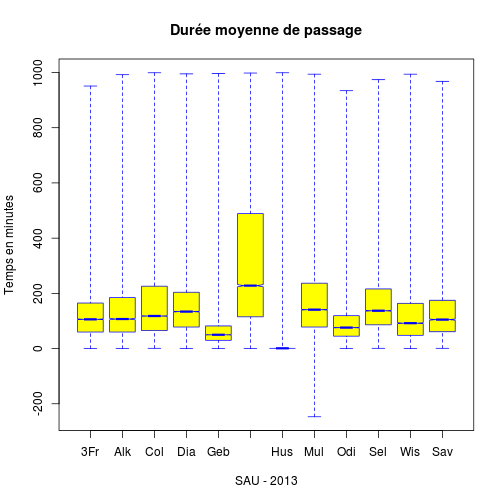
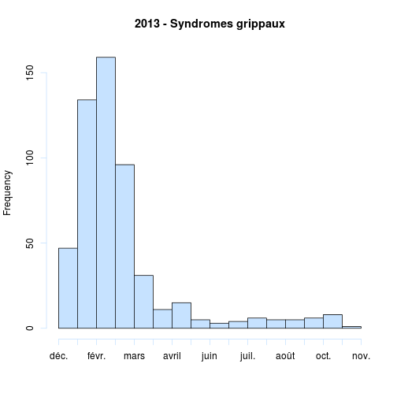
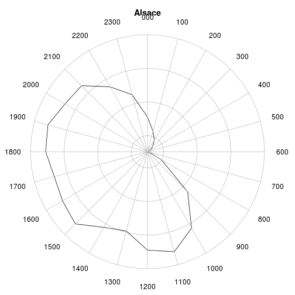
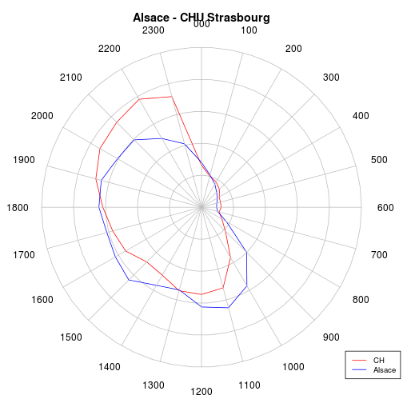
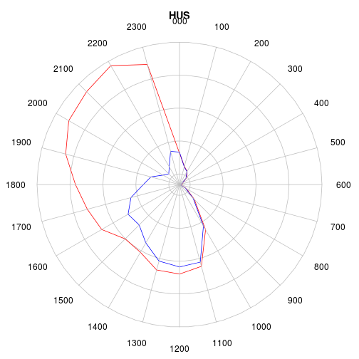

RPU 2013 Analyse
========================================================

```r
date()
```

```
## [1] "Thu Sep 12 15:18:47 2013"
```

source: RPU2013
Ce document exploite le fichier RData préparé à partir de la table *RPU__* de Sagec. Voir le document *RPU_2013_Preparation.Rmd* du dossier Resural.

Librairies nécessaires:
-----------------------

```r
library("gdata")
library("rgrs")
library("lubridate")
library("rattle")
library("epicalc")
library("zoo")
library("xts")
library("xtable")
library("plotrix")
library("openintro")
```

Chargement des routines perso
-----------------------------

```r
source("../mes_fonctions.R")
```

Variables globales:
-------------------

```r
mois_courant <- 8
```


Lecture du fichier des données
---------------------------------------
On lit le fichier de travail créé:

```r

# load('rpu2013.Rda')
load("rpu2013d0108.Rda")
d1 <- d0108
rm(d0108)

attach(d1)
```

Les données sont enregistrées dans un data.frame appelé *d1*.

Analyse des données
===================

```r
n <- dim(d1)
print(n)
```

```
## [1] 221435     20
```

```r
names(d1)
```

```
##  [1] "id"            "CODE_POSTAL"   "COMMUNE"       "DESTINATION"  
##  [5] "DP"            "ENTREE"        "EXTRACT"       "FINESS"       
##  [9] "GRAVITE"       "MODE_ENTREE"   "MODE_SORTIE"   "MOTIF"        
## [13] "NAISSANCE"     "ORIENTATION"   "PROVENANCE"    "SEXE"         
## [17] "SORTIE"        "TRANSPORT"     "TRANSPORT_PEC" "AGE"
```

```r
str(d1)
```

```
## 'data.frame':	221435 obs. of  20 variables:
##  $ id           : chr  "2c9d83843bf5e01d013bf5e985d20225" "2c9d83843bf5e01d013bf5e986950226" "2c9d83843bf5e01d013bf5e987620227" "2c9d83843bf5e01d013bf5e988060228" ...
##  $ CODE_POSTAL  : Factor w/ 2426 levels "00000","00159",..: 706 706 706 706 706 701 818 706 706 706 ...
##  $ COMMUNE      : Factor w/ 4992 levels "00","01257 DRESDEN ALLEMAGNE",..: 2184 2184 2184 2184 741 2048 2033 2184 2184 2184 ...
##  $ DESTINATION  : Factor w/ 7 levels "NA","MCO","SSR",..: NA NA NA NA NA NA 2 NA 2 NA ...
##  $ DP           : chr  "R104" "J038" "S617" "M485" ...
##  $ ENTREE       : chr  "2013-01-01 00:04:00" "2013-01-01 00:16:00" "2013-01-01 00:26:00" "2013-01-01 00:32:00" ...
##  $ EXTRACT      : chr  "2013-01-01 05:37:00" "2013-01-01 05:37:00" "2013-01-01 05:37:00" "2013-01-01 05:37:00" ...
##  $ FINESS       : Factor w/ 12 levels "3Fr","Alk","Col",..: 10 10 10 10 10 10 10 10 10 10 ...
##  $ GRAVITE      : Factor w/ 7 levels "1","2","3","4",..: 2 2 3 2 2 1 3 2 2 2 ...
##  $ MODE_ENTREE  : Factor w/ 5 levels "NA","Mutation",..: 4 4 4 4 4 4 4 4 4 4 ...
##  $ MODE_SORTIE  : Factor w/ 5 levels "NA","Mutation",..: 4 4 4 4 4 4 2 4 2 4 ...
##  $ MOTIF        : chr  "GASTRO04" "DIVERS23" "TRAUMATO10" "TRAUMATO02" ...
##  $ NAISSANCE    : chr  "1960-04-08 00:00:00" "1986-03-05 00:00:00" "1971-12-22 00:00:00" "1927-04-27 00:00:00" ...
##  $ ORIENTATION  : Factor w/ 13 levels "CHIR","FUGUE",..: NA NA NA NA NA NA 5 NA 5 NA ...
##  $ PROVENANCE   : Factor w/ 7 levels "NA","MCO","SSR",..: 6 6 6 6 6 6 6 6 6 6 ...
##  $ SEXE         : Factor w/ 3 levels "F","I","M": 3 3 3 1 3 3 1 1 1 1 ...
##  $ SORTIE       : chr  "2013-01-01 02:38:00" "2013-01-01 00:38:00" "2013-01-01 02:07:00" "2013-01-01 01:52:00" ...
##  $ TRANSPORT    : Factor w/ 6 levels "AMBU","FO","HELI",..: 4 4 4 1 4 4 6 6 4 4 ...
##  $ TRANSPORT_PEC: Factor w/ 3 levels "AUCUN","MED",..: 1 1 1 3 1 1 2 2 1 1 ...
##  $ AGE          : num  52 26 41 85 39 9 79 50 46 18 ...
```

```r
summary(d1)
```

```
##       id             CODE_POSTAL           COMMUNE        DESTINATION    
##  Length:221435      68000  : 15285   MULHOUSE  : 25986   MCO    : 45839  
##  Class :character   68200  : 13693   STRASBOURG: 22710   PSY    :   805  
##  Mode  :character   68100  : 12359   COLMAR    : 15282   SSR    :    54  
##                     67100  : 10326   HAGUENAU  :  4666   HMS    :    18  
##                     67000  :  7317   SELESTAT  :  3832   SLD    :    10  
##                     68500  :  5780   (Other)   :148955   (Other):     1  
##                     (Other):156675   NA's      :     4   NA's   :174708  
##       DP               ENTREE            EXTRACT              FINESS     
##  Length:221435      Length:221435      Length:221435      Col    :44095  
##  Class :character   Class :character   Class :character   Mul    :36456  
##  Mode  :character   Mode  :character   Mode  :character   Hus    :25412  
##                                                           Hag    :23457  
##                                                           Dia    :19611  
##                                                           Sel    :18428  
##                                                           (Other):53976  
##     GRAVITE            MODE_ENTREE        MODE_SORTIE    
##  2      :135307   NA         :     0   NA       :     0  
##  1      : 26194   Mutation   :  2418   Mutation : 43610  
##  3      : 25772   Transfert  :  1956   Transfert:  3193  
##  4      :  2343   Domicile   :193031   Domicile :141826  
##  P      :   942   Transfe  rt:   294   Décès    :     2  
##  (Other):   602   NA's       : 23736   NA's     : 32804  
##  NA's   : 30275                                          
##     MOTIF            NAISSANCE          ORIENTATION       PROVENANCE    
##  Length:221435      Length:221435      UHCD   : 21961   PEA    :121522  
##  Class :character   Class :character   MED    : 11192   PEO    : 19353  
##  Mode  :character   Mode  :character   CHIR   :  4964   MCO    :  5032  
##                                        PSA    :  2049   PSY    :    30  
##                                        REO    :   963   SSR    :    28  
##                                        (Other):  3145   (Other):    14  
##                                        NA's   :177161   NA's   : 75456  
##  SEXE          SORTIE          TRANSPORT      TRANSPORT_PEC   
##  F:104950   Length:221435      AMBU : 30141   AUCUN  :157056  
##  I:     3   Class :character   FO   :   966   MED    :  4503  
##  M:116482   Mode  :character   HELI :   143   PARAMED:  4617  
##                                PERSO:122719   NA's   : 55259  
##                                SMUR :  1853                   
##                                VSAB : 18762                   
##                                NA's : 46851                   
##       AGE       
##  Min.   :  0.0  
##  1st Qu.: 18.0  
##  Median : 38.0  
##  Mean   : 40.5  
##  3rd Qu.: 62.0  
##  Max.   :112.0  
##  NA's   :9
```

Stuctures hospitaliéres participantes
=====================================
- *Alk* CH d' Alkirch
- *Col* CH Colmar (Pasteur + Parc)
- *Dia* Diaconat-Fonderie
- *3Fr* Clinique des trois frontières
- *Geb* HUS
- *Hag* CH de Haguenau
- *Hus* Hôpiaux Universitaires de Strasbourg
- *Mul* CH de Mulhouse
- *Odi* Clinique Ste Odile
- *Sel* CH de Sélestat
- *Wis* CH de Wissembourg
- *Sav* CH de Saverne
Hôpitaux ne transmettant pas de données:
- *Tha* CH de Thann
- *Ann* Clinique Ste Anne

Contribution (en %) des SU à la production de RPU:

```r
summary(d1$FINESS)
```

```
##   3Fr   Alk   Col   Dia   Geb   Hag   Hus   Mul   Odi   Sel   Wis   Sav 
## 10708  4521 44095 19611 10153 23457 25412 36456 17250 18428  8483  2861
```

```r
a <- table(d1$FINESS)
round(prop.table(a) * 100, digits = 2)
```

```
## 
##   3Fr   Alk   Col   Dia   Geb   Hag   Hus   Mul   Odi   Sel   Wis   Sav 
##  4.84  2.04 19.91  8.86  4.59 10.59 11.48 16.46  7.79  8.32  3.83  1.29
```

Passages déclarés au serveur régional:

   ALK  | COL  | CTF |  DIA |  GEB |  HUS |  MUL |  ODI |  SAV |  SEL  | TAN |  WIS 
   ----|-------|-----|------|------|------|-------|------|-----|-------|-----|-----
  4577 |21353 | 5475 | 3136  |4926 |41561 |20160 | 8417 | 8961 | 9670 | 4840 | 3052
  
  First Header  | Second Header
------------- | -------------
Content Cell  | Content Cell
Content Cell  | Content Cell

Projection sur l'année:

```r
mois_courant <- 7
p <- 12/mois_courant
summary(d1$FINESS) * p
```

```
##   3Fr   Alk   Col   Dia   Geb   Hag   Hus   Mul   Odi   Sel   Wis   Sav 
## 18357  7750 75591 33619 17405 40212 43563 62496 29571 31591 14542  4905
```

```r
sum(summary(d1$FINESS) * p)
```

```
## [1] 379603
```

```r

t1 <- table(d1$FINESS)
t2 <- table(d1$FINESS) * p
t3 <- rbind(t1, t2)
rownames(t3) <- c("Réalisé", "Projection 2013")
xtable(t(t3))
```

```
## % latex table generated in R 2.15.1 by xtable 1.7-1 package
## % Thu Sep 12 15:18:59 2013
## \begin{table}[ht]
## \centering
## \begin{tabular}{rrr}
##   \hline
##  & Réalisé & Projection 2013 \\ 
##   \hline
## 3Fr & 10708.00 & 18356.57 \\ 
##   Alk & 4521.00 & 7750.29 \\ 
##   Col & 44095.00 & 75591.43 \\ 
##   Dia & 19611.00 & 33618.86 \\ 
##   Geb & 10153.00 & 17405.14 \\ 
##   Hag & 23457.00 & 40212.00 \\ 
##   Hus & 25412.00 & 43563.43 \\ 
##   Mul & 36456.00 & 62496.00 \\ 
##   Odi & 17250.00 & 29571.43 \\ 
##   Sel & 18428.00 & 31590.86 \\ 
##   Wis & 8483.00 & 14542.29 \\ 
##   Sav & 2861.00 & 4904.57 \\ 
##    \hline
## \end{tabular}
## \end{table}
```

### Origine temporelle des données:

```r
b <- tapply(as.Date(d1$ENTREE), d1$FINESS, min)
c <- as.Date(b, origin = "1970-01-01")
cbind(as.character(sort(c)))
```

```
##     [,1]        
## 3Fr "2013-01-01"
## Col "2013-01-01"
## Dia "2013-01-01"
## Geb "2013-01-01"
## Hag "2013-01-01"
## Hus "2013-01-01"
## Odi "2013-01-01"
## Sel "2013-01-01"
## Wis "2013-01-01"
## Mul "2013-01-07"
## Alk "2013-04-01"
## Sav "2013-07-23"
```

Exhaustivité des données
------------------------

#### Jours manquants:a<-as.data.frame(a)

```r
a <- table(as.Date(d1$ENTREE), d1$FINESS)
a <- as.data.frame.matrix(a)
head(a)
```

```
##            3Fr Alk Col Dia Geb Hag Hus Mul Odi Sel Wis Sav
## 2013-01-01  59   0 208  88  45 131 126   0  84 111  32   0
## 2013-01-02  38   0 197  89  42 112 125   0  69  80  49   0
## 2013-01-03  39   0 160  73  42  83 121   0  55  78  35   0
## 2013-01-04  42   0 170  93  30  92 121   0  67  65  24   0
## 2013-01-05  46   0 150  87  44 100 102   0  70  85  38   0
## 2013-01-06  38   0 167  77  43  90  93   0  79  68  36   0
```

```r
# liste par FINESS des jours où le nb de RPU est inférieur à 20: il faut
# ajouter une colonne date pour que cela fonctionne.
a$date <- seq(as.Date("2013-01-01"), as.Date("2013-07-30"), 1)
```

```
## Error: replacement has 211 rows, data has 243
```

```r
# On initialise une liste de 12 éléments,12 parce que 12 SU
b <- list(1:12)
# pour chacun des SU, les jours où le nombre de RPU < 20, on stocke la
# date (col.13) et le n° du SU
for (i in 1:12) {
    b[[i]] <- a[a[, i] < 20, c(13, i)]
}
```

```
## Error: undefined columns selected
```

```r
str(b)
```

```
## List of 1
##  $ : int [1:12] 1 2 3 4 5 6 7 8 9 10 ...
```

```r
# dossier manquants pour guebwiller:
b[[5]]
```

```
## Error: indice hors limites
```

```r
names(b[[5]])
```

```
## Error: indice hors limites
```

```r
b[[5]]$date
```

```
## Error: indice hors limites
```

```r
# liste des SU incomplets:
for (i in 1:12) {
    n = length(b[[i]]$date)
    if (n > 0) {
        print(paste(i, names(b[[i]][2]), n, sep = " "))
    }
}
```

```
## Error: $ operator is invalid for atomic vectors
```

#### Exhaustivité des items
Il faut tranformer les valeurs NULL en NA pour pouvoir les comptabiliser. Les valeurs NULL apparaissent pour les factors: DP, MOTIF, TRANSPORT, ORIENTATION,GRAVITE, SORTIE. Il faut les transformer en character pour leur attriber la valeur NA au lieu de NULL:

```r
a <- as.character(d1$DP)
a[a == "NULL"] <- NA
sum(is.na(a))
```

```
## [1] 70519
```

```r
mean(is.na(a))
```

```
## [1] 0.3185
```

sum(is.na(a)) retourne le nombre de lignes concernées et *mean(is.na(a))* donne directement le pourcentage de valeurs nulles (R in action pp 356)

```r
d1$DP <- a

a <- as.character(d1$MOTIF)
a[a == "NULL"] <- NA
d1$MOTIF <- a

a <- as.character(d1$TRANSPORT)
a[a == "NULL"] <- NA
d1$TRANSPORT <- a

a <- as.character(d1$ORIENTATION)
a[a == "NULL"] <- NA
d1$ORIENTATION <- a

a <- as.character(d1$GRAVITE)
a[a == "NULL"] <- NA
d1$GRAVITE <- a

a <- as.character(d1$SORTIE)
a[a == "NULL"] <- NA
d1$SORTIE <- a

a <- as.character(d1$ENTREE)
a[a == "NULL"] <- NA
d1$ENTREE <- a
```

Les 2 lignes qui suivent comptent les NA

```r
a <- is.na(d1)
b <- apply(a, 2, mean)
a <- cbind(sort(round(b * 100, 2)))
colnames(a) <- "%"
a
```

```
##                   %
## id             0.00
## CODE_POSTAL    0.00
## COMMUNE        0.00
## ENTREE         0.00
## EXTRACT        0.00
## FINESS         0.00
## NAISSANCE      0.00
## SEXE           0.00
## AGE            0.00
## SORTIE         9.30
## MODE_ENTREE   10.72
## GRAVITE       13.67
## MODE_SORTIE   14.81
## TRANSPORT     21.16
## TRANSPORT_PEC 24.95
## DP            31.85
## PROVENANCE    34.08
## MOTIF         35.82
## DESTINATION   78.90
## ORIENTATION   80.01
```

MODE_SORTIE (hospitalisation ou retour à domicile): dans 14.86% des cas on ne sait pas ce que devient le patient. Pour sélectionner les hospitalisés et éliminer les NA et les valeurs nulles:

```r
a <- d1$MODE_SORTIE[MODE_SORTIE == "Mutation" | MODE_SORTIE == "Transfert"]
a <- na.omit(a)
a <- as.factor(as.character(a))
summary(a)
```

```
##  Mutation Transfert 
##     43610      3193
```

```r
round(prop.table(table(a)) * 100, 2)
```

```
## a
##  Mutation Transfert 
##     93.18      6.82
```

```r

a <- d1[MODE_SORTIE == "Mutation" | MODE_SORTIE == "Transfert", ]
a <- na.omit(a)
summary(a$DESTINATION)
```

```
##    NA   MCO   SSR   SLD   PSY   HAD   HMS 
##     0 16416     2     3   279     0     0
```

```r
summary(as.factor(a$ORIENTATION))
```

```
## CHIR  HDT   HO  MED OBST  REA   SC   SI UHCD 
## 3525   42   13 7761   33  464  648  634 3580
```

```r
round(prop.table(table(as.factor(a$ORIENTATION))) * 100, 2)
```

```
## 
##  CHIR   HDT    HO   MED  OBST   REA    SC    SI  UHCD 
## 21.11  0.25  0.08 46.47  0.20  2.78  3.88  3.80 21.44
```

```r

tab1(as.factor(a$ORIENTATION), sort.group = "decreasing", horiz = TRUE, cex.names = 0.8, 
    xlab = "", main = "Orientation des patients hospitalisés")
```

 

```
## as.factor(a$ORIENTATION) :  
##         Frequency Percent Cum. percent
## MED          7761    46.5         46.5
## UHCD         3580    21.4         67.9
## CHIR         3525    21.1         89.0
## SC            648     3.9         92.9
## SI            634     3.8         96.7
## REA           464     2.8         99.5
## HDT            42     0.3         99.7
## OBST           33     0.2         99.9
## HO             13     0.1        100.0
##   Total     16700   100.0        100.0
```

```r

a <- d1[d1$MODE_SORTIE == "Domicile", ]
summary(as.factor(a$ORIENTATION))
```

```
##   CHIR  FUGUE    HDT     HO    MED   OBST    PSA    REA    REO     SC 
##     83    168     10      2     49      1   2008      9    941      3 
##   SCAM     SI   UHCD   NA's 
##    329     21    168 170838
```

```r
t <- table(as.factor(a$ORIENTATION))
round(prop.table(t) * 100, 2)
```

```
## 
##  CHIR FUGUE   HDT    HO   MED  OBST   PSA   REA   REO    SC  SCAM    SI 
##  2.19  4.43  0.26  0.05  1.29  0.03 52.95  0.24 24.82  0.08  8.68  0.55 
##  UHCD 
##  4.43
```

```r
tab1(as.factor(a$ORIENTATION), sort.group = "decreasing", horiz = TRUE, cex.names = 0.8, 
    xlab = "", main = "Orientation des patients non hospitalisés", missing = F)
```

 

```
## as.factor(a$ORIENTATION) :  
##         Frequency   %(NA+)   %(NA-)
## NA's       170838     97.8      0.0
## PSA          2008      1.1     53.0
## REO           941      0.5     24.8
## SCAM          329      0.2      8.7
## FUGUE         168      0.1      4.4
## UHCD          168      0.1      4.4
## CHIR           83      0.0      2.2
## MED            49      0.0      1.3
## SI             21      0.0      0.6
## HDT            10      0.0      0.3
## REA             9      0.0      0.2
## SC              3      0.0      0.1
## HO              2      0.0      0.1
## OBST            1      0.0      0.0
##   Total    174630    100.0    100.0
```

La table ci-dessus liste le devenir des patients non hospitalisés. On note des incohérences: REA, HDT, SI, Med, CHIR, UHCD. La ligne *Missing* correspond aux patients rentrés sur avis médical.

Etude des patients hospitalisés
--------------------------------
La rubrique mode de sortie peut se décomposer en 3 éléments
- *hosp*: patient hospitalisés, cad gardé en milieu de soins par *MUTATION* ou *TRANSFERT*
- *dom*: retour à domicile ou équivalent
- *dcd*: patients décédés aux urgences
Dans l'échantillon *d1* c'est la colonne *MODE_SORTIE* qui renseigne sur le devenir du patient à la sortie des urgences:


```
## [1] "d1 compte  221435  lignes"
```

Il y a deux façons de former des sous ensembles avec R:
- sélectionner en utilisant la notation vectorielle: hosp<-d1[d1$MODE_SORTIE=="Mutation" | d1$MODE_SORTIE=="Transfert",]
- sélectionner avec la méthode **subset**: b<-subset(d1,MODE_SORTIE=="Mutation" | MODE_SORTIE=="Transfert")

La première méthode sélectionne toutes les lignes correspondant aux critères ET celles où le critère vaut *NA*. ie, la méthode 1 retourne un data frame de 39224 lignes et 20 colonnes.

La méthode *subset* ne tient pas compte des lignes où le critère vaut NA. Dans l'exemple, retourne un dataframe de 23473 lignes et 20 colonnes.


```r
hosp <- d1[d1$MODE_SORTIE == "Mutation" | d1$MODE_SORTIE == "Transfert", ]
dom <- d1[d1$MODE_SORTIE == "Domicile", ]
dcd <- d1[d1$MODE_SORTIE == "Deces", ]
nbna <- nrow(hosp) + nrow(dom) + nrow(dcd) - nrow(d1)
pna <- round(nbna * 100/nrow(d1), 2)

print(paste("hosp = ", nrow(hosp), " lignes"))
```

```
## [1] "hosp =  79607  lignes"
```

```r
print(paste("dom = ", nrow(dom), " lignes"))
```

```
## [1] "dom =  174630  lignes"
```

```r
print(paste("dcd = ", nrow(dcd), " lignes"))
```

```
## [1] "dcd =  32804  lignes"
```

```r

print(paste("La différence du nombre de lignes entre d1 et hosp, dom et dcd indique le nmbre de lignes correspondant à NA et qui sont incluses dans le décompte des lignes de chaque sous ensemble: ", 
    nbna, "correspondant aux mode de sortie non renseignés soit ", pna, " %"))
```

```
## [1] "La différence du nombre de lignes entre d1 et hosp, dom et dcd indique le nmbre de lignes correspondant à NA et qui sont incluses dans le décompte des lignes de chaque sous ensemble:  65606 correspondant aux mode de sortie non renseignés soit  29.63  %"
```

Avec *subset* on élimine ces lignes parasites:

```r
a <- subset(d1, MODE_SORTIE == "Domicile")
b <- subset(d1, MODE_SORTIE == "Mutation" | MODE_SORTIE == "Transfert")
nrow(a)
```

```
## [1] 141826
```

```r
nrow(b)
```

```
## [1] 46803
```

```r
nrow(d1) - nrow(a) - nrow(b)
```

```
## [1] 32806
```

```r

print("O")
```

```
## [1] "O"
```

```r
t <- table(b$ORIENTATION, b$FINESS, useNA = "ifany")
m1 <- margin.table(t, 1)
t2 <- cbind(t, m1)
m2 <- margin.table(t2, 2)
rbind(t2, m2)
```

```
##      3Fr Alk   Col  Dia Geb  Hag   Hus  Mul Odi  Sel  Wis Sav    m1
## CHIR   1   0  1927   32  14  772     0  984 114  826   10 100  4780
## HDT    0   0    41    0   1    0     0    2   1    0   13   0    58
## HO     0   0     5    0   1    0     0    3   0    0    9   0    18
## MED    1   0  4371    7   9 1426   343 1620  35 2719   17 440 10988
## OBST   0   0    22    0   1   28     0    0   1   11    0   0    63
## PSA    0   1     0    9   0    0     0    0   0    0    0   0    10
## REA    0   0   254    2   0  106     0  174   1   57    3   4   601
## REO    5   5     0    8   0    0     0    0   1    0    0   0    19
## SC     0   0   277    0   1   47     0  517   1    1   26   0   870
## SI     0   0   426    0   3  189     0  207   6    8   11   0   850
## UHCD   0   0  3256    4   6 2772 13460  435   0  240   31   0 20204
## <NA> 204 745   313 1857 108 1373     0 1254 628    0 1829  31  8342
## m2   211 751 10892 1919 144 6713 13803 5196 788 3862 1949 575 46803
```

```r

summary(a$MODE_SORTIE)
```

```
##        NA  Mutation Transfert  Domicile     Décès 
##         0         0         0    141826         0
```

```r
summary(b$MODE_SORTIE)
```

```
##        NA  Mutation Transfert  Domicile     Décès 
##         0     43610      3193         0         0
```

- nb total de lignes = 105979
- total hospitalisés = 21950 +  1523
- total non hospitalisés = 66755 
- non réponses = 105979-90228 = 15751

```r
summary(b$DESTINATION)
```

```
##    NA   MCO   SSR   SLD   PSY   HAD   HMS  NA's 
##     0 45702    54    10   799     0     0   238
```

```r
summary(b$ORIENTATION)
```

```
##    Length     Class      Mode 
##     46803 character character
```

```r
summary(a$DESTINATION)
```

```
##     NA    MCO    SSR    SLD    PSY    HAD    HMS   NA's 
##      0    123      0      0      0      1     18 141684
```

```r
summary(a$ORIENTATION)
```

```
##    Length     Class      Mode 
##    141826 character character
```


on forme un dataframe *hosp* des patients hospitalisés par mutation ou transfert:

```r
hosp <- d1[d1$MODE_SORTIE == "Mutation" | d1$MODE_SORTIE == "Transfert", ]
summary(d1$MODE_SORTIE)
```

```
##        NA  Mutation Transfert  Domicile     Décès      NA's 
##         0     43610      3193    141826         2     32804
```

```r
prop.table(summary(d1$MODE_SORTIE)) * 100
```

```
##        NA  Mutation Transfert  Domicile     Décès      NA's 
## 0.000e+00 1.969e+01 1.442e+00 6.405e+01 9.032e-04 1.481e+01
```

#### Destinations

```r
summary(hosp$DESTINATION)
```

```
##    NA   MCO   SSR   SLD   PSY   HAD   HMS  NA's 
##     0 45702    54    10   799     0     0 33042
```

```r
prop.table(summary(hosp$DESTINATION))
```

```
##        NA       MCO       SSR       SLD       PSY       HAD       HMS 
## 0.0000000 0.5740952 0.0006783 0.0001256 0.0100368 0.0000000 0.0000000 
##      NA's 
## 0.4150640
```

```r
# sans les NA
table(hosp$DESTINATION)
```

```
## 
##    NA   MCO   SSR   SLD   PSY   HAD   HMS 
##     0 45702    54    10   799     0     0
```

```r
prop.table(table(hosp$DESTINATION)) * 100
```

```
## 
##       NA      MCO      SSR      SLD      PSY      HAD      HMS 
##  0.00000 98.14668  0.11597  0.02148  1.71588  0.00000  0.00000
```


#### Orientation des hospitalisés MCO (avec et sans les NA):

```r
a <- as.factor(hosp$ORIENTATION[hosp$DESTINATION == "MCO"])
a <- summary(a)
a
```

```
##  CHIR   HDT    HO   MED  OBST   PSA   REA   REO    SC    SI  UHCD  NA's 
##  4684     8     8 10804    63    10   594    19   862   850 20181 40661
```

```r
round(prop.table(a) * 100, 2)
```

```
##  CHIR   HDT    HO   MED  OBST   PSA   REA   REO    SC    SI  UHCD  NA's 
##  5.95  0.01  0.01 13.72  0.08  0.01  0.75  0.02  1.09  1.08 25.63 51.64
```

```r

a <- table(hosp$ORIENTATION[hosp$DESTINATION == "MCO"])
a
```

```
## 
##  CHIR   HDT    HO   MED  OBST   PSA   REA   REO    SC    SI  UHCD 
##  4684     8     8 10804    63    10   594    19   862   850 20181
```

```r
a <- prop.table(a) * 100
a
```

```
## 
##     CHIR      HDT       HO      MED     OBST      PSA      REA      REO 
## 12.29945  0.02101  0.02101 28.36961  0.16543  0.02626  1.55975  0.04989 
##       SC       SI     UHCD 
##  2.26348  2.23197 52.99215
```

```r
sce_chauds <- a["REA"] + a["SI"] + a["SC"]
print(paste("Services chauds: ", round(sce_chauds, 2), " %"))
```

```
## [1] "Services chauds:  6.06  %"
```

```r
mco <- a["CHIR"] + a["MED"] + a["OBST"]
print(paste("MCO: ", round(mco, 2), " %"))
```

```
## [1] "MCO:  40.83  %"
```

```r
print(paste("UHTCD: ", round(a["UHCD"], 2), " %"))
```

```
## [1] "UHTCD:  52.99  %"
```

```r
print(paste("Atypiques: ", round(a["FUGUE"] + a["PSA"] + a["SCAM"] + a["REO"], 
    2), " %"))
```

```
## [1] "Atypiques:  NA  %"
```

```r
print(paste("HDT-HO: ", round(a["HDT"] + a["HO"], 2), " %"))
```

```
## [1] "HDT-HO:  0.04  %"
```

Quelques erreurs de codage:
- Fugue, HDT, HO, PSA,REO, SCAM devraient être nuls
dom<-d1
#### Orientation des patients hospitalisés en Psychiatrie:

```r
a <- summary(hosp$ORIENTATION[hosp$DESTINATION == "PSY"])
a
```

```
##    Length     Class      Mode 
##     33841 character character
```

```r
a <- table(hosp$ORIENTATION[hosp$DESTINATION == "PSY"])
a
```

```
## 
## CHIR  HDT   HO  MED  REA   SC UHCD 
##   96   50   10  174    5    8   11
```

```r

a <- d1[d1$DESTINATION == "PSY", ]
a$DESTINATION <- as.character(a$DESTINATION)
a <- a[!is.na(a$DESTINATION), ]
summary(a$ORIENTATION)
```

```
##    Length     Class      Mode 
##       805 character character
```

```r
round(prop.table(summary(a$ORIENTATION)) * 100, 3)
```

```
## Error: 'type' (character) de l'argument incorrect
```

#### Analyse de l'ensemble de la rubrique **ORIENTATION**

```r
d1$ORIENTATION <- as.factor(d1$ORIENTATION)
a <- summary(d1$ORIENTATION)
a
```

```
##   CHIR  FUGUE    HDT     HO    MED   OBST    PSA    REA    REO     SC 
##   4964    169     89     21  11192     64   2049    660    963    896 
##   SCAM     SI   UHCD   NA's 
##    329    917  21961 177161
```

```r
a <- round(prop.table(a) * 100, 4)

sce_chauds <- a["REA"] + a["SI"] + a["SC"]
print(paste("Services chauds: ", round(sce_chauds, 2), " %"))
```

```
## [1] "Services chauds:  1.12  %"
```

```r
mco <- a["CHIR"] + a["MED"] + a["OBST"]
print(paste("MCO: ", round(mco, 2), " %"))
```

```
## [1] "MCO:  7.32  %"
```

```r
uhcd <- a["UHCD"]
print(paste("UHTCD: ", round(uhcd, 2), " %"))
```

```
## [1] "UHTCD:  9.92  %"
```

```r
atypique <- a["FUGUE"] + a["PSA"] + a["SCAM"] + a["REO"]
print(paste("Atypiques: ", round(atypique, 2), " %"))
```

```
## [1] "Atypiques:  1.59  %"
```

```r
psy <- a["HDT"] + a["HO"]
print(paste("HDT-HO: ", round(psy, 2), " %"))
```

```
## [1] "HDT-HO:  0.05  %"
```

```r
nr <- a["NA's"]

als <- c(mco, uhcd, nr, atypique, sce_chauds, psy)
lor <- c(49.39, 19.12, 17.25, 8.92, 5.24, 0.07)

r <- rbind(als, lor)
barplot(r, las = 2, beside = T, legend = T, ylab = "% des RPU", xlab = "", sub = "(Ref. ORULOR 2011 p.50)", 
    names.arg = c("MCO", "UHCD", "NR", "Atypiques", "REA", "PSY"), main = "Orientation des patients hospitalisés", 
    cex.sub = 0.6)
```

 

en fonction de l'établissement (NOTE: utilisation de useNA="ifany"):

```r
# analyse brute
t <- table(d1$ORIENTATION, d1$FINESS)
t
```

```
##        
##           3Fr   Alk   Col   Dia   Geb   Hag   Hus   Mul   Odi   Sel   Wis
##   CHIR      5     0  1932    59    22   772     0  1070   166   827    11
##   FUGUE     7     5    79     7     0    23     0     0    24     2    21
##   HDT       0     0    42     0     1     0     0    31     1     0    14
##   HO        2     0     5     0     1     0     0     3     0     0    10
##   MED       1     0  4383    12    12  1426   343  1772    52  2731    19
##   OBST      0     0    22     0     1    28     0     0     2    11     0
##   PSA      17   103   675   675    14   346     0   110    29     6    74
##   REA       1     0   254     4     1   106     0   227     2    57     4
##   REO      37    13   810    98     0     0     0     0     2     0     2
##   SC        0     0   277     0     2    47     0   536     1     1    32
##   SCAM      2    11   125    12     8   105     0     8    23     3    27
##   SI        1     0   426     2     4   189     0   250     7    26    12
##   UHCD      1     0  3258    11     7  2772 14229  1400     0   240    43
##        
##           Sav
##   CHIR    100
##   FUGUE     1
##   HDT       0
##   HO        0
##   MED     441
##   OBST      0
##   PSA       0
##   REA       4
##   REO       1
##   SC        0
##   SCAM      5
##   SI        0
##   UHCD      0
```

```r
# analyse brute incluant les NA
t <- table(d1$ORIENTATION, d1$FINESS, useNA = "ifany")
t
```

```
##        
##           3Fr   Alk   Col   Dia   Geb   Hag   Hus   Mul   Odi   Sel   Wis
##   CHIR      5     0  1932    59    22   772     0  1070   166   827    11
##   FUGUE     7     5    79     7     0    23     0     0    24     2    21
##   HDT       0     0    42     0     1     0     0    31     1     0    14
##   HO        2     0     5     0     1     0     0     3     0     0    10
##   MED       1     0  4383    12    12  1426   343  1772    52  2731    19
##   OBST      0     0    22     0     1    28     0     0     2    11     0
##   PSA      17   103   675   675    14   346     0   110    29     6    74
##   REA       1     0   254     4     1   106     0   227     2    57     4
##   REO      37    13   810    98     0     0     0     0     2     0     2
##   SC        0     0   277     0     2    47     0   536     1     1    32
##   SCAM      2    11   125    12     8   105     0     8    23     3    27
##   SI        1     0   426     2     4   189     0   250     7    26    12
##   UHCD      1     0  3258    11     7  2772 14229  1400     0   240    43
##   <NA>  10634  4389 31807 18731 10080 17643 10840 31049 16941 14524  8214
##        
##           Sav
##   CHIR    100
##   FUGUE     1
##   HDT       0
##   HO        0
##   MED     441
##   OBST      0
##   PSA       0
##   REA       4
##   REO       1
##   SC        0
##   SCAM      5
##   SI        0
##   UHCD      0
##   <NA>   2309
```

```r
# cette analyse ne permet pas de séparer les vraies non réponses des
# retours à domicile
hosp <- d1[d1$MODE_SORTIE == "Mutation" | d1$MODE_SORTIE == "Transfert", ]
t <- table(hosp$ORIENTATION, hosp$FINESS, useNA = "ifany")
t
```

```
##        
##           3Fr   Alk   Col   Dia   Geb   Hag   Hus   Mul   Odi   Sel   Wis
##   CHIR      1     0  1927    32    14   772     0   984   114   826    10
##   FUGUE     0     0     0     0     0     0     0     0     0     0     0
##   HDT       0     0    41     0     1     0     0     2     1     0    13
##   HO        0     0     5     0     1     0     0     3     0     0     9
##   MED       1     0  4371     7     9  1426   343  1620    35  2719    17
##   OBST      0     0    22     0     1    28     0     0     1    11     0
##   PSA       0     1     0     9     0     0     0     0     0     0     0
##   REA       0     0   254     2     0   106     0   174     1    57     3
##   REO       5     5     0     8     0     0     0     0     1     0     0
##   SC        0     0   277     0     1    47     0   517     1     1    26
##   SCAM      0     0     0     0     0     0     0     0     0     0     0
##   SI        0     0   426     0     3   189     0   207     6     8    11
##   UHCD      0     0  3256     4     6  2772 13460   435     0   240    31
##   <NA>    204   745   313  1857   108  1373     0  1254   628     0  1829
##        
##           Sav  <NA>
##   CHIR    100     0
##   FUGUE     0     0
##   HDT       0     0
##   HO        0     0
##   MED     440     0
##   OBST      0     0
##   PSA       0     0
##   REA       4     0
##   REO       0     0
##   SC        0     0
##   SCAM      0     0
##   SI        0     0
##   UHCD      0     0
##   <NA>     31 32804
```

```r
# non hospitalisés
dom <- d1[d1$MODE_SORTIE == "Domicile", ]
```


Adultes
-------
Répartition de la population adulte (18 ans et plus)

```r
a <- d1[AGE > 17, c("AGE", "FINESS")]
boxplot(a$AGE ~ a$FINESS, main = "Patients de 18 ans et plus", col = "slategray1")
```

 


Mineurs
-------

```r
a <- d1$AGE[d1$AGE <= 18]
# a
summary(a)
```

```
##    Min. 1st Qu.  Median    Mean 3rd Qu.    Max.    NA's 
##    0.00    2.00    7.00    7.86   13.00   18.00       9
```

```r
hist(a, main = "Moins de 18 ans", xlab = "Age (années)", col = "yellow")
```

 

```r

a <- d1$AGE[FINESS == "Col" & d1$AGE < 18]
# a
a <- d1$AGE[FINESS == "Hag" & d1$AGE < 18]
# a
a <- d1$AGE[FINESS == "Mul" & d1$AGE < 18]
# a
table(FINESS)
```

```
## FINESS
##   3Fr   Alk   Col   Dia   Geb   Hag   Hus   Mul   Odi   Sel   Wis   Sav 
## 10708  4521 44095 19611 10153 23457 25412 36456 17250 18428  8483  2861
```

Durée d'attente
===============
On utilise les données de Sélestat comme étude pilote:

```r
sel <- d1[d1$FINESS == "Sel", ]
e <- ymd_hms(sel$ENTREE)
s <- ymd_hms(sel$SORTIE)
q <- s - e
sel$attente <- q
summary(as.numeric(q))
```

```
##    Min. 1st Qu.  Median    Mean 3rd Qu.    Max.    NA's 
##       1      86     138     162     216     974     625
```

Attente cumulée par jour (pour chaque jour, on cumule les durées d'attente) en mn:

```r
q <- tapply(sel$attente, as.Date(sel$ENTREE), sum, na.rm = TRUE)
summary(q)
```

```
##    Min. 1st Qu.  Median    Mean 3rd Qu.    Max. 
##       0   10800   12900   12900   15200   23000
```

```r
hist(q, main = "Attente cumulée par 24h", xlab = "Durée de passage (en mn)", 
    ylab = "Fréquence", col = "orange")
```

 

```r

z <- zoo(q, unique(as.Date(sel$ENTREE)))
plot(z, main = "Attente cumulée par 24h", xlab = "Sélestat 2013")
```

 

```r
plot(xts(z))
```

 

```r
plot(rollmean(z, 7), main = "Attente cumulée par 24h (moyenne lissée)")
```

 

```r
plot(rollmean(xts(z), 7), main = "Attente cumulée (lissée) par 24h", xlab = "Durée de passage (en mn)", 
    ylab = "Fréquence")
```

 

Ensemble des SAU
----------------
attente en mn:

```r
e <- ymd_hms(d1$ENTREE)
s <- ymd_hms(d1$SORTIE)
q <- s - e
d1$passage <- q/60

tapply(d1$passage, d1$FINESS, mean, na.rm = TRUE)
```

```
##    3Fr    Alk    Col    Dia    Geb    Hag    Hus    Mul    Odi    Sel 
## 134.92 151.92 167.62 161.38  78.03 361.26  74.27 178.59  96.46 162.14 
##    Wis    Sav 
## 137.29 134.45
```

```r
tapply(d1$passage, d1$FINESS, sd, na.rm = TRUE)
```

```
##   3Fr   Alk   Col   Dia   Geb   Hag   Hus   Mul   Odi   Sel   Wis   Sav 
## 152.1 182.6 173.1 142.0 132.8 334.5 276.9 136.8 110.4 104.0 166.5 125.5
```

```r
tapply(d1$passage, d1$FINESS, median, na.rm = TRUE)
```

```
##   3Fr   Alk   Col   Dia   Geb   Hag   Hus   Mul   Odi   Sel   Wis   Sav 
## 108.0 106.0 118.0 135.0  50.0 245.0   1.0 143.0  77.0 138.0  94.0 101.5
```

```r
boxplot(as.numeric(d1$passage) ~ d1$FINESS, col = "pink")
```

 

attente de moins d'une journée:

```r
h24 <- d1[as.numeric(d1$passage) < 1000, c("passage", "FINESS")]
boxplot(as.numeric(h24$passage) ~ h24$FINESS, col = "pink", main = "Durée moyenne de passage (pour t<24h)", 
    ylab = "Temps en minutes", xlab = "SAU - 2013")
```

 

```r
boxplot(as.numeric(h24$passage) ~ h24$FINESS, col = "yellow", range = 0, notch = TRUE, 
    border = "blue", main = "Durée moyenne de passage", ylab = "Temps en minutes", 
    xlab = "SAU - 2013")
```

 

Maladies infectieuses
=====================
Codes CIM 10:
- bronchiolite: J11
- Grippe: J11, J10, J09
- Gastroenterite: A09

Regroupement | Code CIM 10 | Description
------------ | ------------ | -----------
Hyperthermies |T67 | Effets de la chaleur et de la lumière
Hyperthermies | X30 |Exposition à une chaleur naturelle excessive
Déshydratations |E86 |Hypovolémie
Hyponatrémies | E871 | Hypo-osmolarité et hyponatrémie
Malaises | R42 | Etourdissements et éblouissements
Malaises |R53| Malaise et fatigue
Malaises | R55| Syncope et collapsus
Asthme|J45 | Asthme
Asthme |J46 | Etat de mal asthmatique
Piqûres arthropodes ou autres |T63 |Effet toxique d’un contact avec un animal venimeux
Piqûres arthropodes ou autres |W57 |Morsure ou piqûre non venimeuse d’insectes et arthropodes
Piqûres arthropodes ou autres |X20→X29 | Contact avec des animaux ou des plantes venimeuses

Pendant toute la durée du Plan Canicule, du 1er juin au 31 août.


on veut mettre 3 graphiques sur le même dessin

```r
par(mfrow = c(3, 1))
```


gastro
------

```r
gastro <- d1[substr(d1$DP, 1, 3) == "A09", c("DP", "ENTREE")]
g <- gastro[complete.cases(gastro), ]
g$date <- as.Date(g$ENTREE)
hist(g$date, breaks = 18, freq = TRUE, col = "slategray1", main = "2013 - Gastroentérites", 
    xlab = "")
```

 

```r
g$date2 <- ymd_hms(g$ENTREE)
wg <- week(g$date2)
barplot(summary(as.factor(wg)))
```

 

bronchiolite
------------

```r
bronchio <- d1[substr(d1$DP, 1, 3) == "J21", c("DP", "ENTREE")]
bronchio <- bronchio[complete.cases(bronchio), ]
bronchio$date <- as.Date(bronchio$ENTREE)
hist(bronchio$date, breaks = 18, freq = TRUE, col = "slategray1", main = "2013 - Bronchiolites", 
    xlab = "")
```

 

Grippe
------

```r
grippe <- d1[substr(d1$DP, 1, 3) == "J11" | substr(d1$DP, 1, 3) == "J10" | substr(d1$DP, 
    1, 3) == "J09", c("DP", "ENTREE")]
grippe <- grippe[complete.cases(grippe), ]
grippe$date <- as.Date(grippe$ENTREE)
hist(grippe$date, breaks = 18, freq = TRUE, col = "slategray1", main = "2013 - Syndromes grippaux", 
    xlab = "")
```

 

```r

par(mfrow = c(1, 1))
```

malaises
--------

```r
malaise <- d1[substr(d1$DP, 1, 3) == "R55", c("DP", "ENTREE")]
malaise <- malaise[complete.cases(malaise), ]
malaise$date <- as.Date(malaise$ENTREE)
hist(malaise$date, breaks = 18, freq = TRUE, col = "slategray1")
```

 

malaise selon INVS (canicule):

```r
malaise <- d1[substr(d1$DP, 1, 3) == "R55" | substr(d1$DP, 1, 3) == "R53" | 
    substr(d1$DP, 1, 3) == "R42", c("DP", "ENTREE")]
malaise <- malaise[complete.cases(malaise), ]
malaise$date <- as.Date(malaise$ENTREE)
hist(malaise$date, breaks = 18, freq = TRUE, col = "slategray1", main = "Malaises (INVS)")
```

 

```r
plot(as.factor(malaise$date), col = "slategray1", las = 1, main = "Malaises (INVS)")
```

 

AVC
----
code SIM10: I60 à I64
**complete.cases** permet de supprimer les enregistrements vides

```r
avc <- d1[substr(d1$DP, 1, 3) >= "I60" & substr(d1$DP, 1, 3) <= "I64", c("DP", 
    "ENTREE", "FINESS", "AGE", "SEXE")]
avc <- avc[complete.cases(avc), ]
nrow(avc)
```

```
## [1] 1359
```

```r
summary(avc$FINESS)
```

```
## 3Fr Alk Col Dia Geb Hag Hus Mul Odi Sel Wis Sav 
##  31   7 299   0  12 321 201 329   1 114  44   0
```

```r
summary(avc$AGE)
```

```
##    Min. 1st Qu.  Median    Mean 3rd Qu.    Max. 
##     1.0    63.0    76.0    72.3    84.0   102.0
```

```r
summary(avc$SEXE)
```

```
##   F   I   M 
## 707   0 652
```

Le SAU des HUS reçoit peu d' AVC alors que c'est la meilleure filière. Les résultats sont faussés par l'UNV.

Douleur thoracique
------------------
code SIM10: I20 à I25

```r
idm <- d1[substr(d1$DP, 1, 3) >= "I20" & substr(d1$DP, 1, 3) <= "I25", c("DP", 
    "ENTREE", "FINESS", "AGE", "SEXE")]
idm <- idm[complete.cases(idm), ]
nrow(idm)
```

```
## [1] 615
```

```r
summary(idm$FINESS)
```

```
## 3Fr Alk Col Dia Geb Hag Hus Mul Odi Sel Wis Sav 
##  46   5  90   0  22  91 193  84   2  44  38   0
```

```r
summary(idm$AGE)
```

```
##    Min. 1st Qu.  Median    Mean 3rd Qu.    Max. 
##     2.0    53.5    65.0    65.1    79.0   103.0
```

```r
summary(idm$SEXE)
```

```
##   F   I   M 
## 237   0 378
```

Lésions traumatiques
--------------------
codes CIM10 S00–T98

```r
trauma <- d1[substr(d1$DP, 1, 3) >= "S00" & substr(d1$DP, 1, 3) <= "T98", c("DP", 
    "ENTREE", "FINESS", "AGE", "SEXE")]
trauma <- trauma[complete.cases(trauma), ]
nrow(trauma)
```

```
## [1] 57414
```

```r
summary(trauma$FINESS)
```

```
##   3Fr   Alk   Col   Dia   Geb   Hag   Hus   Mul   Odi   Sel   Wis   Sav 
##  3707  1789 16180     0  5053  7824  1126  7620  2906  8365  2844     0
```

```r
summary(trauma$AGE)
```

```
##    Min. 1st Qu.  Median    Mean 3rd Qu.    Max. 
##     0.0    13.0    28.0    33.8    51.0   112.0
```

```r
summary(trauma$SEXE)
```

```
##     F     I     M 
## 24919     2 32493
```

Etude HUS
----------------

```r
geb <- d1[d1$FINESS == "Geb", ]
```

Orientation des patients 

```r
summary(geb$MODE_SORTIE)
```

```
##        NA  Mutation Transfert  Domicile     Décès      NA's 
##         0        92        52      4032         0      5977
```

```r
summary(geb$ORIENTATION)
```

```
##  CHIR FUGUE   HDT    HO   MED  OBST   PSA   REA   REO    SC  SCAM    SI 
##    22     0     1     1    12     1    14     1     0     2     8     4 
##  UHCD  NA's 
##     7 10080
```

Mode d'arrivée aux urgences:

```r
summary(as.factor(geb$TRANSPORT))
```

```
##  AMBU PERSO  SMUR  VSAB  NA's 
##   914  8537     1   610    91
```

Heure d'arrivée aux urgences

```r
e <- ymd_hms(geb$ENTREE)
h <- hour(e)
summary(h)
```

```
##    Min. 1st Qu.  Median    Mean 3rd Qu.    Max. 
##       0      10      14      14      18      23
```

```r
hist(h, breaks = 23, xlab = "Heures", main = "CH HUS - Horaire de fréquentation du SU")
```

 

```r
t <- table(h)
t2 <- as.integer(t)
c <- clock24.plot(t2, clock.pos = 1:24, lwd = 3)
```

 

```r
c <- clock24.plot(t2, clock.pos = 1:24, rp.type = "p", main = "HUS", xlab = "Heures d'arrivée aux urgences", 
    show.grid.labels = F)
```

 

```r
# nécessite la librairie openintro
clock24.plot(t2, clock.pos = 1:24, rp.type = "p", main = "HUS", xlab = "Heures d'arrivée aux urgences", 
    show.grid.labels = F, poly.col = fadeColor("blue", fade = "10"))
```

 

```r
clock24.plot(t2, clock.pos = 1:24, rp.type = "p", main = "HUS", xlab = "Heures d'arrivée aux urgences", 
    show.grid.labels = F, poly.col = fadeColor("blue", fade = "10"), line.col = fadeColor("blue", 
        fade = "10"))
```

 

Idem pour les sorties

```r
s <- ymd_hms(geb$SORTIE)
t3 <- as.integer(table(hour(s)))
clock24.plot(t3, clock.pos = 1:24, rp.type = "p", main = "HUS", xlab = "Heures de sortie des urgences", 
    show.grid.labels = F)
```

 

Combinaison entrée-sortie

```r
t4 <- rbind(t2, t3)
clock24.plot(t4, clock.pos = 1:24, rp.type = "p", main = "HUS", xlab = "Heures d'arrivée aux urgences", 
    show.grid.labels = F)
```

 

```r
clock24.plot(t4, clock.pos = 1:24, rp.type = "p", main = "HUS", xlab = "Heures d'arrivée aux urgences", 
    show.grid.labels = F, line.col = c("red", "blue"))
```

 

```r
fadeBlue <- fadeColor("blue", fade = "15")
fadeRed <- fadeColor("red", fade = "15")
clock24.plot(t4, clock.pos = 1:24, rp.type = "p", main = "HUS", xlab = "Heures d'arrivée aux urgences", 
    show.grid.labels = F, line.col = c(fadeRed, fadeBlue), poly.col = c(fadeRed, 
        fadeBlue))
```

 

Entrées selon la période du jour: nuit profonde NP (0h-8h = 1), journée JO (8h-20h = 2), soir SR (20h-24h = 3). La date/heure d'entrée est transformée en heure entière par la fonction *hour*. hest à son tour segmenté en 3 périodes.

```r
e <- ymd_hms(geb$ENTREE)
h <- hour(e)
b <- cut(h, c(0, 8, 20, 24), labels = c("NP", "JO", "SR"))
bp <- summary(as.factor(b))
barplot(bp)
```

 

```r
round(prop.table(bp) * 100, 2)
```

```
##    NP    JO    SR  NA's 
## 11.36 77.66  9.51  1.47
```

```r
barplot(round(prop.table(bp) * 100, 2), ylab = "% des passages", sub = "NP = 0h-8h", 
    ylim = c(0, 100), main = "CH HUS\n Passages nuit profonde - jour - soirée")
```

 

```r
t <- table(geb$GRAVITE, b)
t
```

```
##    b
##       NP   JO   SR
##   1   50  366   55
##   2 1087 7445  902
##   3   12   40    2
##   4    1   10    3
##   5    0    0    1
##   D    0    1    0
##   P    3   10    2
```

```r
barplot(t, beside = T, col = 1:7)
```

 

Mode sortie en fonction de la période

```r
t <- table(geb$MODE_SORTIE, b)
t
```

```
##            b
##               NP   JO   SR
##   NA           0    0    0
##   Mutation    27   56    4
##   Transfert   11   36    4
##   Domicile   393 3424  187
##   Décès        0    0    0
```

```r
t <- table(geb$ORIENTATION, b)
```

CCL: à HUS tout le monde rentre à la maison !

#### Calcul des heures d'arrivées pour l'ensemble des établissements

```r
e <- ymd_hms(d1$ENTREE)
h <- hour(e)
summary(h)
```

```
##    Min. 1st Qu.  Median    Mean 3rd Qu.    Max. 
##     0.0    10.0    14.0    13.9    18.0    23.0
```

```r
hist(h, breaks = 23, xlab = "Heures", main = "Alsace - Horaire de fréquentation du SU")
```

 

```r
t <- table(h)
als_entree <- as.integer(t)
c <- clock24.plot(als_entree, clock.pos = 1:24, lwd = 3, show.grid.labels = F)
```

 

```r
c <- clock24.plot(als_entree, clock.pos = 1:24, rp.type = "p", main = "Alsace", 
    xlab = "Heures d'arrivée aux urgences", show.grid.labels = F)
```

 

#### Comparaison Alsace - HUS
Les calculs sont exprimés en %

```r
e <- ymd_hms(geb$ENTREE)
h <- hour(e)
t <- table(h)
t2 <- as.integer(t)
t4 <- rbind(prop.table(t2), prop.table(als_entree))
clock24.plot(t4, clock.pos = 1:24, rp.type = "p", main = "Alsace - HUS (rouge)", 
    xlab = "Heures d'arrivée aux urgences", show.grid.labels = F, line.col = c("red", 
        "blue"), radial.lim = c(0, 0.1))
legend(0.09, -0.09, c("CH", "Alsace"), col = c("red", "blue"), lty = 1, cex = 0.8)
```

 

```r

# Profil entrées de HUS versus le profil régional
clock24.plot(t4, clock.pos = 1:24, rp.type = "p", main = "Alsace - HUS (rouge)", 
    xlab = "Heures d'arrivée aux urgences", show.grid.labels = F, line.col = c("red", 
        fadeBlue), poly.col = c(NA, fadeBlue), radial.lim = c(0, 0.1))
```

 

#### Comparaison Alsace - Wissembourg

```r
wis <- d1[d1$FINESS == "Wis", ]
e <- ymd_hms(wis$ENTREE)
h <- hour(e)
t <- table(h)
t2 <- as.integer(t)
t4 <- rbind(prop.table(t2), prop.table(als_entree))
clock24.plot(t4, clock.pos = 1:24, rp.type = "p", main = "Alsace - CH de Wissembourg", 
    xlab = "Heures d'arrivée aux urgences", show.grid.labels = F, line.col = c("red", 
        "blue"), radial.lim = c(0, 0.1))
legend(0.09, -0.09, c("CH", "Alsace"), col = c("red", "blue"), lty = 1, cex = 0.8)
```

 

#### comparaison Alsace - HUS

```r
hus <- d1[d1$FINESS == "Hus", ]
e <- ymd_hms(hus$ENTREE)
h <- hour(e)
t <- table(h)
t2 <- as.integer(t)
t4 <- rbind(prop.table(t2), prop.table(als_entree))
clock24.plot(t4, clock.pos = 1:24, rp.type = "p", main = "Alsace - CHU Strasbourg", 
    xlab = "Heures d'arrivée aux urgences", show.grid.labels = F, line.col = c("red", 
        "blue"), radial.lim = c(0, 0.1))
legend(0.09, -0.09, c("CH", "Alsace"), col = c("red", "blue"), lty = 1, cex = 0.8)
```

 

#### Test de la fonction*passages*

```r
par(mfrow = c(2, 2))
source("../mes_fonctions.R")
passages("Hus", "HUS", sens = 3)
passages("Mul", "CH Mulhouse", sens = 3)
passages("Col", "CH Colmar", sens = 3)
passages("Hag", "CH Haguenau", sens = 3)
```

 

```r

passages("Sel", "CH Selestat", sens = 3)
passages("Odi", "Clinique Ste Odile", sens = 3)
passages("Dia", "Diaconnat - Fonderie", sens = 3)
passages("Tan", "CH Thann", sens = 3)
```

```
## Warning: All formats failed to parse. No formats found. Warning: All
## formats failed to parse. No formats found.
```

 

```r

passages("3Fr", "Trois frontières", sens = 3)
passages("Alk", "CH Alkirch", sens = 3)
passages("Sav", "CH Saverne", sens = 3)
par(mfrow = c(1, 1))
```

 


Etude HUS
----------------

```r
Hus <- d1[d1$FINESS == "Hus", ]
nrow(Hus)
```

```
## [1] 25412
```

```r
min(Hus$ENTREE)
```

```
## [1] "2013-01-01 00:11:00"
```

```r
max(Hus$ENTREE)
```

```
## [1] "2013-08-31 23:50:00"
```

comparaison entre RPU attendu et RPU transmis. Nécessite le fichier *sau2013*. Les données sont dans le dataframe *d*. Les données hus sont isolées dans *dhus*

```r
load("../SAU2013/sau2013.Rda")
dhus <- d[d$hop == "HUS", ]
sum(dhus$TOTAL.passages, na.rm = T)
```

```
## [1] 70001
```

```r

# hus.serv: DU des Hus. HTP adultes, HTP gynéco, HTP pédiatrie, NHC et
# CCOM (Sos mains)
hus.serv <- as.factor(dhus$ser2)
summary(hus.serv)
```

```
## aHTP CCOM gHTP  NHC pHTP NA's 
##  209  202  201  201  403  413
```

```r
tapply(dhus$TOTAL.passages, hus.serv, sum)
```

```
##  aHTP  CCOM  gHTP   NHC  pHTP 
## 20549  4937  5471 17394 21650
```

```r
# RPU uniquement du au SU HTP et NHC
hus.rpu <- subset(dhus, ser2 == "aHTP" | ser2 == "NHC")
n <- sum(hus.rpu$TOTAL.passages)
print("Prévision2013:")
```

```
## [1] "Prévision2013:"
```

```r
n * 3
```

```
## [1] 113829
```

```r

a <- c(nrow(Hus), n)
names(a) = c("RPU déclarés", "RPU Attendus")
barplot(a, main = "HUS - 1er quadrimestre 2013")
```

 

```r
a[1] * 100/a[2]
```

```
## RPU déclarés 
##        66.97
```

Les urgences pédiatriques sont divisées en 2, médicales et chirurgicales. Il y a donc 2 données par jour

```r
hus.ped <- subset(dhus, ser2 == "pHTP")
nped <- sum(hus.ped$TOTAL.passages)
print("Prévision2013:")
```

```
## [1] "Prévision2013:"
```

```r
nped * 3
```

```
## [1] 64950
```

```r

print("Total adulte + pédiatrie:")
```

```
## [1] "Total adulte + pédiatrie:"
```

```r
ntot <- n + nped
ntot
```

```
## [1] 59593
```

```r
print("total annuel:")
```

```
## [1] "total annuel:"
```

```r
ntot * 3
```

```
## [1] 178779
```


Orientation des patients 

```r
summary(Hus$MODE_SORTIE)
```

```
##        NA  Mutation Transfert  Domicile     Décès      NA's 
##         0     13803         0       703         0     10906
```

```r
mean(is.na(Hus$MODE_SORTIE))
```

```
## [1] 0.4292
```

```r
summary(Hus$ORIENTATION)
```

```
##  CHIR FUGUE   HDT    HO   MED  OBST   PSA   REA   REO    SC  SCAM    SI 
##     0     0     0     0   343     0     0     0     0     0     0     0 
##  UHCD  NA's 
## 14229 10840
```

```r
mean(is.na(Hus$ORIENTATION))
```

```
## [1] 0.4266
```

```r

mean(is.na(Hus$MOTIF))
```

```
## [1] 1
```

```r
mean(is.na(Hus$DESTINATION))
```

```
## [1] 0.452
```

```r
mean(is.na(Hus$TRANSPORT_PEC))
```

```
## [1] 0.9987
```

```r
mean(is.na(Hus$PROVENANCE))
```

```
## [1] 0.9587
```

```r
mean(is.na(Hus$TRANSPORT))
```

```
## [1] 0.8229
```

```r
mean(is.na(Hus$MODE_ENTREE))
```

```
## [1] 0
```

```r
mean(is.na(Hus$COMMUNE))
```

```
## [1] 0
```

```r
mean(is.na(Hus$GRAVITE))
```

```
## [1] 0.566
```

```r
mean(is.na(Hus$DP))
```

```
## [1] 0.6516
```

Mode d'arrivée aux urgences:

```r
summary(as.factor(Hus$TRANSPORT))
```

```
##  AMBU    FO PERSO  SMUR  VSAB  NA's 
##  2374     9   803   294  1020 20912
```

```r
mean(is.na(Hus$TRANSPORT))
```

```
## [1] 0.8229
```

Heure d'arrivée aux urgences

```r
e <- ymd_hms(Hus$ENTREE)
h <- hour(e)
summary(h)
```

```
##    Min. 1st Qu.  Median    Mean 3rd Qu.    Max. 
##     0.0    11.0    16.0    14.7    19.0    23.0
```

```r
hist(h, breaks = 23, xlab = "Heures", main = "CH HUS - Horaire de fréquentation du SU", 
    col = c(rep(1, 8), rep(2, 12), rep(3, 4)))
```

 

```r
t <- table(h)
t2 <- as.integer(t)
c <- clock24.plot(t2, clock.pos = 1:24, lwd = 3)
```

 

```r
c <- clock24.plot(t2, clock.pos = 1:24, rp.type = "p", main = "HUS", xlab = "Heures d'arrivée aux urgences", 
    show.grid.labels = F)
```

 

```r
# nécessite la librairie openintro
clock24.plot(t2, clock.pos = 1:24, rp.type = "p", main = "HUS", xlab = "Heures d'arrivée aux urgences", 
    show.grid.labels = F, poly.col = fadeColor("blue", fade = "10"))
```

 

```r
clock24.plot(t2, clock.pos = 1:24, rp.type = "p", main = "HUS", xlab = "Heures d'arrivée aux urgences", 
    show.grid.labels = F, poly.col = fadeColor("blue", fade = "10"), line.col = fadeColor("blue", 
        fade = "10"))
```

 

Idem pour les sorties

```r
s <- ymd_hms(Hus$SORTIE)
mean(is.na(s))
```

```
## [1] 0.3509
```

```r
t3 <- as.integer(table(hour(s)))
clock24.plot(t3, clock.pos = 1:24, rp.type = "p", main = "HUS", xlab = "Heures de sortie des urgences", 
    show.grid.labels = F)
```

 

Combinaison entrée-sortie

```r
t4 <- rbind(t2, t3)
clock24.plot(t4, clock.pos = 1:24, rp.type = "p", main = "HUS", xlab = "Heures d'arrivée aux urgences", 
    show.grid.labels = F)
```

 

```r
clock24.plot(t4, clock.pos = 1:24, rp.type = "p", main = "HUS", xlab = "Heures d'arrivée aux urgences", 
    show.grid.labels = F, line.col = c("red", "blue"))
```

 

```r
fadeBlue <- fadeColor("blue", fade = "15")
fadeRed <- fadeColor("red", fade = "15")
clock24.plot(t4, clock.pos = 1:24, rp.type = "p", main = "HUS", xlab = "Heures d'arrivée aux urgences", 
    show.grid.labels = F, line.col = c(fadeRed, fadeBlue), poly.col = c(fadeRed, 
        fadeBlue))
```

 

Entrées selon la période du jour: nuit profonde NP (0h-8h = 1), journée JO (8h-20h = 2), soir SR (20h-24h = 3). La date/heure d'entrée est transformée en heure entière par la fonction *hour*. hest à son tour segmenté en 3 périodes.

```r
e <- ymd_hms(Hus$ENTREE)
h <- hour(e)
b <- cut(h, c(0, 8, 20, 24), labels = c("NP", "JO", "SR"))
bp <- summary(as.factor(b))
barplot(bp)
```

 

```r
round(prop.table(bp) * 100, 2)
```

```
##    NP    JO    SR  NA's 
## 12.11 68.41 17.50  1.98
```

```r
barplot(round(prop.table(bp) * 100, 2), ylab = "% des passages", sub = "NP = 0h-8h", 
    ylim = c(0, 100), main = "CH HUS\n Passages nuit profonde - jour - soirée")
```

 

```r
t <- table(Hus$GRAVITE, b)
t
```

```
##    b
##       NP   JO   SR
##   1  197  928  151
##   2 1331 4082  472
##   3  682 2129  219
##   4   84  259   28
##   5   27   51    7
```

```r
barplot(t, beside = T, col = 1:5, main = "Gravité en fonction de la période")
legend(1, 2000, c(1:5), col = c(1:5), pch = 15, cex = 0.8)
```

 

Mode sortie en fonction de la période

```r
t <- table(Hus$MODE_SORTIE, b)
t
```

```
##            b
##               NP   JO   SR
##   NA           0    0    0
##   Mutation  2813 9492 1024
##   Transfert    0    0    0
##   Domicile   100  517   72
##   Décès        0    0    0
```

```r
t <- table(Hus$ORIENTATION, b)
```


