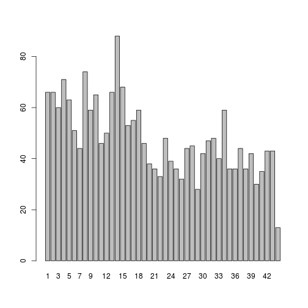
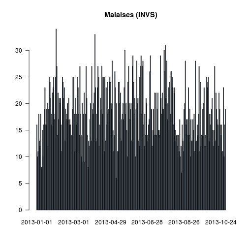
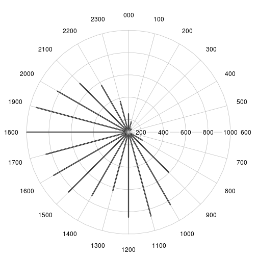
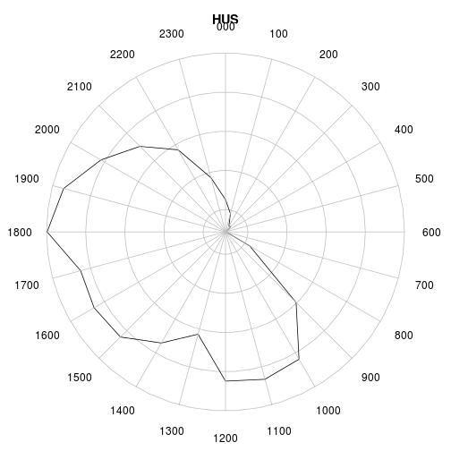
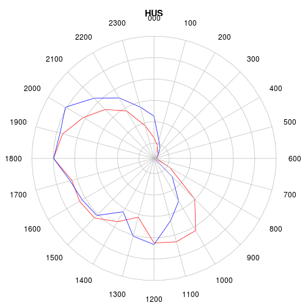
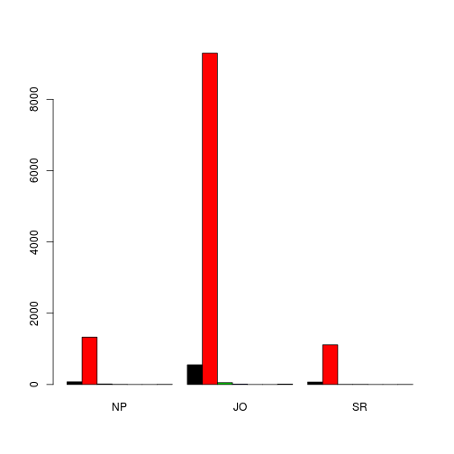

RPU 2013 Analyse
========================================================

```r
date()
```

```
<<<<<<< HEAD
## [1] "Sat Nov  9 10:13:20 2013"
=======
## [1] "Sat Nov 30 19:20:42 2013"
>>>>>>> 229ed100e6b53c12de7d25f4b1202b67e6385124
```

source: RPU2013
Ce document exploite le fichier RData préparé à partir de la table *RPU__* de Sagec. Voir le document *RPU_2013_Preparation.Rmd* du dossier Resural.

Librairies nécessaires:
-----------------------

```r
library("gdata")
```

```
## Error: there is no package called 'gdata'
```

```r
library("rgrs")
library("lubridate")
library("rattle")
library("epicalc")
library("zoo")
library("xts")
library("xtable")
library("plotrix")
library("openintro")
```

Chargement des routines perso
-----------------------------

```r
source("../mes_fonctions.R")
```

Variables globales:
-------------------

```r
mois_courant <- 10
```


Lecture du fichier des données
---------------------------------------
On lit le fichier de travail créé:

```r

# load('rpu2013.Rda')
load("rpu2013d0110.Rda")
# d1<-d0109 rm(d0109)

attach(d1)
```

Les données sont enregistrées dans un data.frame appelé *d1*.

Analyse des données
===================

```r
n <- dim(d1)
print(n)
```

```
## [1] 276452     20
```

```r
names(d1)
```

```
##  [1] "id"            "CODE_POSTAL"   "COMMUNE"       "DESTINATION"  
##  [5] "DP"            "ENTREE"        "EXTRACT"       "FINESS"       
##  [9] "GRAVITE"       "MODE_ENTREE"   "MODE_SORTIE"   "MOTIF"        
## [13] "NAISSANCE"     "ORIENTATION"   "PROVENANCE"    "SEXE"         
## [17] "SORTIE"        "TRANSPORT"     "TRANSPORT_PEC" "AGE"
```

```r
str(d1)
```

```
## 'data.frame':	276452 obs. of  20 variables:
##  $ id           : chr  "2c9d83843bf5e01d013bf5e985d20225" "2c9d83843bf5e01d013bf5e986950226" "2c9d83843bf5e01d013bf5e987620227" "2c9d83843bf5e01d013bf5e988060228" ...
##  $ CODE_POSTAL  : Factor w/ 2648 levels "00000","00159",..: 706 706 706 706 706 701 818 706 706 706 ...
##  $ COMMUNE      : Factor w/ 5624 levels "00","01257 DRESDEN ALLEMAGNE",..: 2184 2184 2184 2184 741 2048 2033 2184 2184 2184 ...
##  $ DESTINATION  : Factor w/ 7 levels "NA","MCO","SSR",..: NA NA NA NA NA NA 2 NA 2 NA ...
##  $ DP           : chr  "R104" "J038" "S617" "M485" ...
##  $ ENTREE       : chr  "2013-01-01 00:04:00" "2013-01-01 00:16:00" "2013-01-01 00:26:00" "2013-01-01 00:32:00" ...
##  $ EXTRACT      : chr  "2013-01-01 05:37:00" "2013-01-01 05:37:00" "2013-01-01 05:37:00" "2013-01-01 05:37:00" ...
##  $ FINESS       : Factor w/ 12 levels "3Fr","Alk","Col",..: 10 10 10 10 10 10 10 10 10 10 ...
##  $ GRAVITE      : Factor w/ 7 levels "1","2","3","4",..: 2 2 3 2 2 1 3 2 2 2 ...
##  $ MODE_ENTREE  : Factor w/ 5 levels "NA","Mutation",..: 4 4 4 4 4 4 4 4 4 4 ...
##  $ MODE_SORTIE  : Factor w/ 5 levels "NA","Mutation",..: 4 4 4 4 4 4 2 4 2 4 ...
##  $ MOTIF        : chr  "GASTRO04" "DIVERS23" "TRAUMATO10" "TRAUMATO02" ...
##  $ NAISSANCE    : chr  "1960-04-08 00:00:00" "1986-03-05 00:00:00" "1971-12-22 00:00:00" "1927-04-27 00:00:00" ...
##  $ ORIENTATION  : Factor w/ 13 levels "CHIR","FUGUE",..: NA NA NA NA NA NA 5 NA 5 NA ...
##  $ PROVENANCE   : Factor w/ 7 levels "NA","MCO","SSR",..: 6 6 6 6 6 6 6 6 6 6 ...
##  $ SEXE         : Factor w/ 3 levels "F","I","M": 3 3 3 1 3 3 1 1 1 1 ...
##  $ SORTIE       : chr  "2013-01-01 02:38:00" "2013-01-01 00:38:00" "2013-01-01 02:07:00" "2013-01-01 01:52:00" ...
##  $ TRANSPORT    : Factor w/ 6 levels "AMBU","FO","HELI",..: 4 4 4 1 4 4 6 6 4 4 ...
##  $ TRANSPORT_PEC: Factor w/ 3 levels "AUCUN","MED",..: 1 1 1 3 1 1 2 2 1 1 ...
##  $ AGE          : num  52 26 41 85 39 9 79 50 46 18 ...
```

```r
summary(d1)
```

```
##       id             CODE_POSTAL            COMMUNE        DESTINATION    
##  Length:276452      68000  : 18857   MULHOUSE   : 32794   MCO    : 57310  
##  Class :character   68200  : 17335   STRASBOURG : 28203   PSY    :  1001  
##  Mode  :character   68100  : 15547   COLMAR     : 18848   SSR    :    94  
##                     67100  : 12941   HAGUENAU   :  5850   HMS    :    21  
##                     67000  :  9045   SAINT LOUIS:  4677   SLD    :    14  
##                     68500  :  7260   (Other)    :186076   (Other):     3  
##                     (Other):195467   NA's       :     4   NA's   :218009  
##       DP               ENTREE            EXTRACT              FINESS     
##  Length:276452      Length:276452      Length:276452      Col    :54517  
##  Class :character   Class :character   Class :character   Mul    :46543  
##  Mode  :character   Mode  :character   Mode  :character   Hus    :31075  
##                                                           Hag    :29184  
##                                                           Dia    :24623  
##                                                           Odi    :21710  
##                                                           (Other):68800  
##     GRAVITE            MODE_ENTREE        MODE_SORTIE    
##  2      :168528   NA         :     0   NA       :     0  
##  3      : 32203   Mutation   :  3012   Mutation : 54438  
##  1      : 31416   Transfert  :  2405   Transfert:  4120  
##  4      :  2887   Domicile   :242679   Domicile :177543  
##  P      :  1127   Transfe  rt:   294   Décès    :     2  
##  (Other):   766   NA's       : 28062   NA's     : 40349  
##  NA's   : 39525                                          
##     MOTIF            NAISSANCE          ORIENTATION       PROVENANCE    
##  Length:276452      Length:276452      UHCD   : 27057   PEA    :147851  
##  Class :character   Class :character   MED    : 14058   PEO    : 24387  
##  Mode  :character   Mode  :character   CHIR   :  6182   MCO    :  6368  
##                                        PSA    :  2582   SSR    :    42  
##                                        REO    :  1197   PSY    :    40  
##                                        (Other):  4018   (Other):    16  
##                                        NA's   :221358   NA's   : 97748  
##  SEXE          SORTIE          TRANSPORT      TRANSPORT_PEC   
##  F:131031   Length:276452      AMBU : 36447   AUCUN  :194787  
##  I:     4   Class :character   FO   :  1182   MED    :  5221  
##  M:145417   Mode  :character   HELI :   176   PARAMED:  5270  
##                                PERSO:150394   NA's   : 71174  
##                                SMUR :  2211                   
##                                VSAB : 23061                   
##                                NA's : 62981                   
##       AGE       
##  Min.   :  0.0  
##  1st Qu.: 18.0  
##  Median : 38.0  
##  Mean   : 40.5  
##  3rd Qu.: 62.0  
##  Max.   :112.0  
##  NA's   :10
```

Stuctures hospitaliéres participantes
=====================================
- *Alk* CH d' Alkirch
- *Col* CH Colmar (Pasteur + Parc)
- *Dia* Diaconat-Fonderie
- *3Fr* Clinique des trois frontières
- *Geb* HUS
- *Hag* CH de Haguenau
- *Hus* Hôpiaux Universitaires de Strasbourg
- *Mul* CH de Mulhouse
- *Odi* Clinique Ste Odile
- *Sel* CH de Sélestat
- *Wis* CH de Wissembourg
- *Sav* CH de Saverne
Hôpitaux ne transmettant pas de données:
- *Tha* CH de Thann
- *Ann* Clinique Ste Anne

Contribution (en %) des SU à la production de RPU:

```r
summary(d1$FINESS)
```

```
##   3Fr   Alk   Col   Dia   Geb   Hag   Hus   Mul   Odi   Sel   Wis   Sav 
## 13250  6007 54517 24623 12743 29184 31075 46543 21710 18502 10638  7660
```

```r
a <- table(d1$FINESS)
round(prop.table(a) * 100, digits = 2)
```

```
## 
##   3Fr   Alk   Col   Dia   Geb   Hag   Hus   Mul   Odi   Sel   Wis   Sav 
##  4.79  2.17 19.72  8.91  4.61 10.56 11.24 16.84  7.85  6.69  3.85  2.77
```

Passages déclarés au serveur régional:

   ALK  | COL  | CTF |  DIA |  GEB |  HUS |  MUL |  ODI |  SAV |  SEL  | TAN |  WIS 
   ----|-------|-----|------|------|------|-------|------|-----|-------|-----|-----
  4577 |21353 | 5475 | 3136  |4926 |41561 |20160 | 8417 | 8961 | 9670 | 4840 | 3052
  
  First Header  | Second Header
------------- | -------------
Content Cell  | Content Cell
Content Cell  | Content Cell

Projection sur l'année:

```r
mois_courant <- 9
p <- 12/mois_courant
summary(d1$FINESS) * p
```

```
##   3Fr   Alk   Col   Dia   Geb   Hag   Hus   Mul   Odi   Sel   Wis   Sav 
## 17667  8009 72689 32831 16991 38912 41433 62057 28947 24669 14184 10213
```

```r
sum(summary(d1$FINESS) * p)
```

```
## [1] 368603
```

```r

t1 <- table(d1$FINESS)
t2 <- table(d1$FINESS) * p
t3 <- rbind(t1, t2)
rownames(t3) <- c("Réalisé", "Projection 2013")
xtable(t(t3))
```

```
<<<<<<< HEAD
## % latex table generated in R 3.0.2 by xtable 1.7-1 package
## % Sat Nov  9 10:13:30 2013
=======
## % latex table generated in R 3.0.1 by xtable 1.7-1 package
## % Sat Nov 30 19:20:56 2013
>>>>>>> 229ed100e6b53c12de7d25f4b1202b67e6385124
## \begin{table}[ht]
## \centering
## \begin{tabular}{rrr}
##   \hline
##  & Réalisé & Projection 2013 \\ 
##   \hline
## 3Fr & 13250.00 & 17666.67 \\ 
##   Alk & 6007.00 & 8009.33 \\ 
##   Col & 54517.00 & 72689.33 \\ 
##   Dia & 24623.00 & 32830.67 \\ 
##   Geb & 12743.00 & 16990.67 \\ 
##   Hag & 29184.00 & 38912.00 \\ 
##   Hus & 31075.00 & 41433.33 \\ 
##   Mul & 46543.00 & 62057.33 \\ 
##   Odi & 21710.00 & 28946.67 \\ 
##   Sel & 18502.00 & 24669.33 \\ 
##   Wis & 10638.00 & 14184.00 \\ 
##   Sav & 7660.00 & 10213.33 \\ 
##    \hline
## \end{tabular}
## \end{table}
```

### Origine temporelle des données:
Pour chaque hopital on determine la datela plus basse a partir de laquelle des donn2es sont transmises. Les dates sont donnees en secondes unix => il faut les transformer en dates calendaires

```r
b <- tapply(as.Date(d1$ENTREE), d1$FINESS, min)
c <- as.Date(b, origin = "1970-01-01")
cbind(as.character(sort(c)))
```

```
##     [,1]        
## 3Fr "2013-01-01"
## Col "2013-01-01"
## Dia "2013-01-01"
## Geb "2013-01-01"
## Hag "2013-01-01"
## Hus "2013-01-01"
## Odi "2013-01-01"
## Sel "2013-01-01"
## Wis "2013-01-01"
## Mul "2013-01-07"
## Alk "2013-04-01"
## Sav "2013-07-23"
```

Exhaustivité des données
------------------------

#### Jours manquants:a<-as.data.frame(a)
NB: il manque le 31/05dans d1

On forme une matrice (table) de 365 lignes et 12 colonnes (hopitaux) contenant le nombre de RPU un jour donne pour un hopital. Pour conserver une trace du jour, on ajoute une colonne date. On signale les jours pour lesquels le nombre de RPU est inferieur a 20:


```r
a <- table(as.Date(d1$ENTREE), d1$FINESS)
a <- as.data.frame.matrix(a)
head(a)
```

```
##            3Fr Alk Col Dia Geb Hag Hus Mul Odi Sel Wis Sav
## 2013-01-01  59   0 208  88  45 131 126   0  84 111  32   0
## 2013-01-02  38   0 197  89  42 112 125   0  69  80  49   0
## 2013-01-03  39   0 160  73  42  83 121   0  55  78  35   0
## 2013-01-04  42   0 170  93  30  92 121   0  67  65  24   0
## 2013-01-05  46   0 150  87  44 100 102   0  70  85  38   0
## 2013-01-06  38   0 167  77  43  90  93   0  79  68  36   0
```

```r
# liste par FINESS des jours où le nb de RPU est inférieur à 20: il faut
# ajouter une colonne date pour que cela fonctionne.
a$date <- seq(as.Date("2013-01-01"), as.Date("2013-09-29"), 1)
```

```
## Error: le tableau de remplacement a 272 lignes, le tableau remplacé en a
## 303
```

```r
# On initialise une liste de 12 éléments,12 parce que 12 SU
b <- list(1:12)
# pour chacun des SU, les jours où le nombre de RPU < 20, on stocke la
# date (col.13) et le n° du SU
for (i in 1:12) {
    b[[i]] <- a[a[, i] < 20, c(13, i)]
}
```

```
## Error: undefined columns selected
```

```r
str(b)
```

```
## List of 1
##  $ : int [1:12] 1 2 3 4 5 6 7 8 9 10 ...
```

```r
# dossier manquants pour guebwiller:
b[[5]]
```

```
## Error: indice hors limites
```

```r
names(b[[5]])
```

```
## Error: indice hors limites
```

```r
b[[5]]$date
```

```
## Error: indice hors limites
```

```r
# liste des SU incomplets:
for (i in 1:12) {
    n = length(b[[i]]$date)
    if (n > 0) {
        print(paste(i, names(b[[i]][2]), n, sep = " "))
    }
}
```

```
## Error: $ operator is invalid for atomic vectors
```

#### Exhaustivité des items
Il faut tranformer les valeurs NULL en NA pour pouvoir les comptabiliser. Les valeurs NULL apparaissent pour les factors: DP, MOTIF, TRANSPORT, ORIENTATION,GRAVITE, SORTIE. Il faut les transformer en character pour leur attriber la valeur NA au lieu de NULL:

```r
a <- as.character(d1$DP)
a[a == "NULL"] <- NA
sum(is.na(a))
```

```
## [1] 92887
```

```r
mean(is.na(a))
```

```
## [1] 0.336
```

sum(is.na(a)) retourne le nombre de lignes concernées et *mean(is.na(a))* donne directement le pourcentage de valeurs nulles (R in action pp 356)

```r
d1$DP <- a

a <- as.character(d1$MOTIF)
a[a == "NULL"] <- NA
d1$MOTIF <- a

a <- as.character(d1$TRANSPORT)
a[a == "NULL"] <- NA
d1$TRANSPORT <- a

a <- as.character(d1$ORIENTATION)
a[a == "NULL"] <- NA
d1$ORIENTATION <- a

a <- as.character(d1$GRAVITE)
a[a == "NULL"] <- NA
d1$GRAVITE <- a

a <- as.character(d1$SORTIE)
a[a == "NULL"] <- NA
d1$SORTIE <- a

a <- as.character(d1$ENTREE)
a[a == "NULL"] <- NA
d1$ENTREE <- a
```

Les 2 lignes qui suivent comptent les NA

```r
a <- is.na(d1)
b <- apply(a, 2, mean)
a <- cbind(sort(round(b * 100, 2)))
colnames(a) <- "%"
a
```

```
##                   %
## id             0.00
## CODE_POSTAL    0.00
## COMMUNE        0.00
## ENTREE         0.00
## EXTRACT        0.00
## FINESS         0.00
## NAISSANCE      0.00
## SEXE           0.00
## AGE            0.00
## SORTIE         9.24
## MODE_ENTREE   10.15
## GRAVITE       14.30
## MODE_SORTIE   14.60
## TRANSPORT     22.78
## TRANSPORT_PEC 25.75
## DP            33.60
## PROVENANCE    35.36
## MOTIF         36.52
## DESTINATION   78.86
## ORIENTATION   80.07
```

MODE_SORTIE (hospitalisation ou retour à domicile): dans 14.86% des cas on ne sait pas ce que devient le patient. Pour sélectionner les hospitalisés et éliminer les NA et les valeurs nulles:

```r
a <- d1$MODE_SORTIE[MODE_SORTIE == "Mutation" | MODE_SORTIE == "Transfert"]
a <- na.omit(a)
a <- as.factor(as.character(a))
summary(a)
```

```
##  Mutation Transfert 
##     54438      4120
```

```r
round(prop.table(table(a)) * 100, 2)
```

```
## a
##  Mutation Transfert 
##     92.96      7.04
```

```r

a <- d1[MODE_SORTIE == "Mutation" | MODE_SORTIE == "Transfert", ]
a <- na.omit(a)
summary(a$DESTINATION)
```

```
##    NA   MCO   SSR   SLD   PSY   HAD   HMS 
##     0 19865     4     4   362     0     0
```

```r
summary(as.factor(a$ORIENTATION))
```

```
## CHIR  HDT   HO  MED OBST  REA   SC   SI UHCD 
## 4247   53   14 9236   38  592  838  798 4419
```

```r
round(prop.table(table(as.factor(a$ORIENTATION))) * 100, 2)
```

```
## 
##  CHIR   HDT    HO   MED  OBST   REA    SC    SI  UHCD 
## 20.99  0.26  0.07 45.64  0.19  2.93  4.14  3.94 21.84
```

```r

tab1(as.factor(a$ORIENTATION), sort.group = "decreasing", horiz = TRUE, cex.names = 0.8, 
    xlab = "", main = "Orientation des patients hospitalisés")
```

 

```
## as.factor(a$ORIENTATION) :  
##         Frequency Percent Cum. percent
## MED          9236    45.6         45.6
## UHCD         4419    21.8         67.5
## CHIR         4247    21.0         88.5
## SC            838     4.1         92.6
## SI            798     3.9         96.6
## REA           592     2.9         99.5
## HDT            53     0.3         99.7
## OBST           38     0.2         99.9
## HO             14     0.1        100.0
##   Total     20235   100.0        100.0
```

```r

a <- d1[d1$MODE_SORTIE == "Domicile", ]
summary(as.factor(a$ORIENTATION))
```

```
##   CHIR  FUGUE    HDT     HO    MED   OBST    PSA    REA    REO     SC 
##    103    219     13      2     58      1   2538      9   1165      6 
##   SCAM     SI   UHCD   NA's 
##    428     23    228 213099
```

```r
t <- table(as.factor(a$ORIENTATION))
round(prop.table(t) * 100, 2)
```

```
## 
##  CHIR FUGUE   HDT    HO   MED  OBST   PSA   REA   REO    SC  SCAM    SI 
##  2.15  4.57  0.27  0.04  1.21  0.02 52.95  0.19 24.31  0.13  8.93  0.48 
##  UHCD 
##  4.76
```

```r
tab1(as.factor(a$ORIENTATION), sort.group = "decreasing", horiz = TRUE, cex.names = 0.8, 
    xlab = "", main = "Orientation des patients non hospitalisés", missing = F)
```

 

```
## as.factor(a$ORIENTATION) :  
##         Frequency   %(NA+)   %(NA-)
## NA's       213099     97.8      0.0
## PSA          2538      1.2     53.0
## REO          1165      0.5     24.3
## SCAM          428      0.2      8.9
## UHCD          228      0.1      4.8
## FUGUE         219      0.1      4.6
## CHIR          103      0.0      2.1
## MED            58      0.0      1.2
## SI             23      0.0      0.5
## HDT            13      0.0      0.3
## REA             9      0.0      0.2
## SC              6      0.0      0.1
## HO              2      0.0      0.0
## OBST            1      0.0      0.0
##   Total    217892    100.0    100.0
```

La table ci-dessus liste le devenir des patients non hospitalisés. On note des incohérences: REA, HDT, SI, Med, CHIR, UHCD. La ligne *Missing* correspond aux patients rentrés sur avis médical.

Etude des patients hospitalisés
--------------------------------
La rubrique mode de sortie peut se décomposer en 3 éléments
- *hosp*: patient hospitalisés, cad gardé en milieu de soins par *MUTATION* ou *TRANSFERT*
- *dom*: retour à domicile ou équivalent
- *dcd*: patients décédés aux urgences
Dans l'échantillon *d1* c'est la colonne *MODE_SORTIE* qui renseigne sur le devenir du patient à la sortie des urgences:


```
## [1] "d1 compte  276452  lignes"
```

Il y a deux façons de former des sous ensembles avec R:
- sélectionner en utilisant la notation vectorielle: hosp<-d1[d1$MODE_SORTIE=="Mutation" | d1$MODE_SORTIE=="Transfert",]
- sélectionner avec la méthode **subset**: b<-subset(d1,MODE_SORTIE=="Mutation" | MODE_SORTIE=="Transfert")

La première méthode sélectionne toutes les lignes correspondant aux critères ET celles où le critère vaut *NA*. ie, la méthode 1 retourne un data frame de 39224 lignes et 20 colonnes.

La méthode *subset* ne tient pas compte des lignes où le critère vaut NA. Dans l'exemple, retourne un dataframe de 23473 lignes et 20 colonnes.


```r
hosp <- d1[d1$MODE_SORTIE == "Mutation" | d1$MODE_SORTIE == "Transfert", ]
dom <- d1[d1$MODE_SORTIE == "Domicile", ]
dcd <- d1[d1$MODE_SORTIE == "Deces", ]
nbna <- nrow(hosp) + nrow(dom) + nrow(dcd) - nrow(d1)
pna <- round(nbna * 100/nrow(d1), 2)

print(paste("hosp = ", nrow(hosp), " lignes"))
```

```
## [1] "hosp =  98907  lignes"
```

```r
print(paste("dom = ", nrow(dom), " lignes"))
```

```
## [1] "dom =  217892  lignes"
```

```r
print(paste("dcd = ", nrow(dcd), " lignes"))
```

```
## [1] "dcd =  40349  lignes"
```

```r

print(paste("La différence du nombre de lignes entre d1 et hosp, dom et dcd indique le nmbre de lignes correspondant à NA et qui sont incluses dans le décompte des lignes de chaque sous ensemble: ", 
    nbna, "correspondant aux mode de sortie non renseignés soit ", pna, " %"))
```

```
## [1] "La différence du nombre de lignes entre d1 et hosp, dom et dcd indique le nmbre de lignes correspondant à NA et qui sont incluses dans le décompte des lignes de chaque sous ensemble:  80696 correspondant aux mode de sortie non renseignés soit  29.19  %"
```

Avec *subset* on élimine ces lignes parasites:

```r
a <- subset(d1, MODE_SORTIE == "Domicile")
b <- subset(d1, MODE_SORTIE == "Mutation" | MODE_SORTIE == "Transfert")
nrow(a)
```

```
## [1] 177543
```

```r
nrow(b)
```

```
## [1] 58558
```

```r
nrow(d1) - nrow(a) - nrow(b)
```

```
## [1] 40351
```

```r

print("O")
```

```
## [1] "O"
```

```r
t <- table(b$ORIENTATION, b$FINESS, useNA = "ifany")
m1 <- margin.table(t, 1)
t2 <- cbind(t, m1)
m2 <- margin.table(t2, 2)
rbind(t2, m2)
```

```
##      3Fr  Alk   Col  Dia Geb  Hag   Hus  Mul Odi  Sel  Wis  Sav    m1
## CHIR   1    0  2358   37  40  947     1 1324 150  835   17  251  5961
## HDT    0    0    47    0   1    0     0    4   2    0   17    0    71
## HO     0    0     6    0   3    0     0    3   0    0    9    0    21
## MED    1    0  5453    8  16 1766   402 2158  40 2726   21 1211 13802
## OBST   0    0    27    0   4   41     0    0   1   11    0    0    84
## PSA    0    1     0    9   0    0     0    0   0    0    0    0    10
## REA    0    0   327    2   0  133     0  228   1   57    6   12   766
## REO    6    7     0   11   0    0     0    0   1    0    1    0    26
## SC     0    0   355    1   5   61     0  666   2    1   34    0  1125
## SI     0    0   535    0   7  236     0  267   6    8   13    0  1072
## UHCD   0    0  4074    5  17 3373 16532  553   1  240   42    0 24837
## <NA> 221 1026   375 2451 274 1757     1 1506 758    0 2334   80 10783
## m2   229 1034 13557 2524 367 8314 16936 6709 962 3878 2494 1554 58558
```

```r

summary(a$MODE_SORTIE)
```

```
##        NA  Mutation Transfert  Domicile     Décès 
##         0         0         0    177543         0
```

```r
summary(b$MODE_SORTIE)
```

```
##        NA  Mutation Transfert  Domicile     Décès 
##         0     54438      4120         0         0
```

- nb total de lignes = 105979
- total hospitalisés = 21950 +  1523
- total non hospitalisés = 66755 
- non réponses = 105979-90228 = 15751

```r
summary(b$DESTINATION)
```

```
##    NA   MCO   SSR   SLD   PSY   HAD   HMS  NA's 
##     0 57165    94    14   995     2     0   288
```

```r
summary(b$ORIENTATION)
```

```
##    Length     Class      Mode 
##     58558 character character
```

```r
summary(a$DESTINATION)
```

```
##     NA    MCO    SSR    SLD    PSY    HAD    HMS   NA's 
##      0    128      0      0      0      1     21 177393
```

```r
summary(a$ORIENTATION)
```

```
##    Length     Class      Mode 
##    177543 character character
```


on forme un dataframe *hosp* des patients hospitalisés par mutation ou transfert:

```r
hosp <- d1[d1$MODE_SORTIE == "Mutation" | d1$MODE_SORTIE == "Transfert", ]
summary(d1$MODE_SORTIE)
```

```
##        NA  Mutation Transfert  Domicile     Décès      NA's 
##         0     54438      4120    177543         2     40349
```

```r
prop.table(summary(d1$MODE_SORTIE)) * 100
```

```
##        NA  Mutation Transfert  Domicile     Décès      NA's 
## 0.000e+00 1.969e+01 1.490e+00 6.422e+01 7.235e-04 1.460e+01
```

#### Destinations

```r
summary(hosp$DESTINATION)
```

```
##    NA   MCO   SSR   SLD   PSY   HAD   HMS  NA's 
##     0 57165    94    14   995     2     0 40637
```

```r
prop.table(summary(hosp$DESTINATION))
```

```
##        NA       MCO       SSR       SLD       PSY       HAD       HMS 
## 0.000e+00 5.780e-01 9.504e-04 1.415e-04 1.006e-02 2.022e-05 0.000e+00 
##      NA's 
## 4.109e-01
```

```r
# sans les NA
table(hosp$DESTINATION)
```

```
## 
##    NA   MCO   SSR   SLD   PSY   HAD   HMS 
##     0 57165    94    14   995     2     0
```

```r
prop.table(table(hosp$DESTINATION)) * 100
```

```
## 
##        NA       MCO       SSR       SLD       PSY       HAD       HMS 
##  0.000000 98.103655  0.161318  0.024026  1.707568  0.003432  0.000000
```


#### Orientation des hospitalisés MCO (avec et sans les NA):

```r
a <- as.factor(hosp$ORIENTATION[hosp$DESTINATION == "MCO"])
a <- summary(a)
a
```

```
##  CHIR   HDT    HO   MED  OBST   PSA   REA   REO    SC    SI  UHCD  NA's 
##  5842    11     9 13569    84    10   758    25  1114  1070 24808 50502
```

```r
round(prop.table(a) * 100, 2)
```

```
##  CHIR   HDT    HO   MED  OBST   PSA   REA   REO    SC    SI  UHCD  NA's 
##  5.97  0.01  0.01 13.87  0.09  0.01  0.78  0.03  1.14  1.09 25.37 51.64
```

```r

a <- table(hosp$ORIENTATION[hosp$DESTINATION == "MCO"])
a
```

```
## 
##  CHIR   HDT    HO   MED  OBST   PSA   REA   REO    SC    SI  UHCD 
##  5842    11     9 13569    84    10   758    25  1114  1070 24808
```

```r
a <- prop.table(a) * 100
a
```

```
## 
##     CHIR      HDT       HO      MED     OBST      PSA      REA      REO 
## 12.35095  0.02326  0.01903 28.68710  0.17759  0.02114  1.60254  0.05285 
##       SC       SI     UHCD 
##  2.35518  2.26216 52.44820
```

```r
sce_chauds <- a["REA"] + a["SI"] + a["SC"]
print(paste("Services chauds: ", round(sce_chauds, 2), " %"))
```

```
## [1] "Services chauds:  6.22  %"
```

```r
mco <- a["CHIR"] + a["MED"] + a["OBST"]
print(paste("MCO: ", round(mco, 2), " %"))
```

```
## [1] "MCO:  41.22  %"
```

```r
print(paste("UHTCD: ", round(a["UHCD"], 2), " %"))
```

```
## [1] "UHTCD:  52.45  %"
```

```r
print(paste("Atypiques: ", round(a["FUGUE"] + a["PSA"] + a["SCAM"] + a["REO"], 
    2), " %"))
```

```
## [1] "Atypiques:  NA  %"
```

```r
print(paste("HDT-HO: ", round(a["HDT"] + a["HO"], 2), " %"))
```

```
## [1] "HDT-HO:  0.04  %"
```

Quelques erreurs de codage:
- Fugue, HDT, HO, PSA,REO, SCAM devraient être nuls
dom<-d1
#### Orientation des patients hospitalisés en Psychiatrie:

```r
a <- summary(hosp$ORIENTATION[hosp$DESTINATION == "PSY"])
a
```

```
##    Length     Class      Mode 
##     41632 character character
```

```r
a <- table(hosp$ORIENTATION[hosp$DESTINATION == "PSY"])
a
```

```
## 
## CHIR  HDT   HO  MED  REA  REO   SC   SI UHCD 
##  119   60   12  222    6    1   11    2   14
```

```r

a <- d1[d1$DESTINATION == "PSY", ]
a$DESTINATION <- as.character(a$DESTINATION)
a <- a[!is.na(a$DESTINATION), ]
summary(a$ORIENTATION)
```

```
##    Length     Class      Mode 
##      1001 character character
```

```r
round(prop.table(summary(a$ORIENTATION)) * 100, 3)
```

```
## Error: 'type' (character) de l'argument incorrect
```

#### Analyse de l'ensemble de la rubrique **ORIENTATION**

```r
d1$ORIENTATION <- as.factor(d1$ORIENTATION)
a <- summary(d1$ORIENTATION)
a
```

```
##   CHIR  FUGUE    HDT     HO    MED   OBST    PSA    REA    REO     SC 
##   6182    220    107     25  14058     85   2582    835   1197   1160 
##   SCAM     SI   UHCD   NA's 
##    428   1158  27057 221358
```

```r
a <- round(prop.table(a) * 100, 4)

sce_chauds <- a["REA"] + a["SI"] + a["SC"]
print(paste("Services chauds: ", round(sce_chauds, 2), " %"))
```

```
## [1] "Services chauds:  1.14  %"
```

```r
mco <- a["CHIR"] + a["MED"] + a["OBST"]
print(paste("MCO: ", round(mco, 2), " %"))
```

```
## [1] "MCO:  7.35  %"
```

```r
uhcd <- a["UHCD"]
print(paste("UHTCD: ", round(uhcd, 2), " %"))
```

```
## [1] "UHTCD:  9.79  %"
```

```r
atypique <- a["FUGUE"] + a["PSA"] + a["SCAM"] + a["REO"]
print(paste("Atypiques: ", round(atypique, 2), " %"))
```

```
## [1] "Atypiques:  1.6  %"
```

```r
psy <- a["HDT"] + a["HO"]
print(paste("HDT-HO: ", round(psy, 2), " %"))
```

```
## [1] "HDT-HO:  0.05  %"
```

```r
nr <- a["NA's"]

als <- c(mco, uhcd, nr, atypique, sce_chauds, psy)
lor <- c(49.39, 19.12, 17.25, 8.92, 5.24, 0.07)

r <- rbind(als, lor)
barplot(r, las = 2, beside = T, legend = T, ylab = "% des RPU", xlab = "", sub = "(Ref. ORULOR 2011 p.50)", 
    names.arg = c("MCO", "UHCD", "NR", "Atypiques", "REA", "PSY"), main = "Orientation des patients hospitalisés", 
    cex.sub = 0.6)
```

 

en fonction de l'établissement (NOTE: utilisation de useNA="ifany"):

```r
# analyse brute
t <- table(d1$ORIENTATION, d1$FINESS)
t
```

```
##        
##           3Fr   Alk   Col   Dia   Geb   Hag   Hus   Mul   Odi   Sel   Wis
##   CHIR      5     0  2363    73    51   947     1  1423   213   836    18
##   FUGUE     8     5   104    10     2    35     0     0    27     2    24
##   HDT       0     0    48     0     1     0     0    38     2     0    18
##   HO        2     0     6     0     3     0     0     4     0     0    10
##   MED       1     0  5466    15    19  1766   402  2354    60  2738    23
##   OBST      0     0    27     0     4    41     0     0     2    11     0
##   PSA      52   130   838   834    32   421     0   142    35     6    92
##   REA       1     0   327     4     1   133     0   291     2    57     7
##   REO      56    19   990   121     1     0     0     0     3     0     3
##   SC        0     0   355     1     6    61     0   693     2     1    41
##   SCAM      3    19   151    14    23   130     0     8    29     3    36
##   SI        1     0   535     2     8   236     0   328     8    26    14
##   UHCD      1     0  4078    12    20  3373 17463  1812     1   240    57
##        
##           Sav
##   CHIR    252
##   FUGUE     3
##   HDT       0
##   HO        0
##   MED    1214
##   OBST      0
##   PSA       0
##   REA      12
##   REO       4
##   SC        0
##   SCAM     12
##   SI        0
##   UHCD      0
```

```r
# analyse brute incluant les NA
t <- table(d1$ORIENTATION, d1$FINESS, useNA = "ifany")
t
```

```
##        
##           3Fr   Alk   Col   Dia   Geb   Hag   Hus   Mul   Odi   Sel   Wis
##   CHIR      5     0  2363    73    51   947     1  1423   213   836    18
##   FUGUE     8     5   104    10     2    35     0     0    27     2    24
##   HDT       0     0    48     0     1     0     0    38     2     0    18
##   HO        2     0     6     0     3     0     0     4     0     0    10
##   MED       1     0  5466    15    19  1766   402  2354    60  2738    23
##   OBST      0     0    27     0     4    41     0     0     2    11     0
##   PSA      52   130   838   834    32   421     0   142    35     6    92
##   REA       1     0   327     4     1   133     0   291     2    57     7
##   REO      56    19   990   121     1     0     0     0     3     0     3
##   SC        0     0   355     1     6    61     0   693     2     1    41
##   SCAM      3    19   151    14    23   130     0     8    29     3    36
##   SI        1     0   535     2     8   236     0   328     8    26    14
##   UHCD      1     0  4078    12    20  3373 17463  1812     1   240    57
##   <NA>  13120  5834 39229 23537 12572 22041 13209 39450 21326 14582 10295
##        
##           Sav
##   CHIR    252
##   FUGUE     3
##   HDT       0
##   HO        0
##   MED    1214
##   OBST      0
##   PSA       0
##   REA      12
##   REO       4
##   SC        0
##   SCAM     12
##   SI        0
##   UHCD      0
##   <NA>   6163
```

```r
# cette analyse ne permet pas de séparer les vraies non réponses des
# retours à domicile
hosp <- d1[d1$MODE_SORTIE == "Mutation" | d1$MODE_SORTIE == "Transfert", ]
t <- table(hosp$ORIENTATION, hosp$FINESS, useNA = "ifany")
t
```

```
##        
##           3Fr   Alk   Col   Dia   Geb   Hag   Hus   Mul   Odi   Sel   Wis
##   CHIR      1     0  2358    37    40   947     1  1324   150   835    17
##   FUGUE     0     0     0     0     0     0     0     0     0     0     0
##   HDT       0     0    47     0     1     0     0     4     2     0    17
##   HO        0     0     6     0     3     0     0     3     0     0     9
##   MED       1     0  5453     8    16  1766   402  2158    40  2726    21
##   OBST      0     0    27     0     4    41     0     0     1    11     0
##   PSA       0     1     0     9     0     0     0     0     0     0     0
##   REA       0     0   327     2     0   133     0   228     1    57     6
##   REO       6     7     0    11     0     0     0     0     1     0     1
##   SC        0     0   355     1     5    61     0   666     2     1    34
##   SCAM      0     0     0     0     0     0     0     0     0     0     0
##   SI        0     0   535     0     7   236     0   267     6     8    13
##   UHCD      0     0  4074     5    17  3373 16532   553     1   240    42
##   <NA>    221  1026   375  2451   274  1757     1  1506   758     0  2334
##        
##           Sav  <NA>
##   CHIR    251     0
##   FUGUE     0     0
##   HDT       0     0
##   HO        0     0
##   MED    1211     0
##   OBST      0     0
##   PSA       0     0
##   REA      12     0
##   REO       0     0
##   SC        0     0
##   SCAM      0     0
##   SI        0     0
##   UHCD      0     0
##   <NA>     80 40349
```

```r
# non hospitalisés
dom <- d1[d1$MODE_SORTIE == "Domicile", ]
```


Adultes
-------
Répartition de la population adulte (18 ans et plus)

```r
a <- d1[AGE > 17, c("AGE", "FINESS")]
boxplot(a$AGE ~ a$FINESS, main = "Patients de 18 ans et plus", col = "slategray1")
```

 


Mineurs
-------

```r
a <- d1$AGE[d1$AGE <= 18]
# a
summary(a)
```

```
##    Min. 1st Qu.  Median    Mean 3rd Qu.    Max.    NA's 
##    0.00    2.00    7.00    7.84   13.00   18.00      10
```

```r
hist(a, main = "Moins de 18 ans", xlab = "Age (années)", col = "yellow")
```

 

```r

a <- d1$AGE[FINESS == "Col" & d1$AGE < 18]
# a
a <- d1$AGE[FINESS == "Hag" & d1$AGE < 18]
# a
a <- d1$AGE[FINESS == "Mul" & d1$AGE < 18]
# a
table(FINESS)
```

```
## FINESS
##   3Fr   Alk   Col   Dia   Geb   Hag   Hus   Mul   Odi   Sel   Wis   Sav 
## 13250  6007 54517 24623 12743 29184 31075 46543 21710 18502 10638  7660
```

Durée d'attente
===============
On utilise les données de Sélestat comme étude pilote:

```r
sel <- d1[d1$FINESS == "Sel", ]
e <- ymd_hms(sel$ENTREE)
s <- ymd_hms(sel$SORTIE)
q <- s - e
sel$attente <- q
summary(as.numeric(q))
```

```
##    Min. 1st Qu.  Median    Mean 3rd Qu.    Max.    NA's 
##       1      86     137     162     216     974     627
```

Attente cumulée par jour (pour chaque jour, on cumule les durées d'attente) en mn:

```r
q <- tapply(sel$attente, as.Date(sel$ENTREE), sum, na.rm = TRUE)
summary(q)
```

```
##    Min. 1st Qu.  Median    Mean 3rd Qu.    Max. 
##       0   10800   12900   12900   15200   23000
```

```r
hist(q, main = "Attente cumulée par 24h", xlab = "Durée de passage (en mn)", 
    ylab = "Fréquence", col = "orange")
```

 

```r

z <- zoo(q, unique(as.Date(sel$ENTREE)))
plot(z, main = "Attente cumulée par 24h", xlab = "Sélestat 2013")
```

 

```r
plot(xts(z))
```

 

```r
plot(rollmean(z, 7), main = "Attente cumulée par 24h (moyenne lissée)")
```

 

```r
plot(rollmean(xts(z), 7), main = "Attente cumulée (lissée) par 24h", xlab = "Durée de passage (en mn)", 
    ylab = "Fréquence")
```

 

Ensemble des SAU
----------------
attente en mn:

```r
e <- ymd_hms(d1$ENTREE)
s <- ymd_hms(d1$SORTIE)
q <- s - e
d1$passage <- q/60

tapply(d1$passage, d1$FINESS, mean, na.rm = TRUE)
```

```
##    3Fr    Alk    Col    Dia    Geb    Hag    Hus    Mul    Odi    Sel 
## 135.14 153.92 168.29 160.32  77.30 356.57  67.35 176.81  95.82 161.99 
##    Wis    Sav 
## 134.68 144.78
```

```r
tapply(d1$passage, d1$FINESS, sd, na.rm = TRUE)
```

```
##   3Fr   Alk   Col   Dia   Geb   Hag   Hus   Mul   Odi   Sel   Wis   Sav 
## 154.0 184.0 178.4 139.8 130.0 328.2 262.2 136.7 111.8 103.9 159.3 156.7
```

```r
tapply(d1$passage, d1$FINESS, median, na.rm = TRUE)
```

```
## 3Fr Alk Col Dia Geb Hag Hus Mul Odi Sel Wis Sav 
## 107 108 119 134  50 241   1 141  77 137  93 105
```

```r
boxplot(as.numeric(d1$passage) ~ d1$FINESS, col = "pink")
```

 

attente de moins d'une journée:

```r
h24 <- d1[as.numeric(d1$passage) < 1000, c("passage", "FINESS")]
boxplot(as.numeric(h24$passage) ~ h24$FINESS, col = "pink", main = "Durée moyenne de passage (pour t<24h)", 
    ylab = "Temps en minutes", xlab = "SAU - 2013")
```

 

```r
boxplot(as.numeric(h24$passage) ~ h24$FINESS, col = "yellow", range = 0, notch = TRUE, 
    border = "blue", main = "Durée moyenne de passage", ylab = "Temps en minutes", 
    xlab = "SAU - 2013")
```

 

Maladies infectieuses
=====================
Codes CIM 10:
- bronchiolite: J11
- Grippe: J11, J10, J09
- Gastroenterite: A09

Regroupement | Code CIM 10 | Description
------------ | ------------ | -----------
Hyperthermies |T67 | Effets de la chaleur et de la lumière
Hyperthermies | X30 |Exposition à une chaleur naturelle excessive
Déshydratations |E86 |Hypovolémie
Hyponatrémies | E871 | Hypo-osmolarité et hyponatrémie
Malaises | R42 | Etourdissements et éblouissements
Malaises |R53| Malaise et fatigue
Malaises | R55| Syncope et collapsus
Asthme|J45 | Asthme
Asthme |J46 | Etat de mal asthmatique
Piqûres arthropodes ou autres |T63 |Effet toxique d’un contact avec un animal venimeux
Piqûres arthropodes ou autres |W57 |Morsure ou piqûre non venimeuse d’insectes et arthropodes
Piqûres arthropodes ou autres |X20→X29 | Contact avec des animaux ou des plantes venimeuses

Pendant toute la durée du Plan Canicule, du 1er juin au 31 août.


on veut mettre 3 graphiques sur le même dessin

```r
par(mfrow = c(3, 1))
```


gastro
------

```r
gastro <- d1[substr(d1$DP, 1, 3) == "A09", c("DP", "ENTREE")]
g <- gastro[complete.cases(gastro), ]
g$date <- as.Date(g$ENTREE)
hist(g$date, breaks = 18, freq = TRUE, col = "slategray1", main = "2013 - Gastroentérites", 
    xlab = "")
```

 

```r
g$date2 <- ymd_hms(g$ENTREE)
wg <- week(g$date2)
barplot(summary(as.factor(wg)))
```

 

bronchiolite
------------

```r
bronchio <- d1[substr(d1$DP, 1, 3) == "J21", c("DP", "ENTREE")]
bronchio <- bronchio[complete.cases(bronchio), ]
bronchio$date <- as.Date(bronchio$ENTREE)
hist(bronchio$date, breaks = 18, freq = TRUE, col = "slategray1", main = "2013 - Bronchiolites", 
    xlab = "")
```

 

Grippe
------

```r
grippe <- d1[substr(d1$DP, 1, 3) == "J11" | substr(d1$DP, 1, 3) == "J10" | substr(d1$DP, 
    1, 3) == "J09", c("DP", "ENTREE")]
grippe <- grippe[complete.cases(grippe), ]
grippe$date <- as.Date(grippe$ENTREE)
hist(grippe$date, breaks = 18, freq = TRUE, col = "slategray1", main = "2013 - Syndromes grippaux", 
    xlab = "")
```

 

```r

par(mfrow = c(1, 1))
```

malaises
--------

```r
malaise <- d1[substr(d1$DP, 1, 3) == "R55", c("DP", "ENTREE")]
malaise <- malaise[complete.cases(malaise), ]
malaise$date <- as.Date(malaise$ENTREE)
hist(malaise$date, breaks = 18, freq = TRUE, col = "slategray1")
```

 

malaise selon INVS (canicule):

```r
malaise <- d1[substr(d1$DP, 1, 3) == "R55" | substr(d1$DP, 1, 3) == "R53" | 
    substr(d1$DP, 1, 3) == "R42", c("DP", "ENTREE")]
malaise <- malaise[complete.cases(malaise), ]
malaise$date <- as.Date(malaise$ENTREE)
hist(malaise$date, breaks = 18, freq = TRUE, col = "slategray1", main = "Malaises (INVS)")
```

 

```r
plot(as.factor(malaise$date), col = "slategray1", las = 1, main = "Malaises (INVS)")
```

 

AVC
----
code SIM10: I60 à I64
**complete.cases** permet de supprimer les enregistrements vides

```r
avc <- d1[substr(d1$DP, 1, 3) >= "I60" & substr(d1$DP, 1, 3) <= "I64", c("DP", 
    "ENTREE", "FINESS", "AGE", "SEXE")]
avc <- avc[complete.cases(avc), ]
nrow(avc)
```

```
## [1] 1639
```

```r
summary(avc$FINESS)
```

```
## 3Fr Alk Col Dia Geb Hag Hus Mul Odi Sel Wis Sav 
##  40   9 357   0  14 372 245 433   1 115  53   0
```

```r
summary(avc$AGE)
```

```
##    Min. 1st Qu.  Median    Mean 3rd Qu.    Max. 
##     1.0    63.0    76.0    72.3    84.0   112.0
```

```r
summary(avc$SEXE)
```

```
##   F   I   M 
## 862   0 777
```

Le SAU des HUS reçoit peu d' AVC alors que c'est la meilleure filière. Les résultats sont faussés par l'UNV.

Douleur thoracique
------------------
code SIM10: I20 à I25

```r
idm <- d1[substr(d1$DP, 1, 3) >= "I20" & substr(d1$DP, 1, 3) <= "I25", c("DP", 
    "ENTREE", "FINESS", "AGE", "SEXE")]
idm <- idm[complete.cases(idm), ]
nrow(idm)
```

```
## [1] 779
```

```r
summary(idm$FINESS)
```

```
## 3Fr Alk Col Dia Geb Hag Hus Mul Odi Sel Wis Sav 
##  56   6 123   0  29 119 252 106   2  44  42   0
```

```r
summary(idm$AGE)
```

```
##    Min. 1st Qu.  Median    Mean 3rd Qu.    Max. 
##     0.0    54.0    66.0    65.4    80.0   103.0
```

```r
summary(idm$SEXE)
```

```
##   F   I   M 
## 307   0 472
```

Lésions traumatiques
--------------------
codes CIM10 S00–T98

```r
trauma <- d1[substr(d1$DP, 1, 3) >= "S00" & substr(d1$DP, 1, 3) <= "T98", c("DP", 
    "ENTREE", "FINESS", "AGE", "SEXE")]
trauma <- trauma[complete.cases(trauma), ]
nrow(trauma)
```

```
## [1] 69722
```

```r
summary(trauma$FINESS)
```

```
##   3Fr   Alk   Col   Dia   Geb   Hag   Hus   Mul   Odi   Sel   Wis   Sav 
##  4621  2399 20101     0  6360  9731  1384  9918  3229  8396  3583     0
```

```r
summary(trauma$AGE)
```

```
##    Min. 1st Qu.  Median    Mean 3rd Qu.    Max. 
##     0.0    13.0    28.0    33.8    51.0   112.0
```

```r
summary(trauma$SEXE)
```

```
##     F     I     M 
## 30089     2 39631
```

Etude HUS
----------------

```r
geb <- d1[d1$FINESS == "Geb", ]
```

Orientation des patients 

```r
summary(geb$MODE_SORTIE)
```

```
##        NA  Mutation Transfert  Domicile     Décès      NA's 
##         0       220       147      5902         0      6474
```

```r
summary(geb$ORIENTATION)
```

```
##  CHIR FUGUE   HDT    HO   MED  OBST   PSA   REA   REO    SC  SCAM    SI 
##    51     2     1     3    19     4    32     1     1     6    23     8 
##  UHCD  NA's 
##    20 12572
```

Mode d'arrivée aux urgences:

```r
summary(as.factor(geb$TRANSPORT))
```

```
##  AMBU PERSO  SMUR  VSAB  NA's 
##  1120 10737     1   767   118
```

Heure d'arrivée aux urgences

```r
e <- ymd_hms(geb$ENTREE)
h <- hour(e)
summary(h)
```

```
##    Min. 1st Qu.  Median    Mean 3rd Qu.    Max. 
##       0      10      14      14      18      23
```

```r
hist(h, breaks = 23, xlab = "Heures", main = "CH HUS - Horaire de fréquentation du SU")
```

 

```r
t <- table(h)
t2 <- as.integer(t)
c <- clock24.plot(t2, clock.pos = 1:24, lwd = 3)
```

 

```r
c <- clock24.plot(t2, clock.pos = 1:24, rp.type = "p", main = "HUS", xlab = "Heures d'arrivée aux urgences", 
    show.grid.labels = F)
```

 

```r
# nécessite la librairie openintro
clock24.plot(t2, clock.pos = 1:24, rp.type = "p", main = "HUS", xlab = "Heures d'arrivée aux urgences", 
    show.grid.labels = F, poly.col = fadeColor("blue", fade = "10"))
```

 

```r
clock24.plot(t2, clock.pos = 1:24, rp.type = "p", main = "HUS", xlab = "Heures d'arrivée aux urgences", 
    show.grid.labels = F, poly.col = fadeColor("blue", fade = "10"), line.col = fadeColor("blue", 
        fade = "10"))
```

 

Idem pour les sorties

```r
s <- ymd_hms(geb$SORTIE)
t3 <- as.integer(table(hour(s)))
clock24.plot(t3, clock.pos = 1:24, rp.type = "p", main = "HUS", xlab = "Heures de sortie des urgences", 
    show.grid.labels = F)
```

 

Combinaison entrée-sortie

```r
t4 <- rbind(t2, t3)
clock24.plot(t4, clock.pos = 1:24, rp.type = "p", main = "HUS", xlab = "Heures d'arrivée aux urgences", 
    show.grid.labels = F)
```

 

```r
clock24.plot(t4, clock.pos = 1:24, rp.type = "p", main = "HUS", xlab = "Heures d'arrivée aux urgences", 
    show.grid.labels = F, line.col = c("red", "blue"))
```

 

```r
fadeBlue <- fadeColor("blue", fade = "15")
fadeRed <- fadeColor("red", fade = "15")
clock24.plot(t4, clock.pos = 1:24, rp.type = "p", main = "HUS", xlab = "Heures d'arrivée aux urgences", 
    show.grid.labels = F, line.col = c(fadeRed, fadeBlue), poly.col = c(fadeRed, 
        fadeBlue))
```

 

Entrées selon la période du jour: nuit profonde NP (0h-8h = 1), journée JO (8h-20h = 2), soir SR (20h-24h = 3). La date/heure d'entrée est transformée en heure entière par la fonction *hour*. hest à son tour segmenté en 3 périodes.

```r
e <- ymd_hms(geb$ENTREE)
h <- hour(e)
b <- cut(h, c(0, 8, 20, 24), labels = c("NP", "JO", "SR"))
bp <- summary(as.factor(b))
barplot(bp)
```

 

```r
round(prop.table(bp) * 100, 2)
```

```
##    NP    JO    SR  NA's 
## 11.20 78.00  9.36  1.44
```

```r
barplot(round(prop.table(bp) * 100, 2), ylab = "% des passages", sub = "NP = 0h-8h", 
    ylim = c(0, 100), main = "CH HUS\n Passages nuit profonde - jour - soirée")
```

 

```r
t <- table(geb$GRAVITE, b)
t
```

```
##    b
##       NP   JO   SR
##   1   76  553   70
##   2 1329 9296 1113
##   3   15   53    3
##   4    3   11    3
##   5    0    0    1
##   D    0    1    0
##   P    4   12    2
```

```r
barplot(t, beside = T, col = 1:7)
```

 

Mode sortie en fonction de la période

```r
t <- table(geb$MODE_SORTIE, b)
t
```

```
##            b
##               NP   JO   SR
##   NA           0    0    0
##   Mutation    54  137   18
##   Transfert   26  108   11
##   Domicile   607 4961  286
##   Décès        0    0    0
```

```r
t <- table(geb$ORIENTATION, b)
```

CCL: à HUS tout le monde rentre à la maison !

#### Calcul des heures d'arrivées pour l'ensemble des établissements

```r
e <- ymd_hms(d1$ENTREE)
h <- hour(e)
summary(h)
```

```
##    Min. 1st Qu.  Median    Mean 3rd Qu.    Max. 
##     0.0    10.0    14.0    13.9    18.0    23.0
```

```r
hist(h, breaks = 23, xlab = "Heures", main = "Alsace - Horaire de fréquentation du SU")
```

 

```r
t <- table(h)
als_entree <- as.integer(t)
c <- clock24.plot(als_entree, clock.pos = 1:24, lwd = 3, show.grid.labels = F)
```

 

```r
c <- clock24.plot(als_entree, clock.pos = 1:24, rp.type = "p", main = "Alsace", 
    xlab = "Heures d'arrivée aux urgences", show.grid.labels = F)
```

 

#### Comparaison Alsace - HUS
Les calculs sont exprimés en %

```r
e <- ymd_hms(geb$ENTREE)
h <- hour(e)
t <- table(h)
t2 <- as.integer(t)
t4 <- rbind(prop.table(t2), prop.table(als_entree))
clock24.plot(t4, clock.pos = 1:24, rp.type = "p", main = "Alsace - HUS (rouge)", 
    xlab = "Heures d'arrivée aux urgences", show.grid.labels = F, line.col = c("red", 
        "blue"), radial.lim = c(0, 0.1))
legend(0.09, -0.09, c("CH", "Alsace"), col = c("red", "blue"), lty = 1, cex = 0.8)
```

 

```r

# Profil entrées de HUS versus le profil régional
clock24.plot(t4, clock.pos = 1:24, rp.type = "p", main = "Alsace - HUS (rouge)", 
    xlab = "Heures d'arrivée aux urgences", show.grid.labels = F, line.col = c("red", 
        fadeBlue), poly.col = c(NA, fadeBlue), radial.lim = c(0, 0.1))
```

 

#### Comparaison Alsace - Wissembourg

```r
wis <- d1[d1$FINESS == "Wis", ]
e <- ymd_hms(wis$ENTREE)
h <- hour(e)
t <- table(h)
t2 <- as.integer(t)
t4 <- rbind(prop.table(t2), prop.table(als_entree))
clock24.plot(t4, clock.pos = 1:24, rp.type = "p", main = "Alsace - CH de Wissembourg", 
    xlab = "Heures d'arrivée aux urgences", show.grid.labels = F, line.col = c("red", 
        "blue"), radial.lim = c(0, 0.1))
legend(0.09, -0.09, c("CH", "Alsace"), col = c("red", "blue"), lty = 1, cex = 0.8)
```

 

#### comparaison Alsace - HUS

```r
hus <- d1[d1$FINESS == "Hus", ]
e <- ymd_hms(hus$ENTREE)
h <- hour(e)
t <- table(h)
t2 <- as.integer(t)
t4 <- rbind(prop.table(t2), prop.table(als_entree))
clock24.plot(t4, clock.pos = 1:24, rp.type = "p", main = "Alsace - CHU Strasbourg", 
    xlab = "Heures d'arrivée aux urgences", show.grid.labels = F, line.col = c("red", 
        "blue"), radial.lim = c(0, 0.1))
legend(0.09, -0.09, c("CH", "Alsace"), col = c("red", "blue"), lty = 1, cex = 0.8)
```

 

#### Test de la fonction*passages*

```r
par(mfrow = c(2, 2))
source("./mes_fonctions.R")
passages("Hus", "HUS", sens = 3)
passages("Mul", "CH Mulhouse", sens = 3)
passages("Col", "CH Colmar", sens = 3)
passages("Hag", "CH Haguenau", sens = 3)
```

 

```r

passages("Sel", "CH Selestat", sens = 3)
passages("Odi", "Clinique Ste Odile", sens = 3)
passages("Dia", "Diaconnat - Fonderie", sens = 3)
passages("Tan", "CH Thann", sens = 3)
```

```
## Warning: All formats failed to parse. No formats found. Warning: All
## formats failed to parse. No formats found.
```

 

```r

passages("3Fr", "Trois frontières", sens = 3)
passages("Alk", "CH Alkirch", sens = 3)
passages("Sav", "CH Saverne", sens = 3)
par(mfrow = c(1, 1))
```

 


Etude HUS
----------------

```r
Hus <- d1[d1$FINESS == "Hus", ]
nrow(Hus)
```

```
## [1] 31075
```

```r
min(Hus$ENTREE)
```

```
## [1] "2013-01-01 00:11:00"
```

```r
max(Hus$ENTREE)
```

```
## [1] "2013-10-31 23:33:00"
```

comparaison entre RPU attendu et RPU transmis. Nécessite le fichier *sau2013*. Les données sont dans le dataframe *d*. Les données hus sont isolées dans *dhus*

```r
load("../SAU2013/sau2013.Rda")
dhus <- d[d$hop == "HUS", ]
sum(dhus$TOTAL.passages, na.rm = T)
```

```
## [1] 91652
```

```r

# hus.serv: DU des Hus. HTP adultes, HTP gynéco, HTP pédiatrie, NHC et
# CCOM (Sos mains)
hus.serv <- as.factor(dhus$ser2)
summary(hus.serv)
```

```
## aHTP gHTP  NHC pHTP NA's 
##  301  293  293  587  597
```

```r
tapply(dhus$TOTAL.passages, hus.serv, sum)
```

```
##  aHTP  gHTP   NHC  pHTP 
## 28778  7848 25089 29937
```

```r
# RPU uniquement du au SU HTP et NHC
hus.rpu <- subset(dhus, ser2 == "aHTP" | ser2 == "NHC")
n <- sum(hus.rpu$TOTAL.passages)
print("Prévision2013:")
```

```
## [1] "Prévision2013:"
```

```r
n * 3
```

```
## [1] 161601
```

```r

a <- c(nrow(Hus), n)
names(a) = c("RPU déclarés", "RPU Attendus")
barplot(a, main = "HUS - 1er quadrimestre 2013")
```

 

```r
a[1] * 100/a[2]
```

```
## RPU déclarés 
##        57.69
```

Les urgences pédiatriques sont divisées en 2, médicales et chirurgicales. Il y a donc 2 données par jour

```r
hus.ped <- subset(dhus, ser2 == "pHTP")
nped <- sum(hus.ped$TOTAL.passages)
print("Prévision2013:")
```

```
## [1] "Prévision2013:"
```

```r
nped * 3
```

```
## [1] 89811
```

```r

print("Total adulte + pédiatrie:")
```

```
## [1] "Total adulte + pédiatrie:"
```

```r
ntot <- n + nped
ntot
```

```
## [1] 83804
```

```r
print("total annuel:")
```

```
## [1] "total annuel:"
```

```r
ntot * 3
```

```
## [1] 251412
```


Orientation des patients 

```r
summary(Hus$MODE_SORTIE)
```

```
##        NA  Mutation Transfert  Domicile     Décès      NA's 
##         0     16936         0       753         0     13386
```

```r
mean(is.na(Hus$MODE_SORTIE))
```

```
## [1] 0.4308
```

```r
summary(Hus$ORIENTATION)
```

```
##  CHIR FUGUE   HDT    HO   MED  OBST   PSA   REA   REO    SC  SCAM    SI 
##     1     0     0     0   402     0     0     0     0     0     0     0 
##  UHCD  NA's 
## 17463 13209
```

```r
mean(is.na(Hus$ORIENTATION))
```

```
## [1] 0.4251
```

```r

mean(is.na(Hus$MOTIF))
```

```
## [1] 1
```

```r
mean(is.na(Hus$DESTINATION))
```

```
## [1] 0.4509
```

```r
mean(is.na(Hus$TRANSPORT_PEC))
```

```
## [1] 0.9988
```

```r
mean(is.na(Hus$PROVENANCE))
```

```
## [1] 0.9595
```

```r
mean(is.na(Hus$TRANSPORT))
```

```
## [1] 0.8549
```

```r
mean(is.na(Hus$MODE_ENTREE))
```

```
## [1] 0
```

```r
mean(is.na(Hus$COMMUNE))
```

```
## [1] 0
```

```r
mean(is.na(Hus$GRAVITE))
```

```
## [1] 0.5618
```

```r
mean(is.na(Hus$DP))
```

```
## [1] 0.653
```

Mode d'arrivée aux urgences:

```r
summary(as.factor(Hus$TRANSPORT))
```

```
##  AMBU    FO PERSO  SMUR  VSAB  NA's 
##  2379     9   806   294  1020 26567
```

```r
mean(is.na(Hus$TRANSPORT))
```

```
## [1] 0.8549
```

Heure d'arrivée aux urgences

```r
e <- ymd_hms(Hus$ENTREE)
h <- hour(e)
summary(h)
```

```
##    Min. 1st Qu.  Median    Mean 3rd Qu.    Max. 
##     0.0    11.0    16.0    14.7    20.0    23.0
```

```r
hist(h, breaks = 23, xlab = "Heures", main = "CH HUS - Horaire de fréquentation du SU", 
    col = c(rep(1, 8), rep(2, 12), rep(3, 4)))
```

 

```r
t <- table(h)
t2 <- as.integer(t)
c <- clock24.plot(t2, clock.pos = 1:24, lwd = 3)
```

 

```r
c <- clock24.plot(t2, clock.pos = 1:24, rp.type = "p", main = "HUS", xlab = "Heures d'arrivée aux urgences", 
    show.grid.labels = F)
```

 

```r
# nécessite la librairie openintro
clock24.plot(t2, clock.pos = 1:24, rp.type = "p", main = "HUS", xlab = "Heures d'arrivée aux urgences", 
    show.grid.labels = F, poly.col = fadeColor("blue", fade = "10"))
```

 

```r
clock24.plot(t2, clock.pos = 1:24, rp.type = "p", main = "HUS", xlab = "Heures d'arrivée aux urgences", 
    show.grid.labels = F, poly.col = fadeColor("blue", fade = "10"), line.col = fadeColor("blue", 
        fade = "10"))
```

 

Idem pour les sorties

```r
s <- ymd_hms(Hus$SORTIE)
mean(is.na(s))
```

```
## [1] 0.3545
```

```r
t3 <- as.integer(table(hour(s)))
clock24.plot(t3, clock.pos = 1:24, rp.type = "p", main = "HUS", xlab = "Heures de sortie des urgences", 
    show.grid.labels = F)
```

 

Combinaison entrée-sortie

```r
t4 <- rbind(t2, t3)
clock24.plot(t4, clock.pos = 1:24, rp.type = "p", main = "HUS", xlab = "Heures d'arrivée aux urgences", 
    show.grid.labels = F)
```

 

```r
clock24.plot(t4, clock.pos = 1:24, rp.type = "p", main = "HUS", xlab = "Heures d'arrivée aux urgences", 
    show.grid.labels = F, line.col = c("red", "blue"))
```

 

```r
fadeBlue <- fadeColor("blue", fade = "15")
fadeRed <- fadeColor("red", fade = "15")
clock24.plot(t4, clock.pos = 1:24, rp.type = "p", main = "HUS", xlab = "Heures d'arrivée aux urgences", 
    show.grid.labels = F, line.col = c(fadeRed, fadeBlue), poly.col = c(fadeRed, 
        fadeBlue))
```

 

Entrées selon la période du jour: nuit profonde NP (0h-8h = 1), journée JO (8h-20h = 2), soir SR (20h-24h = 3). La date/heure d'entrée est transformée en heure entière par la fonction *hour*. hest à son tour segmenté en 3 périodes.

```r
e <- ymd_hms(Hus$ENTREE)
h <- hour(e)
b <- cut(h, c(0, 8, 20, 24), labels = c("NP", "JO", "SR"))
bp <- summary(as.factor(b))
barplot(bp)
```

 

```r
round(prop.table(bp) * 100, 2)
```

```
##    NP    JO    SR  NA's 
## 11.88 68.53 17.59  2.01
```

```r
barplot(round(prop.table(bp) * 100, 2), ylab = "% des passages", sub = "NP = 0h-8h", 
    ylim = c(0, 100), main = "CH HUS\n Passages nuit profonde - jour - soirée")
```

 

```r
t <- table(Hus$GRAVITE, b)
t
```

```
##    b
##       NP   JO   SR
##   1  218 1083  172
##   2 1612 5012  566
##   3  868 2741  262
##   4  104  342   36
##   5   32   69   13
##   D    0    1    0
```

```r
barplot(t, beside = T, col = 1:5, main = "Gravité en fonction de la période")
legend(1, 2000, c(1:5), col = c(1:5), pch = 15, cex = 0.8)
```

 

Mode sortie en fonction de la période

```r
t <- table(Hus$MODE_SORTIE, b)
t
```

```
##            b
##                NP    JO    SR
##   NA            0     0     0
##   Mutation   3390 11755  1207
##   Transfert     0     0     0
##   Domicile    109   552    76
##   Décès         0     0     0
```

```r
t <- table(Hus$ORIENTATION, b)
```


Comparaison Mode de sortie - Gravite
------------------------------------

```r
a <- table(d1$MODE_SORTIE, d1$GRAVITE)
a
```

```
##            
##                  1      2      3      4      5      D      P
##   NA             0      0      0      0      0      0      0
##   Mutation    1857  20735  21315   2247    576      8    363
##   Transfert    120   2130   1332     75     35      0    260
##   Domicile   27743 132552   6828    148     19      4    473
##   Décès          0      2      0      0      0      0      0
```


Comparaison Orientation - Gravite
------------------------------------
  

```r
a <- table(d1$ORIENTATION, d1$GRAVITE)
a
```

```
##        
##             1     2     3     4     5     D     P
##   CHIR    149  2733  2759   279     8     1   115
##   FUGUE    54   121    20     0     0     0     7
##   HDT       3    24    20     1     0     0    40
##   HO        0    11     5     0     0     0     9
##   MED     585  4884  7072   548    33     0   225
##   OBST      3    48    27     3     0     0     0
##   PSA     904   464    28     0     0     0     8
##   REA       1    83   205   194   338     0     3
##   REO     797   290    40     0     0     0     1
##   SC       59   350   605   109    22     0     9
##   SCAM     60   262    72     3     0     0     1
##   SI       14   267   612   217    26     0     2
##   UHCD   1102 10476  7671   976   169     6    37
```

```r
xtable(a)
```

```
## % latex table generated in R 3.0.1 by xtable 1.7-1 package
## % Sat Nov 30 19:21:57 2013
## \begin{table}[ht]
## \centering
## \begin{tabular}{rrrrrrrr}
##   \hline
##  & 1 & 2 & 3 & 4 & 5 & D & P \\ 
##   \hline
## CHIR & 149 & 2733 & 2759 & 279 &   8 &   1 & 115 \\ 
##   FUGUE &  54 & 121 &  20 &   0 &   0 &   0 &   7 \\ 
##   HDT &   3 &  24 &  20 &   1 &   0 &   0 &  40 \\ 
##   HO &   0 &  11 &   5 &   0 &   0 &   0 &   9 \\ 
##   MED & 585 & 4884 & 7072 & 548 &  33 &   0 & 225 \\ 
##   OBST &   3 &  48 &  27 &   3 &   0 &   0 &   0 \\ 
##   PSA & 904 & 464 &  28 &   0 &   0 &   0 &   8 \\ 
##   REA &   1 &  83 & 205 & 194 & 338 &   0 &   3 \\ 
##   REO & 797 & 290 &  40 &   0 &   0 &   0 &   1 \\ 
##   SC &  59 & 350 & 605 & 109 &  22 &   0 &   9 \\ 
##   SCAM &  60 & 262 &  72 &   3 &   0 &   0 &   1 \\ 
##   SI &  14 & 267 & 612 & 217 &  26 &   0 &   2 \\ 
##   UHCD & 1102 & 10476 & 7671 & 976 & 169 &   6 &  37 \\ 
##    \hline
## \end{tabular}
## \end{table}
```


Age et gravité
--------------
On fabrique une nouvelle colonne appelée **cat** qui partage la coleene *age* en 4 catégories. La première categorie comence a -1 pour prendre en compte les moins de 1 an.


```r
d1$cat <- cut(d1$AGE, c(-1, 15, 50, 75, 120), labels = c("Jeunes", "Adultes", 
    "Agés", "Très agés"))
table(d1$cat, d1$GRAVITE)
```

```
##            
##                 1     2     3     4     5     D     P
##   Jeunes    13519 38594  2956   120    28     1    26
##   Adultes   11777 77753  8967   546   150     2   802
##   Agés       4401 33106  9859  1000   296    10   259
##   Très agés  1719 19068 10419  1221   260    19    40
```

```r
barplot(table(d1$GRAVITE))
```

 

```r

barplot(round(prop.table(table(d1$cat, d1$GRAVITE), margin = 1) * 100, 2), beside = T, 
    xlab = "CCMU", ylab = "% du groupe", main = "CCMU par groupe d'age", col = c(1:4))
legend("topright", legend = c("< 15 ans", "15 à 50 ans", "50 à 75", "> 75 ans"), 
    cex = 0.8, pch = 15, col = c(1:4))
```

 

```r

barplot(round(prop.table(table(d1$cat, d1$GRAVITE), margin = 2) * 100, 2), beside = T, 
    xlab = "CCMU", ylab = "% du groupe", main = "Répartition des ages par CCMU", 
    col = c(1:4))
```

 

Représentation sous forme de barres emplilées avec légende  
- on restreint l'espace de dessin en augmentant la marge de gauche
- on dessine les barres en utilisant la marge 2 comme diviseur. Ainsi chaque barre représente un % de 0 à 100 à laquelle contribe chaque catégorie d'age
- on rétablit la marge de droite
- on dessine la légende en supprimant l'encadrement de celle-ci.


```r
par(mar = c(5, 4, 4, 8))
barplot(round(prop.table(table(d1$cat, d1$GRAVITE), margin = 2) * 100, 2), beside = FALSE, 
    xlab = "CCMU", ylab = "% du groupe", main = "Répartition des ages par CCMU", 
    col = c(1:4))
par(mar = c(5, 4, 4, 2))
legend(x = 8.5, y = 100, legend = c("< 15 ans", "15 à 50 ans", "50 à 75", 
    "> 75 ans"), cex = 0.8, pch = 15, col = c(1:4), bty = "n")
```

 


