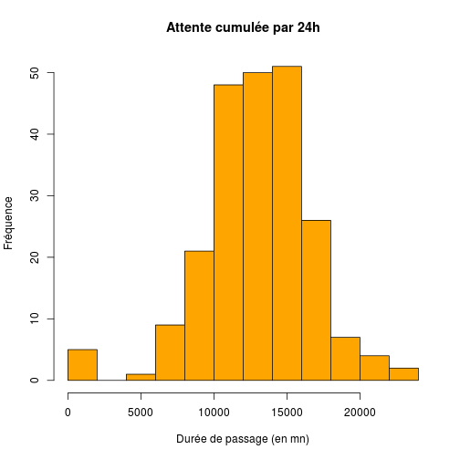

RPU 2013 Analyse
========================================================

```r
date()
```

```
## [1] "Sun Jun 23 22:48:32 2013"
```

source: RPU2013
Ce document exploite le fichier RData préparé à partir de la table *RPU__* de Sagec. Voir le document *RPU_2013_Preparation.Rmd* du dossier Resural.

Librairies nécessaires:
-----------------------

```r
library("gdata")
library("rgrs")
library("lubridate")
library("rattle")
library("epicalc")
library("zoo")
library("xts")
library("xtable")
```

Chargement des routines perso
-----------------------------

```r
source("mes_fonctions.R")
```

```
## Warning: impossible d'ouvrir le fichier 'mes_fonctions.R' : Aucun fichier
## ou dossier de ce type
```

```
## Error: impossible d'ouvrir la connexion
```


Lecture du fichier des données
---------------------------------------
On lit le fichier de travail créé:

```r
load("rpu2013.Rda")
attach(d1)
```

Les données sont enregistrées dans un data.frame appelé *d1*.

Analyse des données
===================

```r
n <- dim(d1)
print(n)
```

```
## [1] 105979     20
```

```r
names(d1)
```

```
##  [1] "id"            "CODE_POSTAL"   "COMMUNE"       "DESTINATION"  
##  [5] "DP"            "ENTREE"        "EXTRACT"       "FINESS"       
##  [9] "GRAVITE"       "MODE_ENTREE"   "MODE_SORTIE"   "MOTIF"        
## [13] "NAISSANCE"     "ORIENTATION"   "PROVENANCE"    "SEXE"         
## [17] "SORTIE"        "TRANSPORT"     "TRANSPORT_PEC" "AGE"
```

```r
str(d1)
```

```
## 'data.frame':	105979 obs. of  20 variables:
##  $ id           : chr  "2c9d83843bf5e01d013bf5e985d20225" "2c9d83843bf5e01d013bf5e986950226" "2c9d83843bf5e01d013bf5e987620227" "2c9d83843bf5e01d013bf5e988060228" ...
##  $ CODE_POSTAL  : Factor w/ 1277 levels "00000","00159",..: 706 706 706 706 706 701 818 706 706 706 ...
##  $ COMMUNE      : Factor w/ 2691 levels "00","01257 DRESDEN ALLEMAGNE",..: 2184 2184 2184 2184 741 2048 2033 2184 2184 2184 ...
##  $ DESTINATION  : Factor w/ 7 levels "NA","MCO","SSR",..: NA NA NA NA NA NA 2 NA 2 NA ...
##  $ DP           : chr  "R104" "J038" "S617" "M485" ...
##  $ ENTREE       : chr  "2013-01-01 00:04:00" "2013-01-01 00:16:00" "2013-01-01 00:26:00" "2013-01-01 00:32:00" ...
##  $ EXTRACT      : chr  "2013-01-01 05:37:00" "2013-01-01 05:37:00" "2013-01-01 05:37:00" "2013-01-01 05:37:00" ...
##  $ FINESS       : Factor w/ 11 levels "3Fr","Alk","Col",..: 10 10 10 10 10 10 10 10 10 10 ...
##  $ GRAVITE      : Factor w/ 7 levels "1","2","3","4",..: 2 2 3 2 2 1 3 2 2 2 ...
##  $ MODE_ENTREE  : Factor w/ 4 levels "NA","Mutation",..: 4 4 4 4 4 4 4 4 4 4 ...
##  $ MODE_SORTIE  : Factor w/ 5 levels "NA","Mutation",..: 4 4 4 4 4 4 2 4 2 4 ...
##  $ MOTIF        : chr  "GASTRO04" "DIVERS23" "TRAUMATO10" "TRAUMATO02" ...
##  $ NAISSANCE    : chr  "1960-04-08 00:00:00" "1986-03-05 00:00:00" "1971-12-22 00:00:00" "1927-04-27 00:00:00" ...
##  $ ORIENTATION  : Factor w/ 13 levels "CHIR","FUGUE",..: NA NA NA NA NA NA 5 NA 5 NA ...
##  $ PROVENANCE   : Factor w/ 7 levels "NA","MCO","SSR",..: 6 6 6 6 6 6 6 6 6 6 ...
##  $ SEXE         : Factor w/ 3 levels "F","I","M": 3 3 3 1 3 3 1 1 1 1 ...
##  $ SORTIE       : chr  "2013-01-01 02:38:00" "2013-01-01 00:38:00" "2013-01-01 02:07:00" "2013-01-01 01:52:00" ...
##  $ TRANSPORT    : Factor w/ 6 levels "AMBU","FO","HELI",..: 4 4 4 1 4 4 6 6 4 4 ...
##  $ TRANSPORT_PEC: Factor w/ 3 levels "AUCUN","MED",..: 1 1 1 3 1 1 2 2 1 1 ...
##  $ AGE          : num  52 26 41 85 39 9 79 50 46 18 ...
```

```r
summary(d1)
```

```
##       id             CODE_POSTAL           COMMUNE       DESTINATION   
##  Length:105979      68000  : 7771   MULHOUSE   :12389   MCO    :23062  
##  Class :character   68200  : 6557   STRASBOURG :11504   PSY    :  399  
##  Mode  :character   68100  : 5866   COLMAR     : 7768   SSR    :   17  
##                     67100  : 5129   HAGUENAU   : 2267   HMS    :    8  
##                     67000  : 3757   SELESTAT   : 2000   SLD    :    4  
##                     67600  : 3005   SAINT LOUIS: 1817   (Other):    0  
##                     (Other):73894   (Other)    :68234   NA's   :82489  
##       DP               ENTREE            EXTRACT              FINESS     
##  Length:105979      Length:105979      Length:105979      Col    :21841  
##  Class :character   Class :character   Class :character   Mul    :16790  
##  Mode  :character   Mode  :character   Mode  :character   Hus    :13095  
##                                                           Hag    :11627  
##                                                           Sel    : 9685  
##                                                           Dia    : 9605  
##                                                           (Other):23336  
##     GRAVITE         MODE_ENTREE       MODE_SORTIE       MOTIF          
##  2      :64451   NA       :    0   NA       :    0   Length:105979     
##  3      :12856   Mutation : 1282   Mutation :21950   Class :character  
##  1      :12797   Transfert: 1128   Transfert: 1523   Mode  :character  
##  4      : 1320   Domicile :91250   Domicile :66755                     
##  P      :  480   NA's     :12319   Décès    :    0                     
##  (Other):  284                     NA's     :15751                     
##  NA's   :13791                                                         
##   NAISSANCE          ORIENTATION      PROVENANCE    SEXE     
##  Length:105979      UHCD   :11496   PEA    :59352   F:50853  
##  Class :character   MED    : 5662   PEO    : 9254   I:    1  
##  Mode  :character   CHIR   : 2342   MCO    : 2574   M:55125  
##                     PSA    :  954   SSR    :   11            
##                     SI     :  445   PSY    :   11            
##                     (Other): 1481   (Other):    9            
##                     NA's   :83599   NA's   :34768            
##     SORTIE          TRANSPORT     TRANSPORT_PEC        AGE     
##  Length:105979      AMBU :16290   AUCUN  :75794   Min.   :  0  
##  Class :character   FO   :  508   MED    : 2120   1st Qu.: 18  
##  Mode  :character   HELI :   37   PARAMED: 2430   Median : 39  
##                     PERSO:58281   NA's   :25635   Mean   : 41  
##                     SMUR : 1027                   3rd Qu.: 63  
##                     VSAB : 9263                   Max.   :112  
##                     NA's :20573                   NA's   :5
```

Stuctures hospitaliéres participantes
=====================================
- *Alk* CH d' Alkirch
- *Col* CH Colmar (Pasteur + Parc)
- *Dia* Diaconat-Fonderie
- *2Fr* Clinique des trois frontières
- *Geb* CH de Guebwiller
- *Hag* CH de Haguenau
- *Hus* Hôpiaux Universitaires de Strasbourg
- *Mul* CH de Mulhouse
- *Odi* Clinique Ste Odile
- *Sel* CH de Sélestat
- *Wis* CH de Wissembourg
Hôpitaux ne transmettant pas de données:
- *Sav* CH de Saverne
- *Tha* CH de Thann
- *Ann* Clinique Ste Anne

```r
summary(d1$FINESS)
```

```
##   3Fr   Alk   Col   Dia   Geb   Hag   Hus   Mul   Odi   Sel   Wis 
##  5212   891 21841  9605  4807 11627 13095 16790  8415  9685  4011
```

```r
a <- table(d1$FINESS)
round(prop.table(a) * 100, digits = 2)
```

```
## 
##   3Fr   Alk   Col   Dia   Geb   Hag   Hus   Mul   Odi   Sel   Wis 
##  4.92  0.84 20.61  9.06  4.54 10.97 12.36 15.84  7.94  9.14  3.78
```

Passages déclarés au serveur régional:

   ALK  | COL  | CTF |  DIA |  GEB |  HUS |  MUL |  ODI |  SAV |  SEL  | TAN |  WIS 
   ----|-------|-----|------|------|------|-------|------|-----|-------|-----|-----
  4577 |21353 | 5475 | 3136  |4926 |41561 |20160 | 8417 | 8961 | 9670 | 4840 | 3052
  
  First Header  | Second Header
------------- | -------------
Content Cell  | Content Cell
Content Cell  | Content Cell

Projection sur l'année:

```r
summary(d1$FINESS) * 3
```

```
##   3Fr   Alk   Col   Dia   Geb   Hag   Hus   Mul   Odi   Sel   Wis 
## 15636  2673 65523 28815 14421 34881 39285 50370 25245 29055 12033
```

```r
sum(summary(d1$FINESS) * 3)
```

```
## [1] 317937
```

```r

t1 <- table(d1$FINESS)
t2 <- table(d1$FINESS) * 3
t3 <- rbind(t1, t2)
rownames(t3) <- c("1er Quadrimestre", "Projection 2013")
xtable(t(t3))
```

```
## % latex table generated in R 2.15.1 by xtable 1.7-1 package
## % Sun Jun 23 22:48:41 2013
## \begin{table}[ht]
## \centering
## \begin{tabular}{rrr}
##   \hline
##  & 1er Quadrimestre & Projection 2013 \\ 
##   \hline
## 3Fr & 5212.00 & 15636.00 \\ 
##   Alk & 891.00 & 2673.00 \\ 
##   Col & 21841.00 & 65523.00 \\ 
##   Dia & 9605.00 & 28815.00 \\ 
##   Geb & 4807.00 & 14421.00 \\ 
##   Hag & 11627.00 & 34881.00 \\ 
##   Hus & 13095.00 & 39285.00 \\ 
##   Mul & 16790.00 & 50370.00 \\ 
##   Odi & 8415.00 & 25245.00 \\ 
##   Sel & 9685.00 & 29055.00 \\ 
##   Wis & 4011.00 & 12033.00 \\ 
##    \hline
## \end{tabular}
## \end{table}
```

### Origine temporelle des données:

```r
b <- tapply(as.Date(d1$ENTREE), d1$FINESS, min)
c <- as.Date(b, origin = "1970-01-01")
cbind(as.character(sort(c)))
```

```
##     [,1]        
## 3Fr "2013-01-01"
## Col "2013-01-01"
## Dia "2013-01-01"
## Geb "2013-01-01"
## Hag "2013-01-01"
## Hus "2013-01-01"
## Odi "2013-01-01"
## Sel "2013-01-01"
## Wis "2013-01-01"
## Mul "2013-01-07"
## Alk "2013-04-01"
```

Exhaustivité des données
------------------------
Il faut tranformer les valeurs NULL en NA pour pouvoir les comptabiliser. Les valeurs NULL apparaissent pour les factors: DP, MOTIF, TRANSPORT, ORIENTATION,GRAVITE, SORTIE. Il faut les transformer en character pour leur attriber la valeur NA au lieu de NULL:

```r
a <- as.character(d1$DP)
a[a == "NULL"] <- NA
sum(is.na(a))
```

```
## [1] 32760
```

```r
mean(is.na(a))
```

```
## [1] 0.3091
```

sum(is.na(a)) retourne le nombre de lignes concernées et *mean(is.na(a))* donne directement le pourcentage de valeurs nulles (R in action pp 356)

```r
d1$DP <- a

a <- as.character(d1$MOTIF)
a[a == "NULL"] <- NA
d1$MOTIF <- a

a <- as.character(d1$TRANSPORT)
a[a == "NULL"] <- NA
d1$TRANSPORT <- a

a <- as.character(d1$ORIENTATION)
a[a == "NULL"] <- NA
d1$ORIENTATION <- a

a <- as.character(d1$GRAVITE)
a[a == "NULL"] <- NA
d1$GRAVITE <- a

a <- as.character(d1$SORTIE)
a[a == "NULL"] <- NA
d1$SORTIE <- a

a <- as.character(d1$ENTREE)
a[a == "NULL"] <- NA
d1$ENTREE <- a
```

Les 2 lignes qui suivent comptent les NA

```r
a <- is.na(d1)
b <- apply(a, 2, mean)
a <- cbind(sort(round(b * 100, 2)))
colnames(a) <- "%"
a
```

```
##                   %
## id             0.00
## CODE_POSTAL    0.00
## COMMUNE        0.00
## ENTREE         0.00
## EXTRACT        0.00
## FINESS         0.00
## NAISSANCE      0.00
## SEXE           0.00
## AGE            0.00
## SORTIE         9.02
## MODE_ENTREE   11.62
## GRAVITE       13.01
## MODE_SORTIE   14.86
## TRANSPORT     19.41
## TRANSPORT_PEC 24.19
## DP            30.91
## PROVENANCE    32.81
## MOTIF         34.87
## DESTINATION   77.84
## ORIENTATION   78.88
```

MODE_SORTIE (hospitalisation ou retour à domicile): dans 14.86% des cas on ne sait pas ce que devient le patient. Pour sélectionner les hospitalisés et éliminer les NA et les valeurs nulles:

```r
a <- d1$MODE_SORTIE[MODE_SORTIE == "Mutation" | MODE_SORTIE == "Transfert"]
a <- na.omit(a)
a <- as.factor(as.character(a))
summary(a)
```

```
##  Mutation Transfert 
##     21950      1523
```

```r
round(prop.table(table(a)) * 100, 2)
```

```
## a
##  Mutation Transfert 
##     93.51      6.49
```

```r

a <- d1[MODE_SORTIE == "Mutation" | MODE_SORTIE == "Transfert", ]
a <- na.omit(a)
summary(a$DESTINATION)
```

```
##   NA  MCO  SSR  SLD  PSY  HAD  HMS 
##    0 8259    2    1  128    0    0
```

```r
summary(as.factor(a$ORIENTATION))
```

```
## CHIR  HDT   HO  MED OBST  REA   SC   SI UHCD 
## 1718   14    9 3969   21  216  299  308 1836
```

```r
round(prop.table(table(as.factor(a$ORIENTATION))) * 100, 2)
```

```
## 
##  CHIR   HDT    HO   MED  OBST   REA    SC    SI  UHCD 
## 20.48  0.17  0.11 47.31  0.25  2.57  3.56  3.67 21.88
```

```r

tab1(as.factor(a$ORIENTATION), sort.group = "decreasing", horiz = TRUE, cex.names = 0.8, 
    xlab = "", main = "Orientation des patients hospitalisés")
```

 

```
## as.factor(a$ORIENTATION) :  
##         Frequency Percent Cum. percent
## MED          3969    47.3         47.3
## UHCD         1836    21.9         69.2
## CHIR         1718    20.5         89.7
## SI            308     3.7         93.3
## SC            299     3.6         96.9
## REA           216     2.6         99.5
## OBST           21     0.3         99.7
## HDT            14     0.2         99.9
## HO              9     0.1        100.0
##   Total      8390   100.0        100.0
```

```r

a <- d1[MODE_SORTIE == "Domicile", ]
summary(as.factor(a$ORIENTATION))
```

```
##  CHIR FUGUE   HDT   MED   PSA   REA   REO  SCAM    SI  UHCD  NA's 
##    45    72     4    24   933     2   413   150     9    71 80783
```

```r
t <- table(as.factor(a$ORIENTATION))
round(prop.table(t) * 100, 2)
```

```
## 
##  CHIR FUGUE   HDT   MED   PSA   REA   REO  SCAM    SI  UHCD 
##  2.61  4.18  0.23  1.39 54.15  0.12 23.97  8.71  0.52  4.12
```

```r
tab1(as.factor(a$ORIENTATION), sort.group = "decreasing", horiz = TRUE, cex.names = 0.8, 
    xlab = "", main = "Orientation des patients non hospitalisés")
```

 

```
## as.factor(a$ORIENTATION) :  
##         Frequency   %(NA+)   %(NA-)
## NA's        80783     97.9      0.0
## PSA           933      1.1     54.1
## REO           413      0.5     24.0
## SCAM          150      0.2      8.7
## FUGUE          72      0.1      4.2
## UHCD           71      0.1      4.1
## CHIR           45      0.1      2.6
## MED            24      0.0      1.4
## SI              9      0.0      0.5
## HDT             4      0.0      0.2
## REA             2      0.0      0.1
##   Total     82506    100.0    100.0
```

La table ci-dessus liste le devenir des patients non hospitalisés. On note des incohérences: REA, HDT, SI, Med, CHIR, UHCD. La ligne *Missing* correspond aux patients rentrés sur avis médical.

Etude des patients hospitalisés
--------------------------------
La rubrique mode de sortie peut se décomposer en 3 éléments
- *hosp*: patient hospitalisés, cad gardé en milieu de soins par *MUTATION* ou *TRANSFERT*
- *dom*: retour à domicile ou équivalent
- *dcd*: patients décédés aux urgences
Dans l'échantillon *d1* c'est la colonne *MODE_SORTIE* qui renseigne sur le devenir du patient à la sortie des urgences:


```
## [1] "d1 compte  105979  lignes"
```

Il y a deux façons de former des sous ensembles avec R:
- sélectionner en utilisant la notation vectorielle: hosp<-d1[d1$MODE_SORTIE=="Mutation" | d1$MODE_SORTIE=="Transfert",]
- sélectionner avec la méthode **subset**: b<-subset(d1,MODE_SORTIE=="Mutation" | MODE_SORTIE=="Transfert")

La première méthode sélectionne toutes les lignes correspondant aux critères ET celles où le critère vaut *NA*. ie, la méthode 1 retourne un data frame de 39224 lignes et 20 colonnes.

La méthode *subset* ne tient pas compte des lignes où le critère vaut NA. Dans l'exemple, retourne un dataframe de 23473 lignes et 20 colonnes.


```r
hosp <- d1[d1$MODE_SORTIE == "Mutation" | d1$MODE_SORTIE == "Transfert", ]
dom <- d1[d1$MODE_SORTIE == "Domicile", ]
dcd <- d1[d1$MODE_SORTIE == "Deces", ]
nbna <- nrow(hosp) + nrow(dom) + nrow(dcd) - nrow(d1)
pna <- round(nbna * 100/nrow(d1), 2)

print(paste("hosp = ", nrow(hosp), " lignes"))
```

```
## [1] "hosp =  39224  lignes"
```

```r
print(paste("dom = ", nrow(dom), " lignes"))
```

```
## [1] "dom =  82506  lignes"
```

```r
print(paste("dcd = ", nrow(dcd), " lignes"))
```

```
## [1] "dcd =  15751  lignes"
```

```r

print(paste("La différence du nombre de lignes entre d1 et hosp, dom et dcd indique le nmbre de lignes correspondant à NA et qui sont incluses dans le décompte des lignes de chaque sous ensemble: ", 
    nbna, "correspondant aux mode de sortie non renseignés soit ", pna, " %"))
```

```
## [1] "La différence du nombre de lignes entre d1 et hosp, dom et dcd indique le nmbre de lignes correspondant à NA et qui sont incluses dans le décompte des lignes de chaque sous ensemble:  31502 correspondant aux mode de sortie non renseignés soit  29.72  %"
```

Avec *subset* on élimine ces lignes parasites:

```r
a <- subset(d1, MODE_SORTIE == "Domicile")
b <- subset(d1, MODE_SORTIE == "Mutation" | MODE_SORTIE == "Transfert")
nrow(a)
```

```
## [1] 66755
```

```r
nrow(b)
```

```
## [1] 23473
```

```r
nrow(d1) - nrow(a) - nrow(b)
```

```
## [1] 15751
```

```r

print("O")
```

```
## [1] "O"
```

```r
t <- table(b$ORIENTATION, b$FINESS, useNA = "ifany")
m1 <- margin.table(t, 1)
t2 <- cbind(t, m1)
m2 <- margin.table(t2, 2)
rbind(t2, m2)
```

```
##      3Fr Alk  Col Dia Geb  Hag  Hus  Mul Odi  Sel Wis    m1
## CHIR   0   0  995   7   0  372    0  402  52  426   4  2258
## HDT    0   0   19   0   1    0    0    1   0    0   2    23
## HO     0   0    4   0   0    0    0    2   0    0   6    12
## MED    0   0 2278   1   0  768  185  779  22 1513  12  5558
## OBST   0   0   16   0   0   16    0    0   1    5   0    38
## PSA    0   0    0   1   0    0    0    0   0    0   0     1
## REA    0   0  120   0   0   65    0   71   0   35   2   293
## REO    2   1    0   4   0    0    0    0   1    0   0     8
## SC     0   0  140   0   0   36    0  233   0    0   7   416
## SI     0   0  223   0   0  104    0   85   2    2   4   420
## UHCD   0   0 1658   1   0 1588 7020  219   0  134  14 10634
## <NA> 125 148  160 781   6  674    0  677 315    0 926  3812
## m2   127 149 5613 795   7 3623 7205 2469 393 2115 977 23473
```

```r

summary(a$MODE_SORTIE)
```

```
##        NA  Mutation Transfert  Domicile     Décès 
##         0         0         0     66755         0
```

```r
summary(b$MODE_SORTIE)
```

```
##        NA  Mutation Transfert  Domicile     Décès 
##         0     21950      1523         0         0
```

- nb total de lignes = 105979
- total hospitalisés = 21950 +  1523
- total non hospitalisés = 66755 
- non réponses = 105979-90228 = 15751

```r
summary(b$DESTINATION)
```

```
##    NA   MCO   SSR   SLD   PSY   HAD   HMS  NA's 
##     0 22935    17     4   395     0     0   122
```

```r
summary(b$ORIENTATION)
```

```
##    Length     Class      Mode 
##     23473 character character
```

```r
summary(a$DESTINATION)
```

```
##    NA   MCO   SSR   SLD   PSY   HAD   HMS  NA's 
##     0   118     0     0     0     0     8 66629
```

```r
summary(a$ORIENTATION)
```

```
##    Length     Class      Mode 
##     66755 character character
```


on forme un dataframe *hosp* des patients hospitalisés par mutation ou transfert:

```r
hosp <- d1[d1$MODE_SORTIE == "Mutation" | d1$MODE_SORTIE == "Transfert", ]
summary(d1$MODE_SORTIE)
```

```
##        NA  Mutation Transfert  Domicile     Décès      NA's 
##         0     21950      1523     66755         0     15751
```

```r
prop.table(summary(d1$MODE_SORTIE)) * 100
```

```
##        NA  Mutation Transfert  Domicile     Décès      NA's 
##     0.000    20.712     1.437    62.989     0.000    14.862
```

#### Destinations

```r
summary(hosp$DESTINATION)
```

```
##    NA   MCO   SSR   SLD   PSY   HAD   HMS  NA's 
##     0 22935    17     4   395     0     0 15873
```

```r
prop.table(summary(hosp$DESTINATION))
```

```
##        NA       MCO       SSR       SLD       PSY       HAD       HMS 
## 0.0000000 0.5847185 0.0004334 0.0001020 0.0100704 0.0000000 0.0000000 
##      NA's 
## 0.4046757
```

```r
# sans les NA
table(hosp$DESTINATION)
```

```
## 
##    NA   MCO   SSR   SLD   PSY   HAD   HMS 
##     0 22935    17     4   395     0     0
```

```r
prop.table(table(hosp$DESTINATION)) * 100
```

```
## 
##       NA      MCO      SSR      SLD      PSY      HAD      HMS 
##  0.00000 98.21849  0.07280  0.01713  1.69158  0.00000  0.00000
```


#### Orientation des hospitalisés MCO (avec et sans les NA):

```r
a <- as.factor(hosp$ORIENTATION[hosp$DESTINATION == "MCO"])
a <- summary(a)
a
```

```
##  CHIR   HDT    HO   MED  OBST   PSA   REA   REO    SC    SI  UHCD  NA's 
##  2208     1     6  5464    38     1   290     8   414   420 10619 19339
```

```r
round(prop.table(a) * 100, 2)
```

```
##  CHIR   HDT    HO   MED  OBST   PSA   REA   REO    SC    SI  UHCD  NA's 
##  5.69  0.00  0.02 14.08  0.10  0.00  0.75  0.02  1.07  1.08 27.36 49.83
```

```r

a <- table(hosp$ORIENTATION[hosp$DESTINATION == "MCO"])
a
```

```
## 
##  CHIR   HDT    HO   MED  OBST   PSA   REA   REO    SC    SI  UHCD 
##  2208     1     6  5464    38     1   290     8   414   420 10619
```

```r
a <- prop.table(a) * 100
a
```

```
## 
##      CHIR       HDT        HO       MED      OBST       PSA       REA 
## 11.341106  0.005136  0.030818 28.065129  0.195182  0.005136  1.489547 
##       REO        SC        SI      UHCD 
##  0.041091  2.126457  2.157276 54.543120
```

```r
sce_chauds <- a["REA"] + a["SI"] + a["SC"]
print(paste("Services chauds: ", round(sce_chauds, 2), " %"))
```

```
## [1] "Services chauds:  5.77  %"
```

```r
mco <- a["CHIR"] + a["MED"] + a["OBST"]
print(paste("MCO: ", round(mco, 2), " %"))
```

```
## [1] "MCO:  39.6  %"
```

```r
print(paste("UHTCD: ", round(a["UHCD"], 2), " %"))
```

```
## [1] "UHTCD:  54.54  %"
```

```r
print(paste("Atypiques: ", round(a["FUGUE"] + a["PSA"] + a["SCAM"] + a["REO"], 
    2), " %"))
```

```
## [1] "Atypiques:  NA  %"
```

```r
print(paste("HDT-HO: ", round(a["HDT"] + a["HO"], 2), " %"))
```

```
## [1] "HDT-HO:  0.04  %"
```

Quelques erreurs de codage:
- Fugue, HDT, HO, PSA,REO, SCAM devraient être nuls
dom<-d1
#### Orientation des patients hospitalisés en Psychiatrie:

```r
a <- summary(hosp$ORIENTATION[hosp$DESTINATION == "PSY"])
a
```

```
##    Length     Class      Mode 
##     16268 character character
```

```r
a <- table(hosp$ORIENTATION[hosp$DESTINATION == "PSY"])
a
```

```
## 
## CHIR  HDT   HO  MED  REA   SC UHCD 
##   50   22    6   92    3    2    5
```

```r

a <- d1[d1$DESTINATION == "PSY", ]
a$DESTINATION <- as.character(a$DESTINATION)
a <- a[!is.na(a$DESTINATION), ]
summary(a$ORIENTATION)
```

```
##    Length     Class      Mode 
##       399 character character
```

```r
round(prop.table(summary(a$ORIENTATION)) * 100, 3)
```

```
## Error: 'type' (character) de l'argument incorrect
```

#### Analyse de l'ensemble de la rubrique **ORIENTATION**

```r
d1$ORIENTATION <- as.factor(d1$ORIENTATION)
a <- summary(d1$ORIENTATION)
a
```

```
##  CHIR FUGUE   HDT    HO   MED  OBST   PSA   REA   REO    SC  SCAM    SI 
##  2342    72    39    12  5662    38   954   321   422   427   150   445 
##  UHCD  NA's 
## 11496 83599
```

```r
a <- round(prop.table(a) * 100, 4)

sce_chauds <- a["REA"] + a["SI"] + a["SC"]
print(paste("Services chauds: ", round(sce_chauds, 2), " %"))
```

```
## [1] "Services chauds:  1.13  %"
```

```r
mco <- a["CHIR"] + a["MED"] + a["OBST"]
print(paste("MCO: ", round(mco, 2), " %"))
```

```
## [1] "MCO:  7.59  %"
```

```r
uhcd <- a["UHCD"]
print(paste("UHTCD: ", round(uhcd, 2), " %"))
```

```
## [1] "UHTCD:  10.85  %"
```

```r
atypique <- a["FUGUE"] + a["PSA"] + a["SCAM"] + a["REO"]
print(paste("Atypiques: ", round(atypique, 2), " %"))
```

```
## [1] "Atypiques:  1.51  %"
```

```r
psy <- a["HDT"] + a["HO"]
print(paste("HDT-HO: ", round(psy, 2), " %"))
```

```
## [1] "HDT-HO:  0.05  %"
```

```r
nr <- a["NA's"]

als <- c(mco, uhcd, nr, atypique, sce_chauds, psy)
lor <- c(49.39, 19.12, 17.25, 8.92, 5.24, 0.07)

r <- rbind(als, lor)
barplot(r, las = 2, beside = T, legend = T, ylab = "% des RPU", xlab = "", sub = "(Ref. ORULOR 2011 p.50)", 
    names.arg = c("MCO", "UHCD", "NR", "Atypiques", "REA", "PSY"), main = "Orientation des patients hospitalisés", 
    cex.sub = 0.6)
```

 

en fonction de l'établissement (NOTE: utilisation de useNA="ifany"):

```r
# analyse brute
t <- table(d1$ORIENTATION, d1$FINESS)
t
```

```
##        
##          3Fr  Alk  Col  Dia  Geb  Hag  Hus  Mul  Odi  Sel  Wis
##   CHIR     2    0  996   22    1  372    0  433   85  426    5
##   FUGUE    0    0   35    4    0   12    0    0   10    1   10
##   HDT      0    0   20    0    1    0    0   16    0    0    2
##   HO       0    0    4    0    0    0    0    2    0    0    6
##   MED      0    0 2287    2    2  768  185  851   33 1520   14
##   OBST     0    0   16    0    0   16    0    0    1    5    0
##   PSA      1   15  316  370    0  145    0   63   10    2   32
##   REA      0    0  120    0    0   65    0   99    0   35    2
##   REO     18    3  359   39    0    0    0    0    2    0    1
##   SC       0    0  140    0    0   36    0  242    0    0    9
##   SCAM     1    0   66    5    1   47    0    4   12    0   14
##   SI       0    0  223    2    0  104    0  100    3    9    4
##   UHCD     0    0 1660    3    0 1588 7412  680    0  134   19
```

```r
# analyse brute incluant les NA
t <- table(d1$ORIENTATION, d1$FINESS, useNA = "ifany")
t
```

```
##        
##           3Fr   Alk   Col   Dia   Geb   Hag   Hus   Mul   Odi   Sel   Wis
##   CHIR      2     0   996    22     1   372     0   433    85   426     5
##   FUGUE     0     0    35     4     0    12     0     0    10     1    10
##   HDT       0     0    20     0     1     0     0    16     0     0     2
##   HO        0     0     4     0     0     0     0     2     0     0     6
##   MED       0     0  2287     2     2   768   185   851    33  1520    14
##   OBST      0     0    16     0     0    16     0     0     1     5     0
##   PSA       1    15   316   370     0   145     0    63    10     2    32
##   REA       0     0   120     0     0    65     0    99     0    35     2
##   REO      18     3   359    39     0     0     0     0     2     0     1
##   SC        0     0   140     0     0    36     0   242     0     0     9
##   SCAM      1     0    66     5     1    47     0     4    12     0    14
##   SI        0     0   223     2     0   104     0   100     3     9     4
##   UHCD      0     0  1660     3     0  1588  7412   680     0   134    19
##   <NA>   5190   873 15599  9158  4802  8474  5498 14300  8259  7553  3893
```

```r
# cette analyse ne permet pas de séparer les vraies non réponses des
# retours à domicile
hosp <- d1[d1$MODE_SORTIE == "Mutation" | d1$MODE_SORTIE == "Transfert", ]
t <- table(hosp$ORIENTATION, hosp$FINESS, useNA = "ifany")
t
```

```
##        
##           3Fr   Alk   Col   Dia   Geb   Hag   Hus   Mul   Odi   Sel   Wis
##   CHIR      0     0   995     7     0   372     0   402    52   426     4
##   FUGUE     0     0     0     0     0     0     0     0     0     0     0
##   HDT       0     0    19     0     1     0     0     1     0     0     2
##   HO        0     0     4     0     0     0     0     2     0     0     6
##   MED       0     0  2278     1     0   768   185   779    22  1513    12
##   OBST      0     0    16     0     0    16     0     0     1     5     0
##   PSA       0     0     0     1     0     0     0     0     0     0     0
##   REA       0     0   120     0     0    65     0    71     0    35     2
##   REO       2     1     0     4     0     0     0     0     1     0     0
##   SC        0     0   140     0     0    36     0   233     0     0     7
##   SCAM      0     0     0     0     0     0     0     0     0     0     0
##   SI        0     0   223     0     0   104     0    85     2     2     4
##   UHCD      0     0  1658     1     0  1588  7020   219     0   134    14
##   <NA>    125   148   160   781     6   674     0   677   315     0   926
##        
##          <NA>
##   CHIR      0
##   FUGUE     0
##   HDT       0
##   HO        0
##   MED       0
##   OBST      0
##   PSA       0
##   REA       0
##   REO       0
##   SC        0
##   SCAM      0
##   SI        0
##   UHCD      0
##   <NA>  15751
```

```r
# non hospitalisés
dom <- d1[d1$MODE_SORTIE == "Domicile", ]
```


Adultes
-------
Répartition de la population adulte (18 ans et plus)

```r
a <- d1[AGE > 17, c("AGE", "FINESS")]
boxplot(a$AGE ~ a$FINESS, main = "Patients de 18 ans et plus", col = "slategray1")
```

 


Mineurs
-------

```r
a <- d1$AGE[d1$AGE <= 18]
# a
summary(a)
```

```
##    Min. 1st Qu.  Median    Mean 3rd Qu.    Max.    NA's 
##    0.00    2.00    7.00    7.77   13.00   18.00       5
```

```r
hist(a, main = "Moins de 18 ans", xlab = "Age (années)", col = "yellow")
```

 

```r

a <- d1$AGE[FINESS == "Col" & d1$AGE < 18]
# a
a <- d1$AGE[FINESS == "Hag" & d1$AGE < 18]
# a
a <- d1$AGE[FINESS == "Mul" & d1$AGE < 18]
# a
table(FINESS)
```

```
## FINESS
##   3Fr   Alk   Col   Dia   Geb   Hag   Hus   Mul   Odi   Sel   Wis 
##  5212   891 21841  9605  4807 11627 13095 16790  8415  9685  4011
```

Durée d'attente
===============
On utilise les données de Sélestat comme étude pilote:

```r
sel <- d1[d1$FINESS == "Sel", ]
e <- ymd_hms(sel$ENTREE)
s <- ymd_hms(sel$SORTIE)
q <- s - e
sel$attente <- q
summary(as.numeric(q))
```

```
##    Min. 1st Qu.  Median    Mean 3rd Qu.    Max.    NA's 
##       1      85     137     162     217     841     237
```

Attente cumulée par jour (pour chaque jour, on cumule les durées d'attente) en mn:

```r
q <- tapply(sel$attente, as.Date(sel$ENTREE), sum, na.rm = TRUE)
summary(q)
```

```
##    Min. 1st Qu.  Median    Mean 3rd Qu.    Max. 
##     392   10500   12800   12700   14900   22500
```

```r
hist(q, main = "Attente cumulée par 24h", xlab = "Durée de passage (en mn)", 
    ylab = "Fréquence", col = "orange")
```

 

```r

z <- zoo(q, unique(as.Date(sel$ENTREE)))
plot(z, main = "Attente cumulée par 24h", xlab = "Sélestat 2013")
```

 

```r
plot(xts(z))
```

 

```r
plot(rollmean(z, 7), main = "Attente cumulée par 24h (moyenne lissée)")
```

 

```r
plot(rollmean(xts(z), 7), main = "Attente cumulée (lissée) par 24h", xlab = "Durée de passage (en mn)", 
    ylab = "Fréquence")
```

 

Ensemble des SAU
----------------
attente en mn:

```r
e <- ymd_hms(d1$ENTREE)
s <- ymd_hms(d1$SORTIE)
q <- s - e
d1$passage <- q/60

tapply(d1$passage, d1$FINESS, mean, na.rm = TRUE)
```

```
##    3Fr    Alk    Col    Dia    Geb    Hag    Hus    Mul    Odi    Sel 
## 139.19 146.60 171.62 170.58  80.39 377.98  73.93 179.18 100.30 161.90 
##    Wis 
## 146.62
```

```r
tapply(d1$passage, d1$FINESS, sd, na.rm = TRUE)
```

```
##   3Fr   Alk   Col   Dia   Geb   Hag   Hus   Mul   Odi   Sel   Wis 
## 141.7 179.6 179.8 149.2 133.4 359.0 271.7 136.2 109.5 104.1 185.5
```

```r
tapply(d1$passage, d1$FINESS, median, na.rm = TRUE)
```

```
## 3Fr Alk Col Dia Geb Hag Hus Mul Odi Sel Wis 
## 114 101 121 141  51 262   1 144  81 137  97
```

```r
boxplot(as.numeric(d1$passage) ~ d1$FINESS, col = "pink")
```

 

attente de moins d'une journée:

```r
h24 <- d1[as.numeric(d1$passage) < 1000, c("passage", "FINESS")]
boxplot(as.numeric(h24$passage) ~ h24$FINESS, col = "pink", main = "Durée moyenne de passage (pour t<24h)", 
    ylab = "Temps en minutes", xlab = "SAU - 2013")
```

 

```r
boxplot(as.numeric(h24$passage) ~ h24$FINESS, col = "yellow", range = 0, notch = TRUE, 
    border = "blue", main = "Durée moyenne de passage", ylab = "Temps en minutes", 
    xlab = "SAU - 2013")
```

 

Maladies infectieuses
=====================
Codes CIM 10:
- bronchiolite: J11
- Grippe: J11, J10, J09
- Gastroenterite: A09

Regroupement | Code CIM 10 | Description
------------ | ------------ | -----------
Hyperthermies |T67 | Effets de la chaleur et de la lumière
Hyperthermies | X30 |Exposition à une chaleur naturelle excessive
Déshydratations |E86 |Hypovolémie
Hyponatrémies | E871 | Hypo-osmolarité et hyponatrémie
Malaises | R42 | Etourdissements et éblouissements
Malaises |R53| Malaise et fatigue
Malaises | R55| Syncope et collapsus
Asthme|J45 | Asthme
Asthme |J46 | Etat de mal asthmatique
Piqûres arthropodes ou autres |T63 |Effet toxique d’un contact avec un animal venimeux
Piqûres arthropodes ou autres |W57 |Morsure ou piqûre non venimeuse d’insectes et arthropodes
Piqûres arthropodes ou autres |X20→X29 | Contact avec des animaux ou des plantes venimeuses

Pendant toute la durée du Plan Canicule, du 1er juin au 31 août.


on veut mettre 3 graphiques sur le même dessin

```r
par(mfrow = c(3, 1))
```


gastro
------

```r
gastro <- d1[substr(d1$DP, 1, 3) == "A09", c("DP", "ENTREE")]
g <- gastro[complete.cases(gastro), ]
g$date <- as.Date(g$ENTREE)
hist(g$date, breaks = 18, freq = TRUE, col = "slategray1", main = "2013 - Gastroentérites", 
    xlab = "")
```

 

```r
g$date2 <- ymd_hms(g$ENTREE)
wg <- week(g$date2)
barplot(summary(as.factor(wg)))
```

 

bronchiolite
------------

```r
bronchio <- d1[substr(d1$DP, 1, 3) == "J21", c("DP", "ENTREE")]
bronchio <- bronchio[complete.cases(bronchio), ]
bronchio$date <- as.Date(bronchio$ENTREE)
hist(bronchio$date, breaks = 18, freq = TRUE, col = "slategray1", main = "2013 - Bronchiolites", 
    xlab = "")
```

 

Grippe
------

```r
grippe <- d1[substr(d1$DP, 1, 3) == "J11" | substr(d1$DP, 1, 3) == "J10" | substr(d1$DP, 
    1, 3) == "J09", c("DP", "ENTREE")]
grippe <- grippe[complete.cases(grippe), ]
grippe$date <- as.Date(grippe$ENTREE)
hist(grippe$date, breaks = 18, freq = TRUE, col = "slategray1", main = "2013 - Syndromes grippaux", 
    xlab = "")
```

 

```r

par(mfrow = c(1, 1))
```

malaises
--------

```r
malaise <- d1[substr(d1$DP, 1, 3) == "R55", c("DP", "ENTREE")]
malaise <- malaise[complete.cases(malaise), ]
malaise$date <- as.Date(malaise$ENTREE)
hist(malaise$date, breaks = 18, freq = TRUE, col = "slategray1")
```

 

malaise selon INVS (canicule):

```r
malaise <- d1[substr(d1$DP, 1, 3) == "R55" | substr(d1$DP, 1, 3) == "R53" | 
    substr(d1$DP, 1, 3) == "R42", c("DP", "ENTREE")]
malaise <- malaise[complete.cases(malaise), ]
malaise$date <- as.Date(malaise$ENTREE)
hist(malaise$date, breaks = 18, freq = TRUE, col = "slategray1", main = "Malaises (INVS)")
```

 

```r
plot(as.factor(malaise$date), col = "slategray1", las = 1, main = "Malaises (INVS)")
```

 

AVC
----
code SIM10: I60 à I64
**complete.cases** permet de supprimer les enregistrements vides

```r
avc <- d1[substr(d1$DP, 1, 3) >= "I60" & substr(d1$DP, 1, 3) <= "I64", c("DP", 
    "ENTREE", "FINESS", "AGE", "SEXE")]
avc <- avc[complete.cases(avc), ]
nrow(avc)
```

```
## [1] 635
```

```r
summary(avc$FINESS)
```

```
## 3Fr Alk Col Dia Geb Hag Hus Mul Odi Sel Wis 
##  19   2 141   0   4 162  76 146   1  66  18
```

```r
summary(avc$AGE)
```

```
##    Min. 1st Qu.  Median    Mean 3rd Qu.    Max. 
##     7.0    62.0    76.0    71.8    83.0    96.0
```

```r
summary(avc$SEXE)
```

```
##   F   I   M 
## 323   0 312
```

Le SAU des HUS reçoit peu d' AVC alors que c'est la meilleure filière. Les résultats sont faussés par l'UNV.

Douleur thoracique
------------------
code SIM10: I20 à I25

```r
idm <- d1[substr(d1$DP, 1, 3) >= "I20" & substr(d1$DP, 1, 3) <= "I25", c("DP", 
    "ENTREE", "FINESS", "AGE", "SEXE")]
idm <- idm[complete.cases(idm), ]
nrow(idm)
```

```
## [1] 320
```

```r
summary(idm$FINESS)
```

```
## 3Fr Alk Col Dia Geb Hag Hus Mul Odi Sel Wis 
##  21   2  42   0  14  45 103  42   0  34  17
```

```r
summary(idm$AGE)
```

```
##    Min. 1st Qu.  Median    Mean 3rd Qu.    Max. 
##     2.0    54.0    68.5    66.3    81.0    98.0
```

```r
summary(idm$SEXE)
```

```
##   F   I   M 
## 123   0 197
```

Lésions traumatiques
--------------------
codes CIM10 S00–T98

```r
trauma <- d1[substr(d1$DP, 1, 3) >= "S00" & substr(d1$DP, 1, 3) <= "T98", c("DP", 
    "ENTREE", "FINESS", "AGE", "SEXE")]
trauma <- trauma[complete.cases(trauma), ]
nrow(trauma)
```

```
## [1] 26364
```

```r
summary(trauma$FINESS)
```

```
##  3Fr  Alk  Col  Dia  Geb  Hag  Hus  Mul  Odi  Sel  Wis 
## 1685  339 7474    0 2308 3630  488 3264 1621 4258 1297
```

```r
summary(trauma$AGE)
```

```
##    Min. 1st Qu.  Median    Mean 3rd Qu.    Max. 
##     0.0    13.0    28.0    33.9    51.0   106.0
```

```r
summary(trauma$SEXE)
```

```
##     F     I     M 
## 11730     1 14633
```


