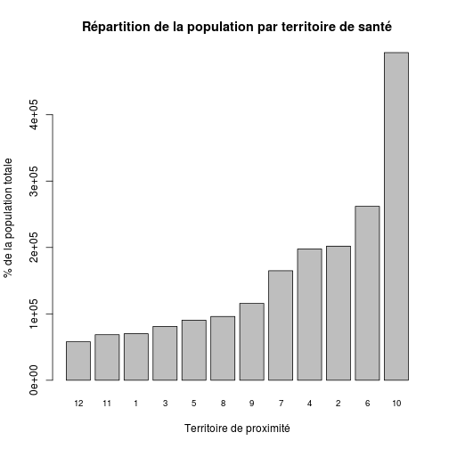
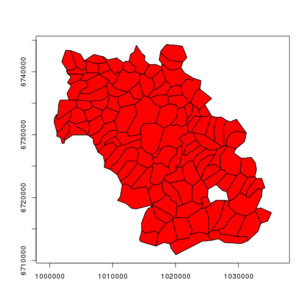
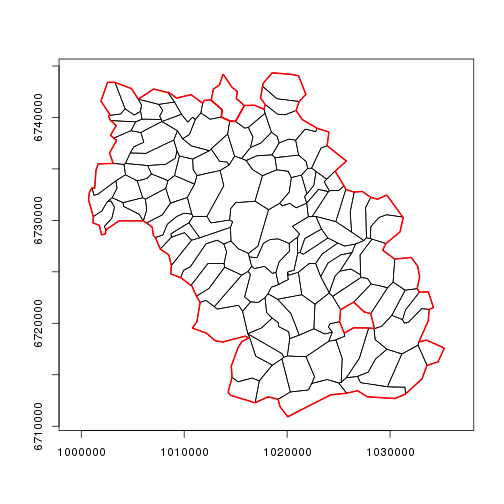
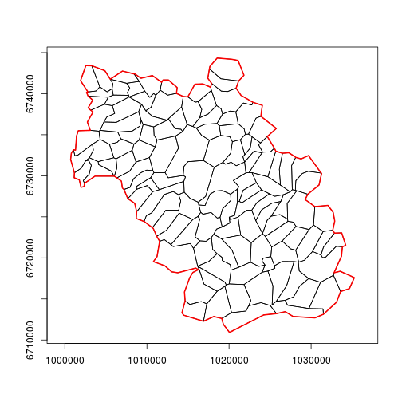

Notes techniques
========================================================
Table des matières
------------------
1. notes techniques
2. cartographie
3. population


Notes techniques
================

gdata est utile pour la méthode drop.levels() qui supprime les levels inutiles:
(ref: http://rwiki.sciviews.org/doku.phpéid=tips:data-manip:drop_unused_levels)

note: pour supprimer les messages inutiles *{r message=FALSE}*

note: pour supprimer les warnings: *{r warning=FALSE}*

# A NE FAIRE QU'UNE FOIS AU DEBUT DE LA SESSION:
# loadhistory(file = ".Rhistory")
# timestamp()
# A FAIRE SI ON CHANGE DE WORKING DIRECTORY
# sauvegarde: savehistory(file = ".Rhistory")

Pour que les légendes de l'axe des Y soient perpendiculaires a ce dernier, rajouter *las = 1*
Pour que les légendes de l'axe des X soient perpendiculaires a ce dernier, rajouter *las = 2*
Pour que les légendes soient perpendiculaires aux 2 axes, rajouter *las = 3*
Par défaut *las = 0*

L'utilisation de la méthode *SweaveInput* provoque un erreur si le fichier à inclure comporte des caractéres accenués (méme enregistrés en UTF8)

Création d'un tableau avec *cbind* et une matrice (et xtable pour pdf): voir exhaustivité des données

Version:

```r
sessionInfo()
```

```
## R version 2.15.1 (2012-06-22)
## Platform: x86_64-pc-linux-gnu (64-bit)
## 
## locale:
##  [1] LC_CTYPE=fr_FR.UTF-8       LC_NUMERIC=C              
##  [3] LC_TIME=fr_FR.UTF-8        LC_COLLATE=fr_FR.UTF-8    
##  [5] LC_MONETARY=fr_FR.UTF-8    LC_MESSAGES=fr_FR.UTF-8   
##  [7] LC_PAPER=C                 LC_NAME=C                 
##  [9] LC_ADDRESS=C               LC_TELEPHONE=C            
## [11] LC_MEASUREMENT=fr_FR.UTF-8 LC_IDENTIFICATION=C       
## 
## attached base packages:
## [1] stats     graphics  grDevices utils     datasets  methods   base     
## 
## other attached packages:
## [1] knitr_1.2
## 
## loaded via a namespace (and not attached):
## [1] digest_0.6.3   evaluate_0.4.3 formatR_0.7    stringr_0.6.2 
## [5] tools_2.15.1
```

```r
toLatex(sessionInfo())
```

```
## \begin{itemize}\raggedright
##   \item R version 2.15.1 (2012-06-22), \verb|x86_64-pc-linux-gnu|
##   \item Locale: \verb|LC_CTYPE=fr_FR.UTF-8|, \verb|LC_NUMERIC=C|, \verb|LC_TIME=fr_FR.UTF-8|, \verb|LC_COLLATE=fr_FR.UTF-8|, \verb|LC_MONETARY=fr_FR.UTF-8|, \verb|LC_MESSAGES=fr_FR.UTF-8|, \verb|LC_PAPER=C|, \verb|LC_NAME=C|, \verb|LC_ADDRESS=C|, \verb|LC_TELEPHONE=C|, \verb|LC_MEASUREMENT=fr_FR.UTF-8|, \verb|LC_IDENTIFICATION=C|
##   \item Base packages: base, datasets, graphics, grDevices,
##     methods, stats, utils
##   \item Other packages: knitr~1.2
##   \item Loaded via a namespace (and not attached): digest~0.6.3,
##     evaluate~0.4.3, formatR~0.7, stringr~0.6.2, tools~2.15.1
## \end{itemize}
```

Pour présenter en latex un tableau type *summary*:
stargazer(as.data.frame(a2[1:length(a)]),summary=TRUE,digit.separator=" ",digits=2,median=TRUE,iqr=TRUE)

Outils de présentation
======================
Sont également utilisables pour le site internet de Resural:
- Interactive presentation with slidify and googleVis: comment faire un diaporama en R en incorporant des graphiques interactifs présentés via googlevis et les incorporer dans son site http://feedproxy.google.com/~r/RBloggers/~3/4w4oN8fMOa4/?utm_source=feedburner&utm_medium=email

Notes de cartographie
=====================

références utiles
-----------------
- dossier stat Resural/carto&pop.rmd
  - carto67.rda
  - carto68.rda
  - carto_alsace.rda
- http://help.nceas.ucsb.edu/r:spatial comment utiliser les ressources de R


Notes sur les populations
=========================
- utilisation du recensement 2010
- dossier stat Resural/carto&pop.rmd
  - pop67.rda
  - pop68.rda
- source INSEE
  - http://www.insee.fr/fr/ppp/bases-de-donnees/recensement/populations-legales/france-regions.asp?annee=2010
   - http://www.insee.fr/fr/ppp/bases-de-donnees/recensement/populations-legales/france
-departements.asp?annee=2010 (fichier excel)
  - http://www.insee.fr/fr/ppp/bases-de-donnees/recensement/populations-legales/departement.asp?dep=67&annee=2010
  - http://www.insee.fr/fr/ppp/bases-de-donnees/recensement/populations-legales/departement.asp?dep=68&annee=2010
  - Liste des cantons, communes, arrondissements, pays: http://www.insee.fr/fr/methodes/nomenclatures/cog/telechargement.asp
  
- population légale 2010: 
  - Alsace   1 845 687

N°  |  Département  |  nb.communes  |  Pop.municipale  |  Pop.totale
----|---------------|---------------|------------------|-------------
67 |  Bas-Rhin |	527 |  1 095 905 | 1 115 226 
68 |	Haut-Rhin | 377  | 749 782 | 765 634 


Fichier ville de la base *pma*
------------------------------
Fichier exporté de la base *pma* sous le nom de *ville.csv* (5/6/2013)


```r
file <- "ville.csv"
v <- read.csv(file, header = TRUE, sep = ",")
names(v)
```

```
##  [1] "ville_ID"          "ville_nom"         "ville_insee"      
##  [4] "ville_zip"         "ville_lambertX"    "ville_lambertY"   
##  [7] "departement_ID"    "region_ID"         "zone_ID"          
## [10] "pays_ID"           "ville_longitude"   "ville_latitude"   
## [13] "canton_ID"         "arrondissement_ID" "admin_ID"         
## [16] "territoire_sante"  "secteur_apa_ID"    "secteur_Smur_ID"  
## [19] "secteur_Adps_ID"   "secteur_Vsav_ID"   "zone_proximite"
```

On ne retient que les villes d'Alsace:

```r
va <- v[v$region_ID == "42", ]
```

mise en forme:

```r
va$zone_proximite <- as.factor(va$zone_proximite)
va$territoire_sante <- as.factor(va$territoire_sante)
```

villes où la ZP est manquante:

```r
a <- va[va$zone_proximite == 0, c(1:3)]
a
```

```
##      ville_ID             ville_nom ville_insee
## 145       161               Rouffac          NA
## 151       168         Bad Krozingen          NA
## 154       171              Breisach          NA
## 1044     1061              AVENHEIM       67015
## 1045     1062            BEHLENHEIM       67024
## 1046     1063            BIRLENBACH       67042
## 1047     1064  BISCHTROFF-SUR-SARRE       67376
## 1049     1066           BREMMELBACH       67064
## 1050     1067       EBERBACH-WOERTH       67114
## 1051     1068              GIMBRETT       67157
## 1052     1069             GRIESBACH       67170
## 1053     1070 GRIESBACH-LE-BASTBERG       67171
## 1054     1071         HERMERSWILLER       67193
## 1055     1072             HOHWILLER       67211
## 1056     1073              IMBSHEIM       67219
## 1057     1074      KLEINFRANKENHEIM       67243
## 1058     1075            KUHLENDORF       67251
## 1059     1076         LEITERSWILLER       67262
## 1060     1077             MATTSTALL       67284
## 1061     1078            MITSCHDORF       67294
```


Résultats:

```r
summary(va$zone_proximite)
```

```
##   0   1   2   3   4   5   6   7   8   9  10  11  12 
##  20 111  94  45  96  64  34 104  42 158  54  50  52
```

Combinaisons des fichiers
-------------------------
On forme un fichier commun avec
- pop67
- pop68
- va
de façon a avoir dans une même base les zones de proximité (va) et les populations correspondantes:

```r
load("~/Documents/Resural/Stat Resural/carto&pop/pop68.rda")
load("~/Documents/Resural/Stat Resural/carto&pop/pop67.rda")
base1 <- merge(va, pop67, by.x = "ville_insee", by.y = "insee")
base2 <- merge(va, pop68, by.x = "ville_insee", by.y = "insee")
base <- rbind(base1, base2)
names(base)
```

```
##  [1] "ville_insee"               "ville_ID"                 
##  [3] "ville_nom"                 "ville_zip"                
##  [5] "ville_lambertX"            "ville_lambertY"           
##  [7] "departement_ID"            "region_ID"                
##  [9] "zone_ID"                   "pays_ID"                  
## [11] "ville_longitude"           "ville_latitude"           
## [13] "canton_ID"                 "arrondissement_ID"        
## [15] "admin_ID"                  "territoire_sante"         
## [17] "secteur_apa_ID"            "secteur_Smur_ID"          
## [19] "secteur_Adps_ID"           "secteur_Vsav_ID"          
## [21] "zone_proximite"            "Code.région"              
## [23] "Nom.de.la.région"          "Code.département"         
## [25] "Code.arrondissement"       "Code.canton"              
## [27] "Code.commune"              "Nom.de.la.commune"        
## [29] "Population.municipale"     "Population.comptée.à.part"
## [31] "Population.totale"
```

```r
rm(base1, base2)
```

Note: le résultat pourrait être simplifié car des colonnes sont redondantes;

Communes où la zone de proximité est manquante:

```r
a <- base[base$zone_proximite == 0, c(1, 3)]
a
```

```
## [1] ville_insee ville_nom  
## <0 rows> (or 0-length row.names)
```

corrections:

```r
base$zone_proximite[53] <- 3
base$territoire_sante[53] <- 1

base$zone_proximite[572] <- 1
base$territoire_sante[572] <- 4

base$zone_proximite[57] <- 3
```


population de la région:

```r
n <- sum(base$Population.totale)
n
```

```
## [1] 1900810
```

Population par zone de proximité:

```r
effectif <- tapply(base$Population.totale, as.factor(base$zone_proximite), sum, 
    na.rm = TRUE)
effectif
```

```
##      0      1      2      3      4      5      6      7      8      9 
##     NA  70118 201951  81144 197768  90538 262034 165002  96112 115883 
##     10     11     12 
## 493558  68655  58047
```

```r
pourcentage <- round(prop.table(effectif) * 100, 2)
pourcentage
```

```
##  0  1  2  3  4  5  6  7  8  9 10 11 12 
## NA NA NA NA NA NA NA NA NA NA NA NA NA
```

```r
c <- cbind(effectif, pourcentage)
c
```

```
##    effectif pourcentage
## 0        NA          NA
## 1     70118          NA
## 2    201951          NA
## 3     81144          NA
## 4    197768          NA
## 5     90538          NA
## 6    262034          NA
## 7    165002          NA
## 8     96112          NA
## 9    115883          NA
## 10   493558          NA
## 11    68655          NA
## 12    58047          NA
```

```r
barplot(sort(effectif), cex.names = 0.8, xlab = "Territoire de proximité", 
    ylab = "% de la population totale", main = "Répartition de la population par territoire de santé")
```

 

Créer une zone de proximité
---------------------------
On fait la liste de tous les codes INSEE de la zone de proximité1:

```r
zip1 <- base$ville_insee[base$zone_proximite == 1]
head(zip1)
```

```
## [1] 68002 68004 68006 68010 68017 68018
```

Puis on fait la liste des villes correspondant à ces codes:
```
b<-paste(zip1,sep=",")
a<-base$ville_nom[base$ville_insee %in% b]
a[1:5]
```
essai de carto associée:
------------------------
La méthode dessine tous les polygones présents qui répondent à un critère de sélection. On utilise le fichier *carto_alsace.rda* qui produit un objet *SpatialPolygonsDataFrame* appelé *als*.

```r
library("maptools")
```

```
## Loading required package: foreign
```

```
## Loading required package: sp
```

```
## Loading required package: grid
```

```
## Loading required package: lattice
```

```
## Checking rgeos availability: TRUE
```

```r
load("/home/jcb/Documents/Resural/Stat Resural/carto&pop/carto_alsace.rda")
names(als)
```

```
##  [1] "ID_GEOFLA"  "CODE_COMM"  "INSEE_COM"  "NOM_COMM"   "STATUT"    
##  [6] "X_CHF_LIEU" "Y_CHF_LIEU" "X_CENTROID" "Y_CENTROID" "Z_MOYEN"   
## [11] "SUPERFICIE" "POPULATION" "CODE_CANT"  "CODE_ARR"   "CODE_DEPT" 
## [16] "NOM_DEPT"   "CODE_REG"   "NOM_REGION"
```

```r
contour <- unionSpatialPolygons(als, IDs = als@data$CODE_ARR)
```

```
## Loading required package: rgeos
```

```
## rgeos version: 0.2-17, (SVN revision ) GEOS runtime version:
## 3.3.3-CAPI-1.7.4 Polygon checking: TRUE
```

```r
plot(contour)
```

 

Contour de la zone de proximié n°1 (code INSEE stockés dans b) dans la région Alsace

```r
library("maptools")
b <- paste(zip1, sep = ",")
a <- base$ville_nom[base$ville_insee %in% b]
contour <- unionSpatialPolygons(als, IDs = als@data$INSEE_COM %in% b)
plot(contour)
```

 

Contour de la zone de proximié n°1 (seule)


```r

b <- paste(zip1, sep = ",")
a <- base$ville_nom[base$ville_insee %in% b]
zp1 <- als[als@data$INSEE_COM %in% b, ]
plot(zp1)
```

 

*zp1* est également un *SpatialPolygonsDataFrame* qui contient les mêmes éléments que l'élément racine:

```r
names(zp1)
```

```
##  [1] "ID_GEOFLA"  "CODE_COMM"  "INSEE_COM"  "NOM_COMM"   "STATUT"    
##  [6] "X_CHF_LIEU" "Y_CHF_LIEU" "X_CENTROID" "Y_CENTROID" "Z_MOYEN"   
## [11] "SUPERFICIE" "POPULATION" "CODE_CANT"  "CODE_ARR"   "CODE_DEPT" 
## [16] "NOM_DEPT"   "CODE_REG"   "NOM_REGION"
```

On peut donc lui appliquer les mêmes fonctions. Par exemple on peut tracer une figure qui représente les contours de la zone de proximité:

```r
contour <- unionSpatialPolygons(zp1, IDs = zp1@data$CODE_ARR)
plot(contour, axes = T)
```

 

*contour* est un *SpatialPolygons*.

Il est possible de superposer les 2 graphiques en ajoutant add=TRUE:

```r
plot(contour, axes = T, xlab = "axe x", col = "red")
plot(zp1, add = T)
```

 

modifier l'aspect:
- lty = 1 (normal), 2, 3, 4, 5... (pointillés)
- lwd = 1 épaisseur du trait
- fg = "red" couleur des axes
- bg = "blue" couleur de fond de l'image
- col = "green" couleur de fond du polygone. col=NA or col="transparent" pour un fond transparent.
- border = "red" couleur de la bordure

exemple:

```r
plot(zp1, , axes = T)
plot(contour, axes = T, lty = 1, lwd = 2, fg = "blue", border = "red", add = T)
```

 

Certains caractères accentués posent des pb comme dans *préfecture*:

```r
summary(zp1$STATUT)
```

```
##         Capitale d'\xe9tat           Chef-lieu canton 
##                          0                          3 
##             Commune simple              Pr\xe9fecture 
##                        107                          0 
## Pr\xe9fecture de r\xe9gion         Sous-pr\xe9fecture 
##                          0                          1
```

Avec la fonction *gsub*, on remplace les caractères anormaux par *e*:

```r
zp1$STATUT <- gsub("\xe9", "e", zp1$STATUT, fixed = F)
summary(as.factor(zp1$STATUT))
```

```
## Chef-lieu canton   Commune simple  Sous-prefecture 
##                3              107                1
```

Il est alorspossible de récupérer les coordonées de la sous-préfecture. Il faut d'abord récupérer le dataframe associé à zp1. NB il faut multiplier les coordonnées x et y par 100 pour être cohérent avec la carte. pch = 19 désigne le symbole rond plein.

```r
a <- zp1@data
head(a)
```

```
##      ID_GEOFLA CODE_COMM INSEE_COM      NOM_COMM         STATUT X_CHF_LIEU
## 180        181       152     68152      ILLFURTH Commune simple      10198
## 2375      2376       282     68282       ROMAGNY Commune simple      10053
## 3175      3176       196     68196         MAGNY Commune simple      10044
## 4413      4414       176     68176     LARGITZEN Commune simple      10146
## 4640      4641       080     68080      EMLINGEN Commune simple      10221
## 6686      6687       081     68081 SAINT-BERNARD Commune simple      10151
##      Y_CHF_LIEU X_CENTROID Y_CENTROID Z_MOYEN SUPERFICIE POPULATION
## 180       67388      10199      67392     299        909        2.3
## 2375      67310      10054      67313     360        289        0.2
## 3175      67305      10039      67306     361        427        0.3
## 4413      67263      10151      67262     404        571        0.3
## 4640      67335      10221      67340     326        243        0.3
## 6686      67384      10153      67378     281        601        0.5
##      CODE_CANT CODE_ARR CODE_DEPT  NOM_DEPT CODE_REG NOM_REGION
## 180         01        1        68 HAUT-RHIN       42     ALSACE
## 2375        05        1        68 HAUT-RHIN       42     ALSACE
## 3175        05        1        68 HAUT-RHIN       42     ALSACE
## 4413        10        1        68 HAUT-RHIN       42     ALSACE
## 4640        01        1        68 HAUT-RHIN       42     ALSACE
## 6686        01        1        68 HAUT-RHIN       42     ALSACE
```

```r

sp <- a[a$STATUT == "Sous-prefecture", ]
sp
```

```
##       ID_GEOFLA CODE_COMM INSEE_COM NOM_COMM          STATUT X_CHF_LIEU
## 12326     12327       004     68004 ALTKIRCH Sous-prefecture      10182
##       Y_CHF_LIEU X_CENTROID Y_CENTROID Z_MOYEN SUPERFICIE POPULATION
## 12326      67332      10186      67330     332        953        5.7
##       CODE_CANT CODE_ARR CODE_DEPT  NOM_DEPT CODE_REG NOM_REGION
## 12326        01        1        68 HAUT-RHIN       42     ALSACE
```

```r

x <- sp$X_CHF_LIEU * 100
y <- sp$Y_CHF_LIEU * 100
nom <- sp$NOM_COMM

plot(contour)
points(x, y, pch = 19, col = 3)
text(x, y, labels = nom, cex = 0.8, pos = 3)
```

 

Les zones de proximités officielles sont dans le fichier zp.csv

```r
zpo <- read.csv("zp.csv", header = TRUE, sep = ",")
names(zpo)
```

```
## [1] "CODE.DEP"                         "CODE.COMMUNE"                    
## [3] "LIBELLE.DES.COMMUNES"             "LIBELLE.DES.TERRITOIRES.DE.SANTE"
## [5] "CODE.ZONES.DE.PROXIMITE"          "LIBELLE.DES.ZONES.DE.PROXIMITE"
```

```r
print("Nb de communes par territoire de santé")
```

```
## [1] "Nb de communes par territoire de santé"
```

```r
a <- zpo$LIBELLE.DES.TERRITOIRES.DE.SANTE
summary(a)
```

```
## TERRITOIRE DE SANTE 1 TERRITOIRE DE SANTE 2 TERRITOIRE DE SANTE 3 
##                   306                   144                   213 
## TERRITOIRE DE SANTE 4 
##                   241
```

```r
print("Nb de communes par territoire de proximité")
```

```
## [1] "Nb de communes par territoire de proximité"
```

```r
a <- zpo$LIBELLE.DES.ZONES.DE.PROXIMITE
summary(a)
```

```
##           ALTKIRCH             COLMAR         GUEBWILLER 
##                111                 94                 42 
##           HAGUENAU MOLSHEIM SCHIRMECK           MULHOUSE 
##                 90                 92                 40 
##   OBERNAI-SELESTAT        SAINT-LOUIS            SAVERNE 
##                101                 40                162 
##         STRASBOURG              THANN        WISSEMBOURG 
##                 28                 50                 54
```

NB: la numérotation ARS des territoires de proximité de proximité ne correspond pas à celle de Sagec. Le code commune du fichier zpo correspond au code INSEE.

Utilisation du fichier *zpo* à la place du fichier *ville*
-----------------------------------------------------------
Crée un objet *zone de proximité 2*, en dessine le contour ainsi que le chef lieu:


```r
zpo <- read.csv("zp.csv", header = TRUE, sep = ",")
base1 <- merge(zpo, pop67, by.x = "CODE.COMMUNE", by.y = "insee")
base2 <- merge(zpo, pop68, by.x = "CODE.COMMUNE", by.y = "insee")
base <- rbind(base1, base2)
rm(base1, base2)
names(base)
```

```
##  [1] "CODE.COMMUNE"                     "CODE.DEP"                        
##  [3] "LIBELLE.DES.COMMUNES"             "LIBELLE.DES.TERRITOIRES.DE.SANTE"
##  [5] "CODE.ZONES.DE.PROXIMITE"          "LIBELLE.DES.ZONES.DE.PROXIMITE"  
##  [7] "Code.région"                      "Nom.de.la.région"                
##  [9] "Code.département"                 "Code.arrondissement"             
## [11] "Code.canton"                      "Code.commune"                    
## [13] "Nom.de.la.commune"                "Population.municipale"           
## [15] "Population.comptée.à.part"        "Population.totale"
```

```r

# spécifique de la zone de proximité 2
zip2 <- base$CODE.COMMUNE[base$CODE.ZONES.DE.PROXIMITE == 2]
b <- paste(zip2, sep = ",")
zp2 <- als[als@data$INSEE_COM %in% b, ]
plot(zp2)
```

 

```r

contour2 <- unionSpatialPolygons(zp2, IDs = zp2@data$CODE_DEPT)
plot(contour2)

zp2$STATUT <- gsub("\xe9", "e", zp2$STATUT, fixed = F)
a <- zp2@data
sp <- a[a$STATUT == "Sous-prefecture", ]
x <- sp$X_CHF_LIEU * 100
y <- sp$Y_CHF_LIEU * 100
nom <- sp$NOM_COMM
points(x, y, pch = 19, col = 3)
text(x, y, labels = nom, cex = 0.8, pos = 3)
```

 

Zone de proximité 3


```r
zip3 <- base$CODE.COMMUNE[base$CODE.ZONES.DE.PROXIMITE == 3]
b <- paste(zip3, sep = ",")
zp3 <- als[als@data$INSEE_COM %in% b, ]
plot(zp3)
```

 

```r

contour3 <- unionSpatialPolygons(zp3, IDs = zp3@data$CODE_DEPT)
plot(contour3)

zp3$STATUT <- gsub("\xe9", "e", zp2$STATUT, fixed = F)
```

```
## Error: replacement has 90 rows, data has 162
```

```r
a <- zp3@data
sp <- a[a$STATUT == "Sous-prefecture", ]
x <- sp$X_CHF_LIEU * 100
y <- sp$Y_CHF_LIEU * 100
nom <- sp$NOM_COMM
points(x, y, pch = 19, col = 3)
text(x, y, labels = nom, cex = 0.8, pos = 3)
```

```
## Error: 'labels' de taille nulle
```

```r
plot(contour2, add = T)
```

 


