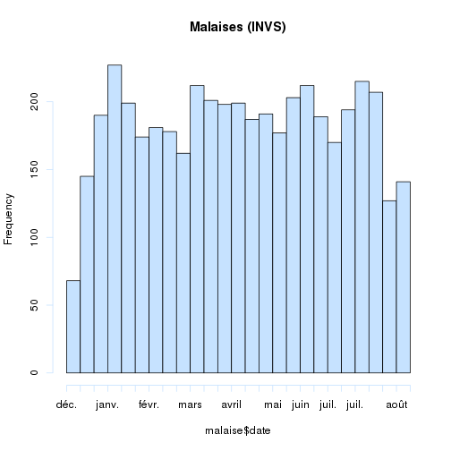

Notes techniques
========================================================
Table des matières
------------------
1. notes techniques
2. cartographie
3. population


Notes techniques
================

gdata est utile pour la méthode drop.levels() qui supprime les levels inutiles:
(ref: http://rwiki.sciviews.org/doku.phpéid=tips:data-manip:drop_unused_levels)

note: pour supprimer les messages inutiles *{r message=FALSE}*

note: pour supprimer les warnings: *{r warning=FALSE}*

#### A NE FAIRE QU'UNE FOIS AU DEBUT DE LA SESSION:
- loadhistory(file = ".Rhistory")
- timestamp()
- A FAIRE SI ON CHANGE DE WORKING DIRECTORY
- sauvegarde: savehistory(file = ".Rhistory")

#### Légendes graphes:
- Pour que les légendes de l'axe des Y soient perpendiculaires a ce dernier, rajouter *las = 1*
- Pour que les légendes de l'axe des X soient perpendiculaires a ce dernier, rajouter *las = 2*
- Pour que les légendes soient perpendiculaires aux 2 axes, rajouter *las = 3*
- Par défaut *las = 0*

- pour ne pas encadrer les légendes: bty = "n" (bty = box type)

#### L'utilisation de la méthode *SweaveInput* 
- provoque un erreur si le fichier à inclure comporte des caractéres accenués (méme enregistrés en UTF8)
- lui préférer
<<child = 'mon_fichier.Rnw'>>=
@

Création d'un tableau avec *cbind* et une matrice (et xtable pour pdf): voir exhaustivité des données

#### Version:

```r
sessionInfo()
```

```
## R version 3.0.1 (2013-05-16)
## Platform: i686-pc-linux-gnu (32-bit)
## 
## locale:
##  [1] LC_CTYPE=fr_FR.UTF-8       LC_NUMERIC=C              
##  [3] LC_TIME=fr_FR.UTF-8        LC_COLLATE=fr_FR.UTF-8    
##  [5] LC_MONETARY=fr_FR.UTF-8    LC_MESSAGES=fr_FR.UTF-8   
##  [7] LC_PAPER=C                 LC_NAME=C                 
##  [9] LC_ADDRESS=C               LC_TELEPHONE=C            
## [11] LC_MEASUREMENT=fr_FR.UTF-8 LC_IDENTIFICATION=C       
## 
## attached base packages:
## [1] stats     graphics  grDevices utils     datasets  methods   base     
## 
## other attached packages:
## [1] knitr_1.3
## 
## loaded via a namespace (and not attached):
## [1] digest_0.6.3   evaluate_0.4.4 formatR_0.8    stringr_0.6.2 
## [5] tools_3.0.1
```

```r
toLatex(sessionInfo())
```

```
## \begin{itemize}\raggedright
##   \item R version 3.0.1 (2013-05-16), \verb|i686-pc-linux-gnu|
##   \item Locale: \verb|LC_CTYPE=fr_FR.UTF-8|, \verb|LC_NUMERIC=C|, \verb|LC_TIME=fr_FR.UTF-8|, \verb|LC_COLLATE=fr_FR.UTF-8|, \verb|LC_MONETARY=fr_FR.UTF-8|, \verb|LC_MESSAGES=fr_FR.UTF-8|, \verb|LC_PAPER=C|, \verb|LC_NAME=C|, \verb|LC_ADDRESS=C|, \verb|LC_TELEPHONE=C|, \verb|LC_MEASUREMENT=fr_FR.UTF-8|, \verb|LC_IDENTIFICATION=C|
##   \item Base packages: base, datasets, graphics, grDevices,
##     methods, stats, utils
##   \item Other packages: knitr~1.3
##   \item Loaded via a namespace (and not attached): digest~0.6.3,
##     evaluate~0.4.4, formatR~0.8, stringr~0.6.2, tools~3.0.1
## \end{itemize}
```


#### Copyright

```r
mtext("© RESURAL 2013", cex = 0.6, side = 4, line = -1, adj = 0.1)
```

```
## Error: plot.new has not been called yet
```


#### Pour présenter en latex un tableau type *summary*:
stargazer(as.data.frame(a2[1:length(a)]),summary=TRUE,digit.separator=" ",digits=2,median=TRUE,iqr=TRUE)

#### Séparateur de milliers:
\np{x} génère une erreur si x est en notation scientifique

#### Se débarasser des NA
Procéder en 2 temsps:
- créer un vecteur de *logical* avec *!is.na*
- extraire les valeurs qui ne sont pas de NA à l'aide du vecteur précédent
exemple:

```r
vector <- c(1, NA, 2)
vector
```

```
## [1]  1 NA  2
```

```r
select <- !is.na(vector)
vector[select]
```

```
## [1] 1 2
```

```r
mean(vector)
```

```
## [1] NA
```

```r
mean(vector[select])
```

```
## [1] 1.5
```


Outils de présentation
======================
Sont également utilisables pour le site internet de Resural:
- Interactive presentation with slidify and googleVis: comment faire un diaporama en R en incorporant des graphiques interactifs présentés via googlevis et les incorporer dans son site http://feedproxy.google.com/~r/RBloggers/~3/4w4oN8fMOa4/?utm_source=feedburner&utm_medium=email

Notes de cartographie
=====================

références utiles
-----------------
- dossier stat Resural/carto&pop.rmd
  - carto67.rda
  - carto68.rda
  - carto_alsace.rda
- http://help.nceas.ucsb.edu/r:spatial comment utiliser les ressources de R


Notes sur les populations
=========================
- utilisation du recensement 2010
- dossier stat Resural/carto&pop.rmd
  - pop67.rda
  - pop68.rda
- source INSEE
  - http://www.insee.fr/fr/ppp/bases-de-donnees/recensement/populations-legales/france-regions.asp?annee=2010
   - http://www.insee.fr/fr/ppp/bases-de-donnees/recensement/populations-legales/france
-departements.asp?annee=2010 (fichier excel)
  - http://www.insee.fr/fr/ppp/bases-de-donnees/recensement/populations-legales/departement.asp?dep=67&annee=2010
  - http://www.insee.fr/fr/ppp/bases-de-donnees/recensement/populations-legales/departement.asp?dep=68&annee=2010
  - Liste des cantons, communes, arrondissements, pays: http://www.insee.fr/fr/methodes/nomenclatures/cog/telechargement.asp
  
- population légale 2010: 
  - Alsace   1 845 687

N°  |  Département  |  nb.communes  |  Pop.municipale  |  Pop.totale
----|---------------|---------------|------------------|-------------
67 |  Bas-Rhin |	527 |  1 095 905 | 1 115 226 
68 |	Haut-Rhin | 377  | 749 782 | 765 634 
pop.als.2010.totale<-1115226 + 765634
pop.als.2010.municipale<-1095905 + 749782

Fichier ville de la base *pma*
------------------------------
Fichier exporté de la base *pma* sous le nom de *ville.csv* (5/6/2013). Il contient toutes les villes connues de Sagec.


```r
file <- "ville.csv"
v <- read.csv(file, header = TRUE, sep = ",")
names(v)
```

```
##  [1] "ville_ID"          "ville_nom"         "ville_insee"      
##  [4] "ville_zip"         "ville_lambertX"    "ville_lambertY"   
##  [7] "departement_ID"    "region_ID"         "zone_ID"          
## [10] "pays_ID"           "ville_longitude"   "ville_latitude"   
## [13] "canton_ID"         "arrondissement_ID" "admin_ID"         
## [16] "territoire_sante"  "secteur_apa_ID"    "secteur_Smur_ID"  
## [19] "secteur_Adps_ID"   "secteur_Vsav_ID"   "zone_proximite"
```

On ne retient que les villes d'Alsace, c'est à dire celles appartenant à la région 42. On sauvegarde le dataframe dans la variable **va** (924 lignes et 21 colonnes)

```r
va <- v[v$region_ID == "42", ]
```

mise en forme:
- *zone_proximite* est transformé en facteur
- *territoire_sante* est transformé en facteur

```r
va$zone_proximite <- as.factor(va$zone_proximite)
va$territoire_sante <- as.factor(va$territoire_sante)
```

#### villes où la ZP est manquante:

```r
a <- va[va$zone_proximite == 0, c(1:3)]
a
```

```
##      ville_ID             ville_nom ville_insee
## 145       161               Rouffac          NA
## 151       168         Bad Krozingen          NA
## 154       171              Breisach          NA
## 1044     1061              AVENHEIM       67015
## 1045     1062            BEHLENHEIM       67024
## 1046     1063            BIRLENBACH       67042
## 1047     1064  BISCHTROFF-SUR-SARRE       67376
## 1049     1066           BREMMELBACH       67064
## 1050     1067       EBERBACH-WOERTH       67114
## 1051     1068              GIMBRETT       67157
## 1052     1069             GRIESBACH       67170
## 1053     1070 GRIESBACH-LE-BASTBERG       67171
## 1054     1071         HERMERSWILLER       67193
## 1055     1072             HOHWILLER       67211
## 1056     1073              IMBSHEIM       67219
## 1057     1074      KLEINFRANKENHEIM       67243
## 1058     1075            KUHLENDORF       67251
## 1059     1076         LEITERSWILLER       67262
## 1060     1077             MATTSTALL       67284
## 1061     1078            MITSCHDORF       67294
```

notes:
- *Hoffe*n est une commune française, située dans le département du Bas-Rhin et la région Alsace. La commune a fusionné avec les villages de *Hermerswiller* et de *Leiterswiller* le 1er janvier 1975.
- Depuis le 1er mai 1972, *Schnersheim* regroupe les communes associées d'*Avenheim* et de *Kleinfrankenheim*.
- *Truchtersheim*: Depuis le 15 juillet 1974, la commune est fusionnée avec l'ancienne commune de *Behlenheim*.


Résultats:

```r
summary(va$zone_proximite)
```

```
##   0   1   2   3   4   5   6   7   8   9  10  11  12 
##  20 111  94  45  96  64  34 104  42 158  54  50  52
```

Combinaisons des fichiers
-------------------------
On forme un fichier commun avec
- pop67: fichier INSEE de 2010
- pop68: fichier INSEE de 2010
- va
de façon a avoir dans une même base les zones de proximité (va) et les populations correspondantes:
- base1: merging de *va* et de *pop67*
- base2: merging de *va* et de *pop68*
base1 et base2 sont fusionné en un seul fichier *base*, puis supprrimés.

```r
load("~/Documents/Resural/Stat Resural/carto&pop/pop68.rda")
load("~/Documents/Resural/Stat Resural/carto&pop/pop67.rda")
base1 <- merge(va, pop67, by.x = "ville_insee", by.y = "insee")
base2 <- merge(va, pop68, by.x = "ville_insee", by.y = "insee")
base <- rbind(base1, base2)
names(base)
```

```
##  [1] "ville_insee"               "ville_ID"                 
##  [3] "ville_nom"                 "ville_zip"                
##  [5] "ville_lambertX"            "ville_lambertY"           
##  [7] "departement_ID"            "region_ID"                
##  [9] "zone_ID"                   "pays_ID"                  
## [11] "ville_longitude"           "ville_latitude"           
## [13] "canton_ID"                 "arrondissement_ID"        
## [15] "admin_ID"                  "territoire_sante"         
## [17] "secteur_apa_ID"            "secteur_Smur_ID"          
## [19] "secteur_Adps_ID"           "secteur_Vsav_ID"          
## [21] "zone_proximite"            "Code.région"              
## [23] "Nom.de.la.région"          "Code.département"         
## [25] "Code.arrondissement"       "Code.canton"              
## [27] "Code.commune"              "Nom.de.la.commune"        
## [29] "Population.municipale"     "Population.comptée.à.part"
## [31] "Population.totale"
```

```r
rm(base1, base2)
```

Note: le résultat pourrait être simplifié car des colonnes sont redondantes;

Communes où la zone de proximité est manquante:

```r
a <- base[base$zone_proximite == 0, c(1, 3)]
a
```

```
## [1] ville_insee ville_nom  
## <0 rows> (or 0-length row.names)
```

corrections:

```r
base$zone_proximite[53] <- 3
base$territoire_sante[53] <- 1

base$zone_proximite[572] <- 1
base$territoire_sante[572] <- 4

base$zone_proximite[57] <- 3
```

#### Définitions INSEE

La *populatio*n d'une commune comprend :
- la population des résidences principales ;
- la population des communautés de la commune ;
- les personnes sans abri ou vivant dans des habitations mobiles

Le concept de *population totale* est défini par le décret n°2003-485 publié au Journal officiel du 8 juin 2003, relatif au recensement de la population.

La population totale d'une commune est égale à la somme de la population municipale et de la population comptée à part de la commune.

La population totale d'un ensemble de communes est égale à la somme des populations totales des communes qui le composent.

La population totale est une population légale à laquelle de très nombreux textes législatifs ou réglementaires font référence. A la différence de la population municipale, elle n'a pas d'utilisation statistique car elle comprend des doubles comptes dès lors que l'on s'intéresse à un ensemble de plusieurs communes.

Le concept de *population municipale* est défini par le décret n°2003-485 publié au Journal officiel du 8 juin 2003, relatif au recensement de la population.
La population municipale comprend les personnes ayant leur résidence habituelle (au sens du décret) sur le territoire de la commune, dans un logement ou une communauté, les personnes détenues dans les établissements pénitentiaires de la commune, les personnes sans-abri recensées sur le territoire de la commune et les personnes résidant habituellement dans une habitation mobile recensée sur le territoire de la commune.
La population municipale d'un ensemble de communes est égale à la somme des populations municipales des communes qui le composent.

Le concept de *population municipale correspond désormais à la notion de population utilisée usuellement en statistique*. En effet, elle ne comporte pas de doubles comptes : chaque personne vivant en France est comptée une fois et une seule. En 1999, c'était le concept de population sans doubles comptes qui correspondait à la notion de population statistique.

source: http://www.insee.fr/fr/methodes/default.asp?page=definitions/population-municipale-rrp.htm

Le concept de *population comptée à part* est défini par le décret n°2003-485 publié au Journal officiel du 8 juin 2003, relatif au recensement de la population.
La population comptée à part comprend certaines personnes dont la résidence habituelle (au sens du décret) est dans une autre commune mais qui ont conservé une résidence sur le territoire de la commune :
1. Les mineurs dont la résidence familiale est dans une autre commune mais qui résident, du fait de leurs études, dans la commune.
2. Les personnes ayant une résidence familiale sur le territoire de la commune et résidant dans une communauté d'une autre commune, dès lors que la communauté relève de l'une des catégories suivantes :
- services de moyen ou de long séjour des établissements publics ou privés de santé, établissements sociaux de moyen ou de long séjour, maisons de retraite, foyers et résidences sociales ;
- communautés religieuses ;
- casernes ou établissements militaires.
3. Les personnes majeures âgées de moins de 25 ans ayant leur résidence familiale sur le territoire de la commune et qui résident dans une autre commune pour leurs études.
4. Les personnes sans domicile fixe rattachées à la commune au sens de la loi du 3 janvier 1969 et non recensées dans la commune.

source: http://www.insee.fr/fr/methodes/default.asp?page=definitions/popul-comptee-a-part-rrp.htm

#### population de la région:

```r
n <- sum(base$Population.totale)
n
```

```
## [1] 1900810
```

```r
pop.tot <- sum(base$Population.totale)
pop.municipale <- sum(base$Population.municipale)
pop.a.part <- sum(base$Population.comptée.à.part)
```

Pour les raisons expliquées plus haut, les calculs statistiques font référence à la population **municipale**.

#### Population par territoire de proximité:
ATTENTION: les territoires de proximité sont dans l'ordre de SAGEC qui n'est pas celui de l'ARS

```r
territoire.prox <- c("Altkirch", "Colmar", "Guebwiller", "Haguenau", "Molsheim-Schirmeck", 
    "Mulhouse", "Sélestat-Obernai", "Saint-Louis", "Saverne", "Strasbourg", 
    "Thann", "Wissembourg")
effectif <- tapply(base$Population.municipale, as.factor(base$zone_proximite), 
    sum, na.rm = TRUE)
# on élimine la colonne 0 qui ne contient que NA
effectif <- effectif[-1]
effectif
```

```
##      1      2      3      4      5      6      7      8      9     10 
##  68591 196848  79628 194649  88811 257351 161331  94315 113804 485884 
##     11     12 
##  67191  56886
```

```r
names(effectif) <- territoire.prox
effectif
```

```
##           Altkirch             Colmar         Guebwiller 
##              68591             196848              79628 
##           Haguenau Molsheim-Schirmeck           Mulhouse 
##             194649              88811             257351 
##   Sélestat-Obernai        Saint-Louis            Saverne 
##             161331              94315             113804 
##         Strasbourg              Thann        Wissembourg 
##             485884              67191              56886
```

```r
pourcentage <- round(prop.table(effectif) * 100, 2)
pourcentage
```

```
##           Altkirch             Colmar         Guebwiller 
##               3.68              10.55               4.27 
##           Haguenau Molsheim-Schirmeck           Mulhouse 
##              10.44               4.76              13.80 
##   Sélestat-Obernai        Saint-Louis            Saverne 
##               8.65               5.06               6.10 
##         Strasbourg              Thann        Wissembourg 
##              26.05               3.60               3.05
```

```r
c <- cbind(effectif, pourcentage)
c
```

```
##                    effectif pourcentage
## Altkirch              68591        3.68
## Colmar               196848       10.55
## Guebwiller            79628        4.27
## Haguenau             194649       10.44
## Molsheim-Schirmeck    88811        4.76
## Mulhouse             257351       13.80
## Sélestat-Obernai     161331        8.65
## Saint-Louis           94315        5.06
## Saverne              113804        6.10
## Strasbourg           485884       26.05
## Thann                 67191        3.60
## Wissembourg           56886        3.05
```

```r
barplot(sort(effectif), cex.names = 0.8, xlab = "", las = 2, ylab = "Effectifs", 
    main = "Répartition de la population par territoire de proximité")
```

 

```r

barplot(sort(pourcentage), cex.names = 0.8, las = 2, xlab = "", ylab = "% de la population totale", 
    main = "Répartition de la population par territoire de proximité")
```

 

Commentaires:
- le territoire  de proximité de Strasbourg est le plus important et regroupe plus du quart de la population alsacienne
- les territoires de santé de Wissembourg et de Thann sont les moins peuplés.
- les territoires de proximité de Haguenau et Colmar sont sensiblement identiques
- Strasbourg, Mulhouse et Colmar regrouppent 50% de la population.

Créer une zone de proximité
---------------------------
On fait la liste de tous les codes INSEE de la zone de proximité1:

```r
zip1 <- base$ville_insee[base$zone_proximite == 1]
head(zip1)
```

```
## [1] 68002 68004 68006 68010 68017 68018
```

Puis on fait la liste des villes correspondant à ces codes:
```
b<-paste(zip1,sep=",")
a<-base$ville_nom[base$ville_insee %in% b]
a[1:5]
```
essai de carto associée:
------------------------
La méthode dessine tous les polygones présents qui répondent à un critère de sélection. On utilise le fichier *carto_alsace.rda* qui produit un objet *SpatialPolygonsDataFrame* appelé *als*.

```r
library("maptools")
```

```
## Loading required package: foreign Loading required package: sp Loading
## required package: grid Loading required package: lattice Checking rgeos
## availability: FALSE Note: when rgeos is not available, polygon geometry
## computations in maptools depend on gpclib, which has a restricted licence.
## It is disabled by default; to enable gpclib, type gpclibPermit()
```

```r
load("/home/jcb/Documents/Resural/Stat Resural/carto&pop/carto_alsace.rda")
names(als)
```

```
##  [1] "ID_GEOFLA"  "CODE_COMM"  "INSEE_COM"  "NOM_COMM"   "STATUT"    
##  [6] "X_CHF_LIEU" "Y_CHF_LIEU" "X_CENTROID" "Y_CENTROID" "Z_MOYEN"   
## [11] "SUPERFICIE" "POPULATION" "CODE_CANT"  "CODE_ARR"   "CODE_DEPT" 
## [16] "NOM_DEPT"   "CODE_REG"   "NOM_REGION"
```

```r
contour <- unionSpatialPolygons(als, IDs = als@data$CODE_ARR)
```

```
## Error: isTRUE(gpclibPermitStatus()) n'est pas TRUE
```

```r
plot(contour)
```

```
## Error: argument 'length.out' must be of length 1
```

Contour de la zone de proximié n°1 (code INSEE stockés dans b) dans la région Alsace

```r
library("maptools")
b <- paste(zip1, sep = ",")
a <- base$ville_nom[base$ville_insee %in% b]
contour <- unionSpatialPolygons(als, IDs = als@data$INSEE_COM %in% b)
```

```
## Error: isTRUE(gpclibPermitStatus()) n'est pas TRUE
```

```r
plot(contour)
```

```
## Error: argument 'length.out' must be of length 1
```

Contour de la zone de proximié n°1 (seule)


```r

b <- paste(zip1, sep = ",")
a <- base$ville_nom[base$ville_insee %in% b]
zp1 <- als[als@data$INSEE_COM %in% b, ]
plot(zp1)
```

 

*zp1* est également un *SpatialPolygonsDataFrame* qui contient les mêmes éléments que l'élément racine:

```r
names(zp1)
```

```
##  [1] "ID_GEOFLA"  "CODE_COMM"  "INSEE_COM"  "NOM_COMM"   "STATUT"    
##  [6] "X_CHF_LIEU" "Y_CHF_LIEU" "X_CENTROID" "Y_CENTROID" "Z_MOYEN"   
## [11] "SUPERFICIE" "POPULATION" "CODE_CANT"  "CODE_ARR"   "CODE_DEPT" 
## [16] "NOM_DEPT"   "CODE_REG"   "NOM_REGION"
```

On peut donc lui appliquer les mêmes fonctions. Par exemple on peut tracer une figure qui représente les contours de la zone de proximité:

```r
contour <- unionSpatialPolygons(zp1, IDs = zp1@data$CODE_ARR)
```

```
## Error: isTRUE(gpclibPermitStatus()) n'est pas TRUE
```

```r
plot(contour, axes = T)
```

```
## Error: argument 'length.out' must be of length 1
```

*contour* est un *SpatialPolygons*.

Il est possible de superposer les 2 graphiques en ajoutant add=TRUE:

```r
plot(contour, axes = T, xlab = "axe x", col = "red")
```

```
## Error: argument 'length.out' must be of length 1
```

```r
plot(zp1, add = T)
```

```
## Error: plot.new has not been called yet
```

modifier l'aspect:
- lty = 1 (normal), 2, 3, 4, 5... (pointillés)
- lwd = 1 épaisseur du trait
- fg = "red" couleur des axes
- bg = "blue" couleur de fond de l'image
- col = "green" couleur de fond du polygone. col=NA or col="transparent" pour un fond transparent.
- border = "red" couleur de la bordure

exemple:

```r
plot(zp1, , axes = T)
```

 

```r
plot(contour, axes = T, lty = 1, lwd = 2, fg = "blue", border = "red", add = T)
```

```
## Error: argument 'length.out' must be of length 1
```

Certains caractères accentués posent des pb comme dans *préfecture*:

```r
summary(zp1$STATUT)
```

```
##         Capitale d'\xe9tat           Chef-lieu canton 
##                          0                          3 
##             Commune simple              Pr\xe9fecture 
##                        107                          0 
## Pr\xe9fecture de r\xe9gion         Sous-pr\xe9fecture 
##                          0                          1
```

Avec la fonction *gsub*, on remplace les caractères anormaux par *e*:

```r
zp1$STATUT <- gsub("\xe9", "e", zp1$STATUT, fixed = F)
summary(as.factor(zp1$STATUT))
```

```
## Chef-lieu canton   Commune simple  Sous-prefecture 
##                3              107                1
```

Il est alorspossible de récupérer les coordonées de la sous-préfecture. Il faut d'abord récupérer le dataframe associé à zp1. NB il faut multiplier les coordonnées x et y par 100 pour être cohérent avec la carte. pch = 19 désigne le symbole rond plein.

```r
a <- zp1@data
head(a)
```

```
##      ID_GEOFLA CODE_COMM INSEE_COM      NOM_COMM         STATUT X_CHF_LIEU
## 180        181       152     68152      ILLFURTH Commune simple      10198
## 2375      2376       282     68282       ROMAGNY Commune simple      10053
## 3175      3176       196     68196         MAGNY Commune simple      10044
## 4413      4414       176     68176     LARGITZEN Commune simple      10146
## 4640      4641       080     68080      EMLINGEN Commune simple      10221
## 6686      6687       081     68081 SAINT-BERNARD Commune simple      10151
##      Y_CHF_LIEU X_CENTROID Y_CENTROID Z_MOYEN SUPERFICIE POPULATION
## 180       67388      10199      67392     299        909        2.3
## 2375      67310      10054      67313     360        289        0.2
## 3175      67305      10039      67306     361        427        0.3
## 4413      67263      10151      67262     404        571        0.3
## 4640      67335      10221      67340     326        243        0.3
## 6686      67384      10153      67378     281        601        0.5
##      CODE_CANT CODE_ARR CODE_DEPT  NOM_DEPT CODE_REG NOM_REGION
## 180         01        1        68 HAUT-RHIN       42     ALSACE
## 2375        05        1        68 HAUT-RHIN       42     ALSACE
## 3175        05        1        68 HAUT-RHIN       42     ALSACE
## 4413        10        1        68 HAUT-RHIN       42     ALSACE
## 4640        01        1        68 HAUT-RHIN       42     ALSACE
## 6686        01        1        68 HAUT-RHIN       42     ALSACE
```

```r

sp <- a[a$STATUT == "Sous-prefecture", ]
sp
```

```
##       ID_GEOFLA CODE_COMM INSEE_COM NOM_COMM          STATUT X_CHF_LIEU
## 12326     12327       004     68004 ALTKIRCH Sous-prefecture      10182
##       Y_CHF_LIEU X_CENTROID Y_CENTROID Z_MOYEN SUPERFICIE POPULATION
## 12326      67332      10186      67330     332        953        5.7
##       CODE_CANT CODE_ARR CODE_DEPT  NOM_DEPT CODE_REG NOM_REGION
## 12326        01        1        68 HAUT-RHIN       42     ALSACE
```

```r

x <- sp$X_CHF_LIEU * 100
y <- sp$Y_CHF_LIEU * 100
nom <- sp$NOM_COMM

plot(contour)
```

```
## Error: argument 'length.out' must be of length 1
```

```r
points(x, y, pch = 19, col = 3)
```

```
## Error: plot.new has not been called yet
```

```r
text(x, y, labels = nom, cex = 0.8, pos = 3)
```

```
## Error: plot.new has not been called yet
```

Les zones de proximités officielles sont dans le fichier zp.csv

```r
zpo <- read.csv("zp.csv", header = TRUE, sep = ",")
names(zpo)
```

```
## [1] "CODE.DEP"                         "CODE.COMMUNE"                    
## [3] "LIBELLE.DES.COMMUNES"             "LIBELLE.DES.TERRITOIRES.DE.SANTE"
## [5] "CODE.ZONES.DE.PROXIMITE"          "LIBELLE.DES.ZONES.DE.PROXIMITE"
```

```r
print("Nb de communes par territoire de santé")
```

```
## [1] "Nb de communes par territoire de santé"
```

```r
a <- zpo$LIBELLE.DES.TERRITOIRES.DE.SANTE
summary(a)
```

```
## TERRITOIRE DE SANTE 1 TERRITOIRE DE SANTE 2 TERRITOIRE DE SANTE 3 
##                   306                   144                   213 
## TERRITOIRE DE SANTE 4 
##                   241
```

```r
print("Nb de communes par territoire de proximité")
```

```
## [1] "Nb de communes par territoire de proximité"
```

```r
a <- zpo$LIBELLE.DES.ZONES.DE.PROXIMITE
summary(a)
```

```
##           ALTKIRCH             COLMAR         GUEBWILLER 
##                111                 94                 42 
##           HAGUENAU MOLSHEIM SCHIRMECK           MULHOUSE 
##                 90                 92                 40 
##   OBERNAI-SELESTAT        SAINT-LOUIS            SAVERNE 
##                101                 40                162 
##         STRASBOURG              THANN        WISSEMBOURG 
##                 28                 50                 54
```

NB: la numérotation ARS des territoires de proximité de proximité ne correspond pas à celle de Sagec. Le code commune du fichier zpo correspond au code INSEE.

Utilisation du fichier *zpo* à la place du fichier *ville*
-----------------------------------------------------------
Crée un objet *zone de proximité 2*, en dessine le contour ainsi que le chef lieu:


```r
zpo <- read.csv("zp.csv", header = TRUE, sep = ",")
base1 <- merge(zpo, pop67, by.x = "CODE.COMMUNE", by.y = "insee")
base2 <- merge(zpo, pop68, by.x = "CODE.COMMUNE", by.y = "insee")
base <- rbind(base1, base2)
rm(base1, base2)
names(base)
```

```
##  [1] "CODE.COMMUNE"                     "CODE.DEP"                        
##  [3] "LIBELLE.DES.COMMUNES"             "LIBELLE.DES.TERRITOIRES.DE.SANTE"
##  [5] "CODE.ZONES.DE.PROXIMITE"          "LIBELLE.DES.ZONES.DE.PROXIMITE"  
##  [7] "Code.région"                      "Nom.de.la.région"                
##  [9] "Code.département"                 "Code.arrondissement"             
## [11] "Code.canton"                      "Code.commune"                    
## [13] "Nom.de.la.commune"                "Population.municipale"           
## [15] "Population.comptée.à.part"        "Population.totale"
```

```r

# spécifique de la zone de proximité 2
zip2 <- base$CODE.COMMUNE[base$CODE.ZONES.DE.PROXIMITE == 2]
b <- paste(zip2, sep = ",")
zp2 <- als[als@data$INSEE_COM %in% b, ]
plot(zp2)

contour2 <- unionSpatialPolygons(zp2, IDs = zp2@data$CODE_DEPT)
```

```
## Error: isTRUE(gpclibPermitStatus()) n'est pas TRUE
```

```r
plot(contour2)
```

```
## Error: erreur d'évaluation de l'argument 'x' lors de la sélection d'une
## méthode pour la fonction 'plot' : Erreur : objet 'contour2' introuvable
```

```r

zp2$STATUT <- gsub("\xe9", "e", zp2$STATUT, fixed = F)
a <- zp2@data
sp <- a[a$STATUT == "Sous-prefecture", ]
x <- sp$X_CHF_LIEU * 100
y <- sp$Y_CHF_LIEU * 100
nom <- sp$NOM_COMM
points(x, y, pch = 19, col = 3)
text(x, y, labels = nom, cex = 0.8, pos = 3)
```

 

Zone de proximité 3 (Saverne)
--------------------


```r
zip3 <- base$CODE.COMMUNE[base$CODE.ZONES.DE.PROXIMITE == 3]
b <- paste(zip3, sep = ",")
zp3 <- als[als@data$INSEE_COM %in% b, ]
plot(zp3)

contour3 <- unionSpatialPolygons(zp3, IDs = zp3@data$CODE_DEPT)
```

```
## Error: isTRUE(gpclibPermitStatus()) n'est pas TRUE
```

```r
plot(contour3)
```

```
## Error: erreur d'évaluation de l'argument 'x' lors de la sélection d'une
## méthode pour la fonction 'plot' : Erreur : objet 'contour3' introuvable
```

```r

zp3$STATUT <- gsub("\xe9", "e", zp3$STATUT, fixed = F)
a <- zp3@data
sp <- a[a$STATUT == "Sous-prefecture", ]
x <- sp$X_CHF_LIEU * 100
y <- sp$Y_CHF_LIEU * 100
nom <- sp$NOM_COMM
points(x, y, pch = 19, col = 3)
text(x, y, labels = nom, cex = 0.8, pos = 3)
```

 

```r
plot(contour2, add = T)
```

```
## Error: erreur d'évaluation de l'argument 'x' lors de la sélection d'une
## méthode pour la fonction 'plot' : Erreur : objet 'contour2' introuvable
```

Zone de proximité 4
--------------------


```r
zip4 <- base$CODE.COMMUNE[base$CODE.ZONES.DE.PROXIMITE == 4]
b <- paste(zip4, sep = ",")
zp4 <- als[als@data$INSEE_COM %in% b, ]
plot(zp4)

contour4 <- unionSpatialPolygons(zp4, IDs = zp4@data$CODE_DEPT)
```

```
## Error: isTRUE(gpclibPermitStatus()) n'est pas TRUE
```

```r
plot(contour4)
```

```
## Error: erreur d'évaluation de l'argument 'x' lors de la sélection d'une
## méthode pour la fonction 'plot' : Erreur : objet 'contour4' introuvable
```

```r

zp4$STATUT <- gsub("\xe9", "e", zp4$STATUT, fixed = F)
a <- zp4@data
sp <- a[a$STATUT == "Prefecture de region", ]
x <- sp$X_CHF_LIEU * 100
y <- sp$Y_CHF_LIEU * 100
nom <- sp$NOM_COMM
points(x, y, pch = 19, col = 3)
text(x, y, labels = nom, cex = 0.8, pos = 3)
```

 

```r
plot(contour4, add = T)
```

```
## Error: erreur d'évaluation de l'argument 'x' lors de la sélection d'une
## méthode pour la fonction 'plot' : Erreur : objet 'contour4' introuvable
```


Zone de proximité 1 (Wissembourg)
--------------------


```r
zip1 <- base$CODE.COMMUNE[base$CODE.ZONES.DE.PROXIMITE == 1]
b <- paste(zip1, sep = ",")
zp1 <- als[als@data$INSEE_COM %in% b, ]
plot(zp1)

contour1 <- unionSpatialPolygons(zp1, IDs = zp1@data$CODE_DEPT)
```

```
## Error: isTRUE(gpclibPermitStatus()) n'est pas TRUE
```

```r
plot(contour1)
```

```
## Error: erreur d'évaluation de l'argument 'x' lors de la sélection d'une
## méthode pour la fonction 'plot' : Erreur : objet 'contour1' introuvable
```

```r

zp1$STATUT <- gsub("\xe9", "e", zp1$STATUT, fixed = F)
a <- zp1@data
sp <- a[a$STATUT == "Sous-prefecture", ]
x <- sp$X_CHF_LIEU * 100
y <- sp$Y_CHF_LIEU * 100
nom <- sp$NOM_COMM
points(x, y, pch = 19, col = 1)
text(x, y, labels = nom, cex = 0.8, pos = 1)
```

 

```r
plot(contour1, add = T)
```

```
## Error: erreur d'évaluation de l'argument 'x' lors de la sélection d'une
## méthode pour la fonction 'plot' : Erreur : objet 'contour1' introuvable
```

Zone de proximité 5 (Molsheim)
--------------------


```r
zip5 <- base$CODE.COMMUNE[base$CODE.ZONES.DE.PROXIMITE == 5]
b <- paste(zip5, sep = ",")
zp5 <- als[als@data$INSEE_COM %in% b, ]
plot(zp5)

contour5 <- unionSpatialPolygons(zp5, IDs = zp5@data$CODE_DEPT)
```

```
## Error: isTRUE(gpclibPermitStatus()) n'est pas TRUE
```

```r
plot(contour5)
```

```
## Error: erreur d'évaluation de l'argument 'x' lors de la sélection d'une
## méthode pour la fonction 'plot' : Erreur : objet 'contour5' introuvable
```

```r

zp5$STATUT <- gsub("\xe9", "e", zp5$STATUT, fixed = F)
a <- zp5@data
sp <- a[a$STATUT == "Sous-prefecture", ]
x <- sp$X_CHF_LIEU * 100
y <- sp$Y_CHF_LIEU * 100
nom <- sp$NOM_COMM
points(x, y, pch = 19, col = 1)
text(x, y, labels = nom, cex = 0.8, pos = 1)
```

 

```r
plot(contour5, add = T)
```

```
## Error: erreur d'évaluation de l'argument 'x' lors de la sélection d'une
## méthode pour la fonction 'plot' : Erreur : objet 'contour5' introuvable
```

Zone de proximité 6 (Selestat)
--------------------


```r
zip6 <- base$CODE.COMMUNE[base$CODE.ZONES.DE.PROXIMITE == 6]
b <- paste(zip6, sep = ",")
zp6 <- als[als@data$INSEE_COM %in% b, ]
plot(zp6)

contour6 <- unionSpatialPolygons(zp6, IDs = zp6@data$CODE_DEPT)
```

```
## Error: isTRUE(gpclibPermitStatus()) n'est pas TRUE
```

```r
plot(contour6)
```

```
## Error: erreur d'évaluation de l'argument 'x' lors de la sélection d'une
## méthode pour la fonction 'plot' : Erreur : objet 'contour6' introuvable
```

```r

zp6$STATUT <- gsub("\xe9", "e", zp6$STATUT, fixed = F)
a <- zp6@data
sp <- a[a$STATUT == "Sous-prefecture", ]
x <- sp$X_CHF_LIEU * 100
y <- sp$Y_CHF_LIEU * 100
nom <- sp$NOM_COMM
points(x, y, pch = 19, col = 1)
text(x, y, labels = nom, cex = 0.8, pos = 1)
```

 

```r
plot(contour6, add = T)
```

```
## Error: erreur d'évaluation de l'argument 'x' lors de la sélection d'une
## méthode pour la fonction 'plot' : Erreur : objet 'contour6' introuvable
```

Zone de proximité 7 (Colmar)
--------------------


```r
zip7 <- base$CODE.COMMUNE[base$CODE.ZONES.DE.PROXIMITE == 7]
b <- paste(zip7, sep = ",")
zp7 <- als[als@data$INSEE_COM %in% b, ]
plot(zp7)

contour7 <- unionSpatialPolygons(zp7, IDs = zp7@data$CODE_DEPT)
```

```
## Error: isTRUE(gpclibPermitStatus()) n'est pas TRUE
```

```r
plot(contour7)
```

```
## Error: erreur d'évaluation de l'argument 'x' lors de la sélection d'une
## méthode pour la fonction 'plot' : Erreur : objet 'contour7' introuvable
```

```r

zp7$STATUT <- gsub("\xe9", "e", zp7$STATUT, fixed = F)
a <- zp7@data
sp <- a[a$STATUT == "Prefecture", ]
x <- sp$X_CHF_LIEU * 100
y <- sp$Y_CHF_LIEU * 100
nom <- sp$NOM_COMM
points(x, y, pch = 19, col = 1)
text(x, y, labels = nom, cex = 0.8, pos = 1)
```

 

```r
plot(contour7, add = T)
```

```
## Error: erreur d'évaluation de l'argument 'x' lors de la sélection d'une
## méthode pour la fonction 'plot' : Erreur : objet 'contour7' introuvable
```

Zone de proximité 8 (Guebwiller)
--------------------


```r
zip8 <- base$CODE.COMMUNE[base$CODE.ZONES.DE.PROXIMITE == 8]
b <- paste(zip8, sep = ",")
zp8 <- als[als@data$INSEE_COM %in% b, ]
plot(zp8)

contour8 <- unionSpatialPolygons(zp8, IDs = zp8@data$CODE_DEPT)
```

```
## Error: isTRUE(gpclibPermitStatus()) n'est pas TRUE
```

```r
plot(contour8)
```

```
## Error: erreur d'évaluation de l'argument 'x' lors de la sélection d'une
## méthode pour la fonction 'plot' : Erreur : objet 'contour8' introuvable
```

```r

zp8$STATUT <- gsub("\xe9", "e", zp8$STATUT, fixed = F)
a <- zp8@data
sp <- a[a$STATUT == "Sous-prefecture", ]
x <- sp$X_CHF_LIEU * 100
y <- sp$Y_CHF_LIEU * 100
nom <- sp$NOM_COMM
points(x, y, pch = 19, col = 1)
text(x, y, labels = nom, cex = 0.8, pos = 1)
```

 

```r
plot(contour8, add = T)
```

```
## Error: erreur d'évaluation de l'argument 'x' lors de la sélection d'une
## méthode pour la fonction 'plot' : Erreur : objet 'contour8' introuvable
```

Zone de proximité 9 (Thann)
--------------------


```r
zip9 <- base$CODE.COMMUNE[base$CODE.ZONES.DE.PROXIMITE == 9]
b <- paste(zip9, sep = ",")
zp9 <- als[als@data$INSEE_COM %in% b, ]
plot(zp9)

contour9 <- unionSpatialPolygons(zp9, IDs = zp9@data$CODE_DEPT)
```

```
## Error: isTRUE(gpclibPermitStatus()) n'est pas TRUE
```

```r
plot(contour9)
```

```
## Error: erreur d'évaluation de l'argument 'x' lors de la sélection d'une
## méthode pour la fonction 'plot' : Erreur : objet 'contour9' introuvable
```

```r

zp9$STATUT <- gsub("\xe9", "e", zp9$STATUT, fixed = F)
a <- zp9@data
sp <- a[a$STATUT == "Sous-prefecture", ]
x <- sp$X_CHF_LIEU * 100
y <- sp$Y_CHF_LIEU * 100
nom <- sp$NOM_COMM
points(x, y, pch = 19, col = 1)
text(x, y, labels = nom, cex = 0.8, pos = 1)
```

 

```r
plot(contour9, add = T)
```

```
## Error: erreur d'évaluation de l'argument 'x' lors de la sélection d'une
## méthode pour la fonction 'plot' : Erreur : objet 'contour9' introuvable
```

Zone de proximité 10 (Mulhouse)
--------------------


```r
zip10 <- base$CODE.COMMUNE[base$CODE.ZONES.DE.PROXIMITE == 10]
b <- paste(zip10, sep = ",")
zp10 <- als[als@data$INSEE_COM %in% b, ]
plot(zp10)

contour10 <- unionSpatialPolygons(zp10, IDs = zp10@data$CODE_DEPT)
```

```
## Error: isTRUE(gpclibPermitStatus()) n'est pas TRUE
```

```r
plot(contour10)
```

```
## Error: erreur d'évaluation de l'argument 'x' lors de la sélection d'une
## méthode pour la fonction 'plot' : Erreur : objet 'contour10' introuvable
```

```r

zp10$STATUT <- gsub("\xe9", "e", zp10$STATUT, fixed = F)
a <- zp10@data
sp <- a[a$STATUT == "Sous-prefecture", ]
x <- sp$X_CHF_LIEU * 100
y <- sp$Y_CHF_LIEU * 100
nom <- sp$NOM_COMM
points(x, y, pch = 19, col = 1)
text(x, y, labels = nom, cex = 0.8, pos = 1)
```

 

```r
plot(contour10, add = T)
```

```
## Error: erreur d'évaluation de l'argument 'x' lors de la sélection d'une
## méthode pour la fonction 'plot' : Erreur : objet 'contour10' introuvable
```

Zone de proximité 11 (Altkirch)
--------------------


```r
zip11 <- base$CODE.COMMUNE[base$CODE.ZONES.DE.PROXIMITE == 11]
b <- paste(zip11, sep = ",")
zp11 <- als[als@data$INSEE_COM %in% b, ]
plot(zp11)

contour11 <- unionSpatialPolygons(zp11, IDs = zp11@data$CODE_DEPT)
```

```
## Error: isTRUE(gpclibPermitStatus()) n'est pas TRUE
```

```r
plot(contour11)
```

```
## Error: erreur d'évaluation de l'argument 'x' lors de la sélection d'une
## méthode pour la fonction 'plot' : Erreur : objet 'contour11' introuvable
```

```r

zp11$STATUT <- gsub("\xe9", "e", zp11$STATUT, fixed = F)
a <- zp11@data
sp <- a[a$STATUT == "Sous-prefecture", ]
x <- sp$X_CHF_LIEU * 100
y <- sp$Y_CHF_LIEU * 100
nom <- sp$NOM_COMM
points(x, y, pch = 19, col = 1)
text(x, y, labels = nom, cex = 0.8, pos = 1)
```

 

```r
plot(contour11, add = T)
```

```
## Error: erreur d'évaluation de l'argument 'x' lors de la sélection d'une
## méthode pour la fonction 'plot' : Erreur : objet 'contour11' introuvable
```

Zone de proximité 12
--------------------


```r
zip12 <- base$CODE.COMMUNE[base$CODE.ZONES.DE.PROXIMITE == 12]
b <- paste(zip12, sep = ",")
zp12 <- als[als@data$INSEE_COM %in% b, ]
plot(zp12)

contour12 <- unionSpatialPolygons(zp12, IDs = zp12@data$CODE_DEPT)
```

```
## Error: isTRUE(gpclibPermitStatus()) n'est pas TRUE
```

```r
plot(contour12)
```

```
## Error: erreur d'évaluation de l'argument 'x' lors de la sélection d'une
## méthode pour la fonction 'plot' : Erreur : objet 'contour12' introuvable
```

```r

zp12$STATUT <- gsub("\xe9", "e", zp12$STATUT, fixed = F)
a <- zp12@data
b <- a[a$NOM_COMM == "SAINT-LOUIS", ]
x <- b$X_CHF_LIEU * 100
y <- b$Y_CHF_LIEU * 100
nom <- b$NOM_COMM
points(x, y, pch = 19, col = 1)
text(x, y, labels = nom, cex = 0.8, pos = 2)
```

 

```r
plot(contour12, add = T)
```

```
## Error: erreur d'évaluation de l'argument 'x' lors de la sélection d'une
## méthode pour la fonction 'plot' : Erreur : objet 'contour12' introuvable
```

Analyse de la superficie
========================
#### superficie de l'Alsace en km2:
surface<-sum(als$SUPERFICIE)/100

#### superficie de l'arrondissement 1
s1<-als[als$CODE_ARR=="1","SUPERFICIE"]
summary(s1)
names(s1)
sum(s1$SUPERFICIE)/100

#### Merging des fichiers *als* et *base*
On fusionne les tables als et base sur la colonne INSEE, ce qui permet de mettre dans la même table las zones de proximite, la surface et la population.
names(als)
names(base)
colonne commune *als$INSEE_COM* et *base$ville_insee*
base_als<-merge(base,als,by.x="ville_insee",by.y="INSEE_COM")
names(base_als)
Surface de la zone de proximité 1 (Altkirch)
szp1<-als[base_als$zone_proximite=="1","SUPERFICIE"]
sum(szp1$SUPERFICIE)/100
[1] 818.17
Pour tous les territoires de proximité (faire une fonction et un dataframe):
s<-0;for(i in 1:12){szp<-als[base_als$zone_proximite==i,"SUPERFICIE"];s1<-sum(szp$SUPERFICIE)/100;;s<-s+s1;print(paste(i," ->",s1,s,sep=" "))}

à transfomer en fonction:
s<-0;for(i in 1:12){szp<-als[base_als$zone_proximite==i,"SUPERFICIE"];s[i]<-sum(szp$SUPERFICIE)/100;s<-s+s[i];print(paste(i," ->",s[i],"(",s,")",sep=" "))}
