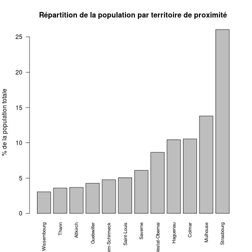

RPU 2013 - Cartographie & Population
========================================================

Notes de cartographie
=====================

références utiles
-----------------
- dossier stat Resural/carto&pop.rmd
  - carto67.rda
  - carto68.rda
  - carto_alsace.rda
- http://help.nceas.ucsb.edu/r:spatial comment utiliser les ressources de R

Les données cartographiques proviennent la base BD Carto de l'IGN dans sa version open data
.
Zone | Système géodésique | Ellipsoïde associé | Projection | Unité | Résolution | Système altimétrique
---|---|---|---|---|---|---
France continentale | RGF93 | IAG GRS 1980 | Lambert-93 | m | cm | IGN 1969 

doc technique: http://pro.ign.fr/sites/default/files/DC_GEOFLA_1-1.pdf
Les données en Lambert93 peuvent être converties en WGS84 et réciproquement par le logiciel Circée.

teléchargements: http://www.ign.fr/institut/actualites/open-data-donnees-lign-disponibles-licence-etalab

Notes sur les populations
=========================
- utilisation du recensement 2010
- dossier stat Resural/carto&pop.rmd
  - pop67.rda
  - pop68.rda
- source INSEE
  - http://www.insee.fr/fr/ppp/bases-de-donnees/recensement/populations-legales/france-regions.asp?annee=2010
   - http://www.insee.fr/fr/ppp/bases-de-donnees/recensement/populations-legales/france
-departements.asp?annee=2010 (fichier excel)
  - http://www.insee.fr/fr/ppp/bases-de-donnees/recensement/populations-legales/departement.asp?dep=67&annee=2010
  - http://www.insee.fr/fr/ppp/bases-de-donnees/recensement/populations-legales/departement.asp?dep=68&annee=2010
  - Liste des cantons, communes, arrondissements, pays: http://www.insee.fr/fr/methodes/nomenclatures/cog/telechargement.asp
  
  - Le fichier **BTT_TD_POP1B_2010.txt** dans le dossier *OpenData* contient les données du dernier recensement de la population (2010) par tranche d'age de 1 an, sexe et commune.Le source INSEE se trouve à la page *Accueil>Thèmes>Population>Évolution e...>Population et lieu de résidence antérieure - 2010 (Bases tableaux détaillés)* du site de l'Insee à l'adresse http://www.insee.fr/fr/themes/detail.asp?reg_id=99&ref_id=td-population-10

Le fichier *BTT_TD_POP1B_2010.txt* est une matrice de plus de 5 millions de lignes et 7 colonne. On en extrait les données propres à l'Alsace sous la forme de 3 fichiers:
- newPop67 pour le bas-Rhin
- newPop68 pour le haut-Rhin
- newPopAlsace pour la région


```r
file <- "~/Documents/Open Data/Population 2008/BTT_TD_POP1B_2010.txt"
doc <- read.table(file, header = TRUE, sep = ";")
head(doc)
```

  NIVEAU CODGEO REG DEP C_AGED10 C_SEXE         NB
1    ARM  13201  93  13        0      1 306,366992
2    ARM  13201  93  13        0      2 254,458782
3    ARM  13201  93  13        1      1 312,109492
4    ARM  13201  93  13        1      2 269,472118
5    ARM  13201  93  13        2      1 246,121158
6    ARM  13201  93  13        2      2 262,231821

```r
str(doc)
```

'data.frame':	5255519 obs. of  7 variables:
 $ NIVEAU  : Factor w/ 2 levels "ARM","COM": 1 1 1 1 1 1 1 1 1 1 ...
 $ CODGEO  : Factor w/ 36722 levels "01001","01002",..: 4524 4524 4524 4524 4524 4524 4524 4524 4524 4524 ...
 $ REG     : int  93 93 93 93 93 93 93 93 93 93 ...
 $ DEP     : Factor w/ 100 levels "01","02","03",..: 13 13 13 13 13 13 13 13 13 13 ...
 $ C_AGED10: int  0 0 1 1 2 2 3 3 4 4 ...
 $ C_SEXE  : int  1 2 1 2 1 2 1 2 1 2 ...
 $ NB      : Factor w/ 788519 levels "0,302373","0,332376",..: 422726 353257 430875 369773 343175 361967 389945 381695 375561 377398 ...

```r
# population du bas-Rhin
newPop67 <- doc[as.character(doc$CODGEO) > "66999" & as.character(doc$CODGEO) < 
    "68000", ]
# remplacement de la virgule par le point décimal
newPop67$NB <- as.numeric(gsub(",", ".", newPop67$NB, fixed = TRUE))
sum(newPop68$NB)
```

```
## Error: objet 'newPop68' introuvable
```

```r
# idem pour les autres
newPop68 <- doc[as.character(doc$CODGEO) > "67999" & as.character(doc$CODGEO) < 
    "69000", ]
newPop68$NB <- as.numeric(gsub(",", ".", newPop68$NB, fixed = TRUE))
sum(newPop68$NB)
```

[1] 749782

```r
newPopAlsace <- rbind(newPop67, newPop68)
sum(newpopAlsace)
```

```
## Error: objet 'newpopAlsace' introuvable
```

```r
# ménage
rm(doc)
# Sauvegarde

# Création des classes d'age
newPopAlsace$age <- cut(newPopAlsace$C_AGED10, breaks = c(-1, 1, 15, 75, 85, 
    110), labels = c("Moins de 1 an", "De 1 à 15 ans", "De 15 à 75 ans", "de 75 à 85 ans", 
    "Plus de 85 ans"))
a <- tapply(as.numeric(newPopAlsace$NB), newPopAlsace$age, sum)
sum(a)
```

[1] 1845687

```r
pop0 <- a[1]
pop1_75 <- a[2] + a[3]
pop75 <- a[4] + a[5]
a <- data.frame(c("Moins de 1 an", "De 1 à 75 ans", "Plus de 75 ans", "Total"), 
    c("pop0", "pop1_75", "pop75", "pop_tot"), c(pop0, pop1_75, pop75, 0))
names(a) <- c("Tranche d'age", "Abréviation", "Effectif")
a$Pourcentage <- round(a$Effectif * 100/sum(a$Effectif), 2)
a[4, 3] <- sum(a$Effectif)

xtable(a)
```

```
## Error: impossible de trouver la fonction "xtable"
```


  
- population légale 2010: 
  - Alsace   1 845 687

N°  |  Département  |  nb.communes  |  Pop.municipale  |  Pop.totale
----|---------------|---------------|------------------|-------------
67 |  Bas-Rhin |  527 |  1 095 905 | 1 115 226 
68 |	Haut-Rhin | 377  | 749 782 | 765 634 
pop.als.2010.totale<-1115226 + 765634
pop.als.2010.municipale<-1095905 + 749782
pop.67.2010.municipale<-1095905
pop.68.2010.municipale<-749782

Fichier ville de la base *pma*
------------------------------
Fichier exporté de la base *pma* sous le nom de *ville.csv* (5/6/2013). Il contient toutes les villes connues de Sagec.


```r
file <- "../data/ville.csv"
v <- read.csv(file, header = TRUE, sep = ",")
names(v)
```

```
##  [1] "ville_ID"          "ville_nom"         "ville_insee"      
##  [4] "ville_zip"         "ville_lambertX"    "ville_lambertY"   
##  [7] "departement_ID"    "region_ID"         "zone_ID"          
## [10] "pays_ID"           "ville_longitude"   "ville_latitude"   
## [13] "canton_ID"         "arrondissement_ID" "admin_ID"         
## [16] "territoire_sante"  "secteur_apa_ID"    "secteur_Smur_ID"  
## [19] "secteur_Adps_ID"   "secteur_Vsav_ID"   "zone_proximite"
```

On ne retient que les villes d'Alsace, c'est à dire celles appartenant à la région 42. On sauvegarde le dataframe dans la variable **va** (924 lignes et 21 colonnes)

```r
va <- v[v$region_ID == "42", ]
```

#### villes où la ZP est manquante:

```r
a <- va[va$zone_proximite == 0, c(1:3)]
a
```

```
##      ville_ID             ville_nom ville_insee
## 145       161               Rouffac          NA
## 151       168         Bad Krozingen          NA
## 154       171              Breisach          NA
## 1044     1061              AVENHEIM       67015
## 1045     1062            BEHLENHEIM       67024
## 1046     1063            BIRLENBACH       67042
## 1047     1064  BISCHTROFF-SUR-SARRE       67376
## 1049     1066           BREMMELBACH       67064
## 1050     1067       EBERBACH-WOERTH       67114
## 1051     1068              GIMBRETT       67157
## 1052     1069             GRIESBACH       67170
## 1053     1070 GRIESBACH-LE-BASTBERG       67171
## 1054     1071         HERMERSWILLER       67193
## 1055     1072             HOHWILLER       67211
## 1056     1073              IMBSHEIM       67219
## 1057     1074      KLEINFRANKENHEIM       67243
## 1058     1075            KUHLENDORF       67251
## 1059     1076         LEITERSWILLER       67262
## 1060     1077             MATTSTALL       67284
## 1061     1078            MITSCHDORF       67294
```

#### mise en forme:
- on élimine les communes sans territoire de proximité (anciennes communes)
- *zone_proximite* est transformé en facteur
- *territoire_sante* est transformé en facteur

```r
va <- va[va$zone_proximite > 0, ]
va$zone_proximite <- as.factor(va$zone_proximite)
va$territoire_sante <- as.factor(va$territoire_sante)
```

#### Sauvegarde: ("/home/jcb/Documents/Resural/Stat Resural/RPU2013/villes.RData")

```r
save(va, file = "villes.RData")
```

load("villes.RData")

notes:
- certaines communes ont fusionné avec d'autres. Liste des anciennes communes du bas-rhin: https://fr.wikipedia.org/wiki/Liste_des_anciennes_communes_du_Bas-Rhin
- l67 comte 527 communes. Voir: http://fr.wikipedia.org/wiki/Liste_des_communes_du_Bas-Rhin (liste des communes, code postal, code insee, arrondissement, canton et communauté dé de commune)
- le 68 compte 377 communes. Voir: http://fr.wikipedia.org/wiki/Liste_des_communes_du_Haut-Rhin
- l'Alsace compte 527 + 377 = 904 communes
- *Hoffe*n est une commune française, située dans le département du Bas-Rhin et la région Alsace. La commune a fusionné avec les villages de *Hermerswiller* et de *Leiterswiller* le 1er janvier 1975.
- Depuis le 1er mai 1972, *Schnersheim* regroupe les communes associées d'*Avenheim* et de *Kleinfrankenheim*.
- *Truchtersheim*: Depuis le 15 juillet 1974, la commune est fusionnée avec l'ancienne commune de *Behlenheim*.


Résultats:

```r
summary(va$zone_proximite)
```

```
##   1   2   3   4   5   6   7   8   9  10  11  12 
## 111  94  45  96  64  34 104  42 158  54  50  52
```

Combinaisons des fichiers
-------------------------
On forme un fichier commun avec
- pop67: fichier INSEE de 2010
- pop68: fichier INSEE de 2010
- va
de façon a avoir dans une même base les zones de proximité (va) et les populations correspondantes:
- base1: merging de *va* et de *pop67*
- base2: merging de *va* et de *pop68*
base1 et base2 sont fusionné en un seul fichier *base*, puis supprimés.

```r
load("~/Documents/Resural/Stat Resural/carto&pop/pop68.rda")
load("~/Documents/Resural/Stat Resural/carto&pop/pop67.rda")
base1 <- merge(va, pop67, by.x = "ville_insee", by.y = "insee")
base2 <- merge(va, pop68, by.x = "ville_insee", by.y = "insee")
base <- rbind(base1, base2)
names(base)
```

```
##  [1] "ville_insee"               "ville_ID"                 
##  [3] "ville_nom"                 "ville_zip"                
##  [5] "ville_lambertX"            "ville_lambertY"           
##  [7] "departement_ID"            "region_ID"                
##  [9] "zone_ID"                   "pays_ID"                  
## [11] "ville_longitude"           "ville_latitude"           
## [13] "canton_ID"                 "arrondissement_ID"        
## [15] "admin_ID"                  "territoire_sante"         
## [17] "secteur_apa_ID"            "secteur_Smur_ID"          
## [19] "secteur_Adps_ID"           "secteur_Vsav_ID"          
## [21] "zone_proximite"            "Code.région"              
## [23] "Nom.de.la.région"          "Code.département"         
## [25] "Code.arrondissement"       "Code.canton"              
## [27] "Code.commune"              "Nom.de.la.commune"        
## [29] "Population.municipale"     "Population.comptée.à.part"
## [31] "Population.totale"
```

```r
rm(base1, base2)
```

Note: le résultat pourrait être simplifié car des colonnes sont redondantes;

Communes où la zone de proximité est manquante:

```r
a <- base[base$zone_proximite == 0, c(1, 3)]
a
```

```
## [1] ville_insee ville_nom  
## <0 rows> (or 0-length row.names)
```

corrections:

```r
base$zone_proximite[53] <- 3
base$territoire_sante[53] <- 1

base$zone_proximite[572] <- 1
base$territoire_sante[572] <- 4

base$zone_proximite[57] <- 3
```

#### Sauvegarde de *base*:

```r
save(base, file = "base.Rda")
```

load("base.Rda")

#### Définitions INSEE

La *populatio*n d'une commune comprend :
- la population des résidences principales ;
- la population des communautés de la commune ;
- les personnes sans abri ou vivant dans des habitations mobiles

Le concept de *population totale* est défini par le décret n°2003-485 publié au Journal officiel du 8 juin 2003, relatif au recensement de la population.

La population totale d'une commune est égale à la somme de la population municipale et de la population comptée à part de la commune.

La population totale d'un ensemble de communes est égale à la somme des populations totales des communes qui le composent.

La population totale est une population légale à laquelle de très nombreux textes législatifs ou réglementaires font référence. A la différence de la population municipale, elle n'a pas d'utilisation statistique car elle comprend des doubles comptes dès lors que l'on s'intéresse à un ensemble de plusieurs communes.

Le concept de *population municipale* est défini par le décret n°2003-485 publié au Journal officiel du 8 juin 2003, relatif au recensement de la population.
La population municipale comprend les personnes ayant leur résidence habituelle (au sens du décret) sur le territoire de la commune, dans un logement ou une communauté, les personnes détenues dans les établissements pénitentiaires de la commune, les personnes sans-abri recensées sur le territoire de la commune et les personnes résidant habituellement dans une habitation mobile recensée sur le territoire de la commune.
La population municipale d'un ensemble de communes est égale à la somme des populations municipales des communes qui le composent.

Le concept de *population municipale correspond désormais à la notion de population utilisée usuellement en statistique*. En effet, elle ne comporte pas de doubles comptes : chaque personne vivant en France est comptée une fois et une seule. En 1999, c'était le concept de population sans doubles comptes qui correspondait à la notion de population statistique.

source: http://www.insee.fr/fr/methodes/default.asp?page=definitions/population-municipale-rrp.htm

Le concept de *population comptée à part* est défini par le décret n°2003-485 publié au Journal officiel du 8 juin 2003, relatif au recensement de la population.
La population comptée à part comprend certaines personnes dont la résidence habituelle (au sens du décret) est dans une autre commune mais qui ont conservé une résidence sur le territoire de la commune :
1. Les mineurs dont la résidence familiale est dans une autre commune mais qui résident, du fait de leurs études, dans la commune.
2. Les personnes ayant une résidence familiale sur le territoire de la commune et résidant dans une communauté d'une autre commune, dès lors que la communauté relève de l'une des catégories suivantes :
- services de moyen ou de long séjour des établissements publics ou privés de santé, établissements sociaux de moyen ou de long séjour, maisons de retraite, foyers et résidences sociales ;
- communautés religieuses ;
- casernes ou établissements militaires.
3. Les personnes majeures âgées de moins de 25 ans ayant leur résidence familiale sur le territoire de la commune et qui résident dans une autre commune pour leurs études.
4. Les personnes sans domicile fixe rattachées à la commune au sens de la loi du 3 janvier 1969 et non recensées dans la commune.

source: http://www.insee.fr/fr/methodes/default.asp?page=definitions/popul-comptee-a-part-rrp.htm

#### population de la région:

```r
n <- sum(base$Population.totale)
n
```

```
## [1] 1900810
```

```r
pop.tot <- sum(base$Population.totale)
pop.municipale <- sum(base$Population.municipale)
pop.municipale
```

```
## [1] 1865289
```

```r
pop.a.part <- sum(base$Population.comptée.à.part)
pop.a.part
```

```
## [1] 35521
```

Pour les raisons expliquées plus haut, les calculs statistiques font référence à la population **municipale**.

#### Population par territoire de proximité:
ATTENTION: les territoires de proximité sont dans l'ordre de SAGEC qui n'est pas celui de l'ARS

```r
territoire.prox <- c("Altkirch", "Colmar", "Guebwiller", "Haguenau", "Molsheim-Schirmeck", 
    "Mulhouse", "Sélestat-Obernai", "Saint-Louis", "Saverne", "Strasbourg", 
    "Thann", "Wissembourg")

# no des territoires de proximité
no_tp <- c(11, 7, 8, 2, 5, 10, 6, 12, 3, 4, 9, 1)

effectif <- tapply(base$Population.municipale, as.factor(base$zone_proximite), 
    sum, na.rm = TRUE)
# on élimine la colonne 0 qui ne contient que NA effectif<-effectif[-1]
effectif
```

```
##      1      2      3      4      5      6      7      8      9     10 
##  68591 196848  79628 194649  88811 257351 161331  94315 113804 485884 
##     11     12 
##  67191  56886
```

```r
names(effectif) <- territoire.prox
effectif
```

```
##           Altkirch             Colmar         Guebwiller 
##              68591             196848              79628 
##           Haguenau Molsheim-Schirmeck           Mulhouse 
##             194649              88811             257351 
##   Sélestat-Obernai        Saint-Louis            Saverne 
##             161331              94315             113804 
##         Strasbourg              Thann        Wissembourg 
##             485884              67191              56886
```

```r
pourcentage <- round(prop.table(effectif) * 100, 2)
pourcentage
```

```
##           Altkirch             Colmar         Guebwiller 
##               3.68              10.55               4.27 
##           Haguenau Molsheim-Schirmeck           Mulhouse 
##              10.44               4.76              13.80 
##   Sélestat-Obernai        Saint-Louis            Saverne 
##               8.65               5.06               6.10 
##         Strasbourg              Thann        Wissembourg 
##              26.05               3.60               3.05
```

```r
c <- cbind(no_tp, effectif, pourcentage)
c
```

```
##                    no_tp effectif pourcentage
## Altkirch              11    68591        3.68
## Colmar                 7   196848       10.55
## Guebwiller             8    79628        4.27
## Haguenau               2   194649       10.44
## Molsheim-Schirmeck     5    88811        4.76
## Mulhouse              10   257351       13.80
## Sélestat-Obernai       6   161331        8.65
## Saint-Louis           12    94315        5.06
## Saverne                3   113804        6.10
## Strasbourg             4   485884       26.05
## Thann                  9    67191        3.60
## Wissembourg            1    56886        3.05
```

```r
save(c, file = "data_tp.R")

barplot(sort(effectif), cex.names = 0.8, xlab = "", las = 2, ylab = "Effectifs", 
    main = "Répartition de la population par territoire de proximité")
```

 

```r

barplot(sort(pourcentage), cex.names = 0.8, las = 2, xlab = "", ylab = "% de la population totale", 
    main = "Répartition de la population par territoire de proximité")
```

 

Commentaires:
- le territoire  de proximité de Strasbourg est le plus important et regroupe plus du quart de la population alsacienne
- les territoires de santé de Wissembourg et de Thann sont les moins peuplés.
- les territoires de proximité de Haguenau et Colmar sont sensiblement identiques
- Strasbourg, Mulhouse et Colmar regrouppent 50% de la population.

Créer une zone de proximité
---------------------------
On fait la liste de tous les codes INSEE de la zone de proximité1:

```r
zip1 <- base$ville_insee[base$zone_proximite == 1]
head(zip1)
```

```
## [1] 68002 68004 68006 68010 68017 68018
```

Puis on fait la liste des villes correspondant à ces codes:

```r
b <- paste(zip1, sep = ",")
a <- base$ville_nom[base$ville_insee %in% b]
a[1:5]
```

```
## [1] ALTENACH     ALTKIRCH     AMMERZWILLER ASPACH       BALLERSDORF 
## 1246 Levels:  Aachen Aargau Aberdeen ACHENHEIM Achern ADAMSWILLER ... Zurich (Suisse)
```

essai de carto associée:
------------------------
La méthode dessine tous les polygones présents qui répondent à un critère de sélection. On utilise le fichier *carto_alsace.rda* qui produit un objet *SpatialPolygonsDataFrame* appelé *als*.

```r
library("maptools")
```

```
## Loading required package: sp
## Checking rgeos availability: FALSE
##  	Note: when rgeos is not available, polygon geometry 	computations in maptools depend on gpclib,
##  	which has a restricted licence. It is disabled by default;
##  	to enable gpclib, type gpclibPermit()
```

```r
load("/home/jcb/Documents/Resural/Stat Resural/carto&pop/carto_alsace.rda")
```

L'objet *als* se compose de deux parties principales:
- un slot cartographique constitué de polygones élémentaires correspondant au contour des communes.
- un slot de data présentées sous forme d'un dataframe et accessible via *als@data* et qui se compose des éléments suivants:

```r
names(als)
```

```
##  [1] "ID_GEOFLA"  "CODE_COMM"  "INSEE_COM"  "NOM_COMM"   "STATUT"    
##  [6] "X_CHF_LIEU" "Y_CHF_LIEU" "X_CENTROID" "Y_CENTROID" "Z_MOYEN"   
## [11] "SUPERFICIE" "POPULATION" "CODE_CANT"  "CODE_ARR"   "CODE_DEPT" 
## [16] "NOM_DEPT"   "CODE_REG"   "NOM_REGION"
```

Les colonnes *CODE_ARR* et *CODE_CANT* sont numérotés de la même façon pour les deux départements ce qui induit des erreurs lors du tracé des arrondissements et des canton. Il est donc nécessaire de les renuméroter:

```r
a <- paste(als@data$CODE_DEPT, als@data$CODE_ARR, sep = "")
als@data$CODE_ARR <- as.factor(a)
als@data$CODE_CANT <- as.factor(paste(als@data$CODE_DEPT, als@data$CODE_CANT, 
    sep = ""))
```

Puis de tracer la carte en sélectionnant la zone à afficher dans la variable *IDs*. D'une manière générale on peut ajouter des colonnes supplémentaires dans le dataframe de l'objet spatial (a@data$ma_variable) puis de créer une carte en fonction de cette variable.

```r
contour3 <- unionSpatialPolygons(als, IDs = als@data$CODE_DEPT)
```

```
## Error: isTRUE(gpclibPermitStatus()) n'est pas TRUE
```

```r
plot(contour3, col = c("springgreen3", "steelblue3"))
```

```
## Error: erreur d'évaluation de l'argument 'x' lors de la sélection d'une méthode pour la fonction 'plot' : Erreur : objet 'contour3' introuvable
```

```r
title(main = "2 Départements en Alsace")
```

```
## Error: plot.new has not been called yet
```

```r
legend("bottomleft", legend = "Haut-Rhin", bty = "n")
```

```
## Error: plot.new has not been called yet
```

```r
legend("topleft", legend = "Bas-Rhin", bty = "n")
```

```
## Error: plot.new has not been called yet
```

```r

contour <- unionSpatialPolygons(als, IDs = als@data$CODE_ARR)
```

```
## Error: isTRUE(gpclibPermitStatus()) n'est pas TRUE
```

```r
plot(contour)
```

```
## Error: argument 'length.out' must be of length 1
```

```r
title(main = "13 Arrondissements d'Alsace")
```

```
## Error: plot.new has not been called yet
```

```r

contour2 <- unionSpatialPolygons(als, IDs = als@data$CODE_CANT)
```

```
## Error: isTRUE(gpclibPermitStatus()) n'est pas TRUE
```

```r
plot(contour2, main = "75 Cantons d'Alsace")
```

```
## Error: erreur d'évaluation de l'argument 'x' lors de la sélection d'une méthode pour la fonction 'plot' : Erreur : objet 'contour2' introuvable
```

```r
main = "75 Cantons d'Alsace"
```


#### Note sur *unionSpatialPolygons*
La fonction agrège des polygones dans un objet *SpatialPolygons*, conformément au vecteur des *IDs* qui contient la liste des polygones à agréger; les limites internes sont dissoutes par la fonction *gUnaryUnion* du package *rgeos*. Si le package *rgeos* n'est pas disponible  mais que le package *gpclib* l'est et que les conditions d'utilisation de la license sont satisfaites, alors la méthode *union* est utilisée.

unionSpatialPolygons(SpP, IDs, threshold=NULL, avoidGEOS=FALSE, avoidUnaryUnion=FALSE)

- SpP: SpatialPolygons source
- IDs: vecteur des polygones à inclure. Il doit être égal au nombre de slots polygons de SpRs. Ce peut être un vecteur de caractères, d'integer, ou de factor (essayer table(factor(IDs)) for a sanity check). Il peut contenir des NA pour les objets qu'on ne souhaite pas inclure dans l'union.

On obtient un *SpatialPolygons* appelé *contour* formé de 4 slots: *polygons*, *plotorder*, *bbox* et *proj4agrs*. Le slot *polygons* contient 8 polygones

#### Coloriage spécifique d'une zone
On veut rprésenter la carte des arrondissements (objet *contour*) avec 2 couleurs pour chaque département. On utilise le *Spatial polygon* contour (cf carto_alsace ci-dessus) qui contient 13 polygones. On crée un vecteur contenant 13 couleurs: "springgreen3" si l'arrondissement appartient au 67 et "steelblue3" sinon. Puis on dessinne la carte en couleur: 

```r
cols <- ifelse(substr(names(contour), 1, 2) == "67", "springgreen3", "steelblue3")
plot(contour, col = cols)
```

```
## Error: argument 'length.out' must be of length 1
```

Petit test pour comprendre la fonction **merge**:

```r
a <- data.frame(id = c(1:10), name = c("annie", "bruno", "charles", "denis", 
    "émilie", "francine", "gaelle", "henri", "isabelle", "joseph"))
b <- data.frame(id = c(1:4), notes = c(10, 15, 14, 13))
a
```

```
##    id     name
## 1   1    annie
## 2   2    bruno
## 3   3  charles
## 4   4    denis
## 5   5   émilie
## 6   6 francine
## 7   7   gaelle
## 8   8    henri
## 9   9 isabelle
## 10 10   joseph
```

```r
b
```

```
##   id notes
## 1  1    10
## 2  2    15
## 3  3    14
## 4  4    13
```

```r
merge(a, b, by.x = "id", by.y = "id")
```

```
##   id    name notes
## 1  1   annie    10
## 2  2   bruno    15
## 3  3 charles    14
## 4  4   denis    13
```

```r
d <- merge(a, b, by.x = "id", by.y = "id", all.x = TRUE)
```

#### Les options de plot.SpatialPolygon

```r
plot(contour[1])
```

```
## Error: erreur d'évaluation de l'argument 'x' lors de la sélection d'une méthode pour la fonction 'plot' : Erreur dans contour[1] : objet de type 'closure' non indiçable
```

```r
plot(contour[1], border = "blue")
```

```
## Error: erreur d'évaluation de l'argument 'x' lors de la sélection d'une méthode pour la fonction 'plot' : Erreur dans contour[1] : objet de type 'closure' non indiçable
```

```r
plot(contour[1], border = "blue", col = "yellow")
```

```
## Error: erreur d'évaluation de l'argument 'x' lors de la sélection d'une méthode pour la fonction 'plot' : Erreur dans contour[1] : objet de type 'closure' non indiçable
```

```r
plot(contour[1], border = "blue", col = "yellow", density = 5)
```

```
## Error: erreur d'évaluation de l'argument 'x' lors de la sélection d'une méthode pour la fonction 'plot' : Erreur dans contour[1] : objet de type 'closure' non indiçable
```

```r
plot(contour[1], border = "blue", col = "yellow", density = 5, angle = 90)
```

```
## Error: erreur d'évaluation de l'argument 'x' lors de la sélection d'une méthode pour la fonction 'plot' : Erreur dans contour[1] : objet de type 'closure' non indiçable
```

```r
plot(contour[1], border = "blue", col = "yellow", density = 5, angle = 90, axes = TRUE)
```

```
## Error: erreur d'évaluation de l'argument 'x' lors de la sélection d'une méthode pour la fonction 'plot' : Erreur dans contour[1] : objet de type 'closure' non indiçable
```

```r
plot(contour[1], border = "blue", col = "yellow", density = 5, angle = 90, axes = TRUE, 
    lty = 3)
```

```
## Error: erreur d'évaluation de l'argument 'x' lors de la sélection d'une méthode pour la fonction 'plot' : Erreur dans contour[1] : objet de type 'closure' non indiçable
```

```r
text(coordinates(contour), labels = row.names(contour))
```

```
## Error: unable to find an inherited method for function 'coordinates' for
## signature '"function"'
```

```r
plot(contour[1], border = "blue", col = "yellow", density = 5, angle = 90, axes = TRUE, 
    lty = 3)
```

```
## Error: erreur d'évaluation de l'argument 'x' lors de la sélection d'une méthode pour la fonction 'plot' : Erreur dans contour[1] : objet de type 'closure' non indiçable
```

```r
text(coordinates(contour[1]), labels = "Haguenau")
```

```
## Error: erreur d'évaluation de l'argument 'obj' lors de la sélection d'une méthode pour la fonction 'coordinates' : Erreur dans contour[1] : objet de type 'closure' non indiçable
```

#### la méthode *coordinates* de SpatialPolygon
Retourne les coordonnées du barycentre du polygone. Pour l'illuster on forme le vecteur des chef-lieu des arrondissement d'Alsace dans l'ordre définit par R.

```r
a <- coordinates(contour)
```

```
## Error: unable to find an inherited method for function 'coordinates' for
## signature '"function"'
```

```r
a
```

```
##    id     name
## 1   1    annie
## 2   2    bruno
## 3   3  charles
## 4   4    denis
## 5   5   émilie
## 6   6 francine
## 7   7   gaelle
## 8   8    henri
## 9   9 isabelle
## 10 10   joseph
```

```r
arrondissements <- c("Haguenau", "Molsheim", "Saverne", "Sélestat", "Strasbourg-campagne", 
    "Wissembourg", "Strasbourg", "Altkirch", "Colmar", "Guegwiller", "Mulhouse", 
    "Ribeauvillé", "Thann")
a <- cbind(a, arrondissements)
```

```
## Error: arguments imply differing number of rows: 10, 13
```

```r
a
```

```
##    id     name
## 1   1    annie
## 2   2    bruno
## 3   3  charles
## 4   4    denis
## 5   5   émilie
## 6   6 francine
## 7   7   gaelle
## 8   8    henri
## 9   9 isabelle
## 10 10   joseph
```

```r
plot(contour, border = "blue", col = "wheat", axes = TRUE, lty = 1)
```

```
## Error: argument 'length.out' must be of length 1
```

```r
text(coordinates(contour), labels = arrondissements, cex = 0.6)
```

```
## Error: unable to find an inherited method for function 'coordinates' for
## signature '"function"'
```

```r
legend("topleft", legend = "Les arrondissements d'Alsace", bty = "n", adj = -0.5)
```

```
## Error: plot.new has not been called yet
```


a<-coordinates(contour)

Contour de la zone de proximié n°1
----------------------------------
(code INSEE stockés dans b) dans la région Alsace

```r
library("maptools")
b <- paste(zip1, sep = ",")
a <- base$ville_nom[base$ville_insee %in% b]
contour <- unionSpatialPolygons(als, IDs = als@data$INSEE_COM %in% b)
```

```
## Error: isTRUE(gpclibPermitStatus()) n'est pas TRUE
```

```r
plot(contour)
```

```
## Error: argument 'length.out' must be of length 1
```

Contour de la zone de proximié n°1 (seule)


```r

b <- paste(zip1, sep = ",")
a <- base$ville_nom[base$ville_insee %in% b]
zp1 <- als[als@data$INSEE_COM %in% b, ]
plot(zp1)
```

 

*zp1* est également un *SpatialPolygonsDataFrame* qui contient les mêmes éléments que l'élément racine:

```r
names(zp1)
```

```
##  [1] "ID_GEOFLA"  "CODE_COMM"  "INSEE_COM"  "NOM_COMM"   "STATUT"    
##  [6] "X_CHF_LIEU" "Y_CHF_LIEU" "X_CENTROID" "Y_CENTROID" "Z_MOYEN"   
## [11] "SUPERFICIE" "POPULATION" "CODE_CANT"  "CODE_ARR"   "CODE_DEPT" 
## [16] "NOM_DEPT"   "CODE_REG"   "NOM_REGION"
```

On peut donc lui appliquer les mêmes fonctions. Par exemple on peut tracer une figure qui représente les contours de la zone de proximité:

```r
contour <- unionSpatialPolygons(zp1, IDs = zp1@data$CODE_ARR)
```

```
## Error: isTRUE(gpclibPermitStatus()) n'est pas TRUE
```

```r
plot(contour, axes = T)
```

```
## Error: argument 'length.out' must be of length 1
```

*contour* est un *SpatialPolygons*.

Il est possible de superposer les 2 graphiques en ajoutant add=TRUE:

```r
plot(contour, axes = T, xlab = "axe x", col = "red")
```

```
## Error: argument 'length.out' must be of length 1
```

```r
plot(zp1, add = T)
```

```
## Error: plot.new has not been called yet
```

modifier l'aspect:
- lty = 1 (normal), 2, 3, 4, 5... (pointillés)
- lwd = 1 épaisseur du trait
- fg = "red" couleur des axes
- bg = "blue" couleur de fond de l'image
- col = "green" couleur de fond du polygone. col=NA or col="transparent" pour un fond transparent.
- border = "red" couleur de la bordure

exemple:

```r
plot(zp1, axes = T)
```

 

```r
plot(contour, axes = T, lty = 1, lwd = 2, fg = "blue", border = "red", add = T)
```

```
## Error: argument 'length.out' must be of length 1
```

Certains caractères accentués posent des pb comme dans *préfecture*:

```r
summary(zp1$STATUT)
```

```
##         Capitale d'\xe9tat           Chef-lieu canton 
##                          0                          3 
##             Commune simple              Pr\xe9fecture 
##                        107                          0 
## Pr\xe9fecture de r\xe9gion         Sous-pr\xe9fecture 
##                          0                          1
```

Avec la fonction *gsub*, on remplace les caractères anormaux par *e*:

```r
zp1$STATUT <- gsub("\xe9", "e", zp1$STATUT, fixed = F)
summary(as.factor(zp1$STATUT))
```

```
## Chef-lieu canton   Commune simple  Sous-prefecture 
##                3              107                1
```

Il est alorspossible de récupérer les coordonées de la sous-préfecture. Il faut d'abord récupérer le dataframe associé à zp1. NB il faut multiplier les coordonnées x et y par 100 pour être cohérent avec la carte. pch = 19 désigne le symbole rond plein.

```r
a <- zp1@data
head(a)
```

```
##      ID_GEOFLA CODE_COMM INSEE_COM      NOM_COMM         STATUT X_CHF_LIEU
## 180        181       152     68152      ILLFURTH Commune simple      10198
## 2375      2376       282     68282       ROMAGNY Commune simple      10053
## 3175      3176       196     68196         MAGNY Commune simple      10044
## 4413      4414       176     68176     LARGITZEN Commune simple      10146
## 4640      4641       080     68080      EMLINGEN Commune simple      10221
## 6686      6687       081     68081 SAINT-BERNARD Commune simple      10151
##      Y_CHF_LIEU X_CENTROID Y_CENTROID Z_MOYEN SUPERFICIE POPULATION
## 180       67388      10199      67392     299        909        2.3
## 2375      67310      10054      67313     360        289        0.2
## 3175      67305      10039      67306     361        427        0.3
## 4413      67263      10151      67262     404        571        0.3
## 4640      67335      10221      67340     326        243        0.3
## 6686      67384      10153      67378     281        601        0.5
##      CODE_CANT CODE_ARR CODE_DEPT  NOM_DEPT CODE_REG NOM_REGION
## 180       6801      681        68 HAUT-RHIN       42     ALSACE
## 2375      6805      681        68 HAUT-RHIN       42     ALSACE
## 3175      6805      681        68 HAUT-RHIN       42     ALSACE
## 4413      6810      681        68 HAUT-RHIN       42     ALSACE
## 4640      6801      681        68 HAUT-RHIN       42     ALSACE
## 6686      6801      681        68 HAUT-RHIN       42     ALSACE
```

```r

sp <- a[a$STATUT == "Sous-prefecture", ]
sp
```

```
##       ID_GEOFLA CODE_COMM INSEE_COM NOM_COMM          STATUT X_CHF_LIEU
## 12326     12327       004     68004 ALTKIRCH Sous-prefecture      10182
##       Y_CHF_LIEU X_CENTROID Y_CENTROID Z_MOYEN SUPERFICIE POPULATION
## 12326      67332      10186      67330     332        953        5.7
##       CODE_CANT CODE_ARR CODE_DEPT  NOM_DEPT CODE_REG NOM_REGION
## 12326      6801      681        68 HAUT-RHIN       42     ALSACE
```

```r

x <- sp$X_CHF_LIEU * 100
y <- sp$Y_CHF_LIEU * 100
nom <- sp$NOM_COMM

plot(contour)
```

```
## Error: argument 'length.out' must be of length 1
```

```r
points(x, y, pch = 19, col = 3)
```

```
## Error: plot.new has not been called yet
```

```r
text(x, y, labels = nom, cex = 0.8, pos = 3)
```

```
## Error: plot.new has not been called yet
```

Les zones de proximités officielles sont dans le fichier zp.csv

```r
# zpo<-read.csv('zp.csv',header=TRUE, sep=',')
zpo <- read.csv("~/Documents/Resural/Stat Resural/RPU2013/cartograhie/data/zp.csv", 
    header = TRUE, sep = ",")
names(zpo)
```

```
## [1] "CODE.DEP"                         "CODE.COMMUNE"                    
## [3] "LIBELLE.DES.COMMUNES"             "LIBELLE.DES.TERRITOIRES.DE.SANTE"
## [5] "CODE.ZONES.DE.PROXIMITE"          "LIBELLE.DES.ZONES.DE.PROXIMITE"
```

```r
print("Nb de communes par territoire de santé")
```

```
## [1] "Nb de communes par territoire de santé"
```

```r
a <- zpo$LIBELLE.DES.TERRITOIRES.DE.SANTE
summary(a)
```

```
## TERRITOIRE DE SANTE 1 TERRITOIRE DE SANTE 2 TERRITOIRE DE SANTE 3 
##                   306                   144                   213 
## TERRITOIRE DE SANTE 4 
##                   241
```

```r
print("Nb de communes par territoire de proximité")
```

```
## [1] "Nb de communes par territoire de proximité"
```

```r
a <- zpo$LIBELLE.DES.ZONES.DE.PROXIMITE
summary(a)
```

```
##           ALTKIRCH             COLMAR         GUEBWILLER 
##                111                 94                 42 
##           HAGUENAU MOLSHEIM SCHIRMECK           MULHOUSE 
##                 90                 92                 40 
##   OBERNAI-SELESTAT        SAINT-LOUIS            SAVERNE 
##                101                 40                162 
##         STRASBOURG              THANN        WISSEMBOURG 
##                 28                 50                 54
```

NB: la numérotation ARS des territoires de proximité de proximité ne correspond pas à celle de Sagec. Le code commune du fichier zpo correspond au code INSEE.

Utilisation du fichier *zpo* à la place du fichier *ville*
-----------------------------------------------------------
Crée un objet *zone de proximité 2*, en dessine le contour ainsi que le chef lieu:


```r
zpo <- read.csv("~/Documents/Resural/Stat Resural/RPU2013/cartograhie/data/zp.csv", 
    header = TRUE, sep = ",")
base1 <- merge(zpo, pop67, by.x = "CODE.COMMUNE", by.y = "insee")
base2 <- merge(zpo, pop68, by.x = "CODE.COMMUNE", by.y = "insee")
base <- rbind(base1, base2)
rm(base1, base2)
names(base)
```

```
##  [1] "CODE.COMMUNE"                     "CODE.DEP"                        
##  [3] "LIBELLE.DES.COMMUNES"             "LIBELLE.DES.TERRITOIRES.DE.SANTE"
##  [5] "CODE.ZONES.DE.PROXIMITE"          "LIBELLE.DES.ZONES.DE.PROXIMITE"  
##  [7] "Code.région"                      "Nom.de.la.région"                
##  [9] "Code.département"                 "Code.arrondissement"             
## [11] "Code.canton"                      "Code.commune"                    
## [13] "Nom.de.la.commune"                "Population.municipale"           
## [15] "Population.comptée.à.part"        "Population.totale"
```

```r

# spécifique de la zone de proximité 2
zip2 <- base$CODE.COMMUNE[base$CODE.ZONES.DE.PROXIMITE == 2]
b <- paste(zip2, sep = ",")
zp2 <- als[als@data$INSEE_COM %in% b, ]
plot(zp2)

contour2 <- unionSpatialPolygons(zp2, IDs = zp2@data$CODE_DEPT)
```

```
## Error: isTRUE(gpclibPermitStatus()) n'est pas TRUE
```

```r
plot(contour2)
```

```
## Error: erreur d'évaluation de l'argument 'x' lors de la sélection d'une méthode pour la fonction 'plot' : Erreur : objet 'contour2' introuvable
```

```r
save(contour2, file = "ZPHag.Rda")
```

```
## Error: objet 'contour2' introuvable
```

```r

zp2$STATUT <- gsub("\xe9", "e", zp2$STATUT, fixed = F)
a <- zp2@data
sp <- a[a$STATUT == "Sous-prefecture", ]
x <- sp$X_CHF_LIEU * 100
y <- sp$Y_CHF_LIEU * 100
nom <- sp$NOM_COMM
points(x, y, pch = 19, col = 3)
text(x, y, labels = nom, cex = 0.8, pos = 3)

# positionnement du CH Haguenau
x <- 1050806.723
y <- 6865868.72
nom <- "CH Haguenau"
points(x, y, pch = 19, col = "red")
text(x, y, labels = nom, cex = 0.8, pos = 3)

library("pixmap")
img <- "../../Fichiers source/logos/hop11.pnm"
hop <- read.pnm(img)
```

```
## Warning: 'x' is NULL so the result will be NULL
```

```r
plot(contour2)
```

```
## Error: erreur d'évaluation de l'argument 'x' lors de la sélection d'une méthode pour la fonction 'plot' : Erreur : objet 'contour2' introuvable
```

```r
x <- 2.5
y <- 2.5
addlogo(hop, px = c(x, x + 0.5), py = c(y, y + 0.5), asp = 1)
```

 

```r
# plot(hop, add = TRUE)

str(hop)
```

```
## Formal class 'pixmapRGB' [package "pixmap"] with 8 slots
##   ..@ red     : num [1:32, 1:32] 1 1 1 1 1 1 1 1 1 1 ...
##   ..@ green   : num [1:32, 1:32] 1 1 1 1 1 1 1 1 1 1 ...
##   ..@ blue    : num [1:32, 1:32] 1 1 1 1 1 1 1 1 1 1 ...
##   ..@ channels: chr [1:3] "red" "green" "blue"
##   ..@ size    : int [1:2] 32 32
##   ..@ cellres : num [1:2] 1 1
##   ..@ bbox    : num [1:4] 0 0 32 32
##   ..@ bbcent  : logi FALSE
```

```r
pin <- par("pin")
pin
```

```
## [1] 5.76 5.16
```

```r
usr <- par("usr")
usr
```

```
## [1] 1026818 1077327 6849387 6894634
```

```r

x.asp <- (hop@size[2] * (usr[2] - usr[1])/pin[1])
y.asp <- (hop@size[1] * (usr[4] - usr[3])/pin[2])
x.asp
```

```
## [1] 280602
```

```r
y.asp
```

```
## [1] 280602
```

Zone de proximité 3 (Saverne)
--------------------


```r
zip3 <- base$CODE.COMMUNE[base$CODE.ZONES.DE.PROXIMITE == 3]
b <- paste(zip3, sep = ",")
zp3 <- als[als@data$INSEE_COM %in% b, ]
plot(zp3)

contour3 <- unionSpatialPolygons(zp3, IDs = zp3@data$CODE_DEPT)
```

```
## Error: isTRUE(gpclibPermitStatus()) n'est pas TRUE
```

```r
plot(contour3)
```

```
## Error: erreur d'évaluation de l'argument 'x' lors de la sélection d'une méthode pour la fonction 'plot' : Erreur : objet 'contour3' introuvable
```

```r

zp3$STATUT <- gsub("\xe9", "e", zp3$STATUT, fixed = F)
a <- zp3@data
sp <- a[a$STATUT == "Sous-prefecture", ]
x <- sp$X_CHF_LIEU * 100
y <- sp$Y_CHF_LIEU * 100
nom <- sp$NOM_COMM
points(x, y, pch = 19, col = 3)
text(x, y, labels = nom, cex = 0.8, pos = 3)
```

 

```r
plot(contour2, add = T)
```

```
## Error: erreur d'évaluation de l'argument 'x' lors de la sélection d'une méthode pour la fonction 'plot' : Erreur : objet 'contour2' introuvable
```

Zone de proximité 4
--------------------


```r
zip4 <- base$CODE.COMMUNE[base$CODE.ZONES.DE.PROXIMITE == 4]
b <- paste(zip4, sep = ",")
zp4 <- als[als@data$INSEE_COM %in% b, ]
plot(zp4)

contour4 <- unionSpatialPolygons(zp4, IDs = zp4@data$CODE_DEPT)
```

```
## Error: isTRUE(gpclibPermitStatus()) n'est pas TRUE
```

```r
plot(contour4)
```

```
## Error: erreur d'évaluation de l'argument 'x' lors de la sélection d'une méthode pour la fonction 'plot' : Erreur : objet 'contour4' introuvable
```

```r

zp4$STATUT <- gsub("\xe9", "e", zp4$STATUT, fixed = F)
a <- zp4@data
sp <- a[a$STATUT == "Prefecture de region", ]
x <- sp$X_CHF_LIEU * 100
y <- sp$Y_CHF_LIEU * 100
nom <- sp$NOM_COMM
points(x, y, pch = 19, col = 3)
text(x, y, labels = nom, cex = 0.8, pos = 3)
```

 

```r
plot(contour4, add = T)
```

```
## Error: erreur d'évaluation de l'argument 'x' lors de la sélection d'une méthode pour la fonction 'plot' : Erreur : objet 'contour4' introuvable
```


Zone de proximité 1 (Wissembourg)
--------------------


```r
zip1 <- base$CODE.COMMUNE[base$CODE.ZONES.DE.PROXIMITE == 1]
b <- paste(zip1, sep = ",")
zp1 <- als[als@data$INSEE_COM %in% b, ]
plot(zp1)

contour1 <- unionSpatialPolygons(zp1, IDs = zp1@data$CODE_DEPT)
```

```
## Error: isTRUE(gpclibPermitStatus()) n'est pas TRUE
```

```r
plot(contour1)
```

```
## Error: erreur d'évaluation de l'argument 'x' lors de la sélection d'une méthode pour la fonction 'plot' : Erreur : objet 'contour1' introuvable
```

```r

zp1$STATUT <- gsub("\xe9", "e", zp1$STATUT, fixed = F)
a <- zp1@data
sp <- a[a$STATUT == "Sous-prefecture", ]
x <- sp$X_CHF_LIEU * 100
y <- sp$Y_CHF_LIEU * 100
nom <- sp$NOM_COMM
points(x, y, pch = 19, col = 1)
text(x, y, labels = nom, cex = 0.8, pos = 1)
```

 

```r
plot(contour1, add = T)
```

```
## Error: erreur d'évaluation de l'argument 'x' lors de la sélection d'une méthode pour la fonction 'plot' : Erreur : objet 'contour1' introuvable
```

Zone de proximité 5 (Molsheim)
--------------------


```r
zip5 <- base$CODE.COMMUNE[base$CODE.ZONES.DE.PROXIMITE == 5]
b <- paste(zip5, sep = ",")
zp5 <- als[als@data$INSEE_COM %in% b, ]
plot(zp5)

contour5 <- unionSpatialPolygons(zp5, IDs = zp5@data$CODE_DEPT)
```

```
## Error: isTRUE(gpclibPermitStatus()) n'est pas TRUE
```

```r
plot(contour5)
```

```
## Error: erreur d'évaluation de l'argument 'x' lors de la sélection d'une méthode pour la fonction 'plot' : Erreur : objet 'contour5' introuvable
```

```r

zp5$STATUT <- gsub("\xe9", "e", zp5$STATUT, fixed = F)
a <- zp5@data
sp <- a[a$STATUT == "Sous-prefecture", ]
x <- sp$X_CHF_LIEU * 100
y <- sp$Y_CHF_LIEU * 100
nom <- sp$NOM_COMM
points(x, y, pch = 19, col = 1)
text(x, y, labels = nom, cex = 0.8, pos = 1)
```

 

```r
plot(contour5, add = T)
```

```
## Error: erreur d'évaluation de l'argument 'x' lors de la sélection d'une méthode pour la fonction 'plot' : Erreur : objet 'contour5' introuvable
```

Zone de proximité 6 (Selestat)
--------------------


```r
zip6 <- base$CODE.COMMUNE[base$CODE.ZONES.DE.PROXIMITE == 6]
b <- paste(zip6, sep = ",")
zp6 <- als[als@data$INSEE_COM %in% b, ]
plot(zp6)

contour6 <- unionSpatialPolygons(zp6, IDs = zp6@data$CODE_DEPT)
```

```
## Error: isTRUE(gpclibPermitStatus()) n'est pas TRUE
```

```r
plot(contour6)
```

```
## Error: erreur d'évaluation de l'argument 'x' lors de la sélection d'une méthode pour la fonction 'plot' : Erreur : objet 'contour6' introuvable
```

```r

zp6$STATUT <- gsub("\xe9", "e", zp6$STATUT, fixed = F)
a <- zp6@data
sp <- a[a$STATUT == "Sous-prefecture", ]
x <- sp$X_CHF_LIEU * 100
y <- sp$Y_CHF_LIEU * 100
nom <- sp$NOM_COMM
points(x, y, pch = 19, col = 1)
text(x, y, labels = nom, cex = 0.8, pos = 1)
```

 

```r
plot(contour6, add = T)
```

```
## Error: erreur d'évaluation de l'argument 'x' lors de la sélection d'une méthode pour la fonction 'plot' : Erreur : objet 'contour6' introuvable
```

Zone de proximité 7 (Colmar)
--------------------


```r
zip7 <- base$CODE.COMMUNE[base$CODE.ZONES.DE.PROXIMITE == 7]
b <- paste(zip7, sep = ",")
zp7 <- als[als@data$INSEE_COM %in% b, ]
plot(zp7)

contour7 <- unionSpatialPolygons(zp7, IDs = zp7@data$CODE_DEPT)
```

```
## Error: isTRUE(gpclibPermitStatus()) n'est pas TRUE
```

```r
plot(contour7)
```

```
## Error: erreur d'évaluation de l'argument 'x' lors de la sélection d'une méthode pour la fonction 'plot' : Erreur : objet 'contour7' introuvable
```

```r

zp7$STATUT <- gsub("\xe9", "e", zp7$STATUT, fixed = F)
a <- zp7@data
sp <- a[a$STATUT == "Prefecture", ]
x <- sp$X_CHF_LIEU * 100
y <- sp$Y_CHF_LIEU * 100
nom <- sp$NOM_COMM
points(x, y, pch = 19, col = 1)
text(x, y, labels = nom, cex = 0.8, pos = 1)
```

 

```r
plot(contour7, add = T)
```

```
## Error: erreur d'évaluation de l'argument 'x' lors de la sélection d'une méthode pour la fonction 'plot' : Erreur : objet 'contour7' introuvable
```

Zone de proximité 8 (Guebwiller)
--------------------


```r
zip8 <- base$CODE.COMMUNE[base$CODE.ZONES.DE.PROXIMITE == 8]
b <- paste(zip8, sep = ",")
zp8 <- als[als@data$INSEE_COM %in% b, ]
plot(zp8)

contour8 <- unionSpatialPolygons(zp8, IDs = zp8@data$CODE_DEPT)
```

```
## Error: isTRUE(gpclibPermitStatus()) n'est pas TRUE
```

```r
plot(contour8)
```

```
## Error: erreur d'évaluation de l'argument 'x' lors de la sélection d'une méthode pour la fonction 'plot' : Erreur : objet 'contour8' introuvable
```

```r

zp8$STATUT <- gsub("\xe9", "e", zp8$STATUT, fixed = F)
a <- zp8@data
sp <- a[a$STATUT == "Sous-prefecture", ]
x <- sp$X_CHF_LIEU * 100
y <- sp$Y_CHF_LIEU * 100
nom <- sp$NOM_COMM
points(x, y, pch = 19, col = 1)
text(x, y, labels = nom, cex = 0.8, pos = 1)
```

 

```r
plot(contour8, add = T)
```

```
## Error: erreur d'évaluation de l'argument 'x' lors de la sélection d'une méthode pour la fonction 'plot' : Erreur : objet 'contour8' introuvable
```

Zone de proximité 9 (Thann)
--------------------


```r
zip9 <- base$CODE.COMMUNE[base$CODE.ZONES.DE.PROXIMITE == 9]
b <- paste(zip9, sep = ",")
zp9 <- als[als@data$INSEE_COM %in% b, ]
plot(zp9)

contour9 <- unionSpatialPolygons(zp9, IDs = zp9@data$CODE_DEPT)
```

```
## Error: isTRUE(gpclibPermitStatus()) n'est pas TRUE
```

```r
plot(contour9)
```

```
## Error: erreur d'évaluation de l'argument 'x' lors de la sélection d'une méthode pour la fonction 'plot' : Erreur : objet 'contour9' introuvable
```

```r

zp9$STATUT <- gsub("\xe9", "e", zp9$STATUT, fixed = F)
a <- zp9@data
sp <- a[a$STATUT == "Sous-prefecture", ]
x <- sp$X_CHF_LIEU * 100
y <- sp$Y_CHF_LIEU * 100
nom <- sp$NOM_COMM
points(x, y, pch = 19, col = 1)
text(x, y, labels = nom, cex = 0.8, pos = 1)
```

 

```r
plot(contour9, add = T)
```

```
## Error: erreur d'évaluation de l'argument 'x' lors de la sélection d'une méthode pour la fonction 'plot' : Erreur : objet 'contour9' introuvable
```

Zone de proximité 10 (Mulhouse)
--------------------


```r
zip10 <- base$CODE.COMMUNE[base$CODE.ZONES.DE.PROXIMITE == 10]
b <- paste(zip10, sep = ",")
zp10 <- als[als@data$INSEE_COM %in% b, ]
plot(zp10)

contour10 <- unionSpatialPolygons(zp10, IDs = zp10@data$CODE_DEPT)
```

```
## Error: isTRUE(gpclibPermitStatus()) n'est pas TRUE
```

```r
plot(contour10)
```

```
## Error: erreur d'évaluation de l'argument 'x' lors de la sélection d'une méthode pour la fonction 'plot' : Erreur : objet 'contour10' introuvable
```

```r

zp10$STATUT <- gsub("\xe9", "e", zp10$STATUT, fixed = F)
a <- zp10@data
sp <- a[a$STATUT == "Sous-prefecture", ]
x <- sp$X_CHF_LIEU * 100
y <- sp$Y_CHF_LIEU * 100
nom <- sp$NOM_COMM
points(x, y, pch = 19, col = 1)
text(x, y, labels = nom, cex = 0.8, pos = 1)
```

 

```r
plot(contour10, add = T)
```

```
## Error: erreur d'évaluation de l'argument 'x' lors de la sélection d'une méthode pour la fonction 'plot' : Erreur : objet 'contour10' introuvable
```

Zone de proximité 11 (Altkirch)
--------------------


```r
zip11 <- base$CODE.COMMUNE[base$CODE.ZONES.DE.PROXIMITE == 11]
b <- paste(zip11, sep = ",")
zp11 <- als[als@data$INSEE_COM %in% b, ]
plot(zp11)

contour11 <- unionSpatialPolygons(zp11, IDs = zp11@data$CODE_DEPT)
```

```
## Error: isTRUE(gpclibPermitStatus()) n'est pas TRUE
```

```r
plot(contour11)
```

```
## Error: erreur d'évaluation de l'argument 'x' lors de la sélection d'une méthode pour la fonction 'plot' : Erreur : objet 'contour11' introuvable
```

```r

zp11$STATUT <- gsub("\xe9", "e", zp11$STATUT, fixed = F)
a <- zp11@data
sp <- a[a$STATUT == "Sous-prefecture", ]
x <- sp$X_CHF_LIEU * 100
y <- sp$Y_CHF_LIEU * 100
nom <- sp$NOM_COMM
points(x, y, pch = 19, col = 1)
text(x, y, labels = nom, cex = 0.8, pos = 1)
```

 

```r
plot(contour11, add = T)
```

```
## Error: erreur d'évaluation de l'argument 'x' lors de la sélection d'une méthode pour la fonction 'plot' : Erreur : objet 'contour11' introuvable
```

Zone de proximité 12
--------------------


```r
zip12 <- base$CODE.COMMUNE[base$CODE.ZONES.DE.PROXIMITE == 12]
b <- paste(zip12, sep = ",")
zp12 <- als[als@data$INSEE_COM %in% b, ]
plot(zp12)

contour12 <- unionSpatialPolygons(zp12, IDs = zp12@data$CODE_DEPT)
```

```
## Error: isTRUE(gpclibPermitStatus()) n'est pas TRUE
```

```r
plot(contour12)
```

```
## Error: erreur d'évaluation de l'argument 'x' lors de la sélection d'une méthode pour la fonction 'plot' : Erreur : objet 'contour12' introuvable
```

```r

zp12$STATUT <- gsub("\xe9", "e", zp12$STATUT, fixed = F)
a <- zp12@data
b <- a[a$NOM_COMM == "SAINT-LOUIS", ]
x <- b$X_CHF_LIEU * 100
y <- b$Y_CHF_LIEU * 100
nom <- b$NOM_COMM
points(x, y, pch = 19, col = 1)
text(x, y, labels = nom, cex = 0.8, pos = 2)
```

 

```r
plot(contour12, add = T)
```

```
## Error: erreur d'évaluation de l'argument 'x' lors de la sélection d'une méthode pour la fonction 'plot' : Erreur : objet 'contour12' introuvable
```

Analyse de la superficie
========================
#### superficie de l'Alsace en km2:
surface<-sum(als$SUPERFICIE)/100

#### superficie de l'arrondissement 1
s1<-als[als$CODE_ARR=="1","SUPERFICIE"]
summary(s1)
names(s1)
sum(s1$SUPERFICIE)/100

#### Merging des fichiers *als* et *base*
On fusionne les tables als et base sur la colonne INSEE, ce qui permet de mettre dans la même table las zones de proximite, la surface et la population.
names(als)
names(base)
colonne commune *als$INSEE_COM* et *base$ville_insee*
base_als<-merge(base,als,by.x="ville_insee",by.y="INSEE_COM")
names(base_als)
Surface de la zone de proximité 1 (Altkirch)
szp1<-als[base_als$zone_proximite=="1","SUPERFICIE"]
sum(szp1$SUPERFICIE)/100
[1] 818.17
Pour tous les territoires de proximité (faire une fonction et un dataframe):
s<-0;for(i in 1:12){szp<-als[base_als$zone_proximite==i,"SUPERFICIE"];s1<-sum(szp$SUPERFICIE)/100;;s<-s+s1;print(paste(i," ->",s1,s,sep=" "))}

à transfomer en fonction:
s<-0;for(i in 1:12){szp<-als[base_als$zone_proximite==i,"SUPERFICIE"];s[i]<-sum(szp$SUPERFICIE)/100;s<-s+s[i];print(paste(i," ->",s[i],"(",s,")",sep=" "))}

#### Merging des fichiers *als* et *zpo*

- als est le fichier shapefile des données alsace. Sa partie donnée est accessible via *als@data* par exemple  names(als@data). Les communes sont repérées par *INSEE_COM*
- *zpo* est le fichier des zones de proximité. Les communes sont repérées par *CODE.COMMUNE*
- on fait un merging des 2 fichiers sur ces colonnes:

```r
zpals <- merge(zpo, als, by.x = "CODE.COMMUNE", by.y = "INSEE_COM")
```

en fait on obtient un simple dataframe et pas un spatialPolygon. Pour que celà fonctionne il faut merger uniquement les data:
zpals<-als
zpals@data<-merge(zpals@data,zpo,by.x="INSEE_COM",by.y="CODE.COMMUNE")
zp<-zpals[zpals$CODE.ZONES.DE.PROXIMITE==1,]

Le merging fonctionne mais les datas ne correspondent plus au shapefile ?

soluttion trouvée:  
Let df = data frame, sp = spatial polygon object and by = name or column number of common column. You can then merge the data frame into the sp object using the following line of code

sp@data = data.frame(sp@data, df[match(sp@data[,by], df[,by]),])

Here is how the code works. The match function inside aligns the columns so that order is preserved. So when we merge it with sp@data, order is correctly preserved. A quick check to see if the code has worked is to inspect the two columns corresponding to the common column and see if they are identical (the common columns get duplicated and it is easy to remove the copy, but i keep it as it is a good check):

```r
zpals <- als
zpals@data <- data.frame(zpals@data, zpo[match(zpals@data[, "INSEE_COM"], zpo[, 
    "CODE.COMMUNE"]), ])
zp <- zpals[zpals$CODE.ZONES.DE.PROXIMITE == 1, ]
plot(zp)
```

 

Ca marche!!! auteur: http://stackoverflow.com/users/235349/ramnath (Ramnath Vaidyanathan is an Assistant Professor of Operations Management at the Desautels Faculty of Management, McGill University. He got his PhD from the Wharton School and worked at McKinsey & Co prior to that. )

Dessin  du contour: nécessite la package *maptools*  
czp = contour de la zone de proximité:

```r
library("maptools")
czp <- unionSpatialPolygons(zp, IDs = zp@data$CODE_DEPT)
```

```
## Error: isTRUE(gpclibPermitStatus()) n'est pas TRUE
```

```r
plot(czp)
```

```
## Error: erreur d'évaluation de l'argument 'x' lors de la sélection d'une méthode pour la fonction 'plot' : Erreur : objet 'czp' introuvable
```

```r
title(main = "Zone de proximité de Wissembourg")
```

```
## Error: plot.new has not been called yet
```

```
#### Dessin du contour de l'ensemble des zones de proximité (czps)

```r
czps <- unionSpatialPolygons(zpals, IDs = zpals$CODE.ZONES.DE.PROXIMITE)
```

```
## Error: isTRUE(gpclibPermitStatus()) n'est pas TRUE
```

```r
plot(czps)
```

```
## Error: erreur d'évaluation de l'argument 'x' lors de la sélection d'une méthode pour la fonction 'plot' : Erreur : objet 'czps' introuvable
```

```r
plot(czps, col = c("red", "yellow", "blue", "green", "orange"))
```

```
## Error: erreur d'évaluation de l'argument 'x' lors de la sélection d'une méthode pour la fonction 'plot' : Erreur : objet 'czps' introuvable
```

```r
title(main = "Zone de proximité en Alsace")
```

```
## Error: plot.new has not been called yet
```

#### Dessin du contour des territoires de santé (ctss)

```r
ctss <- unionSpatialPolygons(zpals, IDs = zpals$LIBELLE.DES.TERRITOIRES.DE.SANTE)
```

```
## Error: isTRUE(gpclibPermitStatus()) n'est pas TRUE
```

```r
plot(ctss)
```

```
## Error: erreur d'évaluation de l'argument 'x' lors de la sélection d'une méthode pour la fonction 'plot' : Erreur : objet 'ctss' introuvable
```

```r
title(main = "Territoires de santé en Alsace")
```

```
## Error: plot.new has not been called yet
```

```r
save(ctss, file = "als_ts.Rda")
```

```
## Error: objet 'ctss' introuvable
```

#### Dessin territoires de santé (ctss) et des zones de proximité (czps)

```r
plot(czps)
```

```
## Error: erreur d'évaluation de l'argument 'x' lors de la sélection d'une méthode pour la fonction 'plot' : Erreur : objet 'czps' introuvable
```

```r
plot(ctss, border = "red", add = T)
```

```
## Error: erreur d'évaluation de l'argument 'x' lors de la sélection d'une méthode pour la fonction 'plot' : Erreur : objet 'ctss' introuvable
```

```r

plot(ctss, col = c("yellow", "blue", "green", "orange"), border = "red", add = T)
```

```
## Error: erreur d'évaluation de l'argument 'x' lors de la sélection d'une méthode pour la fonction 'plot' : Erreur : objet 'ctss' introuvable
```

```r
plot(czps, add = TRUE)
```

```
## Error: erreur d'évaluation de l'argument 'x' lors de la sélection d'une méthode pour la fonction 'plot' : Erreur : objet 'czps' introuvable
```

essais avec les couleurs:
- plot(ctss,col=heat.colors(4))
- plot(czps,col=heat.colors(12))
- plot(czps,col=terrain.colors(12))
- plot(czps,col=topo.colors(12))
- plot(czps,col=cm.colors(12))

essai avec "RColorBrewer"

```r
library("RColorBrewer")
```

```
## Error: there is no package called 'RColorBrewer'
```

```r
wp <- brewer.pal(12, "Set3")
```

```
## Error: impossible de trouver la fonction "brewer.pal"
```

```r
plot(czps, col = wp)
```

```
## Error: erreur d'évaluation de l'argument 'x' lors de la sélection d'une méthode pour la fonction 'plot' : Erreur : objet 'czps' introuvable
```

```r
title(main = "Zone de proximité en Alsace")
```

```
## Error: plot.new has not been called yet
```

couleurs prop. au % de 75 ans:  
Le % des 75 ans par zone de proximité est donné par *pbc* (voir carto&pop)  
pbc
     1      2      3      4      5      6      7      8      9     10     11     12 
 3.425 11.743  4.161 10.036  4.785 14.772  8.449  4.212  6.863 24.431  4.071  3.051  
avec l'ordre suivant:  
altk, colmar, gueb, hag, mols, mul, obernai, stlouis, saverne, stras,thann, wiss (ordre alphabétique = ordre de l'ARS)  
ce qui donne par tranche de 5% arrondi
c
 [1] 1 3 1 3 1 3 2 1 2 5 1 1
 
Or l'ordre d'affichage des polygones est le suivant:  
czps@plotOrder
 [1]  6 10  9  5  8  3 11  1 12  2  7  4

Peut-on changer l'ordre d'affichage ?

c<-c(3,5,2,1,1,1,1,1,1,3,2,3)

names(czps)
 [1] "1"  "10" "11" "12" "2"  "3"  "4"  "5"  "6"  "7"  "8"  "9" 

*czps* dessine les *zp* dans l'ordre suivant:  
- wis, mul, alt, stl, hag, sav, str, mols, obe, col, gue, tha
- en chiffre: 12,6,1,8,4,9,10,5,7,2,3,11
ce qui donne le vecteur de couleur:  

```r
c <- c(1, 3, 1, 1, 3, 2, 5, 1, 2, 3, 1, 1)
palette(gray(5:0/5))
plot(czps, col = c)
```

```
## Error: erreur d'évaluation de l'argument 'x' lors de la sélection d'une méthode pour la fonction 'plot' : Erreur : objet 'czps' introuvable
```

```r
title(main = "Répartition des 75 ans et plus", xlab = "Chiffres INSEE 2010")
```

```
## Error: plot.new has not been called yet
```

```r
legend("topleft", col = gray(5:0/5), legend = c("0-5%", "5-10%", "10-15%", "15-20%", 
    "20-25%"), pch = 15, cex = 0.8, bty = "n")
```

```
## Error: plot.new has not been called yet
```

```r
mtext("© RESURAL 2013", cex = 0.6, side = 4, line = -1, adj = 0.1)
```

```
## Error: plot.new has not been called yet
```

NB: pour déterminer l'ordre de traçage, on utilise la méthode suivante:
col<-c(1,2,2,2,2,2,2,2,2,2,2,2,2)
 plot(czps,col=col)
 col<-c(2,1,2,2,2,2,2,2,2,2,2,2,2)
 plot(czps,col=col)
 col<-c(2,2,1,2,2,2,2,2,2,2,2,2,2)
 plot(czps,col=col)
 col<-c(2,2,2,1,2,2,2,2,2,2,2,2,2)
 plot(czps,col=col)
 col<-c(2,2,2,2,1,2,2,2,2,2,2,2,2)
 plot(czps,col=col)
 col<-c(2,2,2,2,2,1,2,2,2,2,2,2,2)
 plot(czps,col=col)
col<-c(2,2,2,2,2,2,1,2,2,2,2,2,2)
plot(czps,col=col)
col<-c(2,2,2,2,2,2,2,1,2,2,2,2,2) 
plot(czps,col=col)
col<-c(2,2,2,2,2,2,2,2,1,2,2,2,2)
plot(czps,col=col)
col<-c(2,2,2,2,2,2,2,2,2,1,2,2,2)
plot(czps,col=col)
col<-c(2,2,2,2,2,2,2,2,2,2,1,2,2)
plot(czps,col=col)
col<-c(2,2,2,2,2,2,2,2,2,2,2,1,2)
plot(czps,col=col)
col<-c(2,2,2,2,2,2,2,2,2,2,2,2,1)
plot(czps,col=col)

Utilisation des cartes pré-enregistrées
---------------------------------------

```r
# fond de carte des territoires de santé
load("als_ts.Rda")
plot(ctss)
# surimpression des SAU
hopitaux <- "../../Fichiers source/Hopitaux2lambert/hopitaux_alsace.csv"
h <- read.csv(hopitaux, header = TRUE, sep = ",")
for (i in 1:nrow(h)) {
    points(h$lam_lon[i], h$lam_lat[i], pch = 19, col = "red")
    text(h$lam_lon[i], h$lam_lat[i], labels = h$hopital[i], cex = 0.8, pos = h$pos[i])
}
```

 

